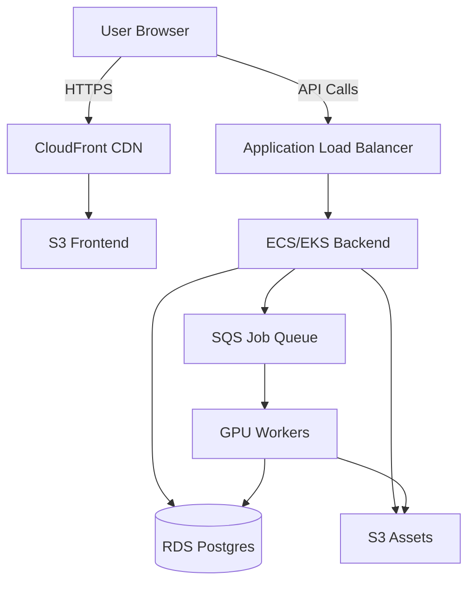

# 🎬 AI Film Studio — End-to-End SDLC (AWS + DevOps + Cloud + AI)

**A production-ready platform for AI-powered film generation with comprehensive tech stack integration**

[](https://aws.amazon.com)
[](https://terraform.io)
[](https://kubernetes.io)
[](https://fastapi.tiangolo.com)
[](https://nextjs.org)

---

## 📋 Table of Contents

- [Overview](#overview)
- [Tech Stack & Layer Mapping](#tech-stack--layer-mapping)
- [Architecture](#architecture)
- [Key Features](#key-features)
- [Getting Started](#getting-started)
- [Documentation](#documentation)
- [License](#license)

---

## 🎯 Overview

**AI Film Studio** is a comprehensive cloud-native platform that transforms text scripts into professional short films using AI-powered content generation. The platform integrates multiple AI/ML models, microservices architecture, and enterprise-grade infrastructure to deliver a complete video production pipeline.

### **Core Capabilities**

✅ **Script-to-Video Pipeline** — Automated script analysis → image generation → voice synthesis → animation → final video  
✅ **Multi-language Support** — 20+ languages for interface, voice, and subtitles  
✅ **Cultural Awareness** — Context-aware generation for Indian and Western cultural elements  
✅ **Subscription Model** — Free to Enterprise tiers with credit-based billing (3 credits = 1 minute)  
✅ **YouTube Integration** — Direct upload with playlist and thumbnail management  
✅ **Salesforce CRM** — Complete business process automation and analytics  
✅ **Enterprise-Grade Infrastructure** — AWS-based with auto-scaling and 99.9% uptime

### **Target Users**

- Content creators and influencers
- Marketing and advertising agencies
- Educational institutions
- Corporate training departments
- Indie filmmakers and studios
- Religious and cultural organizations

---

## 🌐 Tech Stack & Layer Mapping

For a comprehensive breakdown of all technologies, services, and components, see our **[Complete Tech Stack Mapping](./docs/tech-stack-mapping.md)**.

### Quick Overview

| Layer | Key Technologies | Purpose |
|-------|-----------------|---------|
| **Frontend** | React, Next.js, TailwindCSS, i18next | User interface with multi-language support |
| **Backend** | FastAPI, Node.js/NestJS, JWT/OAuth | Microservices architecture with 6+ services |
| **Database** | PostgreSQL, Redis, AWS S3 | Data persistence and caching |
| **AI/ML** | SDXL, ElevenLabs, Wav2Lip, Whisper | Complete AI pipeline for content generation |
| **Infrastructure** | AWS ECS/EKS, EC2 GPU, Terraform | Scalable cloud deployment |
| **Integrations** | YouTube API, Stripe, Salesforce CRM | External service integrations |

**Microservices:**
- User Service (Authentication & Profiles)
- Project Service (CRUD & Status Tracking)
- Credits Service (Billing & Subscriptions)
- AI Job Service (Queue Management)
- YouTube Service (Video Uploads)
- Admin Service (System Management)

---

## 🏗️ Architecture

### High-Level System Design

```
┌─────────────┐
│   Browser   │
└──────┬──────┘
       │
┌──────▼──────────┐
│  CloudFront CDN │
└──────┬──────────┘
       │
┌──────▼──────┐     ┌─────────────┐
│  Frontend   │     │   Backend   │
│  (Next.js)  │────▶│  (FastAPI)  │
└─────────────┘     └──────┬──────┘
                           │
                ┌──────────┼──────────┐
                │          │          │
         ┌──────▼────┐  ┌─▼───┐  ┌──▼───┐
         │    RDS    │  │Redis│  │  S3  │
         │PostgreSQL │  │Cache│  │Media │
         └───────────┘  └─────┘  └──────┘
                           │
                    ┌──────▼──────┐
                    │  SQS Queue  │
                    └──────┬──────┘
                           │
                    ┌──────▼──────┐
                    │ GPU Workers │
                    │  (AI/ML)    │
                    └─────────────┘
```

### AI/ML Pipeline

```
Script Input → NLP Analysis → Character/Scene Extraction
     ↓
Image Generation (SDXL) → Background & Characters
     ↓
Voice Synthesis (ElevenLabs/OpenAI TTS) → Dialogue Audio
     ↓
Lip-sync (Wav2Lip + FOMM) → Animated Characters
     ↓
Music Generation → Scene Background Music
     ↓
Subtitle Generation (Whisper) → Multi-language Subtitles
     ↓
Video Composition (FFmpeg) → Final Video
     ↓
YouTube Upload → Published Video
```

---

## ✨ Key Features

### 1. **Comprehensive AI Pipeline**

- **Script Analysis**: Extract characters, emotions, cultural context
- **Image Generation**: SDXL, Runway Gen-2, CogVideo, Dream Machine
- **Voice Synthesis**: ElevenLabs, Coqui TTS, OpenAI TTS (20+ languages)
- **Lip-sync Animation**: Wav2Lip + First Order Motion Model
- **Music Generation**: OpenAI Jukebox, MIDI synthesis, cultural audio
- **Subtitles**: Whisper ASR with multi-language translation

### 2. **Multi-language Support**

- **Interface**: 10+ languages (i18next)
- **Voice**: 15+ languages with native accents
- **Subtitles**: 20+ languages with auto-translation

### 3. **Cultural Audio Library**

- **Indian**: Slokas, mantras, Sahasranamas, classical music
- **Western**: Orchestral, cinematic scores, ambient music
- **Regional**: Folk music by region

### 4. **Subscription Tiers**

| Tier | Price | Credits/Month | Max Duration | Features |
|------|-------|---------------|--------------|----------|
| **Free** | $0 | 3 | 1 min | Watermarked, basic voices |
| **Standard** | $9.99 | 30 | 3 min | No watermark, standard voices |
| **Pro** | $29.99 | 100 | 5 min | Premium voices, priority queue |
| **Enterprise** | $299.99 | Unlimited | 10 min | White-label, API access, custom voices |

**Credit System**: 3 credits = 1 minute of video

### 5. **YouTube Integration**

- Direct video upload
- Automatic playlist management
- Custom thumbnail generation
- Metadata configuration (title, description, tags)
- Privacy settings (public, unlisted, private)

### 6. **Salesforce CRM Integration**

- **Custom Objects**: AI_Project__c, AI_Credit__c, YouTube_Integration__c
- **Automation**: Credit deduction, monthly resets, refund flows
- **Analytics**: User activity, revenue, AI usage dashboards
- **Reports**: Daily active users, videos generated, credit consumption

### 7. **Enterprise Features**

- Multi-AZ deployment with 99.9% uptime
- Auto-scaling GPU workers
- Comprehensive monitoring (CloudWatch, Grafana, Prometheus)
- Security: JWT/OAuth, encryption at rest and in transit
- Cost optimization: Spot instances, intelligent tiering

---

## 🚀 Getting Started

### Prerequisites

- Python 3.11+
- Node.js 18+
- Docker Desktop
- AWS Account
- PostgreSQL 15+
- Redis 7+

### Local Development

#### 1. Clone the repository

```bash
git clone https://github.com/AI-Empower-HQ-360/AI-Film-Studio.git
cd AI-Film-Studio
```

#### 2. Set up Python environment

```bash
python -m venv venv
source venv/bin/activate  # Windows: venv\Scripts\activate
pip install -r requirements.txt
```

#### 3. Configure environment variables

```bash
cp .env.example .env
# Edit .env with your configuration
```

#### 4. Initialize database

```bash
# Create database
createdb ai_film_studio

# Run migrations
alembic upgrade head
```

#### 5. Start services

```bash
# Start API server
uvicorn src.api.main:app --reload

# Access API documentation
# http://localhost:8000/api/docs
```

### Environment Setup

The platform supports multiple environments:

- **Development**: Local development with minimal resources
- **Sandbox/QA**: Integration testing environment
- **Staging**: Pre-production validation
- **Production**: Live user traffic

Set environment: `export ENVIRONMENT=development`

---

## 📚 Documentation

### Complete Documentation

- **[Tech Stack Mapping](./docs/tech-stack-mapping.md)** - Comprehensive technology overview
- **[System Design](./docs/architecture/system-design.md)** - Architecture and components
- **[Functional Requirements (FRD)](./docs/requirements/FRD.md)** - Feature specifications
- **[Non-Functional Requirements (NFR)](./docs/requirements/NFR.md)** - Performance, security, scalability

### API Documentation

Once the server is running, access:
- **Swagger UI**: http://localhost:8000/api/docs
- **ReDoc**: http://localhost:8000/api/redoc

### Key Endpoints

```
Authentication:
POST   /api/v1/auth/register      - Register new user
POST   /api/v1/auth/login         - User login
GET    /api/v1/auth/me            - Get current user

Projects:
GET    /api/v1/projects           - List projects
POST   /api/v1/projects           - Create project
GET    /api/v1/projects/{id}      - Get project
POST   /api/v1/projects/{id}/generate - Generate video

Credits:
GET    /api/v1/credits/balance    - Get credit balance
POST   /api/v1/credits/purchase   - Purchase credits
POST   /api/v1/credits/subscriptions/upgrade - Upgrade tier
```

---

## 🔧 Configuration

### Database Models

Located in `src/models/database.py`:
- User
- Project
- CreditTransaction
- AIJob
- YouTubeIntegration
- Subscription
- ContentModeration

### Microservices

Located in `src/services/`:
- `user_service.py` - User management
- `project_service.py` - Project operations
- `credits_service.py` - Credit & subscription management
- `ai_job_service.py` - AI job queue management
- `ai_ml_services.py` - AI/ML pipeline services
- `youtube_admin_services.py` - YouTube & admin operations

### Salesforce Integration

Configuration in `src/config/salesforce_config.py`:
- Custom object definitions
- Automation flows
- Dashboard and report templates
- API integration endpoints

---

## 🌍 Multi-Environment Support

| Environment | Purpose | Cost/Month |
|-------------|---------|-----------|
| Development | Rapid development | ~$335 |
| Sandbox/QA | Integration testing | ~$800 |
| Staging | Pre-production | ~$1,500 |
| Production | Live traffic | ~$2,600 |

**Cost Optimization**:
- Spot instances for GPU workers (70% savings)
- Auto-scaling based on demand
- S3 intelligent tiering
- Reserved instances for baseline capacity

---

## 🔒 Security

- **Authentication**: JWT with RS256 algorithm
- **Authorization**: Role-based access control (RBAC)
- **Encryption**: AES-256 at rest, TLS 1.2+ in transit
- **Network**: VPC isolation, security groups, AWS WAF
- **Secrets**: AWS Secrets Manager with rotation
- **Compliance**: GDPR, CCPA, SOC 2 ready

---

## 📊 Monitoring

- **CloudWatch**: Logs, metrics, alarms
- **Grafana**: Custom dashboards
- **Prometheus**: Metrics collection
- **X-Ray**: Distributed tracing (optional)

**Key Metrics**:
- API response time (<200ms target)
- Video generation time (2-5 min target)
- Credit consumption
- GPU utilization
- Error rates

---

## 🤝 Contributing

We welcome contributions! Please see [CONTRIBUTING.md](./CONTRIBUTING.md) for guidelines.

---

## 📄 License

This project is licensed under the MIT License - see the [LICENSE](./LICENSE) file for details.

---

## 📞 Contact

**Author**: AI-Empower-HQ-360  
**Repository**: [AI-Film-Studio](https://github.com/AI-Empower-HQ-360/AI-Film-Studio)

---

## 🎯 Roadmap

- [ ] Mobile apps (iOS/Android)
- [ ] Real-time collaboration
- [ ] Advanced video editing tools
- [ ] Custom AI model training
- [ ] Marketplace for voice actors and music
- [ ] API access for third-party integrations
- [ ] White-label solutions

---

**⭐ If you find this project useful, please star the repository!**

## 🏗️ Architecture

### **High-Level System Design**



### **Component Breakdown**

| Component | Technology | Purpose |
|-----------|-----------|---------|
| **Frontend** | Next.js on S3 + CloudFront | User interface, video preview |
| **Backend API** | FastAPI on ECS/EKS | Job orchestration, auth, credits |
| **Worker Plane** | Python + GPU EC2/EKS | AI generation, video composition |
| **Database** | RDS Postgres (Multi-AZ) | Users, projects, jobs, metadata |
| **Storage** | S3 (versioned, encrypted) | Scripts, images, videos, final MP4s |
| **Queue** | SQS | Asynchronous job processing |
| **CDN** | CloudFront | Global content delivery |

---

## 📊 SDLC Phases

This project follows a complete **Software Development Life Cycle (SDLC)** with DevOps integration:

### **1️⃣ Requirements Phase**
- Business Requirements Document (BRD)
- Functional Requirements Document (FRD)
- Non-Functional Requirements (NFR)
- Cost estimation and timeline

📂 See: [`docs/requirements/`](./docs/requirements/)

### **2️⃣ Design Phase**
- System architecture design
- Cloud service selection
- Network and security design
- Environment strategy

📂 See: [`docs/architecture/`](./docs/architecture/)

### **3️⃣ Development Phase**
- Application development (Backend, Worker, Frontend)
- Infrastructure as Code (Terraform)
- Kubernetes manifests
- Unit testing

📂 See: [`backend/`](./backend/), [`worker/`](./worker/), [`frontend/`](./frontend/), [`infrastructure/`](./infrastructure/)

### **4️⃣ Testing Phase**
- Unit, integration, and security testing
- Performance and load testing
- Resilience testing

📂 See: Test directories in each component

### **5️⃣ Deployment Phase**
- CI/CD pipelines (GitHub Actions)
- Blue-green and canary deployments
- Rollback strategies

📂 See: [`.github/workflows/`](./.github/workflows/)

### **6️⃣ Operations & Maintenance**
- Monitoring and alerting (CloudWatch)
- Incident management
- Cost optimization
- Security patching

📂 See: [`docs/operations/`](./docs/operations/)

---

## 🛠️ Technology Stack

### **Cloud & Infrastructure**
- **AWS**: VPC, EC2, ECS/EKS, RDS, S3, SQS, CloudFront, IAM
- **Terraform**: Infrastructure as Code
- **Kubernetes**: Container orchestration (EKS)
- **Docker**: Containerization

### **Backend**
- **Python 3.11+**
- **FastAPI**: High-performance API framework
- **SQLAlchemy**: ORM for database interactions
- **Alembic**: Database migrations
- **Pydantic**: Data validation
- **JWT**: Authentication

### **Worker (AI Pipeline)**
- **Stable Diffusion XL (SDXL)**: Image generation
- **Custom AI models**: Video generation
- **FFmpeg**: Video composition and encoding
- **Celery/SQS**: Task queue processing

### **Frontend**
- **Next.js 14**: React framework
- **TypeScript**: Type-safe development
- **Tailwind CSS**: Styling
- **Axios**: API client
- **React Query**: Data fetching

### **DevOps**
- **GitHub Actions**: CI/CD
- **Docker**: Multi-stage builds
- **Amazon ECR**: Container registry
- **Terraform Cloud**: State management (optional)

### **Monitoring & Observability**
- **CloudWatch**: Logs, metrics, alarms
- **Prometheus + Grafana**: Advanced monitoring (optional)
- **X-Ray**: Distributed tracing (optional)

---

## 📁 Project Structure

```
ai-film-studio/
├── docs/                          # Documentation
│   ├── requirements/              # BRD, FRD, NFR
│   ├── architecture/              # System design, diagrams
│   └── operations/                # Runbooks, incident response
├── infrastructure/                # Infrastructure as Code
│   ├── terraform/                 # Terraform modules
│   │   ├── environments/          # Dev, Test, Prod configs
│   │   └── modules/               # Reusable modules
│   └── kubernetes/                # K8s manifests and Helm charts
├── backend/                       # FastAPI backend
│   ├── src/                       # Source code
│   ├── tests/                     # Unit and integration tests
│   └── Dockerfile                 # Container image
├── worker/                        # GPU worker
│   ├── src/                       # AI pipeline code
│   ├── tests/                     # Worker tests
│   └── Dockerfile                 # Container image
├── frontend/                      # Next.js frontend
│   ├── src/                       # React components
│   └── package.json               # Dependencies
├── .github/                       # GitHub Actions workflows
│   └── workflows/                 # CI/CD pipelines
└── scripts/                       # Utility scripts
```

---

## 🚀 Getting Started

### **Prerequisites**

- AWS Account with appropriate permissions
- Terraform >= 1.5
- Docker Desktop
- Node.js >= 18
- Python >= 3.11
- kubectl (for EKS)
- GitHub account for CI/CD

### **Local Development Setup**

#### **1. Clone the repository**
```bash
git clone https://github.com/AI-Empower-HQ-360/AI-Film-Studio.git
cd AI-Film-Studio
```

#### **2. Set up backend**
```bash
cd backend
python -m venv venv
source venv/bin/activate  # Windows: venv\Scripts\activate
pip install -r requirements.txt
cp .env.example .env  # Configure your environment variables
uvicorn src.main:app --reload
```

#### **3. Set up worker**
```bash
cd worker
python -m venv venv
source venv/bin/activate
pip install -r requirements.txt
python src/main.py
```

#### **4. Set up frontend**
```bash
cd frontend
npm install
cp .env.example .env.local
npm run dev
```

### **Infrastructure Deployment**

#### **1. Initialize Terraform**
```bash
cd infrastructure/terraform/environments/dev
terraform init
```

#### **2. Plan infrastructure**
```bash
terraform plan -out=tfplan
```

#### **3. Apply infrastructure**
```bash
terraform apply tfplan
```

---

## 🌍 Environments

| Environment | Purpose | Infrastructure |
|-------------|---------|---------------|
| **Dev** | Rapid development and testing | Small instances, single AZ |
| **Test/QA** | Integration and performance testing | Mirrors prod, scaled down |
| **Staging** | Pre-production validation | Prod-like, blue-green ready |
| **Production** | Live user traffic | Multi-AZ, auto-scaling, HA |

---

## 🔄 CI/CD Pipeline

### **Workflow Overview**

1. **Code Push** → Trigger GitHub Actions
2. **Build & Test** → Run unit and integration tests
3. **Docker Build** → Create container images → Push to ECR
4. **Deploy to Dev** → Automatic deployment
5. **Deploy to Test** → Manual approval
6. **Deploy to Prod** → Blue-green deployment with manual approval

### **Pipeline Files**
- `.github/workflows/backend-ci-cd.yml` — Backend deployment
- `.github/workflows/worker-ci-cd.yml` — Worker deployment
- `.github/workflows/frontend-ci-cd.yml` — Frontend deployment
- `.github/workflows/terraform-deploy.yml` — Infrastructure deployment

---

## 🤝 Contributing

We welcome contributions! Please see [CONTRIBUTING.md](./CONTRIBUTING.md) for guidelines.

---

## 📄 License

This project is licensed under the MIT License - see the [LICENSE](./LICENSE) file for details.

---

## 📞 Contact

**Author**: AI-Empower-HQ-360  
**Repository**: [AI-Film-Studio](https://github.com/AI-Empower-HQ-360/AI-Film-Studio)

---

**⭐ If you find this project useful, please star the repository!**