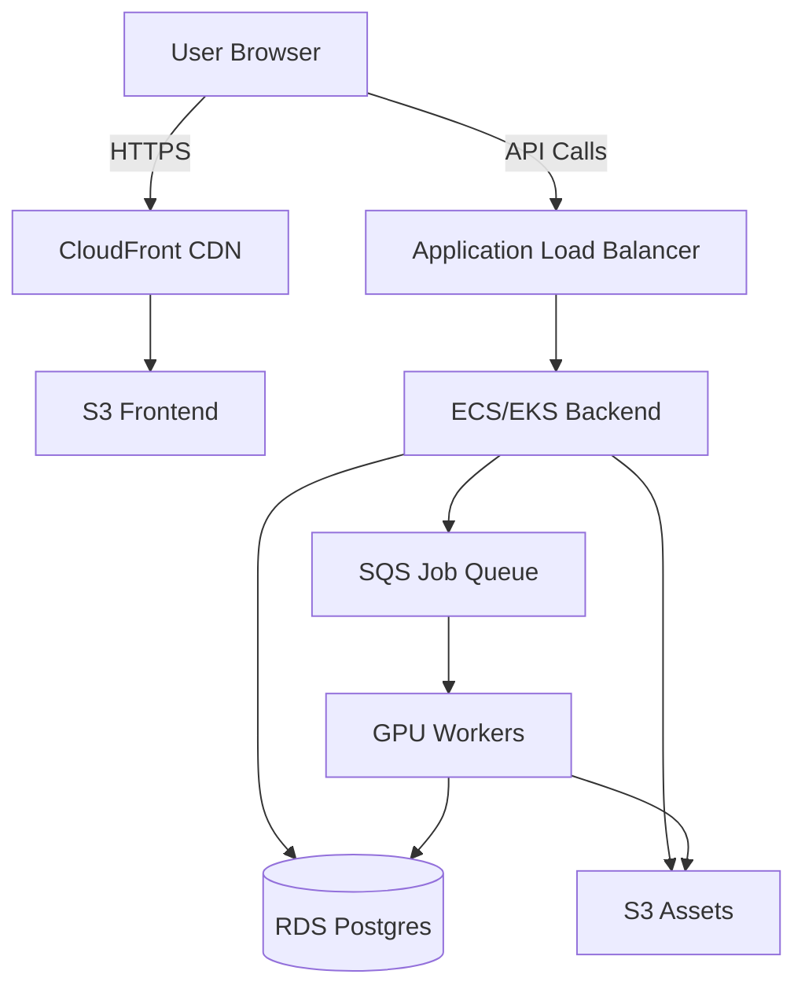

# 🎬 AI Film Studio — End-to-End SDLC (AWS + DevOps + Cloud + AI)

**A production-ready case study demonstrating enterprise-grade cloud architecture, DevOps practices, and AI-powered film generation**

[](https://aws.amazon.com)
[](https://terraform.io)
[](https://kubernetes.io)
[](https://fastapi.tiangolo.com)
[](https://nextjs.org)

---

## 📋 Table of Contents

- [Overview](#overview)
- [Architecture](#architecture)
- [SDLC Phases](#sdlc-phases)
- [Technology Stack](#technology-stack)
- [Project Structure](#project-structure)
- [Getting Started](#getting-started)
- [Environments](#environments)
- [CI/CD Pipeline](#cicd-pipeline)
- [Contributing](#contributing)
- [License](#license)

---

## 🎯 Overview

**AI Film Studio** is a cloud-native platform that transforms text scripts into cinematic short films (30-90 seconds) using AI-powered image/video generation and intelligent composition.

### **Key Features**

✅ **End-to-End Automation** — Script → Scene Graph → Shot Generation → Video Composition  
✅ **Scalable Cloud Architecture** — AWS-based infrastructure supporting 10,000+ users  
✅ **GPU-Accelerated AI** — SDXL, custom models for high-quality visual generation  
✅ **DevOps Best Practices** — IaC, CI/CD, multi-environment deployments  
✅ **Production-Ready** — Monitoring, alerting, auto-scaling, security hardening  

### **Target Users**

- Content creators and marketers
- Indie filmmakers and studios
- Educational institutions
- Corporate training departments

---

## 🏗️ Architecture

### **High-Level System Design**



### **Component Breakdown**

| Component | Technology | Purpose |
|-----------|-----------|---------|
| **Frontend** | Next.js 14 + Supabase Auth | User interface, authentication, video preview |
| **Backend API** | FastAPI on ECS/EKS | Job orchestration, credits, film generation |
| **Worker Plane** | Python + GPU EC2/EKS | AI generation, video composition |
| **Database** | RDS Postgres (Multi-AZ) + Supabase | Users, projects, jobs, metadata |
| **Storage** | S3 (versioned, encrypted) | Scripts, images, videos, final MP4s |
| **Queue** | SQS | Asynchronous job processing |
| **CDN** | CloudFront | Global content delivery |

---

## 📊 SDLC Phases

This project follows a complete **Software Development Life Cycle (SDLC)** with DevOps integration:

### **1️⃣ Requirements Phase**
- Business Requirements Document (BRD)
- Functional Requirements Document (FRD)
- Non-Functional Requirements (NFR)
- Cost estimation and timeline

📂 See: [`docs/requirements/`](./docs/requirements/)

### **2️⃣ Design Phase**
- System architecture design
- Cloud service selection
- Network and security design
- Environment strategy

📂 See: [`docs/architecture/`](./docs/architecture/)

### **3️⃣ Development Phase**
- Application development (Backend, Worker, Frontend)
- Infrastructure as Code (Terraform)
- Kubernetes manifests
- Unit testing

📂 See: [`backend/`](./backend/), [`worker/`](./worker/), [`frontend/`](./frontend/), [`infrastructure/`](./infrastructure/)

### **4️⃣ Testing Phase**
- Unit, integration, and security testing
- Performance and load testing
- Resilience testing

📂 See: Test directories in each component

### **5️⃣ Deployment Phase**
- CI/CD pipelines (GitHub Actions)
- Blue-green and canary deployments
- Rollback strategies

📂 See: [`.github/workflows/`](./.github/workflows/)

### **6️⃣ Operations & Maintenance**
- Monitoring and alerting (CloudWatch)
- Incident management
- Cost optimization
- Security patching

📂 See: [`docs/operations/`](./docs/operations/)

---

## 🛠️ Technology Stack

### **Cloud & Infrastructure**
- **AWS**: VPC, EC2, ECS/EKS, RDS, S3, SQS, CloudFront, IAM
- **Terraform**: Infrastructure as Code
- **Kubernetes**: Container orchestration (EKS)
- **Docker**: Containerization

### **Backend**
- **Python 3.11+**
- **FastAPI**: High-performance API framework
- **SQLAlchemy**: ORM for database interactions
- **Alembic**: Database migrations
- **Pydantic**: Data validation
- **JWT**: Authentication

### **Worker (AI Pipeline)**
- **Stable Diffusion XL (SDXL)**: Image generation
- **Custom AI models**: Video generation
- **FFmpeg**: Video composition and encoding
- **Celery/SQS**: Task queue processing

### **Frontend**
- **Next.js 14**: React framework with App Router
- **TypeScript**: Type-safe development
- **Supabase**: Authentication and user management
- **@supabase/ssr**: Server-side rendering auth helpers
- **Tailwind CSS**: Utility-first styling framework
- **React Hooks**: Modern React patterns

### **DevOps**
- **GitHub Actions**: CI/CD
- **Docker**: Multi-stage builds
- **Amazon ECR**: Container registry
- **Terraform Cloud**: State management (optional)

### **Monitoring & Observability**
- **CloudWatch**: Logs, metrics, alarms
- **Prometheus + Grafana**: Advanced monitoring (optional)
- **X-Ray**: Distributed tracing (optional)

---

## 📁 Project Structure

```
ai-film-studio/
├── docs/                          # Documentation
│   ├── requirements/              # BRD, FRD, NFR
│   ├── architecture/              # System design, diagrams
│   └── operations/                # Runbooks, incident response
├── infrastructure/                # Infrastructure as Code
│   ├── terraform/                 # Terraform modules
│   │   ├── environments/          # Dev, Test, Prod configs
│   │   └── modules/               # Reusable modules
│   └── kubernetes/                # K8s manifests and Helm charts
├── backend/                       # FastAPI backend
│   ├── src/                       # Source code
│   ├── tests/                     # Unit and integration tests
│   └── Dockerfile                 # Container image
├── worker/                        # GPU worker
│   ├── src/                       # AI pipeline code
│   ├── tests/                     # Worker tests
│   └── Dockerfile                 # Container image
├── frontend/                      # Next.js frontend
│   ├── src/                       # React components
│   └── package.json               # Dependencies
├── .github/                       # GitHub Actions workflows
│   └── workflows/                 # CI/CD pipelines
└── scripts/                       # Utility scripts
```

---

## 🚀 Getting Started

### **Prerequisites**

- AWS Account with appropriate permissions
- Terraform >= 1.5
- Docker Desktop
- Node.js >= 18
- Python >= 3.11
- kubectl (for EKS)
- GitHub account for CI/CD

### **Local Development Setup**

#### **1. Clone the repository**
```bash
git clone https://github.com/AI-Empower-HQ-360/AI-Film-Studio.git
cd AI-Film-Studio
```

#### **2. Set up backend**
```bash
cd backend
python -m venv venv
source venv/bin/activate  # Windows: venv\Scripts\activate
pip install -r requirements.txt
cp .env.example .env  # Configure your environment variables
uvicorn src.main:app --reload
```

#### **3. Set up worker**
```bash
cd worker
python -m venv venv
source venv/bin/activate
pip install -r requirements.txt
python src/main.py
```

#### **4. Set up frontend**
```bash
cd frontend
npm install
cp .env.local.example .env.local
# Edit .env.local with your Supabase credentials
npm run dev
```

The frontend will be available at [http://localhost:3000](http://localhost:3000).

📂 See detailed setup instructions: [`frontend/README.md`](./frontend/README.md)

### **Infrastructure Deployment**

#### **1. Initialize Terraform**
```bash
cd infrastructure/terraform/environments/dev
terraform init
```

#### **2. Plan infrastructure**
```bash
terraform plan -out=tfplan
```

#### **3. Apply infrastructure**
```bash
terraform apply tfplan
```

---

## 🌍 Environments

| Environment | Purpose | Infrastructure |
|-------------|---------|---------------|
| **Dev** | Rapid development and testing | Small instances, single AZ |
| **Test/QA** | Integration and performance testing | Mirrors prod, scaled down |
| **Staging** | Pre-production validation | Prod-like, blue-green ready |
| **Production** | Live user traffic | Multi-AZ, auto-scaling, HA |

---

## 🔄 CI/CD Pipeline

### **Workflow Overview**

1. **Code Push** → Trigger GitHub Actions
2. **Build & Test** → Run unit and integration tests
3. **Docker Build** → Create container images → Push to ECR
4. **Deploy to Dev** → Automatic deployment
5. **Deploy to Test** → Manual approval
6. **Deploy to Prod** → Blue-green deployment with manual approval

### **Pipeline Files**
- `.github/workflows/backend-ci-cd.yml` — Backend deployment
- `.github/workflows/worker-ci-cd.yml` — Worker deployment
- `.github/workflows/frontend-ci-cd.yml` — Frontend deployment
- `.github/workflows/terraform-deploy.yml` — Infrastructure deployment

---

## 🤝 Contributing

We welcome contributions! Please see [CONTRIBUTING.md](./CONTRIBUTING.md) for guidelines.

---

## 📄 License

This project is licensed under the MIT License - see the [LICENSE](./LICENSE) file for details.

---

## 📞 Contact

**Author**: AI-Empower-HQ-360  
**Repository**: [AI-Film-Studio](https://github.com/AI-Empower-HQ-360/AI-Film-Studio)

---

**⭐ If you find this project useful, please star the repository!**