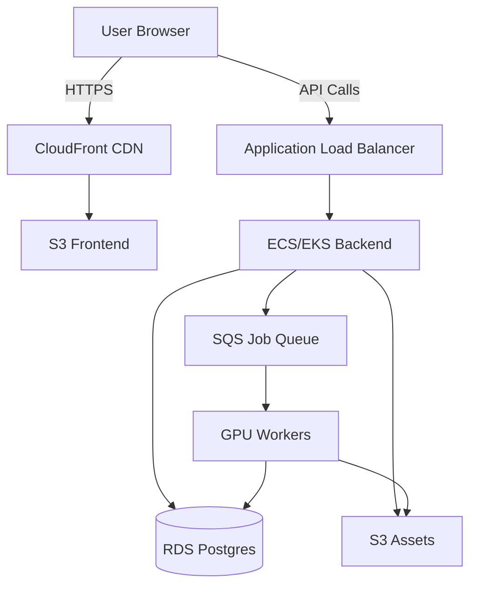

# 🎬 AI Film Studio — End-to-End SDLC (AWS + DevOps + Cloud + AI)

**A production-ready case study demonstrating enterprise-grade cloud architecture, DevOps practices, and AI-powered film generation**

[](https://aws.amazon.com)
[](https://terraform.io)
[](https://kubernetes.io)
[](https://fastapi.tiangolo.com)
[](https://nextjs.org)

---

## 📋 Table of Contents

- [Overview](#overview)
- [Investor & Developer Master Blueprint](#investor--developer-master-blueprint)
- [Architecture](#architecture)
- [SDLC Phases](#sdlc-phases)
- [Technology Stack](#technology-stack)
- [Project Structure](#project-structure)
- [Getting Started](#getting-started)
- [Environments](#environments)
- [CI/CD Pipeline](#cicd-pipeline)
- [Contributing](#contributing)
- [Automation & Tooling](#-automation--tooling)
- [Acknowledgments](#-acknowledgments)
- [License](#license)
- [Contact](#contact)

---

## 🎯 Overview

**AI Film Studio** is a cloud-native platform that transforms text scripts into cinematic short films (30-90 seconds) using AI-powered image/video generation and intelligent composition.

### **Key Features**

✅ **End-to-End Automation** — Script → Scene Graph → Shot Generation → Video Composition  
✅ **Story & Cultural Context-Aware** — Dynamic image generation based on script narrative and cultural settings  
✅ **Scalable Cloud Architecture** — AWS-based infrastructure supporting 10,000+ users  
✅ **GPU-Accelerated AI** — SDXL, custom models for high-quality visual generation  
✅ **DevOps Best Practices** — IaC, CI/CD, multi-environment deployments  
✅ **Production-Ready** — Monitoring, alerting, auto-scaling, security hardening  

### **Image Generation Workflow**

The platform implements a sophisticated, **script-driven image generation pipeline** that adapts to:
- 📜 **Story narrative and context** — Characters, scenes, and props generated based on script
- 🌍 **Cultural authenticity** — Traditional attire, architecture, and customs (South Indian, Western, East Asian, etc.)
- 🎭 **Dynamic character adaptation** — Same characters generate different visuals based on story context
- 🎨 **Scene consistency** — Backgrounds, lighting, and atmosphere match the narrative

**Dependency Hierarchy:** Script → Cultural Detection → Character Images → Scene Backgrounds → Video Synthesis

📖 **[View Detailed Image Generation Workflow →](./docs/architecture/image-generation-workflow.md)**

### **Target Users**


- Content creators and marketers
- Indie filmmakers and studios
- Educational institutions
- Corporate training departments

---

## 📘 Investor & Developer Master Blueprint

**NEW!** We've created a comprehensive master blueprint that integrates all architectural layers, AI dependencies, business models, and deployment strategies.

### **What's Included:**

✅ **Complete Workflow Layers** — Frontend → Backend → AI → Cloud → Salesforce → YouTube  
✅ **7-Stage AI Pipeline** — Script → Story/Culture → Image → Voice → Animation → Music → Podcast → Subtitles  
✅ **Subscription & Credit System** — Free → Pro → Enterprise tiers (3 credits = 1 min)  
✅ **Multi-Environment Strategy** — Dev, Sandbox/QA, Staging, Production  
✅ **Integration Details** — Salesforce CRM + YouTube + Multi-language support  
✅ **Cultural Awareness** — Dynamic content with cultural context  
✅ **Voice Diversity** — 25+ voice options across ages, genders, languages  
✅ **Business Model** — Revenue projections, unit economics, scaling strategies

📂 **Read the full blueprint:** [`docs/INVESTOR_DEVELOPER_MASTER_BLUEPRINT.md`](./docs/INVESTOR_DEVELOPER_MASTER_BLUEPRINT.md)

This document is designed for:
- **Investors**: Understand the business model, market opportunity, and technical capabilities
- **Developers**: Reference guide for implementation, architecture, and integration
- **Partners**: Integration opportunities with Salesforce, YouTube, and other platforms
- **Stakeholders**: Complete visibility into the end-to-end system

---

## 🏗️ Architecture

### **High-Level System Design**


```mermaid
graph TB
    User[User Browser] -->|HTTPS| CF[CloudFront CDN]
    CF --> S3F[S3 Frontend]
    User -->|API Calls| ALB[Application Load Balancer]
    ALB --> ECS[ECS/EKS Backend]
    ECS --> RDS[(RDS Postgres)]
    ECS --> SQS[SQS Job Queue]
    ECS --> S3A[S3 Assets]
    SQS --> Worker[GPU Workers]
    Worker --> S3A
    Worker --> RDS
```

> 📐 **For detailed architecture diagrams including all microservices, AI models, and integrations, see:**
> 
> [**Comprehensive Architecture Diagram →**](./docs/architecture/comprehensive-architecture-diagram.md)

### **Component Breakdown**

| Component | Technology | Purpose |
|-----------|-----------|---------|
| **Frontend** | Next.js on S3 + CloudFront | User interface, video preview |
| **Backend API** | FastAPI on ECS/EKS | Job orchestration, auth, credits |
| **Worker Plane** | Python + GPU EC2/EKS | AI generation, video composition |
| **Database** | RDS Postgres (Multi-AZ) | Users, projects, jobs, metadata |
| **Storage** | S3 (versioned, encrypted) | Scripts, images, videos, final MP4s |
| **Queue** | SQS | Asynchronous job processing |
| **CDN** | CloudFront | Global content delivery |

---

## 📊 SDLC Phases

This project follows a complete **Software Development Life Cycle (SDLC)** with DevOps integration:

### **1️⃣ Requirements Phase**
- Business Requirements Document (BRD)
- Functional Requirements Document (FRD)
- Non-Functional Requirements (NFR)
- Cost estimation and timeline

📂 See: [`docs/requirements/`](./docs/requirements/)

### **2️⃣ Design Phase**
- System architecture design
- Cloud service selection
- Network and security design
- Environment strategy

📂 See: [`docs/architecture/`](./docs/architecture/)

### **3️⃣ Development Phase**
- Application development (Backend, Worker, Frontend)
- Infrastructure as Code (Terraform)
- Kubernetes manifests
- Unit testing

📂 See: [`backend/`](./backend/), [`worker/`](./worker/), [`frontend/`](./frontend/), [`infrastructure/`](./infrastructure/)

### **4️⃣ Testing Phase**
- Unit, integration, and security testing
- Performance and load testing
- Resilience testing

📂 See: Test directories in each component

### **5️⃣ Deployment Phase**
- CI/CD pipelines (GitHub Actions)
- Blue-green and canary deployments
- Rollback strategies

📂 See: [`.github/workflows/`](./.github/workflows/)

### **6️⃣ Operations & Maintenance**
- Monitoring and alerting (CloudWatch)
- Incident management
- Cost optimization
- Security patching

📂 See: [`docs/operations/`](./docs/operations/)

---

## 🛠️ Technology Stack

### **Cloud & Infrastructure**
- **AWS**: VPC, EC2, ECS/EKS, RDS, S3, SQS, CloudFront, IAM
- **Terraform**: Infrastructure as Code
- **Kubernetes**: Container orchestration (EKS)
- **Docker**: Containerization

### **Backend**
- **Python 3.11+**
- **FastAPI**: High-performance API framework
- **SQLAlchemy**: ORM for database interactions
- **Alembic**: Database migrations
- **Pydantic**: Data validation
- **JWT**: Authentication

### **Worker (AI Pipeline)**
- **Video Generation**: Stable Diffusion Video, Gen-2, CogVideo, AnimateDiff
- **Voice Synthesis**: ElevenLabs, Coqui TTS, OpenAI TTS (multi-age, multi-gender)
- **Lip-sync & Animation**: Wav2Lip, First Order Motion Model, SadTalker
- **Music Generation**: MusicGen, AudioCraft, OpenAI Jukebox
- **Subtitles**: OpenAI Whisper, Google Cloud Speech-to-Text
- **Translation**: Google Translate, DeepL
- **Job Queue**: AWS SQS, BullMQ, RabbitMQ, Celery
- **FFmpeg**: Video/audio composition and encoding

📖 **[View Complete AI/ML Tech Stack Documentation](./docs/ai-ml-stack.md)**

### **Frontend**
- **Next.js 14**: React framework with SSR
- **React 18**: Component-based UI
- **TypeScript**: Type-safe development
- **Tailwind CSS + Material UI/Chakra UI**: Styling and components
- **Redux/Zustand**: State management
- **React Hook Form**: Form handling
- **Video.js**: Video playback
- **i18next**: Internationalization

📂 See detailed breakdown: [`docs/architecture/frontend-tech-stack.md`](./docs/architecture/frontend-tech-stack.md)

### **DevOps**
- **GitHub Actions**: CI/CD
- **Docker**: Multi-stage builds
- **Amazon ECR**: Container registry
- **Terraform Cloud**: State management (optional)

### **Monitoring & Observability**
- **CloudWatch**: Logs, metrics, alarms
- **Prometheus + Grafana**: Advanced monitoring (optional)
- **X-Ray**: Distributed tracing (optional)

---

## 📁 Project Structure

```
ai-film-studio/
├── docs/                          # Documentation
│   ├── requirements/              # BRD, FRD, NFR
│   ├── architecture/              # System design, diagrams
│   └── operations/                # Runbooks, incident response
├── infrastructure/                # Infrastructure as Code
│   ├── terraform/                 # Terraform modules
│   │   ├── environments/          # Dev, Test, Prod configs
│   │   └── modules/               # Reusable modules
│   └── kubernetes/                # K8s manifests and Helm charts
├── backend/                       # FastAPI backend
│   ├── src/                       # Source code
│   ├── tests/                     # Unit and integration tests
│   └── Dockerfile                 # Container image
├── worker/                        # GPU worker
│   ├── src/                       # AI pipeline code
│   ├── tests/                     # Worker tests
│   └── Dockerfile                 # Container image
├── frontend/                      # Next.js frontend
│   ├── src/                       # React components
│   └── package.json               # Dependencies
├── .github/                       # GitHub Actions workflows
│   └── workflows/                 # CI/CD pipelines
└── scripts/                       # Utility scripts
```

---

## 🚀 Getting Started

### **Prerequisites**

- AWS Account with appropriate permissions
- Terraform >= 1.5
- Docker Desktop
- Node.js >= 18
- Python >= 3.11
- kubectl (for EKS)
- GitHub account for CI/CD

### **Local Development Setup**

#### **1. Clone the repository**
```bash
git clone https://github.com/AI-Empower-HQ-360/AI-Film-Studio.git
cd AI-Film-Studio
```

#### **2. Set up backend**
```bash
cd backend
python -m venv venv
source venv/bin/activate  # Windows: venv\Scripts\activate
pip install -r requirements.txt
cp .env.example .env  # Configure your environment variables
uvicorn src.main:app --reload
```

#### **3. Set up worker**
```bash
cd worker
python -m venv venv
source venv/bin/activate
pip install -r requirements.txt
python src/main.py
```

#### **4. Set up frontend**
```bash
cd frontend
npm install
cp .env.example .env.local
npm run dev
```

### **Infrastructure Deployment**

#### **1. Initialize Terraform**
```bash
cd infrastructure/terraform/environments/dev
terraform init
```

#### **2. Plan infrastructure**
```bash
terraform plan -out=tfplan
```

#### **3. Apply infrastructure**
```bash
terraform apply tfplan
```

---

## 🌍 Environments

| Environment | Branch | Purpose | Infrastructure |
|-------------|--------|---------|---------------|
| **Dev** | `dev` | Rapid development and testing | Small instances, single AZ |
| **Sandbox** | `sandbox` | Integration and QA testing | Mirrors prod, scaled down |
| **Staging** | `staging` | Pre-production validation | Prod-like, blue-green ready |
| **Production** | `main` | Live user traffic | Multi-AZ, auto-scaling, HA |

### Branch Strategy

This project follows a multi-environment branch strategy for safe CI/CD deployments:

- **`dev`** → Development environment (automatic deployment)
- **`sandbox`** → Testing/QA environment (automatic deployment, QA approval required)
- **`staging`** → Pre-production environment (manual deployment with approval)
- **`main`** → Production environment (manual deployment with multiple approvals)

📂 See: [`docs/BRANCHING_STRATEGY.md`](./docs/BRANCHING_STRATEGY.md) for complete workflow details.

📂 Environment-specific documentation: [`docs/environments/`](./docs/environments/)

---

## 🔄 CI/CD Pipeline

### **Workflow Overview**

1. **Code Push** → Trigger GitHub Actions
2. **Build & Test** → Run unit and integration tests
3. **Docker Build** → Create container images → Push to ECR
4. **Deploy to Dev** → Automatic deployment
5. **Deploy to Test** → Manual approval
6. **Deploy to Prod** → Blue-green deployment with manual approval

### **Pipeline Files**
- `.github/workflows/backend-ci-cd.yml` — Backend deployment
- `.github/workflows/worker-ci-cd.yml` — Worker deployment
- `.github/workflows/frontend-ci-cd.yml` — Frontend deployment
- `.github/workflows/terraform-deploy.yml` — Infrastructure deployment

---

## 🤝 Contributing

We welcome contributions! Please see [CONTRIBUTING.md](./CONTRIBUTING.md) for guidelines.

### **Adding Collaborators**

To invite developers or team members to collaborate on this project:

1. **Navigate to Settings**: Go to your repository's **Settings** tab
2. **Access Collaborators**: Click on **Collaborators and teams** in the left sidebar
3. **Add People**: Click **Add people** and enter the GitHub username or email of the person you want to invite
4. **Set Permissions**: Choose the appropriate permission level:
   - **Read**: Can view and clone the repository
   - **Triage**: Can manage issues and pull requests
   - **Write**: Can push to the repository
   - **Maintain**: Can manage the repository without access to sensitive actions
   - **Admin**: Full access to the repository
5. **Send Invitation**: The collaborator will receive an email invitation to join

For organization-owned repositories, you can also create teams with specific access levels.

---

## 🤖 Automation & Tooling

This project leverages various automation tools to streamline development and maintain code quality:

### **GitHub Actions**

GitHub Actions workflows are set up for continuous integration and deployment:

- **Deployment Pipeline**: Automatically builds and deploys the Next.js frontend to GitHub Pages on push to `main`
- **CI/CD Workflows**: Additional workflows can be configured for backend testing, worker validation, and infrastructure deployment

To add new workflows:
1. Create a `.yml` file in `.github/workflows/`
2. Define triggers, jobs, and steps following [GitHub Actions documentation](https://docs.github.com/en/actions)

### **Recommended Bots & Automation**

Consider setting up these automated tools to enhance your workflow:

| Bot/Tool | Purpose | Setup |
|----------|---------|-------|
| **Dependabot** | Automated dependency updates | Add `dependabot.yml` to `.github/` |
| **CodeQL** | Security vulnerability scanning | Enable in repository security settings |
| **Stale Bot** | Auto-close inactive issues/PRs | Add `stale.yml` workflow |
| **Semantic Release** | Automated versioning and changelog | Configure in CI pipeline |
| **Pre-commit Hooks** | Code quality checks before commits | Add `.pre-commit-config.yaml` |
| **Branch Protection** | Require reviews and status checks | Configure in repository settings |

### **Setting Up Dependabot**

To enable automated dependency updates, create `.github/dependabot.yml`:

```yaml
version: 2
updates:
  - package-ecosystem: "npm"
    directory: "/frontend"
    schedule:
      interval: "weekly"
  - package-ecosystem: "pip"
    directory: "/"
    schedule:
      interval: "weekly"
  - package-ecosystem: "github-actions"
    directory: "/"
    schedule:
      interval: "weekly"
```

---

## 🙏 Acknowledgments

This project was developed with assistance from **GitHub Copilot**, an AI-powered coding assistant that helped accelerate development through intelligent code suggestions, documentation generation, and problem-solving support.

We acknowledge the following tools and technologies that made this project possible:

- **GitHub Copilot** — AI pair programming assistant
- **OpenAI** — AI research and technology
- **AWS** — Cloud infrastructure
- **HashiCorp Terraform** — Infrastructure as Code
- **The Open Source Community** — For the amazing frameworks and libraries used in this project

---

## 📄 License

This project is licensed under the MIT License - see the [LICENSE](./LICENSE) file for details.

---

<a id="contact"></a>
## 📞 Contact

**Author**: AI-Empower-HQ-360  
**Repository**: [AI-Film-Studio](https://github.com/AI-Empower-HQ-360/AI-Film-Studio)

---

**⭐ If you find this project useful, please star the repository!**
