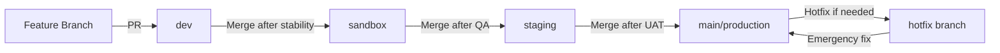

# GitHub Branch Strategy for AI Film Studio

This document defines the branch strategy for the AI Film Studio project, ensuring proper CI/CD workflow, isolation, and safe deployments.

## 📋 Branch Overview

| Branch Name | Purpose | Environment | Notes |
|-------------|---------|-------------|-------|
| `dev` | Development | Dev AWS | Active feature development, frequent commits |
| `sandbox` | Testing / QA | Sandbox AWS & Salesforce | Merge from dev once features are stable |
| `staging` | Pre-production | Staging AWS | Final verification, mirrors production environment |
| `main` | Production | Production AWS | Live deployment, merge only tested code from staging |

---

## 🌿 Branch Descriptions

### `dev` Branch
- **Purpose**: Active feature development
- **Environment**: Dev AWS environment
- **Deployment**: Automatic deployment on push
- **Protection**: Minimal (allow direct commits)
- **Testing**: Unit tests must pass
- **Usage**:
  - Developers create feature branches from `dev`
  - Feature branches merge back to `dev` via Pull Request
  - Frequent commits and rapid iteration

### `sandbox` Branch
- **Purpose**: Testing and Quality Assurance
- **Environment**: Connected to Sandbox environment (Salesforce Sandbox & AWS Sandbox)
- **Deployment**: Automatic deployment on push
- **Protection**: Require PR approval from QA team
- **Testing**: Integration and E2E tests must pass
- **Usage**:
  - Merge from `dev` once features are stable
  - QA team performs comprehensive testing
  - Bug fixes can be made directly or via hotfix branches

### `staging` Branch
- **Purpose**: Pre-production validation
- **Environment**: Staging AWS (mirrors Production)
- **Deployment**: Manual deployment with approval
- **Protection**: Require PR approval from 2+ reviewers
- **Testing**: Full test suite, performance tests, security scans
- **Usage**:
  - Merge from `sandbox` after successful QA
  - Final verification before production
  - Smoke tests and UAT (User Acceptance Testing)
  - Production-like data and configuration

### `main` (or `production`) Branch
- **Purpose**: Live production deployment
- **Environment**: Production AWS
- **Deployment**: Manual deployment with multiple approvals
- **Protection**: Maximum protection, require signed commits
- **Testing**: All tests must pass, security scans, performance validation
- **Usage**:
  - Merge only thoroughly tested code from `staging`
  - Tag releases with semantic versioning (v1.0.0, v1.1.0, etc.)
  - Maintain high stability and availability
  - Rollback capability for quick recovery

---

## 🔄 Workflow Example



### Standard Development Flow

1. **Feature Development**
   ```bash
   git checkout dev
   git pull origin dev
   git checkout -b feature/new-feature
   # Make changes
   git add .
   git commit -m "feat: add new feature"
   git push origin feature/new-feature
   # Create PR to dev
   ```

2. **Promote to Sandbox**
   ```bash
   git checkout sandbox
   git pull origin sandbox
   git merge dev
   git push origin sandbox
   # Triggers deployment to Sandbox environment
   ```

3. **Promote to Staging**
   ```bash
   git checkout staging
   git pull origin staging
   git merge sandbox
   git push origin staging
   # Requires approval, triggers deployment to Staging
   ```

4. **Promote to Production**
   ```bash
   git checkout main
   git pull origin main
   git merge staging
   git tag -a v1.0.0 -m "Release v1.0.0"
   git push origin main --tags
   # Requires multiple approvals, manual deployment trigger
   ```

---

## 🛡️ Branch Protection Rules

### `dev` Branch
- ✅ Require pull request reviews (1 approver)
- ✅ Require status checks to pass (unit tests)
- ✅ Require branches to be up to date before merging
- ❌ Do not require signed commits
- ❌ Do not restrict who can push

### `sandbox` Branch
- ✅ Require pull request reviews (1 approver from QA)
- ✅ Require status checks to pass (integration tests)
- ✅ Require branches to be up to date before merging
- ✅ Dismiss stale pull request approvals
- ❌ Do not require signed commits

### `staging` Branch
- ✅ Require pull request reviews (2 approvers)
- ✅ Require status checks to pass (all tests)
- ✅ Require branches to be up to date before merging
- ✅ Dismiss stale pull request approvals
- ✅ Require conversation resolution before merging
- ⚠️ Restrict who can push (only release managers)

### `main` Branch
- ✅ Require pull request reviews (3 approvers, including 1 code owner)
- ✅ Require status checks to pass (all tests + security scans)
- ✅ Require branches to be up to date before merging
- ✅ Require signed commits
- ✅ Dismiss stale pull request approvals
- ✅ Require conversation resolution before merging
- ✅ Restrict who can push (only release managers and admins)
- ✅ Require linear history
- ✅ Include administrators in restrictions

---

## 🚨 Hotfix Workflow

For urgent production fixes:

1. Create hotfix branch from `main`:
   ```bash
   git checkout main
   git pull origin main
   git checkout -b hotfix/critical-bug-fix
   # Make fix
   git add .
   git commit -m "fix: resolve critical bug"
   git push origin hotfix/critical-bug-fix
   ```

2. Create PR to `main` for immediate deployment

3. Backport fix to other branches:
   ```bash
   git checkout staging
   git cherry-pick <hotfix-commit>
   git push origin staging
   
   git checkout sandbox
   git cherry-pick <hotfix-commit>
   git push origin sandbox
   
   git checkout dev
   git cherry-pick <hotfix-commit>
   git push origin dev
   ```

---

## 📊 Environment Mapping

| Branch | AWS Account | Salesforce Org | Database | Cache |
|--------|-------------|----------------|----------|-------|
| `dev` | Dev Account | Developer Sandbox | Dev RDS | Dev ElastiCache |
| `sandbox` | Test Account | QA Sandbox | Test RDS | Test ElastiCache |
| `staging` | Prod Account (Staging VPC) | Staging Sandbox | Staging RDS | Staging ElastiCache |
| `main` | Prod Account | Production | Prod RDS (Multi-AZ) | Prod ElastiCache (Cluster) |

---

## 🔐 Access Control

| Role | dev | sandbox | staging | main |
|------|-----|---------|---------|------|
| Developer | Write | Read | Read | Read |
| QA Engineer | Read | Write | Read | Read |
| DevOps Engineer | Write | Write | Write | Read |
| Release Manager | Write | Write | Write | Write |
| Admin | Write | Write | Write | Write |

---

## 📝 Commit Convention

Follow [Conventional Commits](https://www.conventionalcommits.org/):

- `feat:` New feature
- `fix:` Bug fix
- `docs:` Documentation changes
- `style:` Code style changes (formatting)
- `refactor:` Code refactoring
- `test:` Adding or updating tests
- `chore:` Maintenance tasks
- `perf:` Performance improvements
- `ci:` CI/CD changes

---

## 🏷️ Release Tagging

Use [Semantic Versioning](https://semver.org/):

- **MAJOR.MINOR.PATCH** (e.g., 1.2.3)
- **MAJOR**: Breaking changes
- **MINOR**: New features (backward compatible)
- **PATCH**: Bug fixes (backward compatible)

Examples:
- `v1.0.0` - Initial production release
- `v1.1.0` - New feature added
- `v1.1.1` - Bug fix
- `v2.0.0` - Breaking changes

---

## 📚 References

- [GitHub Flow](https://guides.github.com/introduction/flow/)
- [GitFlow](https://nvie.com/posts/a-successful-git-branching-model/)
- [Branch Protection Rules](https://docs.github.com/en/repositories/configuring-branches-and-merges-in-your-repository/defining-the-mergeability-of-pull-requests/about-protected-branches)

---

**Last Updated**: 2025-12-31
