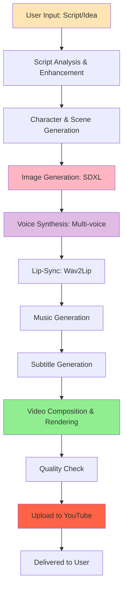
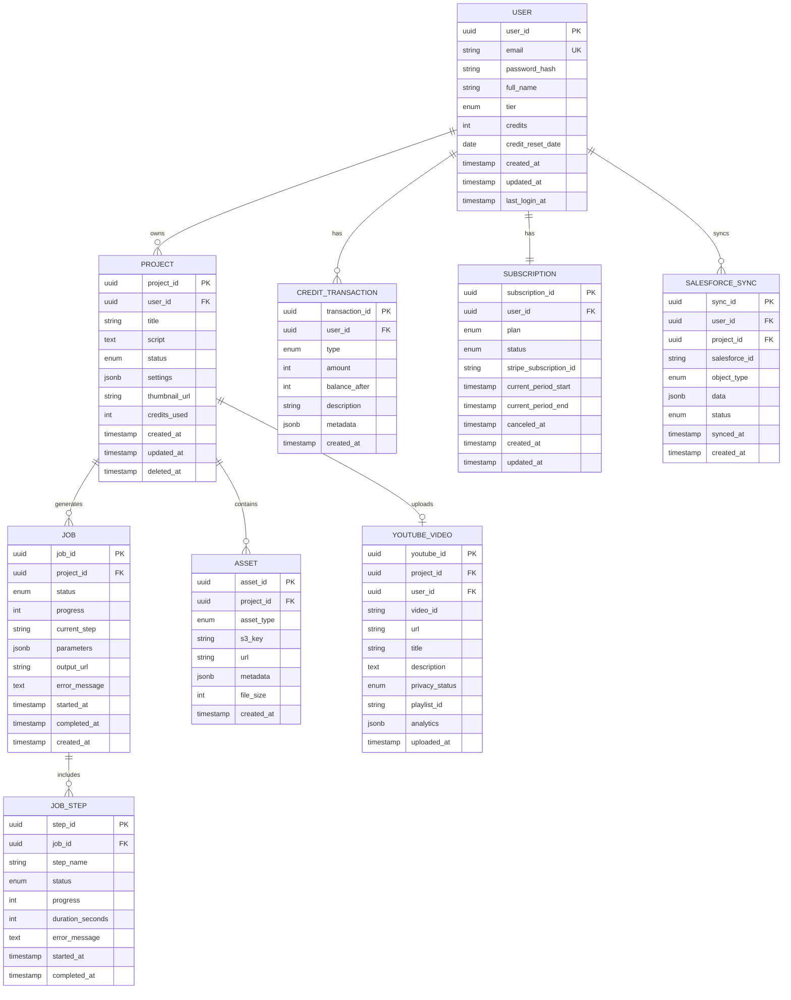
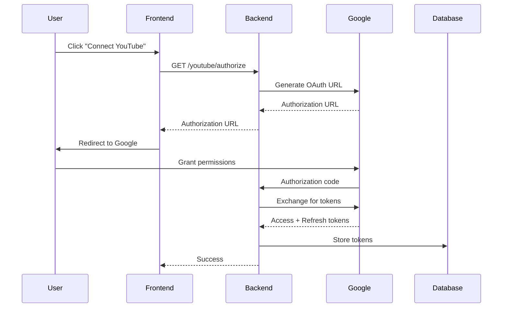
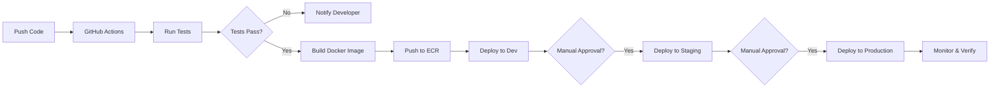

# 🎬 AI Film Studio - Complete Developer Guide

**Version:** 2.0  
**Last Updated:** December 31, 2025  
**Document Owner:** AI-Empower-HQ-360

---

## 📋 Table of Contents

1. [Project Overview](#project-overview)
2. [High-Level Workflow](#high-level-workflow)
3. [Tech Stack](#tech-stack)
4. [Environment Setup](#environment-setup)
5. [File Structure](#file-structure)
6. [API Contracts](#api-contracts)
7. [Database Schema](#database-schema)
8. [AI Pipelines](#ai-pipelines)
9. [Cloud Infrastructure](#cloud-infrastructure)
10. [Salesforce CRM Integration](#salesforce-crm-integration)
11. [YouTube Integration](#youtube-integration)
12. [Subscription & Credit System](#subscription--credit-system)
13. [Testing & QA](#testing--qa)
14. [Deployment & CI/CD](#deployment--cicd)
15. [MVP & Roadmap](#mvp--roadmap)

---

## 🎯 Project Overview

### Purpose

**AI Film Studio** is a comprehensive AI-powered video creation platform that transforms ideas into complete video content with automated script generation, image creation, voice synthesis, lip-sync, background music, subtitles, and direct YouTube integration.

### Target Users

- **Content Creators**: YouTube creators, TikTok influencers, social media managers
- **Businesses**: Marketing teams, corporate training, product demos
- **Educators**: Online course creators, educational content producers
- **Entertainment**: Independent filmmakers, podcast creators, storytellers
- **Religious Organizations**: Creating devotional content with Slokas and spiritual music

### Key Features

#### 🎨 Multi-Character Video Creation
- Generate videos with multiple AI-generated characters
- Support for different ages, genders, and cultural backgrounds
- Consistent character appearance across scenes

#### 🎙️ Podcast & Interview Creation
- Multi-voice conversations
- Automatic speaker turn-taking
- Dynamic camera angles

#### 🎵 Music & Audio Integration
- **Indian Music**: Classical ragas, devotional music, Bollywood styles
- **Western Music**: Pop, rock, jazz, classical, electronic
- **Slokas & Mantras**: Sanskrit chanting with proper pronunciation
- **Poems & Narration**: Dramatic readings, storytelling voices

#### 🌍 Multi-Language Support
- Voice synthesis in 50+ languages
- Automatic subtitle generation
- Translation capabilities
- Culture-aware character design

#### 🤖 AI-Generated Content
- **Images**: Stable Diffusion XL, ControlNet for pose/depth control
- **Voices**: Multi-age (child, young adult, middle-aged, elderly)
- **Lip-Sync**: Wav2Lip for accurate mouth movements
- **Background Music**: Context-aware music generation

#### 📺 YouTube Integration
- Direct upload to YouTube
- Automatic playlist creation
- Thumbnail generation
- Duration control (30s, 60s, 90s, custom)
- SEO-optimized titles and descriptions

---

## 🔄 High-Level Workflow



### Workflow Steps

1. **Script Input** (5 seconds)
   - User provides script or topic
   - AI enhances and structures content
   - Identifies characters, scenes, and timing

2. **Image Generation** (30-60 seconds)
   - Generates character images using SDXL
   - Creates background scenes
   - Applies ControlNet for consistency

3. **Voice Synthesis** (20-40 seconds)
   - Converts text to speech
   - Applies character-specific voices
   - Synchronizes with timing

4. **Lip-Sync** (40-80 seconds)
   - Maps audio to mouth movements
   - Generates realistic facial animations
   - Ensures natural expression

5. **Music & SFX** (15-30 seconds)
   - Generates or selects background music
   - Adds sound effects
   - Balances audio levels

6. **Subtitle Generation** (10-20 seconds)
   - Creates timestamped subtitles
   - Multiple language support
   - Customizable styling

7. **Video Rendering** (60-120 seconds)
   - Composites all elements
   - Applies transitions and effects
   - Exports in multiple formats

8. **YouTube Upload** (30-60 seconds)
   - Uploads to user's channel
   - Sets metadata and thumbnail
   - Assigns to playlist

**Total Processing Time**: 3-7 minutes per video (depending on length and complexity)

---

## 🛠️ Tech Stack

### Frontend

```yaml
Framework: Next.js 14+
Language: TypeScript 5.x
UI Library: React 18+
Styling: Tailwind CSS 3.x
State Management:
  - Zustand (global state)
  - React Query (server state)
  - React Hook Form (forms)

Key Libraries:
  - Axios: API communication
  - react-player: Video playback
  - react-dropzone: File uploads
  - Framer Motion: Animations
  - Headless UI: Accessible components
  - Chart.js: Analytics visualization

Build Tools:
  - Webpack 5 (Next.js default)
  - SWC Compiler (fast builds)
  - PostCSS (CSS processing)

Hosting:
  - AWS S3: Static hosting
  - CloudFront: Global CDN
  - Route53: DNS management
```

### Backend

```yaml
Framework: FastAPI 0.104+
Language: Python 3.11+
ASGI Server: Uvicorn 0.24+
Database ORM: SQLAlchemy 2.0
Migration Tool: Alembic 1.12
Validation: Pydantic 2.5

Key Libraries:
  - PyJWT: Authentication
  - passlib: Password hashing
  - python-multipart: File uploads
  - aiohttp: Async HTTP client
  - boto3: AWS SDK
  - redis-py: Caching
  - celery: Task queue (optional)

Hosting:
  - AWS ECS Fargate: Container orchestration
  - Application Load Balancer: Traffic distribution
  - Auto Scaling: Dynamic scaling
```

### AI/ML Stack

```yaml
Core Frameworks:
  - PyTorch: 2.1+
  - Transformers: 4.36+ (Hugging Face)
  - Diffusers: 0.25+ (Stable Diffusion)
  - CUDA: 12.1 (GPU acceleration)

Models:
  Text Analysis:
    - GPT-3.5-turbo / GPT-4
    - Claude 3 Sonnet
    - Mistral-7B (local fallback)
  
  Image Generation:
    - Stable Diffusion XL
    - ControlNet (pose, depth, canny)
    - IP-Adapter (style transfer)
    - Custom LoRA models
  
  Voice Synthesis:
    - Coqui TTS
    - ElevenLabs API
    - Bark (multi-lingual)
  
  Lip-Sync:
    - Wav2Lip
    - SadTalker (alternative)
  
  Music Generation:
    - AudioCraft
    - MusicGen
    - Riffusion
  
  Video Generation:
    - Stable Video Diffusion
    - AnimateDiff

Optimization:
  - xformers: Memory efficient attention
  - bitsandbytes: Model quantization
  - torch.compile: JIT compilation
  - Flash Attention 2.x: Fast attention
```

### Cloud & Infrastructure

```yaml
Cloud Provider: AWS

Compute:
  - ECS Fargate: Backend API
  - EC2 GPU (g4dn.xlarge): AI processing
  - Lambda: Serverless functions
  - Auto Scaling: Dynamic capacity

Storage:
  - S3: Media storage (Standard, IA, Glacier)
  - EBS: EC2 volumes
  - EFS: Shared file systems (optional)

Database:
  - RDS PostgreSQL 15: Primary database
  - ElastiCache Redis: Caching & sessions
  - DynamoDB: Session storage (alternative)

Networking:
  - VPC: Network isolation
  - ALB: Load balancing
  - CloudFront: CDN
  - Route53: DNS
  - VPC Endpoints: Private connectivity

Messaging:
  - SQS: Job queue
  - SNS: Notifications
  - EventBridge: Event routing

Security:
  - IAM: Access management
  - Secrets Manager: Credentials storage
  - AWS WAF: Web application firewall
  - GuardDuty: Threat detection
  - KMS: Encryption keys

Monitoring:
  - CloudWatch: Logs, metrics, alarms
  - X-Ray: Distributed tracing
  - CloudTrail: Audit logging

CI/CD:
  - GitHub Actions: Build & deploy
  - ECR: Container registry
  - CodeBuild: Build service
  - CodeDeploy: Deployment automation
```

### Salesforce Integration

```yaml
Edition: Enterprise / Unlimited
API Version: v58.0

Custom Objects:
  - AIFilmProject__c
  - VideoAsset__c
  - CreditTransaction__c
  - UserSubscription__c
  - YouTubeVideo__c

Integration:
  - REST API: Data synchronization
  - Streaming API: Real-time updates
  - Bulk API: Large data transfers
  - Metadata API: Configuration

Apex Components:
  - Triggers: ProjectTrigger, CreditTrigger
  - Classes: YouTubeService, AIService
  - Scheduled Jobs: CreditReset, Cleanup

Flows:
  - Screen Flows: Project creation wizard
  - Autolaunched Flows: Credit calculation
  - Record-Triggered Flows: Status updates

Dashboards:
  - User Analytics Dashboard
  - Credit Usage Dashboard
  - Video Performance Dashboard
  - Revenue Dashboard

Authentication:
  - OAuth 2.0: Secure API access
  - Connected App: Integration setup
  - JWT Bearer Flow: Server-to-server
```

### YouTube Integration

```yaml
API Version: YouTube Data API v3

Capabilities:
  - Video Upload: Direct upload via resumable upload
  - Playlist Management: Create, update, delete playlists
  - Thumbnail Upload: Custom thumbnail images
  - Metadata Management: Title, description, tags, category
  - Analytics: View counts, watch time, engagement

Authentication:
  - OAuth 2.0: User consent flow
  - Service Account: Server-side operations
  - Refresh Tokens: Long-lived access

Quotas:
  - Daily API Units: 10,000 (standard)
  - Upload Quota: 10 videos/day (adjustable)
  - Video Duration: Up to 12 hours (verified accounts)

Libraries:
  - google-api-python-client
  - google-auth
  - google-auth-oauthlib
```

---

## 🔧 Environment Setup

### Prerequisites

```yaml
Required Software:
  - Git: 2.x+
  - Python: 3.11+
  - Node.js: 18+ LTS
  - Docker Desktop: 24.x+
  - Terraform: 1.6+
  - AWS CLI: 2.x
  - kubectl: 1.28+ (for EKS)

Required Accounts:
  - AWS: Cloud infrastructure
  - GitHub: Source code & CI/CD
  - Salesforce: CRM integration
  - YouTube/Google: Video uploads
  - OpenAI: GPT models (optional)
  - ElevenLabs: Voice synthesis (optional)
  - Stripe: Payment processing

Hardware Recommendations:
  Development:
    - CPU: 4+ cores
    - RAM: 16GB+
    - Storage: 100GB+ SSD
    - GPU: Not required (uses cloud)
  
  Local AI Testing (Optional):
    - GPU: NVIDIA RTX 3060+ (12GB VRAM)
    - RAM: 32GB+
    - Storage: 500GB+ NVMe SSD
```

### Environment Types

| Environment | Purpose | Infrastructure | Auto-Deploy |
|------------|---------|----------------|-------------|
| **Development** | Local dev & testing | Minimal, single AZ | No |
| **Sandbox** | Integration testing | Small, mirrors staging | On PR |
| **Staging** | Pre-production validation | Prod-like, scaled down | On merge to main |
| **Production** | Live user traffic | Multi-AZ, HA, scaled | Manual approval |

### Development Environment Setup

#### 1. Clone Repository

```bash
git clone https://github.com/AI-Empower-HQ-360/AI-Film-Studio.git
cd AI-Film-Studio
```

#### 2. Backend Setup

```bash
cd backend
python -m venv venv
source venv/bin/activate  # Windows: venv\Scripts\activate

# Install dependencies
pip install -r requirements.txt
pip install -r requirements-dev.txt  # Development tools

# Setup environment variables
cp .env.example .env
# Edit .env with your configuration

# Run database migrations
alembic upgrade head

# Start backend server
uvicorn src.main:app --reload --host 0.0.0.0 --port 8000
```

Backend will be available at: `http://localhost:8000`  
API Documentation: `http://localhost:8000/docs`

#### 3. Worker Setup (AI Processing)

```bash
cd worker
python -m venv venv
source venv/bin/activate

# Install dependencies
pip install -r requirements.txt

# Download AI models (first time only, ~20GB)
python scripts/download_models.py

# Setup environment variables
cp .env.example .env

# Start worker
python src/main.py
```

#### 4. Frontend Setup

```bash
cd frontend
npm install

# Setup environment variables
cp .env.example .env.local
# Edit .env.local with backend API URL

# Start development server
npm run dev
```

Frontend will be available at: `http://localhost:3000`

#### 5. Local Testing with Docker Compose

For a complete local environment with all services:

```bash
# Build all containers
docker-compose build

# Start all services
docker-compose up -d

# View logs
docker-compose logs -f

# Stop all services
docker-compose down
```

Services:
- Frontend: `http://localhost:3000`
- Backend API: `http://localhost:8000`
- PostgreSQL: `localhost:5432`
- Redis: `localhost:6379`
- Worker: Background process

### Sandbox Environment

Automated deployment on pull request creation:

```yaml
Trigger: PR created/updated
Infrastructure:
  - 1 ECS task (backend)
  - 0-1 GPU workers (on-demand)
  - db.t3.small RDS
  - Temporary S3 bucket

Duration: Kept alive during PR review
Cleanup: Auto-deleted after PR merge/close
```

### Staging Environment

Pre-production environment for final validation:

```yaml
Infrastructure:
  - 2 ECS tasks (backend)
  - 1-2 GPU workers
  - db.t3.large RDS (Multi-AZ)
  - Shared S3 bucket

Deployment: Automatic on merge to main
Data: Production-like test data
Access: Internal team only
```

### Production Environment

Live environment with full high-availability:

```yaml
Infrastructure:
  - 4-50 ECS tasks (auto-scaling)
  - 1-20 GPU workers (auto-scaling)
  - db.r6g.xlarge RDS (Multi-AZ)
  - Production S3 buckets with replication

Deployment: Manual approval required
Monitoring: 24/7 CloudWatch alerts
Backup: Daily automated backups
Security: WAF, GuardDuty, enhanced monitoring
```

---

## 📁 File Structure

```
ai-film-studio/
├── .github/                        # GitHub configuration
│   ├── workflows/                  # CI/CD pipelines
│   │   ├── backend-ci-cd.yml      # Backend deployment
│   │   ├── worker-ci-cd.yml       # Worker deployment
│   │   ├── frontend-ci-cd.yml     # Frontend deployment
│   │   └── terraform-deploy.yml   # Infrastructure deployment
│   └── CODEOWNERS                 # Code review assignments
│
├── docs/                          # Documentation
│   ├── requirements/              # Requirements documents
│   │   ├── FRD.md                # Functional requirements
│   │   ├── NFR.md                # Non-functional requirements
│   │   └── BRD.md                # Business requirements
│   ├── architecture/              # Architecture documents
│   │   └── system-design.md      # System design
│   ├── DEVELOPER_GUIDE.md        # This document
│   ├── API_REFERENCE.md          # API documentation
│   ├── DEPLOYMENT.md             # Deployment guide
│   ├── SALESFORCE_INTEGRATION.md # Salesforce setup
│   └── YOUTUBE_INTEGRATION.md    # YouTube setup
│
├── infrastructure/                # Infrastructure as Code
│   ├── terraform/                # Terraform configurations
│   │   ├── environments/         # Environment-specific configs
│   │   │   ├── dev/             # Development environment
│   │   │   ├── staging/         # Staging environment
│   │   │   └── prod/            # Production environment
│   │   ├── modules/             # Reusable Terraform modules
│   │   │   ├── vpc/            # VPC module
│   │   │   ├── ecs/            # ECS module
│   │   │   ├── rds/            # RDS module
│   │   │   ├── s3/             # S3 module
│   │   │   └── security/       # Security groups, WAF
│   │   └── scripts/            # Helper scripts
│   │
│   └── kubernetes/              # Kubernetes manifests (optional)
│       ├── base/               # Base configurations
│       ├── overlays/           # Environment overlays
│       └── helm/               # Helm charts
│
├── backend/                      # FastAPI backend service
│   ├── src/                     # Source code
│   │   ├── api/                # API routes
│   │   │   ├── v1/            # API version 1
│   │   │   │   ├── auth.py   # Authentication endpoints
│   │   │   │   ├── projects.py # Project management
│   │   │   │   ├── jobs.py   # Job management
│   │   │   │   ├── credits.py # Credit system
│   │   │   │   ├── users.py  # User management
│   │   │   │   └── admin.py  # Admin endpoints
│   │   │   └── __init__.py
│   │   │
│   │   ├── models/            # Database models
│   │   │   ├── user.py
│   │   │   ├── project.py
│   │   │   ├── job.py
│   │   │   ├── credit.py
│   │   │   └── asset.py
│   │   │
│   │   ├── schemas/           # Pydantic schemas
│   │   │   ├── user.py       # Request/response schemas
│   │   │   ├── project.py
│   │   │   └── job.py
│   │   │
│   │   ├── services/          # Business logic
│   │   │   ├── auth_service.py
│   │   │   ├── project_service.py
│   │   │   ├── job_service.py
│   │   │   ├── credit_service.py
│   │   │   ├── salesforce_service.py
│   │   │   └── youtube_service.py
│   │   │
│   │   ├── core/              # Core functionality
│   │   │   ├── config.py     # Configuration
│   │   │   ├── database.py   # Database connection
│   │   │   ├── security.py   # Security utilities
│   │   │   └── dependencies.py # FastAPI dependencies
│   │   │
│   │   ├── utils/             # Utility functions
│   │   │   ├── aws.py        # AWS helpers
│   │   │   ├── logger.py     # Logging setup
│   │   │   └── validators.py # Custom validators
│   │   │
│   │   └── main.py           # Application entry point
│   │
│   ├── alembic/              # Database migrations
│   │   ├── versions/         # Migration scripts
│   │   └── env.py
│   │
│   ├── tests/                # Test suite
│   │   ├── unit/            # Unit tests
│   │   ├── integration/     # Integration tests
│   │   └── conftest.py      # Pytest configuration
│   │
│   ├── Dockerfile           # Container image
│   ├── requirements.txt     # Production dependencies
│   ├── requirements-dev.txt # Development dependencies
│   └── .env.example        # Environment template
│
├── worker/                   # AI processing worker
│   ├── src/                 # Source code
│   │   ├── pipelines/      # AI pipelines
│   │   │   ├── script_analyzer.py # Script analysis
│   │   │   ├── image_generator.py # Image generation
│   │   │   ├── voice_synthesizer.py # Voice synthesis
│   │   │   ├── lipsync_engine.py # Lip synchronization
│   │   │   ├── music_generator.py # Music generation
│   │   │   ├── subtitle_generator.py # Subtitle creation
│   │   │   └── video_composer.py # Final composition
│   │   │
│   │   ├── models/         # Model management
│   │   │   ├── model_loader.py # Load AI models
│   │   │   └── model_cache.py  # Model caching
│   │   │
│   │   ├── processors/     # Processing utilities
│   │   │   ├── audio_processor.py
│   │   │   ├── image_processor.py
│   │   │   └── video_processor.py
│   │   │
│   │   ├── queue/          # Job queue handling
│   │   │   ├── sqs_consumer.py # SQS consumer
│   │   │   └── job_handler.py  # Job processing
│   │   │
│   │   └── main.py         # Worker entry point
│   │
│   ├── scripts/            # Utility scripts
│   │   ├── download_models.py # Download AI models
│   │   └── test_pipeline.py   # Test AI pipeline
│   │
│   ├── tests/              # Test suite
│   │   └── test_pipelines.py
│   │
│   ├── Dockerfile          # Container image
│   ├── requirements.txt    # Dependencies
│   └── .env.example       # Environment template
│
├── frontend/               # Next.js frontend
│   ├── src/               # Source code
│   │   ├── app/          # Next.js app directory
│   │   │   ├── page.tsx  # Home page
│   │   │   ├── layout.tsx # Root layout
│   │   │   ├── auth/     # Authentication pages
│   │   │   ├── dashboard/ # User dashboard
│   │   │   ├── projects/ # Project pages
│   │   │   └── admin/    # Admin panel
│   │   │
│   │   ├── components/    # React components
│   │   │   ├── common/   # Shared components
│   │   │   ├── layout/   # Layout components
│   │   │   ├── forms/    # Form components
│   │   │   └── video/    # Video player components
│   │   │
│   │   ├── lib/          # Utilities & libraries
│   │   │   ├── api.ts    # API client
│   │   │   ├── auth.ts   # Auth helpers
│   │   │   └── utils.ts  # Utility functions
│   │   │
│   │   ├── hooks/        # Custom React hooks
│   │   │   ├── useAuth.ts
│   │   │   ├── useProjects.ts
│   │   │   └── useJobs.ts
│   │   │
│   │   ├── store/        # State management
│   │   │   ├── authStore.ts
│   │   │   └── projectStore.ts
│   │   │
│   │   └── types/        # TypeScript types
│   │       ├── user.ts
│   │       ├── project.ts
│   │       └── job.ts
│   │
│   ├── public/           # Static assets
│   │   ├── images/
│   │   └── icons/
│   │
│   ├── tests/            # Test suite
│   │   ├── unit/
│   │   └── e2e/
│   │
│   ├── package.json      # Dependencies
│   ├── tsconfig.json     # TypeScript config
│   ├── tailwind.config.js # Tailwind CSS config
│   └── .env.example     # Environment template
│
├── scripts/              # Project-wide scripts
│   ├── setup.sh         # Initial setup
│   ├── deploy.sh        # Deployment script
│   ├── backup.sh        # Backup script
│   └── test-all.sh      # Run all tests
│
├── tests/                # Integration tests
│   ├── e2e/             # End-to-end tests
│   └── load/            # Load tests
│
├── docker-compose.yml    # Local development environment
├── Dockerfile           # Multi-stage build (optional)
├── .env.example         # Environment template
├── .gitignore          # Git ignore rules
├── requirements.txt     # Python dependencies (root)
├── setup.py            # Python package setup
├── README.md           # Project README
└── LICENSE             # License file
```

### Key Directories Explained

#### `/backend`
FastAPI backend service handling authentication, API endpoints, business logic, and database operations.

#### `/worker`
GPU-accelerated worker service for AI processing tasks. Processes jobs from SQS queue and performs image generation, voice synthesis, lip-sync, and video composition.

#### `/frontend`
Next.js frontend application providing the user interface for project creation, video generation, and management.

#### `/infrastructure`
Infrastructure as Code (IaC) using Terraform for AWS resource provisioning and Kubernetes manifests for container orchestration.

#### `/docs`
Comprehensive documentation including requirements, architecture, API reference, and deployment guides.

---

## 📡 API Contracts

### Base URL

- **Development**: `http://localhost:8000/api/v1`
- **Staging**: `https://staging-api.aifilmstudio.com/api/v1`
- **Production**: `https://api.aifilmstudio.com/api/v1`

### Authentication

All authenticated endpoints require a JWT bearer token:

```http
Authorization: Bearer <access_token>
```

### API Endpoints

#### Authentication & User Management

**POST /auth/register**
```json
Request:
{
  "email": "user@example.com",
  "password": "SecurePass123!",
  "full_name": "John Doe"
}

Response: 201 Created
{
  "user_id": "uuid-here",
  "email": "user@example.com",
  "full_name": "John Doe",
  "tier": "free",
  "credits": 3,
  "created_at": "2025-12-31T10:00:00Z"
}
```

**POST /auth/login**
```json
Request:
{
  "email": "user@example.com",
  "password": "SecurePass123!"
}

Response: 200 OK
{
  "access_token": "eyJ0eXAiOiJKV1QiLCJ...",
  "refresh_token": "refresh_token_here",
  "token_type": "bearer",
  "expires_in": 3600,
  "user": {
    "user_id": "uuid-here",
    "email": "user@example.com",
    "tier": "free",
    "credits": 3
  }
}
```

**POST /auth/refresh**
```json
Request:
{
  "refresh_token": "refresh_token_here"
}

Response: 200 OK
{
  "access_token": "new_access_token",
  "expires_in": 3600
}
```

**GET /users/me**
```json
Response: 200 OK
{
  "user_id": "uuid-here",
  "email": "user@example.com",
  "full_name": "John Doe",
  "tier": "free",
  "credits": 3,
  "credit_reset_date": "2026-01-01",
  "created_at": "2025-12-31T10:00:00Z",
  "subscription": {
    "plan": "free",
    "status": "active",
    "expires_at": null
  }
}
```

**GET /users/me/credits**
```json
Response: 200 OK
{
  "balance": 15,
  "tier": "standard",
  "reset_date": "2026-01-01",
  "monthly_limit": 30,
  "history": [
    {
      "transaction_id": "uuid",
      "type": "deduction",
      "amount": -3,
      "balance_after": 15,
      "description": "Video generated: 60 seconds",
      "created_at": "2025-12-30T15:30:00Z"
    },
    {
      "transaction_id": "uuid",
      "type": "grant",
      "amount": 30,
      "balance_after": 18,
      "description": "Monthly credit reset",
      "created_at": "2025-12-01T00:00:00Z"
    }
  ]
}
```

#### Project Management

**POST /projects**
```json
Request:
{
  "title": "My First Video",
  "script": "A short story about a journey...",
  "settings": {
    "duration": 60,
    "style": "cinematic",
    "music_genre": "epic",
    "language": "en",
    "subtitle_language": ["en", "es"]
  }
}

Response: 201 Created
{
  "project_id": "uuid-here",
  "title": "My First Video",
  "status": "draft",
  "created_at": "2025-12-31T10:00:00Z",
  "estimated_credits": 3
}
```

**GET /projects**
```json
Query Parameters:
  - page: 1
  - per_page: 20
  - status: draft|processing|completed|failed
  - sort: created_at|updated_at
  - order: asc|desc

Response: 200 OK
{
  "projects": [
    {
      "project_id": "uuid",
      "title": "My First Video",
      "status": "completed",
      "thumbnail_url": "https://cdn.aifilmstudio.com/thumbnails/...",
      "duration": 60,
      "credits_used": 3,
      "created_at": "2025-12-31T10:00:00Z",
      "completed_at": "2025-12-31T10:05:00Z"
    }
  ],
  "total_count": 42,
  "page": 1,
  "per_page": 20,
  "total_pages": 3
}
```

**GET /projects/{project_id}**
```json
Response: 200 OK
{
  "project_id": "uuid-here",
  "title": "My First Video",
  "script": "A short story about a journey...",
  "status": "completed",
  "settings": {
    "duration": 60,
    "style": "cinematic",
    "music_genre": "epic",
    "language": "en",
    "subtitle_language": ["en", "es"]
  },
  "assets": {
    "video_url": "https://cdn.aifilmstudio.com/videos/...",
    "thumbnail_url": "https://cdn.aifilmstudio.com/thumbnails/...",
    "subtitle_urls": {
      "en": "https://cdn.aifilmstudio.com/subtitles/en.srt",
      "es": "https://cdn.aifilmstudio.com/subtitles/es.srt"
    }
  },
  "youtube": {
    "video_id": "youtube-video-id",
    "url": "https://youtube.com/watch?v=...",
    "uploaded_at": "2025-12-31T10:06:00Z"
  },
  "credits_used": 3,
  "created_at": "2025-12-31T10:00:00Z",
  "completed_at": "2025-12-31T10:05:00Z"
}
```

**PATCH /projects/{project_id}**
```json
Request:
{
  "title": "Updated Title",
  "script": "Updated script content..."
}

Response: 200 OK
{
  "project_id": "uuid-here",
  "title": "Updated Title",
  "updated_at": "2025-12-31T11:00:00Z"
}
```

**DELETE /projects/{project_id}**
```json
Response: 204 No Content
```

#### Video Generation

**POST /projects/{project_id}/generate**
```json
Request:
{
  "settings": {
    "duration": 60,
    "style": "cinematic",
    "characters": [
      {
        "name": "narrator",
        "age": "adult",
        "gender": "male",
        "voice": "deep"
      }
    ],
    "music_genre": "epic",
    "include_subtitles": true,
    "subtitle_languages": ["en", "es"],
    "youtube_upload": true,
    "youtube_playlist": "My Videos"
  }
}

Response: 202 Accepted
{
  "job_id": "uuid-here",
  "status": "queued",
  "estimated_time": "3-5 minutes",
  "credits_deducted": 3
}
```

**GET /jobs/{job_id}**
```json
Response: 200 OK
{
  "job_id": "uuid-here",
  "project_id": "uuid",
  "status": "processing",
  "progress": 65,
  "current_step": "voice_synthesis",
  "steps": [
    {"name": "script_analysis", "status": "completed", "duration": 5},
    {"name": "image_generation", "status": "completed", "duration": 45},
    {"name": "voice_synthesis", "status": "processing", "progress": 50},
    {"name": "lipsync", "status": "pending"},
    {"name": "music_generation", "status": "pending"},
    {"name": "video_composition", "status": "pending"},
    {"name": "youtube_upload", "status": "pending"}
  ],
  "estimated_time_remaining": "90 seconds",
  "started_at": "2025-12-31T10:00:00Z",
  "updated_at": "2025-12-31T10:02:30Z"
}
```

**GET /jobs/{job_id}/download**
```json
Response: 200 OK
{
  "download_url": "https://s3.amazonaws.com/signed-url-here",
  "expires_in": 3600,
  "file_size": 45678901,
  "format": "mp4",
  "resolution": "1920x1080",
  "duration": 60
}
```

#### YouTube Integration

**POST /youtube/authorize**
```json
Response: 200 OK
{
  "authorization_url": "https://accounts.google.com/o/oauth2/v2/auth?..."
}
```

**POST /youtube/callback**
```json
Request:
{
  "code": "authorization_code_from_google",
  "state": "state_token"
}

Response: 200 OK
{
  "status": "connected",
  "channel_id": "UC...",
  "channel_title": "My Channel"
}
```

**GET /youtube/playlists**
```json
Response: 200 OK
{
  "playlists": [
    {
      "playlist_id": "PL...",
      "title": "AI Generated Videos",
      "video_count": 15,
      "created_at": "2025-01-01T00:00:00Z"
    }
  ]
}
```

**POST /youtube/upload**
```json
Request:
{
  "project_id": "uuid",
  "title": "My Amazing Video",
  "description": "Created with AI Film Studio",
  "tags": ["AI", "video", "creation"],
  "category_id": "22",
  "privacy_status": "public",
  "playlist_id": "PL..."
}

Response: 200 OK
{
  "video_id": "youtube-video-id",
  "url": "https://youtube.com/watch?v=...",
  "status": "uploaded",
  "uploaded_at": "2025-12-31T10:06:00Z"
}
```

#### Salesforce Integration

**POST /salesforce/sync-project**
```json
Request:
{
  "project_id": "uuid"
}

Response: 200 OK
{
  "salesforce_id": "a0X...",
  "status": "synced",
  "synced_at": "2025-12-31T10:00:00Z"
}
```

**POST /salesforce/sync-credits**
```json
Response: 200 OK
{
  "credits_synced": 150,
  "transactions_synced": 25,
  "status": "completed"
}
```

#### Subscription & Billing

**GET /subscriptions/plans**
```json
Response: 200 OK
{
  "plans": [
    {
      "plan_id": "free",
      "name": "Free",
      "price": 0,
      "credits_per_month": 3,
      "features": ["Basic video generation", "Watermarked videos"],
      "limits": {
        "max_duration": 60,
        "max_characters": 1,
        "quality": "720p"
      }
    },
    {
      "plan_id": "standard",
      "name": "Standard",
      "price": 39,
      "credits_per_month": 30,
      "features": ["No watermark", "HD quality", "Multi-character"],
      "limits": {
        "max_duration": 120,
        "max_characters": 3,
        "quality": "1080p"
      }
    },
    {
      "plan_id": "pro",
      "name": "Pro",
      "price": 49,
      "credits_per_month": 60,
      "features": ["4K quality", "Priority processing", "API access"],
      "limits": {
        "max_duration": 180,
        "max_characters": 5,
        "quality": "4K"
      }
    },
    {
      "plan_id": "enterprise",
      "name": "Enterprise",
      "price": 99,
      "credits_per_month": 150,
      "features": ["Unlimited everything", "Dedicated support", "Custom branding"],
      "limits": {
        "max_duration": null,
        "max_characters": null,
        "quality": "4K"
      }
    }
  ]
}
```

**POST /subscriptions/subscribe**
```json
Request:
{
  "plan_id": "standard",
  "payment_method_id": "pm_stripe_id"
}

Response: 200 OK
{
  "subscription_id": "sub_...",
  "status": "active",
  "current_period_start": "2025-12-31T00:00:00Z",
  "current_period_end": "2026-01-31T00:00:00Z",
  "credits_granted": 30
}
```

### Error Responses

All errors follow this format:

```json
{
  "error": {
    "code": "INSUFFICIENT_CREDITS",
    "message": "You don't have enough credits to generate this video.",
    "details": {
      "required": 3,
      "available": 0,
      "next_reset": "2026-01-01T00:00:00Z"
    }
  }
}
```

Common error codes:
- `AUTHENTICATION_REQUIRED`: Missing or invalid token
- `INSUFFICIENT_CREDITS`: Not enough credits
- `PROJECT_NOT_FOUND`: Project doesn't exist
- `JOB_ALREADY_PROCESSING`: Job is already being processed
- `INVALID_INPUT`: Validation error
- `RATE_LIMIT_EXCEEDED`: Too many requests
- `INTERNAL_SERVER_ERROR`: Server error

---

## 💾 Database Schema

### Overview

The AI Film Studio uses PostgreSQL as its primary database with SQLAlchemy ORM for data access.

### Entity Relationship Diagram



### Table Definitions

#### users

```sql
CREATE TABLE users (
    user_id UUID PRIMARY KEY DEFAULT gen_random_uuid(),
    email VARCHAR(255) UNIQUE NOT NULL,
    password_hash VARCHAR(255) NOT NULL,
    full_name VARCHAR(255),
    tier VARCHAR(50) DEFAULT 'free' CHECK (tier IN ('free', 'standard', 'pro', 'enterprise')),
    credits INTEGER DEFAULT 3,
    credit_reset_date DATE,
    salesforce_contact_id VARCHAR(100),
    youtube_channel_id VARCHAR(100),
    youtube_access_token TEXT,
    youtube_refresh_token TEXT,
    youtube_token_expires_at TIMESTAMP,
    created_at TIMESTAMP DEFAULT CURRENT_TIMESTAMP,
    updated_at TIMESTAMP DEFAULT CURRENT_TIMESTAMP,
    last_login_at TIMESTAMP,
    deleted_at TIMESTAMP
);

CREATE INDEX idx_users_email ON users(email);
CREATE INDEX idx_users_tier ON users(tier);
CREATE INDEX idx_users_created_at ON users(created_at);
```

#### projects

```sql
CREATE TABLE projects (
    project_id UUID PRIMARY KEY DEFAULT gen_random_uuid(),
    user_id UUID NOT NULL REFERENCES users(user_id) ON DELETE CASCADE,
    title VARCHAR(255) NOT NULL,
    script TEXT NOT NULL,
    status VARCHAR(50) DEFAULT 'draft' CHECK (status IN ('draft', 'queued', 'processing', 'completed', 'failed', 'cancelled')),
    settings JSONB DEFAULT '{}',
    thumbnail_url TEXT,
    credits_used INTEGER DEFAULT 0,
    salesforce_project_id VARCHAR(100),
    created_at TIMESTAMP DEFAULT CURRENT_TIMESTAMP,
    updated_at TIMESTAMP DEFAULT CURRENT_TIMESTAMP,
    deleted_at TIMESTAMP
);

CREATE INDEX idx_projects_user_id ON projects(user_id);
CREATE INDEX idx_projects_status ON projects(status);
CREATE INDEX idx_projects_created_at ON projects(created_at);
CREATE INDEX idx_projects_deleted_at ON projects(deleted_at) WHERE deleted_at IS NOT NULL;
```

#### jobs

```sql
CREATE TABLE jobs (
    job_id UUID PRIMARY KEY DEFAULT gen_random_uuid(),
    project_id UUID NOT NULL REFERENCES projects(project_id) ON DELETE CASCADE,
    status VARCHAR(50) DEFAULT 'queued' CHECK (status IN ('queued', 'processing', 'completed', 'failed', 'cancelled')),
    progress INTEGER DEFAULT 0 CHECK (progress >= 0 AND progress <= 100),
    current_step VARCHAR(100),
    parameters JSONB DEFAULT '{}',
    output_url TEXT,
    error_message TEXT,
    sqs_message_id VARCHAR(255),
    worker_id VARCHAR(100),
    started_at TIMESTAMP,
    completed_at TIMESTAMP,
    created_at TIMESTAMP DEFAULT CURRENT_TIMESTAMP
);

CREATE INDEX idx_jobs_project_id ON jobs(project_id);
CREATE INDEX idx_jobs_status ON jobs(status);
CREATE INDEX idx_jobs_created_at ON jobs(created_at);
CREATE INDEX idx_jobs_worker_id ON jobs(worker_id);
```

#### job_steps

```sql
CREATE TABLE job_steps (
    step_id UUID PRIMARY KEY DEFAULT gen_random_uuid(),
    job_id UUID NOT NULL REFERENCES jobs(job_id) ON DELETE CASCADE,
    step_name VARCHAR(100) NOT NULL,
    status VARCHAR(50) DEFAULT 'pending' CHECK (status IN ('pending', 'processing', 'completed', 'failed', 'skipped')),
    progress INTEGER DEFAULT 0 CHECK (progress >= 0 AND progress <= 100),
    duration_seconds INTEGER,
    error_message TEXT,
    metadata JSONB DEFAULT '{}',
    started_at TIMESTAMP,
    completed_at TIMESTAMP,
    created_at TIMESTAMP DEFAULT CURRENT_TIMESTAMP
);

CREATE INDEX idx_job_steps_job_id ON job_steps(job_id);
CREATE INDEX idx_job_steps_status ON job_steps(status);
```

#### assets

```sql
CREATE TABLE assets (
    asset_id UUID PRIMARY KEY DEFAULT gen_random_uuid(),
    project_id UUID NOT NULL REFERENCES projects(project_id) ON DELETE CASCADE,
    asset_type VARCHAR(50) NOT NULL CHECK (asset_type IN ('video', 'image', 'audio', 'subtitle', 'thumbnail')),
    s3_key VARCHAR(500) NOT NULL,
    url TEXT,
    metadata JSONB DEFAULT '{}',
    file_size BIGINT,
    mime_type VARCHAR(100),
    created_at TIMESTAMP DEFAULT CURRENT_TIMESTAMP
);

CREATE INDEX idx_assets_project_id ON assets(project_id);
CREATE INDEX idx_assets_asset_type ON assets(asset_type);
CREATE INDEX idx_assets_created_at ON assets(created_at);
```

#### credit_transactions

```sql
CREATE TABLE credit_transactions (
    transaction_id UUID PRIMARY KEY DEFAULT gen_random_uuid(),
    user_id UUID NOT NULL REFERENCES users(user_id) ON DELETE CASCADE,
    type VARCHAR(50) NOT NULL CHECK (type IN ('deduction', 'grant', 'purchase', 'refund', 'reset')),
    amount INTEGER NOT NULL,
    balance_after INTEGER NOT NULL,
    description TEXT,
    metadata JSONB DEFAULT '{}',
    project_id UUID REFERENCES projects(project_id),
    stripe_payment_intent_id VARCHAR(255),
    salesforce_transaction_id VARCHAR(100),
    created_at TIMESTAMP DEFAULT CURRENT_TIMESTAMP
);

CREATE INDEX idx_credit_transactions_user_id ON credit_transactions(user_id);
CREATE INDEX idx_credit_transactions_type ON credit_transactions(type);
CREATE INDEX idx_credit_transactions_created_at ON credit_transactions(created_at);
```

#### subscriptions

```sql
CREATE TABLE subscriptions (
    subscription_id UUID PRIMARY KEY DEFAULT gen_random_uuid(),
    user_id UUID NOT NULL REFERENCES users(user_id) ON DELETE CASCADE,
    plan VARCHAR(50) NOT NULL CHECK (plan IN ('free', 'standard', 'pro', 'enterprise')),
    status VARCHAR(50) DEFAULT 'active' CHECK (status IN ('active', 'cancelled', 'past_due', 'unpaid')),
    stripe_subscription_id VARCHAR(255) UNIQUE,
    stripe_customer_id VARCHAR(255),
    current_period_start TIMESTAMP NOT NULL,
    current_period_end TIMESTAMP NOT NULL,
    canceled_at TIMESTAMP,
    salesforce_subscription_id VARCHAR(100),
    created_at TIMESTAMP DEFAULT CURRENT_TIMESTAMP,
    updated_at TIMESTAMP DEFAULT CURRENT_TIMESTAMP
);

CREATE INDEX idx_subscriptions_user_id ON subscriptions(user_id);
CREATE INDEX idx_subscriptions_status ON subscriptions(status);
CREATE INDEX idx_subscriptions_stripe_subscription_id ON subscriptions(stripe_subscription_id);
```

#### youtube_videos

```sql
CREATE TABLE youtube_videos (
    youtube_id UUID PRIMARY KEY DEFAULT gen_random_uuid(),
    project_id UUID NOT NULL REFERENCES projects(project_id) ON DELETE CASCADE,
    user_id UUID NOT NULL REFERENCES users(user_id) ON DELETE CASCADE,
    video_id VARCHAR(50) NOT NULL,
    url TEXT NOT NULL,
    title VARCHAR(500),
    description TEXT,
    privacy_status VARCHAR(50) CHECK (privacy_status IN ('public', 'private', 'unlisted')),
    playlist_id VARCHAR(100),
    analytics JSONB DEFAULT '{}',
    uploaded_at TIMESTAMP DEFAULT CURRENT_TIMESTAMP,
    created_at TIMESTAMP DEFAULT CURRENT_TIMESTAMP
);

CREATE INDEX idx_youtube_videos_project_id ON youtube_videos(project_id);
CREATE INDEX idx_youtube_videos_user_id ON youtube_videos(user_id);
CREATE INDEX idx_youtube_videos_video_id ON youtube_videos(video_id);
```

#### salesforce_syncs

```sql
CREATE TABLE salesforce_syncs (
    sync_id UUID PRIMARY KEY DEFAULT gen_random_uuid(),
    user_id UUID REFERENCES users(user_id) ON DELETE CASCADE,
    project_id UUID REFERENCES projects(project_id) ON DELETE CASCADE,
    salesforce_id VARCHAR(100) NOT NULL,
    object_type VARCHAR(100) NOT NULL,
    data JSONB DEFAULT '{}',
    status VARCHAR(50) DEFAULT 'synced' CHECK (status IN ('synced', 'pending', 'failed')),
    error_message TEXT,
    synced_at TIMESTAMP DEFAULT CURRENT_TIMESTAMP,
    created_at TIMESTAMP DEFAULT CURRENT_TIMESTAMP
);

CREATE INDEX idx_salesforce_syncs_user_id ON salesforce_syncs(user_id);
CREATE INDEX idx_salesforce_syncs_project_id ON salesforce_syncs(project_id);
CREATE INDEX idx_salesforce_syncs_salesforce_id ON salesforce_syncs(salesforce_id);
CREATE INDEX idx_salesforce_syncs_object_type ON salesforce_syncs(object_type);
```

### Database Migrations

Database migrations are managed using Alembic:

```bash
# Create a new migration
alembic revision --autogenerate -m "Description of changes"

# Apply migrations
alembic upgrade head

# Rollback one migration
alembic downgrade -1

# Check current version
alembic current

# View migration history
alembic history
```

### Data Retention Policy

```yaml
user_data:
  - Active users: Retained indefinitely
  - Deleted accounts: 90 days grace period, then hard delete
  
projects:
  - Draft projects: Retained 1 year of inactivity
  - Completed projects: Retained indefinitely
  - Failed projects: Retained 90 days
  - Deleted projects: Soft delete with 30-day recovery

assets:
  - S3 lifecycle: Standard → IA (30 days) → Glacier (90 days)
  - Deleted project assets: Removed after 30 days
  
logs:
  - Application logs: 30 days
  - Access logs: 90 days
  - Audit logs: 7 years
```

---

## 🤖 AI Pipelines

### Pipeline Overview

The AI Film Studio uses a multi-stage pipeline to transform scripts into complete videos:

```
Script → Analysis → Image Generation → Voice Synthesis → Lip-Sync → Music → Subtitles → Composition → YouTube Upload
```

### Stage 1: Script Analysis (5-10 seconds)

**Purpose**: Analyze and enhance the input script, extract characters, scenes, and timing information.

**Models Used**:
- GPT-4 or Claude 3 Sonnet for script enhancement
- Custom NLP models for scene detection

**Process**:
1. Parse input script
2. Identify characters and their attributes (age, gender, role)
3. Break script into scenes and shots
4. Generate scene descriptions for image generation
5. Create timing plan for audio synchronization

**Output**:
```json
{
  "enhanced_script": "Full enhanced script...",
  "characters": [
    {"name": "narrator", "age": "adult", "gender": "male", "voice_type": "deep"}
  ],
  "scenes": [
    {
      "scene_id": 1,
      "description": "A sunrise over mountains",
      "duration": 5,
      "shots": [...]
    }
  ],
  "total_duration": 60
}
```

### Stage 2: Image Generation (30-60 seconds)

**Purpose**: Generate all visual assets including characters and backgrounds.

**Models Used**:
- Stable Diffusion XL 1.0
- ControlNet for pose and depth control
- Custom LoRA models for consistent character appearance

**Process**:
1. Generate character reference images
2. Create background scenes
3. Apply ControlNet for specific poses
4. Ensure visual consistency across scenes

**Parameters**:
```python
{
    "model": "stabilityai/stable-diffusion-xl-base-1.0",
    "steps": 30-50,
    "guidance_scale": 7.5,
    "resolution": "1024x1024",
    "negative_prompt": "blurry, low quality, distorted",
    "lora_models": ["character_consistency_v1"]
}
```

### Stage 3: Voice Synthesis (20-40 seconds)

**Purpose**: Convert script text to natural-sounding speech.

**Models Used**:
- Coqui TTS (multi-language)
- ElevenLabs API (premium voices)
- Bark (for special effects)

**Voice Types**:
- Age: child, young_adult, middle_aged, elderly
- Gender: male, female, neutral
- Style: narrator, conversational, dramatic, cheerful, serious
- Language: 50+ languages supported

**Process**:
1. Select appropriate voice model
2. Generate speech for each character
3. Apply emotional modulation
4. Synchronize with timing plan

### Stage 4: Lip-Sync (40-80 seconds)

**Purpose**: Synchronize generated audio with character mouth movements.

**Models Used**:
- Wav2Lip (primary)
- SadTalker (alternative)

**Process**:
1. Extract audio features
2. Generate mouth shape keyframes
3. Apply to character images
4. Create smooth animations
5. Export as video clips

### Stage 5: Music Generation (15-30 seconds)

**Purpose**: Create background music appropriate for the content.

**Models Used**:
- MusicGen (Facebook/Meta)
- AudioCraft
- Riffusion

**Music Styles**:
- **Indian**: Classical ragas, devotional, Bollywood, folk
- **Western**: Pop, rock, jazz, classical, electronic
- **Spiritual**: Slokas, mantras, meditation
- **Ambient**: Nature sounds, minimalist, cinematic

**Process**:
1. Analyze script mood and theme
2. Select appropriate music style
3. Generate background music
4. Adjust volume levels for voice clarity

### Stage 6: Subtitle Generation (10-20 seconds)

**Purpose**: Create multi-language subtitles with accurate timing.

**Process**:
1. Transcribe audio (if needed)
2. Translate to target languages
3. Generate SRT/VTT files
4. Synchronize with audio
5. Apply styling

**Supported Languages**: 50+ including:
- English, Spanish, French, German, Italian
- Hindi, Tamil, Telugu, Bengali, Marathi
- Chinese, Japanese, Korean
- Arabic, Portuguese, Russian

### Stage 7: Video Composition (60-120 seconds)

**Purpose**: Combine all elements into final video.

**Tools**:
- FFmpeg for video processing
- Custom composition engine

**Process**:
1. Arrange clips in timeline
2. Add transitions and effects
3. Overlay subtitles
4. Mix audio tracks
5. Apply color grading
6. Export in target resolution

**Export Settings**:
```yaml
Resolution: 1920x1080 (1080p) or 3840x2160 (4K)
Codec: H.264 (MP4)
Bitrate: 5-10 Mbps
Frame Rate: 24 fps or 30 fps
Audio: AAC, 192 kbps, stereo
```

### Stage 8: YouTube Upload (30-60 seconds)

**Purpose**: Upload video directly to YouTube with metadata.

**Process**:
1. Authenticate with YouTube API
2. Upload video file
3. Set title, description, tags
4. Upload custom thumbnail
5. Add to playlist
6. Set privacy settings

### Pipeline Configuration

All pipelines are configurable via settings:

```json
{
  "duration": 60,
  "quality": "1080p",
  "style": "cinematic",
  "characters": [...],
  "music_genre": "epic",
  "subtitle_languages": ["en", "es"],
  "youtube_upload": true,
  "youtube_settings": {
    "privacy": "public",
    "playlist": "My Videos",
    "notify_subscribers": true
  }
}
```

### Model Versions and Dependencies

```yaml
Image Generation:
  - stable-diffusion-xl-base-1.0: 6.9GB
  - controlnet-canny: 1.4GB
  - controlnet-depth: 1.4GB
  - custom-lora-models: 200MB

Voice Synthesis:
  - coqui-tts-models: 500MB per language
  - elevenlabs: API-based, no local model

Lip-Sync:
  - wav2lip: 150MB
  - sadtalker: 2.3GB

Music Generation:
  - musicgen-medium: 1.5GB
  - audiocraft: 800MB

Total Storage: ~20GB for all models
```

---

## ☁️ Cloud Infrastructure

### AWS Services Used

| Service | Purpose | Configuration |
|---------|---------|---------------|
| **VPC** | Network isolation | CIDR: 10.0.0.0/16, Multi-AZ |
| **EC2** | GPU workers | g4dn.xlarge, auto-scaling |
| **ECS** | Backend containers | Fargate, 2-50 tasks |
| **RDS** | PostgreSQL database | Multi-AZ, automated backups |
| **S3** | Media storage | Versioned, encrypted |
| **CloudFront** | CDN | Global edge locations |
| **ALB** | Load balancing | SSL termination |
| **SQS** | Job queue | Standard queue |
| **ElastiCache** | Redis caching | Multi-AZ cluster |
| **Secrets Manager** | Credentials | Auto-rotation |
| **CloudWatch** | Monitoring | Logs, metrics, alarms |
| **WAF** | Security | Rate limiting, DDoS protection |
| **Route53** | DNS | Hosted zone |

### Infrastructure as Code

All infrastructure is defined in Terraform:

```bash
# Navigate to environment
cd infrastructure/terraform/environments/prod

# Initialize Terraform
terraform init

# Plan changes
terraform plan -out=tfplan

# Apply changes
terraform apply tfplan

# Destroy infrastructure (careful!)
terraform destroy
```

### Key Infrastructure Components

**VPC Architecture**:
- 2 Availability Zones
- Public subnets (ALB, NAT Gateway)
- Private app subnets (ECS, EC2)
- Private data subnets (RDS, ElastiCache)
- VPC Endpoints for AWS services

**Security**:
- Security groups with least privilege
- IAM roles for service-to-service auth
- KMS encryption for data at rest
- TLS 1.2+ for data in transit
- AWS WAF for application protection

**Scaling**:
- ECS auto-scaling based on CPU/memory
- EC2 GPU auto-scaling based on SQS depth
- RDS read replicas for read scaling
- CloudFront for global distribution

---

## 🔗 Salesforce CRM Integration

### Purpose

Integrate AI Film Studio with Salesforce CRM for:
- Customer relationship management
- Project tracking and analytics
- Credit usage monitoring
- Revenue reporting
- Customer support

### Custom Objects

#### AIFilmProject__c
```
Fields:
- Name (Auto-number): Project ID
- Title__c (Text): Project title
- Script__c (Long Text Area): Script content
- Status__c (Picklist): draft, processing, completed, failed
- Duration__c (Number): Video duration in seconds
- Credits_Used__c (Number): Credits consumed
- User__c (Lookup): Related User record
- Video_URL__c (URL): Final video URL
- YouTube_Video_ID__c (Text): YouTube video ID
- Created_Date__c (Date/Time): Creation timestamp
```

#### CreditTransaction__c
```
Fields:
- Name (Auto-number): Transaction ID
- User__c (Lookup): Related User record
- Type__c (Picklist): deduction, grant, purchase, refund
- Amount__c (Number): Credit amount
- Balance_After__c (Number): Balance after transaction
- Description__c (Text): Transaction description
- Project__c (Lookup): Related Project record
- Transaction_Date__c (Date/Time): Transaction timestamp
```

#### UserSubscription__c
```
Fields:
- Name (Auto-number): Subscription ID
- User__c (Lookup): Related User record
- Plan__c (Picklist): free, standard, pro, enterprise
- Status__c (Picklist): active, cancelled, past_due
- Monthly_Credits__c (Number): Credits per month
- Current_Period_Start__c (Date): Period start
- Current_Period_End__c (Date): Period end
- MRR__c (Currency): Monthly recurring revenue
```

### API Integration

**Authentication**: OAuth 2.0 JWT Bearer Flow

```python
# Example: Sync project to Salesforce
import requests

def sync_project_to_salesforce(project_data):
    access_token = get_salesforce_token()
    
    url = f"{SALESFORCE_INSTANCE_URL}/services/data/v58.0/sobjects/AIFilmProject__c"
    headers = {
        "Authorization": f"Bearer {access_token}",
        "Content-Type": "application/json"
    }
    
    payload = {
        "Title__c": project_data["title"],
        "Script__c": project_data["script"],
        "Status__c": project_data["status"],
        "User__c": project_data["salesforce_user_id"],
        "Duration__c": project_data["duration"],
        "Credits_Used__c": project_data["credits_used"]
    }
    
    response = requests.post(url, json=payload, headers=headers)
    return response.json()
```

### Dashboards

**User Analytics Dashboard**:
- Total users by tier
- New signups (daily/weekly/monthly)
- Active users
- Churn rate

**Project Performance Dashboard**:
- Total projects created
- Completion rate
- Average processing time
- Failed project analysis

**Revenue Dashboard**:
- MRR (Monthly Recurring Revenue)
- ARR (Annual Recurring Revenue)
- Revenue by plan
- Churn impact

**Credit Usage Dashboard**:
- Total credits consumed
- Average credits per user
- Credit purchase trends
- Top credit consumers

---

## 📺 YouTube Integration

### Setup

1. Create Google Cloud Project
2. Enable YouTube Data API v3
3. Configure OAuth 2.0 credentials
4. Set redirect URI: `https://api.aifilmstudio.com/youtube/callback`

### Authentication Flow



### Features

#### Video Upload
```python
from googleapiclient.discovery import build
from googleapiclient.http import MediaFileUpload

def upload_to_youtube(video_path, metadata):
    youtube = build('youtube', 'v3', credentials=credentials)
    
    body = {
        'snippet': {
            'title': metadata['title'],
            'description': metadata['description'],
            'tags': metadata['tags'],
            'categoryId': metadata['category_id']
        },
        'status': {
            'privacyStatus': metadata['privacy_status']
        }
    }
    
    media = MediaFileUpload(video_path, chunksize=-1, resumable=True)
    request = youtube.videos().insert(
        part='snippet,status',
        body=body,
        media_body=media
    )
    
    response = request.execute()
    return response['id']
```

#### Playlist Management
- Create new playlists
- Add videos to playlists
- Reorder playlist items
- Update playlist metadata

#### Thumbnail Upload
- Custom thumbnail generation
- Automatic upload
- Image optimization (1280x720)

#### Duration Control
- 30 seconds
- 60 seconds (recommended)
- 90 seconds
- Custom (up to 12 hours for verified accounts)

### Quotas

**Daily API Units**: 10,000 (default)

Operation costs:
- Video upload: 1,600 units
- Playlist creation: 50 units
- Thumbnail upload: 50 units
- Video list: 1 unit

**Upload Limits**:
- Standard accounts: 15 videos/day
- Verified accounts: Unlimited (subject to quota)

---

## 💳 Subscription & Credit System

### Subscription Plans

| Plan | Price | Credits/Month | Features |
|------|-------|---------------|----------|
| **Free** | $0 | 3 | Basic videos, watermarked, 720p |
| **Standard** | $39 | 30 | No watermark, 1080p, multi-character |
| **Pro** | $49 | 60 | 4K quality, priority queue, API access |
| **Enterprise** | $99 | 150 | Unlimited, dedicated support, custom branding |

### Credit Calculation

**Formula**: `credits_required = ceiling(duration_seconds / 20)`

Examples:
- 30 seconds = 2 credits
- 60 seconds = 3 credits
- 90 seconds = 5 credits
- 120 seconds = 6 credits

**Credit Deduction**:
- Deducted when job starts processing
- Refunded if job fails due to system error
- No refund for user errors (invalid script, etc.)

### Credit Reset

- Monthly reset on subscription anniversary
- Unused credits do not roll over
- Purchase additional credits: $5 for 10 credits

### Payment Processing

**Stripe Integration**:

```python
import stripe

# Create subscription
def create_subscription(user_id, plan_id, payment_method_id):
    customer = stripe.Customer.create(
        email=user.email,
        payment_method=payment_method_id,
        invoice_settings={'default_payment_method': payment_method_id}
    )
    
    subscription = stripe.Subscription.create(
        customer=customer.id,
        items=[{'price': plan_price_id}],
        expand=['latest_invoice.payment_intent']
    )
    
    return subscription
```

---

## 🧪 Testing & QA

### Testing Strategy

```yaml
Unit Tests:
  - Coverage: >80%
  - Framework: pytest (backend), Jest (frontend)
  - Run on: Every commit

Integration Tests:
  - API endpoint tests
  - Database integration
  - AWS service integration
  - Run on: Pull requests

E2E Tests:
  - User workflows
  - Framework: Playwright
  - Run on: Pre-deployment

Load Tests:
  - Tool: Locust
  - Scenarios: 100, 500, 1000 concurrent users
  - Run on: Staging environment

Security Tests:
  - OWASP Top 10
  - Dependency scanning
  - Container scanning
  - Run on: Weekly

AI Model Tests:
  - Model accuracy
  - Output quality
  - Performance benchmarks
  - Run on: Model updates
```

### Running Tests

**Backend Tests**:
```bash
cd backend
pytest tests/ -v --cov=src --cov-report=html
```

**Frontend Tests**:
```bash
cd frontend
npm test
npm run test:e2e
```

**Load Tests**:
```bash
cd tests/load
locust -f locustfile.py --host=https://staging-api.aifilmstudio.com
```

### Test Environments

**Sandbox**: Automated testing on PR creation  
**Staging**: Manual QA before production  
**Production**: Canary deployments with monitoring

---

## 🚀 Deployment & CI/CD

### CI/CD Pipeline



### Deployment Process

**1. Development**:
- Automatic deployment on commit to `dev` branch
- No manual approval required

**2. Staging**:
- Automatic deployment on merge to `main`
- Smoke tests run automatically
- Manual QA verification

**3. Production**:
- Manual approval required
- Blue-green deployment
- Gradual traffic shift (10% → 50% → 100%)
- Automatic rollback on errors

### Deployment Commands

```bash
# Deploy backend to production
cd infrastructure/terraform/environments/prod
terraform apply -target=module.ecs -auto-approve

# Deploy worker
aws ecs update-service --cluster prod-cluster --service worker --force-new-deployment

# Rollback deployment
./scripts/rollback.sh prod backend v1.2.3
```

### Monitoring Post-Deployment

- CloudWatch logs for errors
- Response time metrics
- Error rate tracking
- User impact assessment

---

## 🗺️ MVP & Roadmap

### MVP Features (Completed)

✅ User authentication and authorization  
✅ Script input and enhancement  
✅ AI image generation (SDXL)  
✅ Voice synthesis (multi-language)  
✅ Basic video composition  
✅ Credit system  
✅ YouTube upload integration  
✅ Subscription plans  

### Phase 2 (Q1 2026)

- [ ] Advanced lip-sync with SadTalker
- [ ] Multi-character conversations
- [ ] Indian music and Slokas integration
- [ ] Advanced subtitle styling
- [ ] Salesforce dashboard integration
- [ ] Mobile-responsive UI improvements
- [ ] Video templates library
- [ ] Batch video generation

### Phase 3 (Q2 2026)

- [ ] 4K video support
- [ ] Real-time collaboration
- [ ] Advanced video editing tools
- [ ] Custom AI model training
- [ ] API for developers
- [ ] White-label solution
- [ ] Mobile apps (iOS/Android)
- [ ] TikTok integration

### Phase 4 (Q3 2026)

- [ ] Live streaming support
- [ ] Interactive videos
- [ ] VR/360 video support
- [ ] Advanced analytics dashboard
- [ ] Marketplace for templates
- [ ] Multi-language UI
- [ ] Enterprise SSO integration
- [ ] Dedicated GPU clusters

---

## 📚 Additional Resources

### Documentation

- [API Reference](./API_REFERENCE.md)
- [Deployment Guide](./DEPLOYMENT.md)
- [Salesforce Integration](./SALESFORCE_INTEGRATION.md)
- [YouTube Integration](./YOUTUBE_INTEGRATION.md)
- [Architecture Design](./architecture/system-design.md)
- [Requirements](./requirements/FRD.md)

### External Links

- [FastAPI Documentation](https://fastapi.tiangolo.com/)
- [Next.js Documentation](https://nextjs.org/docs)
- [AWS Documentation](https://docs.aws.amazon.com/)
- [Terraform Documentation](https://www.terraform.io/docs)
- [Stable Diffusion](https://stability.ai/)
- [YouTube Data API](https://developers.google.com/youtube/v3)
- [Salesforce API](https://developer.salesforce.com/)

### Support

- **Email**: support@aifilmstudio.com
- **Slack**: #ai-film-studio
- **Documentation**: https://docs.aifilmstudio.com
- **GitHub Issues**: https://github.com/AI-Empower-HQ-360/AI-Film-Studio/issues

---

## 🤝 Contributing

We welcome contributions! Please see [CONTRIBUTING.md](../CONTRIBUTING.md) for guidelines.

### Development Workflow

1. Fork the repository
2. Create a feature branch
3. Make your changes
4. Write tests
5. Run linters and tests
6. Submit a pull request
7. Wait for code review
8. Address feedback
9. Merge!

---

## 📄 License

This project is licensed under the MIT License - see the [LICENSE](../LICENSE) file for details.

---

**Last Updated**: December 31, 2025  
**Version**: 2.0  
**Maintained by**: AI-Empower-HQ-360 Development Team

**For questions or support, please contact**: dev-team@aifilmstudio.com
