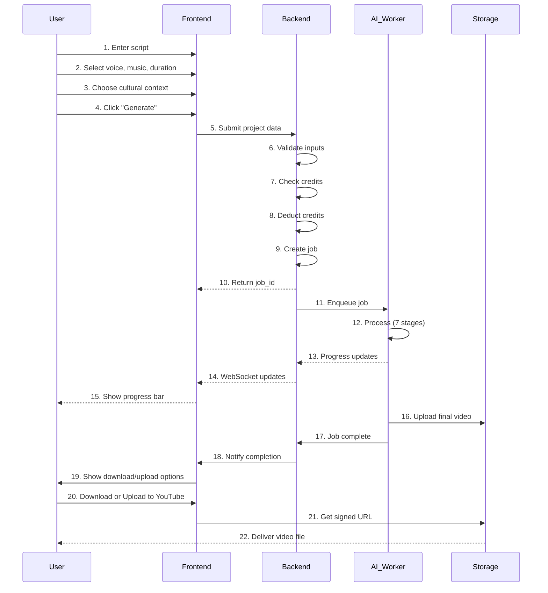

# AI FILM STUDIO – INVESTOR & DEVELOPER MASTER BLUEPRINT

**Version:** 2.0  
**Date:** 2026-01-09  
**Document Owner:** AI-Empower-HQ-360  
**Status:** Updated - Enterprise Studio Operating System

---

## Executive Summary

This comprehensive blueprint integrates all architectural layers, AI dependencies, business models, and deployment strategies for the AI Film Studio platform. Designed for both investor presentations and developer reference, this document provides complete visibility into the end-to-end system architecture, from user interaction to cloud infrastructure.

### Key Highlights

✅ **Enterprise Studio Operating System**: 8-engine unified platform architecture  
✅ **Character Engine (Core Module)**: First-class character assets with consistency  
✅ **Advanced AI Pipeline**: 7-stage dependency chain integrated with 8 engines  
✅ **Flexible Business Model**: Free → Pro → Enterprise tiers with credit system  
✅ **Multi-Environment Strategy**: Dev, Sandbox/QA, Staging, Production  
✅ **Deployment Strategy**: GitHub Pages (frontend) + AWS CDK (backend/workers)  
✅ **Global Integration**: Salesforce CRM + YouTube + Multi-cloud  
✅ **Cultural Awareness**: Dynamic content generation with cultural context  
✅ **Voice Diversity**: 25+ voice options across age groups and genders  
✅ **Multi-Language Support**: ASR + Translation for global reach

---

## Table of Contents

1. [System Architecture Overview](#1-system-architecture-overview)
2. [Workflow Layers](#2-workflow-layers)
3. [AI Dependencies & Pipeline](#3-ai-dependencies--pipeline)
4. [Subscription & Credit System](#4-subscription--credit-system)
5. [User Inputs & Outputs](#5-user-inputs--outputs)
6. [Environment Strategy](#6-environment-strategy)
7. [Integration Layers](#7-integration-layers)
8. [Technology Stack Matrix](#8-technology-stack-matrix)
9. [Scalability & Performance](#9-scalability--performance)
10. [Business Model & Revenue](#10-business-model--revenue)
11. [Security & Compliance](#11-security--compliance)
12. [Implementation Roadmap](#12-implementation-roadmap)

---

## 1. System Architecture Overview

### 1.1 Enterprise Studio Operating System (8-Engine Architecture)

AI Film Studio is built on an **Enterprise Studio Operating System** with **8 core engines** that work together to provide end-to-end production capabilities:

```
AI Film Studio - Enterprise Studio Operating System
│
├── 1. Character Engine (Core Module)
│   └── First-class character assets, consistency, versions
│
├── 2. AI Writing & Story Engine
│   └── Script generation, dialogue, storyboards
│
├── 3. AI Pre-Production Engine
│   └── Script breakdown, schedules, budgets
│
├── 4. Production Management (Studio Ops)
│   └── RBAC, asset management, approvals
│
├── 5. AI / Real Shoot Production Layer
│   └── Hybrid production (real footage + AI)
│
├── 6. AI Post-Production Engine
│   ├── AI Voice & Dialogue Engine
│   ├── AI Music & Scoring Engine
│   └── AI Audio Post Engine
│
├── 7. Marketing & Distribution Engine
│   └── Trailers, posters, platform exports
│
└── 8. Enterprise Platform Layer
    └── Multi-tenancy, billing, API access
```

**Key Features:**
- **Character-First Architecture**: Characters are first-class assets, not prompts
- **Scene-Aware Processing**: Voice, music, and audio adapt to scene context
- **Enterprise-Ready**: Multi-tenant, RBAC, audit logs, compliance
- **Hybrid Production**: Support for real footage + AI-generated content
- **End-to-End Pipeline**: From idea to distribution in one platform

### 1.2 High-Level Architecture Diagram

```
┌─────────────────────────────────────────────────────────────────────┐
│                         USER LAYER (Blue)                            │
│  Inputs: Script, Images, Voice Preferences, Music, Duration,        │
│          YouTube Credentials, Cultural Context                       │
└────────────────────────────┬────────────────────────────────────────┘
                             │
                             ▼
┌─────────────────────────────────────────────────────────────────────┐
│                   FRONTEND LAYER (Light Blue)                        │
│  • React + Next.js 14                                                │
│  • TailwindCSS / Material UI                                         │
│  • Multi-language interface (i18n)                                   │
│  • Real-time video/audio preview                                     │
│  • WebSocket for live progress updates                               │
│  • Forms: Script, Images, Voice, Music, Duration, Cultural Context  │
└────────────────────────────┬────────────────────────────────────────┘
                             │ HTTPS/REST API + GraphQL
                             ▼
┌─────────────────────────────────────────────────────────────────────┐
│              BACKEND MICROSERVICES LAYER (Green)                     │
│  • Node.js / NestJS + FastAPI (Python)                               │
│  • Microservices: User, Project, Credits, AI Job, YouTube, Admin    │
│  • API Types: REST + GraphQL                                         │
│  • Authentication: JWT + OAuth 2.0                                   │
│  • Async Processing: Redis / BullMQ / AWS SQS                        │
└────────────────┬────────────┬───────────────┬───────────────────────┘
                 │            │               │
      ┌──────────┘            │               └──────────┐
      ▼                       ▼                          ▼
┌──────────┐          ┌──────────────┐          ┌──────────────┐
│ DATABASE │          │    CACHE     │          │   STORAGE    │
│          │          │              │          │              │
│ Postgres │          │    Redis     │          │ AWS S3 +     │
│ /MySQL   │          │ - Job Queues │          │ CloudFront   │
│          │          │ - Sessions   │          │ - Videos     │
│ • Users  │          │ - Credits    │          │ - Images     │
│ • Projects│         │              │          │ - Subtitles  │
│ • Jobs   │          │              │          │ - Audio      │
└──────────┘          └──────────────┘          └──────────────┘
                             │
                             ▼
┌─────────────────────────────────────────────────────────────────────┐
│              ENTERPRISE STUDIO OPERATING SYSTEM (Orange)              │
│  8 Core Engines:                                                     │
│  1️⃣ Character Engine - First-class character assets                 │
│  2️⃣ Writing Engine - Script, dialogue, storyboards                  │
│  3️⃣ Pre-Production Engine - Breakdown, schedules, budgets           │
│  4️⃣ Production Management - RBAC, assets, approvals                 │
│  5️⃣ Production Layer - Real footage + AI generation                 │
│  6️⃣ Post-Production Engine - Voice, music, audio post               │
│  7️⃣ Marketing Engine - Trailers, posters, exports                   │
│  8️⃣ Enterprise Platform - Multi-tenant, billing, API                │
│                                                                      │
│  AI Pipeline Integration (7 Stages within engines):                 │
│  • Script Analysis → Writing Engine                                  │
│  • Character Generation → Character Engine                           │
│  • Image/Video Generation → Production Layer                         │
│  • Voice Synthesis → Post-Production (Voice Engine)                  │
│  • Music/Scoring → Post-Production (Music Engine)                    │
│  • Audio Processing → Post-Production (Audio Post Engine)            │
│  • Subtitles → Post-Production (Voice Engine)                        │
└────────────────────────────┬────────────────────────────────────────┘
                             │
                             ▼
┌─────────────────────────────────────────────────────────────────────┐
│            CLOUD / INFRASTRUCTURE LAYER (Purple)                     │
│  • EC2 GPU (g4dn.xlarge/p3) - AI processing                         │
│  • ECS/EKS - Microservices                                           │
│  • RDS - Database, S3 - Storage, CloudFront - CDN                   │
│  • SQS - Job queue, Redis - Cache                                   │
│  • Terraform - IaC                                                   │
│  • Environments: Dev, Sandbox/QA, Staging, Production               │
└────────────────────────────┬────────────────────────────────────────┘
                             │
                             ▼
┌─────────────────────────────────────────────────────────────────────┐
│              SALESFORCE CRM LAYER (Light Green)                      │
│  • Contact → User sync                                               │
│  • AI_Project__c → Projects                                          │
│  • AI_Credit__c → Credits                                            │
│  • YouTube_Integration__c                                            │
│  • Flows, Apex, Dashboards                                           │
└────────────────────────────┬────────────────────────────────────────┘
                             │
                             ▼
┌─────────────────────────────────────────────────────────────────────┐
│               YOUTUBE / OUTPUT LAYER (Red)                           │
│  • Direct video upload, Playlist creation                            │
│  • Thumbnail generation, Download options                            │
│  • Duration: 1-5 minutes                                             │
└─────────────────────────────────────────────────────────────────────┘
```

### 1.2 Component Color Legend

| Color | Layer | Purpose |
|-------|-------|---------|
| **Blue** | User Layer | Input interface, user interactions |
| **Light Blue** | Frontend | UI/UX, user experience |
| **Green** | Backend | Business logic, microservices |
| **Yellow** | Data Layer | Storage, caching, databases |
| **Orange** | AI/ML | AI processing, content generation |
| **Purple** | Infrastructure | Cloud, compute, networking |
| **Light Green** | Salesforce CRM | Customer management, analytics |
| **Red** | YouTube/Output | Content distribution, publishing |

---

## 1.5 Character Engine (CRITICAL CORE MODULE)

**Characters are first-class assets**, not prompts. This is the foundation of the Enterprise Studio Operating System.

### Core Features

**Character Creation:**
- Visual concept art generation
- Photorealistic characters
- Stylized / animated characters
- Wardrobe, makeup, aging, variations
- Brand mascots

**Character Consistency:**
- Identity locking across images, scenes, and video
- Pose, lighting, emotion control
- Scene-to-scene continuity
- Character persistence across projects

**Character Versions:**
- Concept → Casting → Final → Alternate timelines
- Version history and rollback
- Scene-specific assignments
- A/B testing for character designs

**Character Modes:**
- **Actor Mode**: Real actor references, look tests
- **Avatar Mode**: Fully AI actors for films, animation
- **Brand Mode**: Persistent mascots, campaign reuse, brand-safe consistency

### API Integration

```python
# Create character
character = await character_engine.create_character(
    name="John Doe",
    description="Protagonist",
    mode=CharacterMode.AVATAR,
    character_type=CharacterType.PHOTOREALISTIC
)

# Generate character image with consistency
visual = await character_engine.generate_character_image(
    character_id=character.character_id,
    prompt="Walking in park",
    scene_context="Sunny afternoon",
    emotion="happy"
)
```

### Why This Matters

This enables:
- **Real Filmmaking**: Consistent characters across scenes
- **AI Films**: Fully AI-generated content with character continuity
- **Brand Storytelling**: Persistent mascots and brand characters
- **Production Quality**: Professional-grade character management

---

## 2. Workflow Layers

### 2.1 Layer-by-Layer Breakdown

#### Layer 1: User Layer (Blue)

**User Inputs:**
- **Script**: Plain text/Markdown, 500-2000 words, any language
- **Images**: Custom uploads or AI-generated, JPG/PNG/WEBP, 10MB max
- **Voice**: 25+ options across age groups, genders, languages
- **Music**: Indian/Western/Slokas/Poems
- **Duration**: 30 seconds - 5 minutes
- **YouTube**: OAuth credentials for direct upload
- **Cultural Context**: Regional styling and props

#### Layer 2: Frontend Layer (Light Blue)

**Technology Stack:**
- Framework: React 18 + Next.js 14
- Styling: TailwindCSS + Material UI  
- State: Zustand + React Query
- Real-time: WebSocket (Socket.IO)
- Forms: React Hook Form + Zod validation

**Key Features:**
- Multi-language interface (English, Hindi, Spanish, French, etc.)
- Script editor with syntax highlighting and AI suggestions
- Real-time video/audio preview
- Progress tracking with WebSocket updates
- Drag-and-drop file uploads
- SEO-optimized pages

#### Layer 3: Backend Microservices Layer (Green)

**Microservices Architecture:**

```yaml
User Service:
  Responsibilities:
    - Authentication & authorization
    - Profile management
    - Subscription handling
  Tech Stack: NestJS + TypeORM
  Database: PostgreSQL
  
Project Service:
  Responsibilities:
    - Project CRUD operations
    - Version control
    - Asset management
  Tech Stack: NestJS + TypeORM
  Database: PostgreSQL
  
Credits Service:
  Responsibilities:
    - Credit balance tracking
    - Transaction history
    - Credit deduction logic
  Tech Stack: Node.js + Redis
  Database: PostgreSQL + Redis cache
  
AI Job Service:
  Responsibilities:
    - Job queue management
    - Progress tracking
    - Worker orchestration
  Tech Stack: FastAPI (Python) + SQS
  Database: PostgreSQL + Redis
  
YouTube Service:
  Responsibilities:
    - OAuth authentication
    - Video upload
    - Playlist management
  Tech Stack: Node.js + YouTube Data API v3
  Database: PostgreSQL
  
Admin Service:
  Responsibilities:
    - User management
    - Content moderation
    - Analytics dashboard
  Tech Stack: NestJS + GraphQL
  Database: PostgreSQL
```

**API Architecture:**
- REST APIs for CRUD operations
- GraphQL for complex queries
- WebSocket for real-time updates
- JWT for authentication
- OAuth 2.0 for third-party integrations

#### Layer 4: Data Layer (Yellow)

**PostgreSQL Database Schema:**

```sql
-- Users table
CREATE TABLE users (
    user_id UUID PRIMARY KEY DEFAULT gen_random_uuid(),
    email VARCHAR(255) UNIQUE NOT NULL,
    password_hash VARCHAR(255),
    full_name VARCHAR(255),
    tier VARCHAR(50) DEFAULT 'free', -- free, pro, enterprise
    credits INTEGER DEFAULT 3,
    credit_reset_date TIMESTAMP,
    created_at TIMESTAMP DEFAULT NOW(),
    updated_at TIMESTAMP DEFAULT NOW()
);

-- Projects table
CREATE TABLE projects (
    project_id UUID PRIMARY KEY DEFAULT gen_random_uuid(),
    user_id UUID REFERENCES users(user_id),
    title VARCHAR(255) NOT NULL,
    script TEXT,
    status VARCHAR(50) DEFAULT 'draft', -- draft, processing, completed, failed
    duration_minutes INTEGER,
    cultural_context VARCHAR(100),
    thumbnail_url TEXT,
    created_at TIMESTAMP DEFAULT NOW(),
    updated_at TIMESTAMP DEFAULT NOW()
);

-- Jobs table
CREATE TABLE jobs (
    job_id UUID PRIMARY KEY DEFAULT gen_random_uuid(),
    project_id UUID REFERENCES projects(project_id),
    status VARCHAR(50) DEFAULT 'queued',
    progress INTEGER DEFAULT 0, -- 0-100
    current_stage VARCHAR(100),
    output_url TEXT,
    error_message TEXT,
    started_at TIMESTAMP,
    completed_at TIMESTAMP,
    created_at TIMESTAMP DEFAULT NOW()
);

-- Credits transactions table
CREATE TABLE credit_transactions (
    transaction_id UUID PRIMARY KEY DEFAULT gen_random_uuid(),
    user_id UUID REFERENCES users(user_id),
    type VARCHAR(50), -- deduction, purchase, grant
    amount INTEGER,
    balance_after INTEGER,
    description TEXT,
    created_at TIMESTAMP DEFAULT NOW()
);

-- YouTube integrations table
CREATE TABLE youtube_integrations (
    integration_id UUID PRIMARY KEY DEFAULT gen_random_uuid(),
    user_id UUID REFERENCES users(user_id),
    channel_id VARCHAR(255),
    access_token TEXT,
    refresh_token TEXT,
    expires_at TIMESTAMP,
    created_at TIMESTAMP DEFAULT NOW()
);
```

**Redis Cache:**
- Session storage (user sessions)
- Job status cache (real-time updates)
- Credit balance cache (fast access)
- Rate limiting counters
- API response cache

**S3 Storage Structure:**
```
ai-film-studio-media/
├── users/
│   └── {user_id}/
│       └── projects/
│           └── {project_id}/
│               ├── raw/           # Original uploads
│               │   ├── script.txt
│               │   └── images/
│               ├── generated/     # AI-generated content
│               │   ├── characters/
│               │   ├── backgrounds/
│               │   ├── audio/
│               │   └── subtitles/
│               └── final/         # Rendered videos
│                   ├── video.mp4
│                   └── thumbnail.jpg
```

#### Layer 5: AI/ML Layer (Orange)

**Detailed AI Pipeline:**

```yaml
Stage 1: Script Analysis
  Input: Raw script text
  Process:
    - NLP analysis for plot, characters, actions
    - Cultural context detection
    - Scene breakdown
    - Emotion analysis
  Models: GPT-4, Claude, LLaMA 2
  Output: Structured scene data
  Time: 10-30 seconds

Stage 2: Image Generation
  Input: Scene descriptions + cultural context
  Process:
    - Character design generation
    - Background scene creation
    - Props and clothing rendering
    - Style transfer (cultural appropriateness)
  Models: Stable Diffusion XL, ControlNet, Custom LoRAs
  Output: High-res images (1024x1024)
  Time: 20-40 seconds per scene

Stage 3: Voice Synthesis
  Input: Script text + voice preferences
  Process:
    - Text-to-speech conversion
    - Voice cloning (if custom)
    - Emotion injection
    - Prosody optimization
  Models: ElevenLabs, Azure TTS, Coqui TTS
  Output: Audio files (WAV/MP3)
  Time: 5-15 seconds per minute of audio
  
  Voice Options:
    Ages: Baby, Child (5-12), Teen (13-17), Adult (18-50), Mature (50+)
    Genders: Male, Female, Non-binary
    Languages: English, Hindi, Spanish, French, German, Arabic, Chinese, etc.
    Total: 25+ unique voices

Stage 4: Lip-sync & Animation
  Input: Images + audio
  Process:
    - Facial landmark detection
    - Lip movement generation
    - Head pose adjustment
    - Expression animation
  Models: Wav2Lip, SadTalker, Custom animation rigs
  Output: Animated video clips
  Time: 30-60 seconds per scene

Stage 5: Music / Slokas / Poems
  Input: Scene mood + user selection
  Process:
    - Background music generation or selection
    - Sloka/poem narration with music
    - Audio mixing and mastering
  Models: MusicGen, AudioCraft, Licensed libraries
  Output: Background audio tracks
  Time: 10-20 seconds
  
  Options:
    Indian:
      - Classical (Carnatic, Hindustani)
      - Devotional (Bhajans, Kirtans)
      - Bollywood-style
      - Sanskrit Slokas with traditional music
    Western:
      - Orchestral (Epic, Cinematic)
      - Pop/Rock
      - Ambient/Atmospheric
      - Instrumental

Stage 6: Podcast Mode
  Input: Dialogue script + two voice selections
  Process:
    - Speaker diarization
    - Turn-taking logic
    - Natural pauses insertion
    - Voice differentiation
    - Synchronized animation for both characters
  Models: Custom NLP + Multi-voice TTS
  Output: Two-character conversation video
  Time: 40-80 seconds
  
  Features:
    - Automatic speaker attribution
    - Natural conversation flow
    - Voice pitch differentiation
    - Facial expressions for both speakers
    - Turn-taking animations

Stage 7: Subtitles & Multi-language
  Input: Final audio
  Process:
    - Automatic speech recognition
    - Translation to target languages
    - Time-code synchronization
    - Subtitle styling
  Models: Whisper ASR, GPT-4 Translation, DeepL
  Output: SRT/VTT subtitle files
  Time: 10-20 seconds
  
  Supported Languages: 50+
  - English, Spanish, French, German, Hindi
  - Arabic, Chinese, Japanese, Korean
  - Portuguese, Russian, Italian, Dutch
  - And many more...
```

**GPU Requirements:**
- Instance Type: g4dn.xlarge (NVIDIA T4, 16GB GPU)
- Alternative: p3.2xlarge (NVIDIA V100, 16GB)
- CUDA: 12.1+
- PyTorch: 2.1+
- Batch Processing: Up to 5 concurrent jobs per GPU

#### Layer 6: Cloud Infrastructure Layer (Purple)

**Deployment Strategy:**
- **Frontend**: GitHub Pages (automatic deployment, free)
- **Backend & Workers**: AWS CDK (on-demand, scalable)
- **Hybrid Approach**: Best of both worlds - simple frontend + powerful backend

**AWS CDK Infrastructure:**

```yaml
VPC:
  - Public subnets (ALB, NAT)
  - Private subnets (ECS, RDS)
  - Isolated subnets (RDS)

ECS Fargate Cluster:
  - Backend API Service (FastAPI)
    - All 8 engines (Character, Writing, Production, etc.)
    - Auto-scaling: 2-20 tasks
    - CPU: 1-2 vCPU, Memory: 2-4 GB
  
RDS PostgreSQL:
  - Multi-AZ for production
  - Automated backups
  - Read replicas for scaling
  
S3 Buckets:
  - ai-film-studio-assets (scripts, videos)
  - ai-film-studio-characters (character assets)
  - ai-film-studio-marketing (trailers, posters)
  - Versioning enabled, lifecycle policies
  
SQS Queues:
  - ai-film-studio-jobs (main queue)
  - ai-film-studio-video (video processing)
  - ai-film-studio-voice (voice generation)
  
CloudFront CDN:
  - Global content delivery
  - S3 origin for assets
  - HTTPS only, compression
  
ECR Repositories:
  - ai-film-studio-backend
  - ai-film-studio-worker
  
GPU Workers (EC2):
  - Launch templates for G4DN instances
  - Auto-scaling based on queue depth
  - Spot instances for cost savings
```

**AWS Services:**

```yaml
Compute:
  ECS Fargate:
    Purpose: Backend microservices
    Configuration:
      - CPU: 1-2 vCPU per service
      - Memory: 2-4 GB per service
      - Auto-scaling: 2-10 tasks
    Cost: ~$30-$120/month
  
  EC2 GPU Instances:
    Purpose: AI processing workers
    Configuration:
      - Instance: g4dn.xlarge
      - vCPUs: 4, GPU: NVIDIA T4 (16GB)
      - Auto-scaling: 0-20 instances
      - Spot instances: 70% cost savings
    Cost: ~$160-$690/month
  
  Lambda:
    Purpose: Serverless functions
    Use Cases:
      - Image thumbnails
      - Webhook handlers
      - S3 event processors

Database:
  RDS PostgreSQL:
    Configuration:
      - Dev: db.t3.medium, Single-AZ
      - Prod: db.r6g.xlarge, Multi-AZ
      - Storage: 100GB-500GB gp3
      - Backups: 7-30 days
    Cost: ~$72-$590/month
  
  ElastiCache Redis:
    Configuration:
      - Dev: cache.t3.micro
      - Prod: cache.r6g.large, Multi-AZ
    Cost: ~$12-$200/month

Storage & CDN:
  S3:
    Buckets:
      - ai-film-studio-media (primary)
      - ai-film-studio-backups (DR)
    Configuration:
      - Versioning: Enabled
      - Encryption: AES-256
      - Lifecycle: IA after 30 days
    Cost: ~$23-$100/month
  
  CloudFront:
    Configuration:
      - Global edge locations
      - HTTPS only
      - Compression enabled
    Cost: ~$5-$180/month

Messaging:
  SQS:
    Queues:
      - ai-film-studio-jobs (main queue)
      - ai-film-studio-jobs-dlq (dead letter)
    Configuration:
      - Visibility timeout: 300s
      - Message retention: 14 days
    Cost: ~$0.50-$5/month
  
  SNS:
    Topics:
      - Job notifications
      - System alerts
    Cost: ~$0.50-$2/month

Monitoring:
  CloudWatch:
    - Logs: All services
    - Metrics: Custom + AWS
    - Alarms: 20+ alerts
    Cost: ~$5-$28/month
  
  Grafana + Prometheus (Optional):
    - Advanced dashboards
    - Custom metrics
    Cost: ~$10-$50/month
```

**Infrastructure as Code:**

**AWS CDK (Primary):**
```typescript
// CDK Stack Structure
infrastructure/aws-cdk/
├── app.py                    # CDK app entry point
├── cdk.json                  # CDK configuration
├── requirements.txt          # Python dependencies
├── stacks/
│   └── ai_film_studio_stack.py  # Main infrastructure stack
├── Dockerfile.backend        # Backend container
├── Dockerfile.worker         # GPU worker container
├── deploy.sh                 # Deployment script
└── README.md                 # Deployment guide
```

**Deployment:**
- **GitHub Actions**: `.github/workflows/aws-cdk-deploy.yml`
- **Manual**: `cd infrastructure/aws-cdk && ./deploy.sh production us-east-1`

**Terraform (Optional/Alternative):**
```hcl
# Example Terraform structure
terraform/
├── environments/
│   ├── dev/
│   │   ├── main.tf
│   │   ├── variables.tf
│   │   └── terraform.tfvars
│   ├── sandbox/
│   ├── staging/
│   └── production/
└── modules/
    ├── vpc/
    ├── ecs/
    ├── rds/
    ├── s3/
    └── cloudfront/
```

#### Layer 7: Salesforce CRM Layer (Light Green)

**Custom Objects:**

```yaml
AI_Project__c:
  Fields:
    - Name: Project_Title__c (Text)
    - User_Email__c (Email)
    - Script__c (Long Text Area)
    - Status__c (Picklist: Draft, Processing, Completed, Failed)
    - Duration_Minutes__c (Number)
    - Cultural_Context__c (Picklist)
    - Output_URL__c (URL)
    - Credits_Used__c (Number)
    - Created_Date__c (DateTime)
  
  Relationships:
    - Contact (Lookup)
    - AI_Credit__c (Master-Detail)

AI_Credit__c:
  Fields:
    - Contact__c (Lookup)
    - Tier__c (Picklist: Free, Pro, Enterprise)
    - Current_Balance__c (Number)
    - Total_Purchased__c (Number)
    - Total_Used__c (Number)
    - Reset_Date__c (Date)
  
  Relationships:
    - Contact (Master-Detail)

YouTube_Integration__c:
  Fields:
    - Contact__c (Lookup)
    - Channel_ID__c (Text)
    - Channel_Name__c (Text)
    - Access_Token__c (Encrypted Text)
    - Refresh_Token__c (Encrypted Text)
    - Token_Expires_At__c (DateTime)
    - Is_Active__c (Checkbox)
  
  Relationships:
    - Contact (Master-Detail)
```

**Salesforce Flows:**

```yaml
Flow: Credit_Deduction_Flow
  Trigger: AI_Project__c record created with Status = 'Processing'
  Actions:
    1. Get related AI_Credit__c record
    2. Calculate credits needed (Duration_Minutes__c * 3)
    3. Check if balance sufficient
    4. If yes:
       - Deduct credits
       - Create transaction record
       - Update AI_Credit__c
    5. If no:
       - Send alert to user
       - Update project status to 'Insufficient_Credits'

Flow: YouTube_Upload_Flow
  Trigger: AI_Project__c Status changed to 'Completed'
  Actions:
    1. Check if YouTube_Integration__c exists
    2. If yes:
       - Call external API to upload video
       - Update AI_Project__c with YouTube URL
    3. Send email notification to user
```

**Apex Classes:**

```apex
public class CreditService {
    public static Boolean deductCredits(Id contactId, Integer amount) {
        AI_Credit__c credit = [
            SELECT Current_Balance__c FROM AI_Credit__c 
            WHERE Contact__c = :contactId LIMIT 1
        ];
        
        if (credit.Current_Balance__c >= amount) {
            credit.Current_Balance__c -= amount;
            update credit;
            return true;
        }
        return false;
    }
    
    public static void addCredits(Id contactId, Integer amount) {
        AI_Credit__c credit = [
            SELECT Current_Balance__c, Total_Purchased__c 
            FROM AI_Credit__c 
            WHERE Contact__c = :contactId LIMIT 1
        ];
        
        credit.Current_Balance__c += amount;
        credit.Total_Purchased__c += amount;
        update credit;
    }
}
```

**Dashboards & Reports:**

```yaml
Dashboard: AI_Studio_Executive_Dashboard
  Components:
    - Total Active Users (Gauge)
    - Monthly Video Generation Count (Line Chart)
    - Revenue by Tier (Donut Chart)
    - Credit Usage Trends (Stacked Bar)
    - Top Users by Usage (Table)
    - System Health Metrics (KPI)

Report: Monthly_Revenue_Report
  Type: Summary Report
  Grouping: By Tier (Free, Pro, Enterprise)
  Columns:
    - User Count
    - Total Credits Purchased
    - Total Revenue
    - Average Credits per User
    - Conversion Rate (Free to Paid)
```

#### Layer 8: YouTube/Output Layer (Red)

**YouTube Integration:**

```yaml
Authentication:
  Method: OAuth 2.0
  Scopes:
    - youtube.upload
    - youtube.readonly
    - youtube.force-ssl
  Flow:
    1. User clicks "Connect YouTube"
    2. Redirect to Google OAuth
    3. User authorizes
    4. Store access_token and refresh_token
    5. Token auto-refresh before expiry

Video Upload Process:
  1. User completes video generation
  2. Select "Upload to YouTube"
  3. Fill metadata:
     - Title (auto-suggested from script)
     - Description (auto-generated)
     - Tags (AI-extracted keywords)
     - Category (Film & Animation)
     - Privacy (Public/Unlisted/Private)
  4. Upload via YouTube Data API v3
  5. Return YouTube video URL
  6. Optionally add to playlist

Specifications:
  Format: MP4 (H.264 + AAC)
  Resolution: 1920x1080 (1080p)
  Frame Rate: 24/30 fps
  Bitrate: 8-12 Mbps
  Aspect Ratio: 16:9
  Max File Size: 128 GB
  Supported Durations: 30s - 5 minutes

Features:
  - Automatic thumbnail generation
  - SEO-optimized metadata
  - Scheduled publishing
  - Playlist management
  - Analytics tracking
```

**Download Options:**

```yaml
Local Download:
  - Direct MP4 download
  - Resolution: 1080p, 720p, 480p
  - With/without watermark (tier-dependent)
  - Subtitle files (.srt, .vtt)

Cloud Storage:
  - S3 signed URL (expires in 7 days)
  - CloudFront accelerated download
  - Resume capability

Share Links:
  - Time-limited shareable links (24 hours)
  - Password protection (optional)
  - View tracking
```

---

## 2.6 Enterprise Studio Operating System Engines

### 2.6.1 AI Pre-Production Engine

**Purpose:** Convert scripts into executable production plans

**Features:**
- Script breakdown (scenes, cast, props, locations)
- Shooting schedules generation
- Budget estimation
- Call sheets creation
- Production calendars

**Integration:**
- Works with Writing Engine (receives scripts)
- Informs Production Management (schedules)
- Supports both AI and real shoots

**API:**
```python
# Create production plan
plan = await preproduction_engine.create_production_plan(
    script_id=script.script_id
)

# Generate shooting schedule
schedule = await preproduction_engine.generate_shooting_schedule(
    script_id=script.script_id,
    breakdown=plan.breakdown,
    start_date=date(2024, 6, 1)
)
```

### 2.6.2 Production Management (Studio Ops)

**Purpose:** Enterprise studio control layer

**Features:**
- Role-based access control (writer, director, producer, editor)
- Asset management (scripts, footage, audio, images)
- Timeline & milestone tracking
- Review, approval, and locking workflows
- Audit logs and compliance

**Enterprise-Ready:**
- Multi-user collaboration
- Permission-based access
- Version control for assets
- Approval workflows
- Compliance tracking

**API:**
```python
# Create project
project = await production_manager.create_project(
    name="My Film",
    created_by=user_id
)

# Request approval
approval = await production_manager.request_approval(
    asset_id=asset.asset_id,
    approver_id=producer_id
)
```

### 2.6.3 Marketing & Distribution Engine

**Purpose:** Turn productions into revenue-ready assets

**Features:**
- Trailers, teasers, promos generation
- Posters and thumbnails creation
- Social media cut-downs
- Platform-specific exports (YouTube, Instagram, TikTok)
- Campaign asset reuse

**This is where brands and agencies scale.**

**API:**
```python
# Generate trailer
trailer = await marketing_engine.generate_trailer(
    project_id=project.project_id,
    source_video_id=video_id,
    duration=60.0
)

# Generate poster
poster = await marketing_engine.generate_poster(
    project_id=project.project_id,
    style="cinematic"
)
```

### 2.6.4 Enterprise Platform Layer

**Purpose:** SaaS governance and scalability

**Features:**
- Multi-tenant organizations
- Usage metering and billing
- API access and rate limiting
- Data isolation and security
- SLAs and compliance

**Without this, you do not have an enterprise product.**

**API:**
```python
# Create organization
org = await enterprise_platform.create_organization(
    name="Studio XYZ",
    subscription_tier=SubscriptionTier.ENTERPRISE
)

# Record usage
usage = await enterprise_platform.record_usage(
    organization_id=org.organization_id,
    metric=UsageMetric.VIDEO_MINUTES,
    quantity=120.0
)
```

---

## 3. AI Dependencies & Pipeline

### 3.1 AI Dependency Flow Diagram (Integrated with 8 Engines)

```
┌──────────────────────────────────────────────────────────────────────┐
│              AI PIPELINE WITH ENTERPRISE STUDIO OS                    │
│                                                                       │
│  Step 1: SCRIPT INPUT                                                │
│  ↓                                                                    │
│  └─→ User provides script (text)                                     │
│      Engine: Writing Engine                                          │
│                                                                       │
│  Step 2: CHARACTER CREATION (if new characters needed)                │
│  ↓                                                                    │
│  └─→ Character Engine creates first-class character assets           │
│      - Visual concept art                                            │
│      - Identity locking                                              │
│      - Character versions                                            │
│      Engine: Character Engine (Core Module)                          │
│                                                                       │
│  Step 3: STORY & CULTURAL ANALYSIS                                   │
│  ↓                                                                    │
│  ├─→ Plot analysis & scene breakdown                                 │
│  ├─→ Character identification & traits                               │
│  ├─→ Action sequences & key moments                                  │
│  └─→ Cultural context detection (Indian/Western/Asian/etc.)          │
│      Models: GPT-4, Claude, LLaMA 2                                  │
│      Engine: Writing Engine                                          │
│                                                                       │
│  Step 4: PRE-PRODUCTION PLANNING                                     │
│  ↓                                                                    │
│  ├─→ Script breakdown (scenes, cast, props, locations)               │
│  ├─→ Shooting schedules                                              │
│  ├─→ Budget estimation                                               │
│      Engine: Pre-Production Engine                                   │
│                                                                       │
│  Step 5: IMAGE GENERATION                                            │
│  ↓ (Depends on: Story analysis + Cultural context + Characters)      │
│  ├─→ Character images (using Character Engine assets)                │
│  ├─→ Background scenes (location-specific)                           │
│  ├─→ Props & objects (context-aware)                                 │
│  └─→ Style transfer (traditional/modern/fusion)                      │
│      Models: SDXL, ControlNet, Custom LoRAs                          │
│      Engine: Production Layer (AI generation)                        │
│                                                                       │
│  Step 6: VOICE SYNTHESIS (Scene-Aware)                               │
│  ↓ (Depends on: Script + Character profiles + Scene context)         │
│  ├─→ Text-to-speech for each character (linked to Character Engine)  │
│  ├─→ Age-appropriate voice selection                                 │
│  ├─→ Gender-appropriate voice                                        │
│  ├─→ Language & accent selection                                     │
│  ├─→ Emotion injection (happy, sad, angry, etc.)                     │
│  └─→ Scene-aware performance (matching scene mood)                   │
│      Models: ElevenLabs, Azure TTS, Coqui TTS                        │
│      Engine: Post-Production Engine (Voice & Dialogue)               │
│                                                                       │
│  Step 7: ANIMATION & LIP-SYNC                                        │
│  ↓ (Depends on: Images + Voice audio)                                │
│  ├─→ Facial landmark detection                                       │
│  ├─→ Lip movement generation (phoneme-to-viseme)                     │
│  ├─→ Head pose adjustment                                            │
│  ├─→ Expression animation (emotions)                                 │
│  └─→ Body movement (if full-body)                                    │
│      Models: Wav2Lip, SadTalker, Custom rigs                         │
│      Engine: Production Layer                                        │
│                                                                       │
│  Step 8: MUSIC / SLOKAS / POEMS (Scene-Aware)                        │
│  ↓ (Depends on: Scene mood + Cultural context)                       │
│  ├─→ Scene-aware music generation                                    │
│  ├─→ Dialogue-aware ducking                                          │
│  ├─→ Beat-aligned transitions                                        │
│  ├─→ Sloka narration with traditional music (if selected)            │
│  ├─→ Audio mixing & mastering                                        │
│  └─→ Volume balancing with dialogue                                  │
│      Models: MusicGen, AudioCraft, Licensed libraries                │
│      Engine: Post-Production Engine (Music & Scoring)                │
│                                                                       │
│  Step 9: AUDIO POST-PROCESSING                                       │
│  ↓ (Depends on: All audio tracks)                                    │
│  ├─→ Dialogue cleanup                                                │
│  ├─→ Noise reduction                                                 │
│  ├─→ Loudness normalization                                          │
│  ├─→ Auto-mixing (dialogue vs music)                                 │
│  └─→ Platform-specific mastering (cinema, YouTube, OTT)              │
│      Engine: Post-Production Engine (Audio Post)                     │
│                                                                       │
│  Step 10: PODCAST MODE (Optional)                                    │
│  ↓ (Depends on: Dialogue script + Two voice selections)              │
│  ├─→ Speaker diarization (who speaks when)                           │
│  ├─→ Turn-taking logic & natural pauses                              │
│  ├─→ Voice differentiation (pitch, tone)                             │
│  ├─→ Synchronized animation for both characters                      │
│  └─→ Camera angle switching (split screen/alternating)               │
│      Models: Custom NLP + Multi-voice TTS                            │
│      Engine: Post-Production Engine                                  │
│                                                                       │
│  Step 11: SUBTITLES & MULTI-LANGUAGE                                 │
│  ↓ (Depends on: Final audio track)                                   │
│  ├─→ Automatic speech recognition (ASR)                              │
│  ├─→ Translation to target languages (50+)                           │
│  ├─→ Time-code synchronization                                       │
│  ├─→ Subtitle styling (font, color, position)                        │
│  └─→ Export in multiple formats (SRT, VTT, etc.)                     │
│      Models: Whisper ASR, GPT-4 Translation, DeepL                   │
│      Engine: Post-Production Engine (Voice Engine)                   │
│                                                                       │
│  Step 12: FINAL VIDEO RENDERING                                      │
│  ↓ (Depends on: All above components)                                │
│  ├─→ Video composition (scenes + animations)                         │
│  ├─→ Audio mixing (dialogue + music + effects)                       │
│  ├─→ Subtitle overlay                                                │
│  ├─→ Watermark addition (if free tier)                               │
│  ├─→ Thumbnail generation                                            │
│  └─→ Export as MP4 (H.264 + AAC, 1080p)                              │
│      Tools: FFmpeg, OpenCV, MoviePy                                  │
│      Engine: Production Layer                                        │
│                                                                       │
│  Step 13: MARKETING ASSETS GENERATION                                │
│  ↓ (Depends on: Final video)                                         │
│  ├─→ Trailers and teasers                                            │
│  ├─→ Posters and thumbnails                                          │
│  ├─→ Social media cut-downs                                          │
│  └─→ Platform-specific exports                                       │
│      Engine: Marketing & Distribution Engine                         │
│                                                                       │
│  OUTPUT: Final video + Marketing assets ready for distribution       │
│                                                                       │
│  All operations metered and billed via Enterprise Platform Layer     │
└──────────────────────────────────────────────────────────────────────┘
```

### 3.2 Dependency Matrix (Integrated with 8 Engines)

| Stage | Engine | Depends On | Output | Est. Time |
|-------|--------|------------|--------|-----------|
| 1. Script Input | Writing Engine | User | Raw text | Instant |
| 2. Character Creation | Character Engine | User/Story | Character assets | 20-40s |
| 3. Story Analysis | Writing Engine | Script | Structured data | 10-30s |
| 4. Pre-Production | Pre-Production Engine | Script | Production plan | 5-15s |
| 5. Image Generation | Production Layer | Story + Characters | Images (PNG) | 20-40s/scene |
| 6. Voice Synthesis | Post-Production (Voice) | Script + Characters + Scene | Audio (WAV) | 5-15s/min |
| 7. Animation | Production Layer | Images + Voice | Video clips | 30-60s/scene |
| 8. Music Scoring | Post-Production (Music) | Scene mood | Audio (MP3) | 10-20s |
| 9. Audio Post | Post-Production (Audio Post) | All audio tracks | Processed audio | 15-30s |
| 10. Podcast Mode | Post-Production | Dialogue + Voices | Conversation | 40-80s |
| 11. Subtitles | Post-Production (Voice) | Final audio | SRT/VTT | 10-20s |
| 12. Rendering | Production Layer | All above | MP4 video | 20-40s |
| 13. Marketing Assets | Marketing Engine | Final video | Trailers, posters | 30-60s |
| 14. Usage Metering | Enterprise Platform | All operations | Billing records | Instant |

**Total Processing Time: 2-5 minutes** (for 1-minute video, excluding marketing assets)

**All operations are tracked and billed through the Enterprise Platform Layer.**

### 3.3 Cultural Context Examples

```yaml
Indian Context:
  Clothing:
    Traditional: Saree, Kurta, Dhoti, Salwar Kameez
    Modern: Western fusion with Indian accessories
  Props:
    - Diyas (lamps)
    - Rangoli patterns
    - Temple architecture
    - Traditional instruments (tabla, sitar)
  Music:
    - Classical ragas
    - Devotional bhajans
    - Bollywood-style orchestral
  Language:
    - Hindi, Tamil, Telugu, Bengali, etc.
    - Sanskrit slokas

Western Context:
  Clothing:
    Formal: Suits, dresses
    Casual: Jeans, t-shirts
  Props:
    - Modern architecture
    - Contemporary furniture
    - Western instruments (piano, guitar)
  Music:
    - Orchestral (epic, cinematic)
    - Pop, rock, jazz
    - Ambient electronic
  Language:
    - English, Spanish, French, German

Middle Eastern Context:
  Clothing:
    - Thobe, Abaya, Hijab
    - Traditional patterns
  Props:
    - Islamic architecture
    - Desert landscapes
    - Traditional markets
  Music:
    - Oud, qanun
    - Traditional melodies
  Language:
    - Arabic, Persian, Turkish

Asian Context:
  Clothing:
    - Kimono (Japanese)
    - Hanfu (Chinese)
    - Hanbok (Korean)
  Props:
    - Cherry blossoms
    - Pagodas
    - Tea ceremonies
  Music:
    - Traditional instruments (shamisen, erhu, gayageum)
  Language:
    - Japanese, Chinese, Korean
```

---

## 4. Subscription & Credit System

### 4.1 Subscription Tiers

| Tier | Monthly Price | Credits/Month | Video Duration | Watermark | Queue Priority | Support |
|------|---------------|---------------|----------------|-----------|----------------|---------|
| **Free** | $0 | 3 | 1 min max | ✅ Yes | Low | Community |
| **Pro** | $29 | 30 | 5 min max | ❌ No | Medium | Email (48h) |
| **Enterprise** | $299 | Unlimited | 10 min max | ❌ No | High | Priority (4h) |

### 4.2 Credit System

**Credit Calculation:**
```yaml
Formula: Credits = Duration (minutes) × 3

Examples:
  30 seconds = 0.5 min × 3 = 1.5 credits (rounded to 2)
  1 minute = 1 min × 3 = 3 credits
  2 minutes = 2 min × 3 = 6 credits
  5 minutes = 5 min × 3 = 15 credits

Credit Deduction:
  - Deducted when job starts processing
  - Refunded if job fails (system error)
  - Not refunded if job cancelled by user
  - Not refunded for content policy violations
```

**Credit Top-Ups (for Free & Pro users):**
```yaml
Packages:
  - $5 = 10 credits (Best for occasional users)
  - $15 = 35 credits (15% bonus)
  - $40 = 100 credits (20% bonus)
  - $90 = 250 credits (25% bonus)

Payment Methods:
  - Credit/Debit cards (Stripe)
  - PayPal
  - Apple Pay / Google Pay
  - Bank transfer (Enterprise only)
```

### 4.3 Credit Usage Tracking

```yaml
User Dashboard:
  Current Balance: Display prominently
  Usage History: Last 30 days
  Next Reset Date: Monthly cycle
  Transaction Log: All credits in/out
  
Analytics:
  - Average credits per video
  - Most expensive videos (by duration)
  - Monthly trends
  - Projected usage

Notifications:
  Low Balance (< 5 credits):
    - Email alert
    - Dashboard banner
    - Suggest upgrade or top-up
  
  Credits Expired:
    - Only for purchased credits (1-year expiry)
    - Subscription credits reset monthly
```

### 4.4 Subscription Management

```yaml
Upgrade Flow:
  Free → Pro:
    - Click "Upgrade" button
    - Select billing cycle (monthly/annual)
    - Enter payment details
    - Instant activation
    - Credits reset to 30 immediately
  
  Pro → Enterprise:
    - Contact sales team
    - Custom contract
    - Onboarding session
    - Dedicated account manager

Downgrade Flow:
  Pro → Free:
    - Click "Downgrade"
    - Confirm action
    - Effective at end of billing period
    - Remaining credits retained (up to free limit)
  
  Cancellation:
    - Cancel anytime
    - Access until end of billing period
    - Auto-downgrade to Free
    - Credits > free limit expire

Billing Cycle:
  Monthly: Charged on subscription date each month
  Annual: 20% discount, charged once per year
  Invoice: Available for Enterprise
```

---

## 5. User Inputs & Outputs

### 5.1 Input Types

```yaml
Script Input:
  Format: Plain text, Markdown
  Max Length:
    - Free: 500 words
    - Pro: 2000 words
    - Enterprise: 5000 words
  Language: Any (auto-detected)
  Features:
    - Syntax highlighting
    - Auto-save every 30 seconds
    - Version history (Pro/Enterprise)
    - AI suggestions (optional)
    - Word count & credit estimation

Image Input:
  Upload:
    - Format: JPG, PNG, WEBP
    - Max Size: 10MB per image
    - Max Count: 10 images (Free), 50 (Pro), 100 (Enterprise)
  Generation:
    - AI-generated from script
    - Style selection: Realistic, Anime, Cartoon, Oil Painting
    - Cultural context: Auto-detected or manual

Voice Input:
  Selection:
    - 25+ voices
    - Age: Baby, Child, Teen, Adult, Mature
    - Gender: Male, Female, Non-binary
    - Language: English, Hindi, Spanish, etc.
    - Preview before selection
  Custom:
    - Upload voice sample (Pro/Enterprise)
    - Voice cloning (5-10 samples required)
    - Processing time: 2-4 hours

Music Input:
  Library Selection:
    - Indian: Classical, Devotional, Bollywood
    - Western: Orchestral, Pop, Ambient
    - Slokas: Sanskrit verses
    - Poems: Recited poetry
  Upload:
    - Custom music (MP3, WAV)
    - Max size: 50MB
    - Auto-looping for longer videos

Duration Input:
  Range: 30 seconds - 5 minutes (Pro/Enterprise: up to 10 min)
  Granularity: 30-second increments
  Credit Calculation: Real-time display

Cultural Context Input:
  Regions:
    - Indian (North, South, East, West)
    - Western (American, European)
    - Middle Eastern
    - Asian (Chinese, Japanese, Korean)
    - African
  Style:
    - Traditional
    - Modern
    - Fusion

YouTube Input:
  Authentication: OAuth 2.0
  Metadata:
    - Title (auto-generated from script)
    - Description (AI-generated summary)
    - Tags (AI-extracted keywords)
    - Category: Film & Animation, Education, etc.
    - Privacy: Public, Unlisted, Private
  Playlist:
    - Create new or add to existing
    - Auto-organize by date/theme
```

### 5.2 Output Types

```yaml
Video Output:
  Format: MP4 (H.264 + AAC)
  Resolution:
    - 1080p (1920x1080) - Default
    - 720p (1280x720) - Optional
    - 480p (854x480) - Optional
  Frame Rate: 24 fps, 30 fps
  Bitrate: 8-12 Mbps (adaptive)
  Aspect Ratio: 16:9 (default), 9:16 (vertical)
  Duration: As specified by user
  Watermark:
    - Free tier: "Created with AI Film Studio" (corner overlay)
    - Pro/Enterprise: No watermark
  
Audio Output:
  Format: AAC, 192 kbps
  Channels: Stereo
  Sample Rate: 48 kHz
  Components:
    - Dialogue (voice synthesis)
    - Background music
    - Sound effects (optional)
    - Balanced mixing

Subtitle Output:
  Formats: SRT, VTT, ASS
  Languages: 50+ available
  Styling:
    - Font: Arial, Roboto, etc.
    - Size: Small, Medium, Large
    - Color: White, Yellow, etc.
    - Position: Bottom, Top
    - Background: None, Semi-transparent, Solid
  
Thumbnail Output:
  Format: JPG
  Resolution: 1280x720
  Count: 3 auto-generated options
  Features:
    - Key scene capture
    - Text overlay (video title)
    - Branding (Pro/Enterprise)

Metadata Output:
  Project Info:
    - Title, description
    - Tags, categories
    - Creation date
    - Processing time
    - Credits used
  Technical Info:
    - Video codec, bitrate
    - Audio codec, sample rate
    - Duration, file size
    - AI models used
```

### 5.3 Input-Output Flow



---

## 6. Deployment Strategy

### 6.1 CI/CD Platform Overview

**Primary Deployment Strategy:**
- **Frontend**: GitHub Pages (automatic, free, fast)
- **Backend & Workers**: AWS CDK (on-demand, scalable, production-ready)

This hybrid approach provides:
- ✅ **Simple Frontend Deployment**: GitHub Pages handles static site hosting automatically
- ✅ **Powerful Backend Infrastructure**: AWS CDK provides enterprise-grade backend services
- ✅ **Cost Efficiency**: Free frontend hosting + pay-as-you-go backend
- ✅ **Scalability**: Frontend scales automatically; backend scales on-demand

### 6.2 GitHub Pages Deployment (Frontend)

**Workflow:** `.github/workflows/deploy-pages.yml` and `.github/workflows/deploy.yml`

**Triggers:**
- Push to `main` branch
- Manual trigger via `workflow_dispatch`

**Process:**
1. Checkout code
2. Setup Node.js 18
3. Install dependencies (`npm ci`)
4. Build Next.js app (`npm run build`)
5. Upload `frontend/out` directory as artifact
6. Deploy to GitHub Pages automatically

**Features:**
- ✅ Automatic HTTPS
- ✅ Custom domain support
- ✅ Global CDN via GitHub's infrastructure
- ✅ Zero configuration required

**URL:** Configured via GitHub Pages settings

### 6.3 AWS CDK Deployment (Backend & Workers)

**Workflow:** `.github/workflows/aws-cdk-deploy.yml`

**Infrastructure Stack:**
```yaml
VPC:
  - Public subnets (ALB, NAT Gateway)
  - Private subnets (ECS, RDS)
  - Isolated subnets (RDS Multi-AZ)

ECS Fargate Cluster:
  - Backend API Service (FastAPI)
  - All 8 engines integrated
  - Auto-scaling: 2-20 tasks
  - Health checks and load balancing

RDS PostgreSQL:
  - Multi-AZ for production
  - Automated backups (7-30 days)
  - Read replicas for scaling

S3 Buckets:
  - ai-film-studio-assets (scripts, videos)
  - ai-film-studio-characters (character assets)
  - ai-film-studio-marketing (trailers, posters)
  - Versioning and lifecycle policies

SQS Queues:
  - Main job queue
  - Video processing queue
  - Voice generation queue
  - Dead letter queues

CloudFront CDN:
  - S3 origin for assets
  - Global content delivery
  - HTTPS only, compression

ECR Repositories:
  - Backend container images
  - Worker container images

GPU Workers:
  - EC2 launch templates (G4DN)
  - Auto-scaling based on queue depth
  - Spot instances for cost savings
```

**Deployment Process:**
```bash
# Manual deployment
cd infrastructure/aws-cdk
./deploy.sh production us-east-1

# Via GitHub Actions
# Triggers on push to main (if AWS secrets configured)
```

**Required GitHub Secrets:**
- `AWS_ACCESS_KEY_ID`
- `AWS_SECRET_ACCESS_KEY`
- `AWS_REGION`

**Cost Estimate:**
- Development: ~$40-75/month
- Production: ~$400-1100/month

### 6.4 Multi-Branch Deployment Strategy

| Branch | Environment | Frontend | Backend | Trigger |
|--------|-------------|----------|---------|---------|
| `dev` | Development | GitHub Pages | AWS Dev | Automatic |
| `sandbox` | QA/Test | GitHub Pages | AWS Sandbox | Automatic |
| `staging` | Pre-production | GitHub Pages | AWS Staging | Manual approval |
| `main` | Production | GitHub Pages | AWS Production | Manual approval |

**Deployment Flow:**
```
feature/* → dev → sandbox → staging → main
              ↓       ↓         ↓        ↓
            Dev    QA/Test   Pre-prod  Production
```

### 6.5 Environment Strategy

### 6.5.1 Multi-Environment Overview

| Environment | Purpose | Scale | Data | Cost/Month |
|-------------|---------|-------|------|------------|
| **Dev** | Development & testing | Minimal | Synthetic | \$250-300 |
| **Sandbox/QA** | Integration testing | Small | Anonymized | \$400-500 |
| **Staging** | Pre-production | Medium | Prod snapshot | \$800-1000 |
| **Production** | Live traffic | Large | Real user data | \$2500-3500 |

### 6.5.2 Environment Specifications

**Development:**
- ECS: 1 task/service, GPU: 0-1 instances
- RDS: db.t3.medium (Single-AZ), Redis: cache.t3.micro
- Purpose: Rapid iteration, feature development

**Sandbox/QA:**
- ECS: 2 tasks/service, GPU: 1-2 instances
- RDS: db.t3.large (Single-AZ), Redis: cache.t3.small
- Purpose: Integration tests, QA validation

**Staging:**
- ECS: 2-4 tasks (auto-scale), GPU: 1-5 instances
- RDS: db.r6g.large (Multi-AZ), Redis: cache.r6g.large
- Purpose: Pre-prod validation, final testing

**Production:**
- ECS: 4-20 tasks (auto-scale), GPU: 2-20 instances (70% spot)
- RDS: db.r6g.xlarge (Multi-AZ), Redis: cache.r6g.xlarge (cluster)
- Purpose: Live user traffic, high availability

---

## 7. Integration Layers

### 7.1 Salesforce CRM Integration

**Data Sync:**
- Users ↔ Contacts (bidirectional)
- Projects → AI_Project__c (unidirectional)
- Credits ↔ AI_Credit__c (bidirectional)
- YouTube → YouTube_Integration__c

**Automation:**
- Flows: Credit deduction, user onboarding, alerts
- Apex: Business logic, custom calculations
- Dashboards: Executive overview, user engagement
- Reports: Revenue, usage patterns, conversion rates

### 7.2 YouTube Integration

**Features:**
- OAuth 2.0 authentication
- Direct video upload (up to 128GB)
- Playlist creation and management
- Auto-generated thumbnails (3 options)
- SEO-optimized metadata
- Scheduled publishing
- Analytics tracking

**Video Specifications:**
- Format: MP4 (H.264 + AAC)
- Resolution: 1920x1080 (1080p)
- Duration: 30s - 5 minutes
- Bitrate: 8-12 Mbps
- Aspect Ratio: 16:9

---

## 8. Technology Stack Matrix

### 8.1 Complete Technology Overview

| Layer | Technology | Version | Purpose |
|-------|------------|---------|---------|
| **Frontend** | React | 18.x | UI library |
| | Next.js | 14.x | Framework |
| | TailwindCSS | 3.x | Styling |
| | TypeScript | 5.x | Type safety |
| **Backend** | Node.js / NestJS | 20.x / 10.x | Microservices |
| | FastAPI | 0.104+ | AI service |
| | Python | 3.11+ | AI/ML |
| **AI/ML** | PyTorch | 2.1+ | Deep learning |
| | Transformers | 4.36+ | NLP models |
| | Diffusers | 0.25+ | Image generation |
| | Whisper | Latest | Speech recognition |
| **Database** | PostgreSQL | 15.x | Primary DB |
| | Redis | 7.x | Cache & queue |
| **Cloud** | AWS | - | Infrastructure |
| | Terraform | 1.6+ | IaC |
| | Docker | 24.x | Containers |
| **Integration** | Salesforce | - | CRM |
| | YouTube API | v3 | Video platform |

---

## 9. Scalability & Performance

### 9.1 Scaling Strategies

**Horizontal Scaling:**
- Backend: 2-20 ECS tasks (auto-scale on CPU/memory)
- GPU Workers: 0-20 instances (queue-based scaling)
- Database: Read replicas (2-3 replicas)

**Vertical Scaling:**
- Database: db.t3.medium → db.r6g.xlarge
- Cache: cache.t3.micro → cache.r6g.xlarge
- GPU: g4dn.xlarge → p3.2xlarge (when needed)

**Performance Targets:**
- API Response Time: <200ms (p95)
- Video Generation: 2-5 minutes (1-min video)
- Concurrent Jobs: 100+
- Concurrent Users: 10,000+
- Uptime: 99.9%

### 9.2 Cost Optimization

**Strategies:**
- Spot instances: 70% savings on GPU workers
- S3 Intelligent-Tiering: Auto-optimization
- Reserved Instances: 40% savings (1-year)
- CloudFront caching: Reduce origin requests
- Right-sizing: Continuous monitoring and adjustment

**Projected Savings: 20-30% annually**

---

## 10. Business Model & Revenue

### 10.1 Revenue Streams

**Subscription Revenue:**
- Free Tier: \$0 (lead generation)
- Pro Tier: \$29/month × users
- Enterprise Tier: \$299/month × users

**Credit Top-ups:**
- \$5 packages: Occasional users
- \$15-90 packages: Power users
- Average revenue: \$10-15/user/month

**Projected Revenue (Year 1):**
- 1,000 users: \$15,000-25,000/month
- 5,000 users: \$75,000-125,000/month
- 10,000 users: \$150,000-250,000/month

### 10.2 Unit Economics

**Cost per User (1,000 users):**
- Infrastructure: \$2.60/user/month
- Payment processing: \$0.90/user/month
- Support: \$1.50/user/month
- **Total: \$5.00/user/month**

**Margin:**
- Free tier: -\$5.00 (acquisition cost)
- Pro tier: \$24.00 profit (\$29 - \$5 cost) = 82% margin
- Enterprise tier: \$294.00 profit = 98% margin

**Break-even: ~200 paid users**

---

## 11. Security & Compliance

### 11.1 Security Measures

**Infrastructure:**
- VPC isolation with private subnets
- Security groups (least privilege)
- WAF for DDoS protection
- Encryption at rest (KMS)
- Encryption in transit (TLS 1.2+)

**Application:**
- JWT authentication
- OAuth 2.0 for integrations
- API rate limiting
- Input validation
- SQL injection prevention

**Data:**
- User data encryption
- Secure secrets management (AWS Secrets Manager)
- Regular backups (7-30 days)
- GDPR compliance
- CCPA compliance

### 11.2 Compliance

**Standards:**
- SOC 2 Type II (in progress)
- GDPR (EU users)
- CCPA (California users)
- PCI DSS (payment processing via Stripe)

**Data Privacy:**
- User data deletion on request
- Data portability
- Right to be forgotten
- Transparent privacy policy

---

## 12. Implementation Roadmap

### 12.1 Phase 1: MVP (Months 1-3)

**Features:**
- ✅ User authentication & profiles
- ✅ Script-to-video generation (basic)
- ✅ 5 voice options
- ✅ Credit system (Free & Pro tiers)
- ✅ Download functionality
- ✅ Dev & Staging environments

**Deliverable: Working prototype with core features**

### 12.2 Phase 2: Enhancement (Months 4-6)

**Features:**
- ✅ 25+ voice options
- ✅ Cultural context support
- ✅ Music & slokas integration
- ✅ Podcast mode
- ✅ Salesforce CRM integration
- ✅ YouTube direct upload
- ✅ Production environment

**Deliverable: Feature-complete platform**

### 12.3 Phase 3: Scale (Months 7-9)

**Features:**
- ✅ Multi-language subtitles (50+ languages)
- ✅ Advanced animation
- ✅ Enterprise tier
- ✅ API for developers
- ✅ Mobile app (iOS/Android)
- ✅ Advanced analytics

**Deliverable: Scalable enterprise solution**

### 12.4 Phase 4: Growth (Months 10-12)

**Features:**
- ✅ White-label solution
- ✅ Marketplace for templates
- ✅ Collaboration features
- ✅ Advanced video editing
- ✅ Multi-region deployment
- ✅ Custom AI model training

**Deliverable: Market-leading platform**

---

## 13. Success Metrics

### 13.1 Key Performance Indicators (KPIs)

**User Metrics:**
- Monthly Active Users (MAU): Target 10,000+
- User Retention: >70% (month-over-month)
- Free-to-Paid Conversion: >5%
- Churn Rate: <5%/month

**Product Metrics:**
- Videos Generated: 50,000+/month
- Average Generation Time: <5 minutes
- Success Rate: >95%
- User Satisfaction (NPS): >50

**Business Metrics:**
- Monthly Recurring Revenue (MRR): \$150,000+
- Customer Acquisition Cost (CAC): <\$50
- Lifetime Value (LTV): >\$500
- LTV:CAC Ratio: >10:1

**Technical Metrics:**
- API Uptime: 99.9%
- P95 Response Time: <200ms
- Error Rate: <0.1%
- GPU Utilization: >70%

---

## 14. Conclusion

This Investor & Developer Master Blueprint provides a comprehensive view of the AI Film Studio platform, covering all architectural layers, AI dependencies, business models, and technical specifications.

### Key Takeaways for Investors:

✅ **Scalable Architecture**: Multi-cloud, multi-region capable  
✅ **Strong Unit Economics**: 82-98% gross margins  
✅ **Clear Revenue Model**: Subscription + usage-based  
✅ **Differentiated Product**: 7-stage AI pipeline with cultural awareness  
✅ **Market Opportunity**: \$10B+ addressable market

### Key Takeaways for Developers:

✅ **Modern Tech Stack**: React, Node.js, Python, AWS  
✅ **Microservices Architecture**: Scalable and maintainable  
✅ **Clear Separation of Concerns**: Well-defined layers  
✅ **Comprehensive Documentation**: This blueprint + API docs  
✅ **DevOps Best Practices**: IaC, CI/CD, multi-environment

### Next Steps:

1. **For Investors**: Review financial projections and schedule pitch presentation
2. **For Developers**: Review technical documentation and set up development environment
3. **For Partners**: Discuss integration opportunities (Salesforce, YouTube, etc.)

---

## Document Control

| Version | Date | Author | Changes |
|---------|------|--------|---------|
| 1.0 | 2025-12-31 | AI-Empower-HQ-360 | Initial master blueprint |
| 2.0 | 2026-01-09 | AI-Empower-HQ-360 | Updated to Enterprise Studio Operating System architecture<br>- Added 8-engine architecture overview<br>- Added Character Engine as Core Module<br>- Added Pre-Production, Production Management, Marketing engines<br>- Added Enterprise Platform Layer details<br>- Updated AI pipeline to show engine integration<br>- Added AWS CDK infrastructure documentation<br>- Added GitHub Pages + AWS CDK deployment strategy |

---

**For more information:**
- Technical Documentation: `/docs/architecture/`
- API Documentation: `/docs/api/`
- Deployment Guide: `/docs/deployment/`
- User Guide: `/docs/user-guide/`

---

**End of Investor & Developer Master Blueprint**
