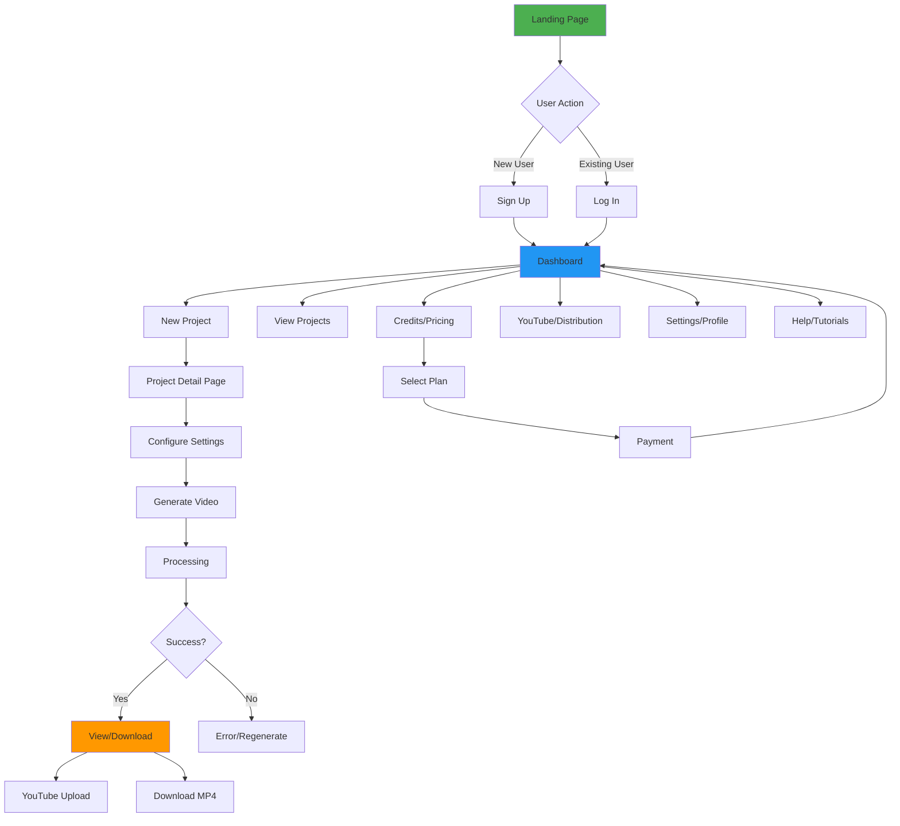
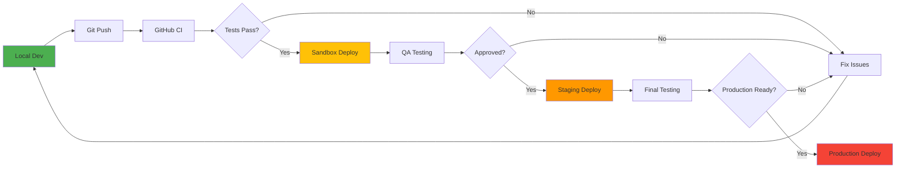
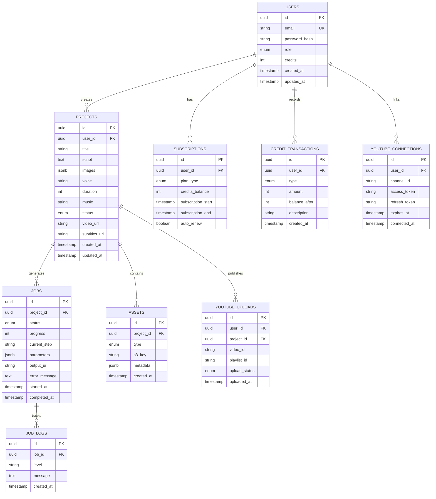
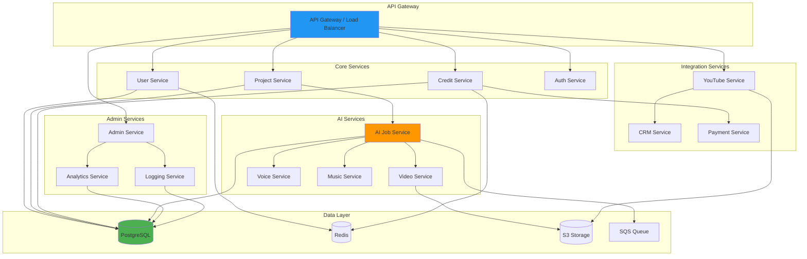
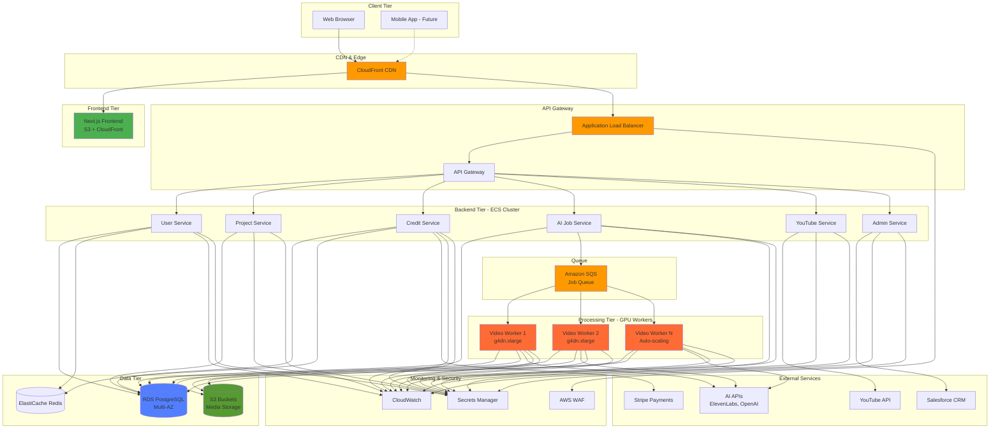
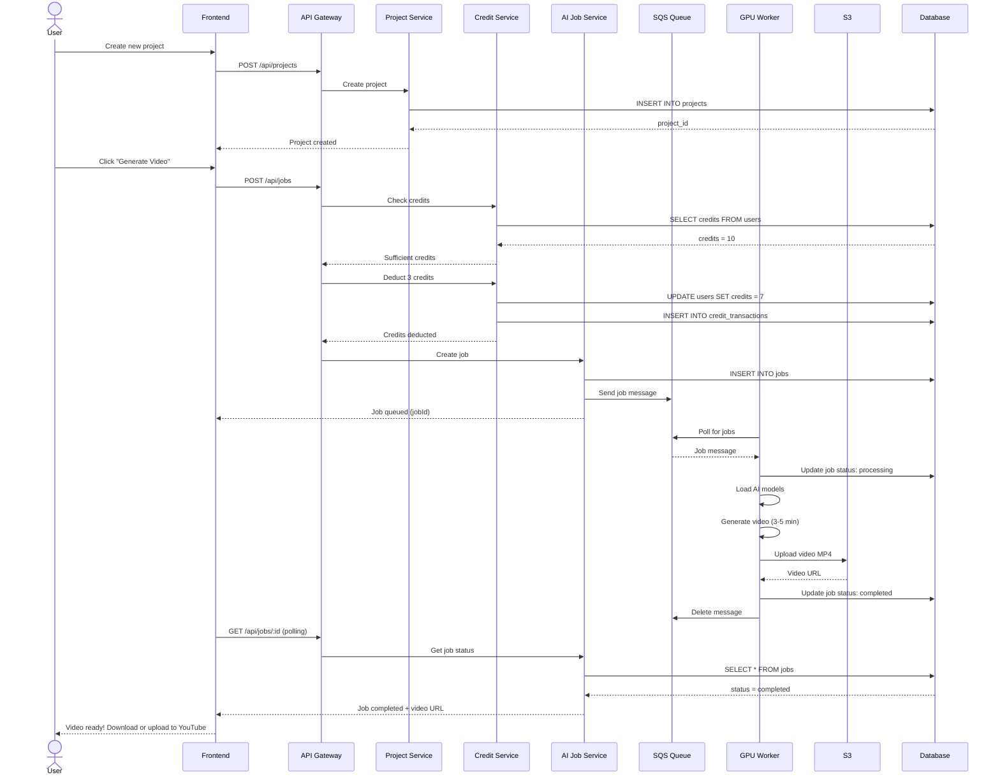

# 🌐 AI FILM STUDIO – MASTER BLUEPRINT

**Version:** 1.0  
**Last Updated:** 2025-12-31  
**Document Owner:** AI-Empower-HQ-360

---

## 📋 Table of Contents

1. [Project Overview](#1-project-overview)
2. [Workflow / Flowchart](#2-workflow--flowchart)
3. [Tech Stack](#3-tech-stack)
4. [Environments](#4-environments)
5. [Database Schema](#5-database-schema)
6. [Subscription & Credit System](#6-subscription--credit-system)
7. [Frontend Pages / Components](#7-frontend-pages--components)
8. [AI Features](#8-ai-features)
9. [Backend Microservices](#9-backend-microservices)
10. [Overall Architecture](#10-overall-architecture)
11. [Next Steps](#11-next-steps)

---

## 1️⃣ **Project Overview**

**AI Film Studio** is a comprehensive platform that allows users to create AI-generated videos using:

* **Script input** - Text-based storytelling
* **Images of characters** - Custom character uploads
* **Voice selection** - Multiple age groups (baby, toddler, child, adult, young adult, mature)
* **Music** - Indian/Western, Slokas, Poems
* **Video duration** selection - 1–5 minutes
* **YouTube upload & playlist management** - Direct distribution
* **Podcast-style videos** - Multi-character discussions

### **Core Objectives**

✅ Generate fully AI-powered videos from user input  
✅ Multi-language support for global reach  
✅ Credits & subscription system for monetization  
✅ CRM integration (Salesforce) for enterprise features  
✅ Scalable cloud architecture on AWS  

### **Target Users**

- **Content Creators**: YouTubers, TikTokers, social media influencers
- **Businesses**: Marketing teams, educational content producers
- **Storytellers**: Writers, podcasters, indie filmmakers
- **Spiritual Content**: Religious institutions, yoga instructors

---

## 2️⃣ **Workflow / Flowchart**

### **High-Level User Journey**



### **Detailed Component Flow**

```
Landing → SignUp/Login → Dashboard
Dashboard → New Project → Project Detail → Dashboard
Dashboard → Credits/Pricing → Top-up → Dashboard
Dashboard → YouTube/Distribution → Playlist / Thumbnail
Dashboard → Settings/Profile
Landing / Dashboard → Help/Tutorials
Admin Panel → Users / Projects / Analytics
```

### **Components Involved**

**Landing Page:**
- Hero, Features, Demo, PricingTeaser, Footer

**Authentication:**
- AuthForm, SocialLoginButtons

**Dashboard:**
- ProjectCard, CreditsDisplay, QuickStartButton

**Project Creation:**
- ScriptInput, ImageUpload, VoiceDropdown, DurationDropdown, MusicSelector, GenerateButton

**Project Detail:**
- VideoPlayer, DownloadButton, ReGenerateButton, SubtitlesDownload, YouTubeUpload

**Pricing:**
- PlanCardList, TopUpButton

**Help:**
- GuideList, FAQAccordion, ContactForm

**Profile:**
- ProfileForm, ConnectedAccounts

**Admin:**
- UserList, CreditAdjustment, Logs, Analytics

---

## 3️⃣ **Tech Stack**

### **Frontend**

```yaml
Framework:
  - React 18+
  - Next.js 14+ (App Router)
  - TypeScript 5.x

Styling:
  - TailwindCSS 3.x
  - Material UI / Shadcn UI
  - Framer Motion (animations)

State Management:
  - Redux Toolkit / Zustand
  - React Query (server state)
  - Context API (theme, auth)

Media:
  - Video.js / React Player
  - HTML5 video player
  - Dropzone.js (file uploads)

Internationalization:
  - i18next
  - next-i18next

Forms:
  - React Hook Form
  - Zod (validation)

Build Tools:
  - Next.js (Webpack 5 / Turbopack)
  - SWC (fast compilation)
```

### **Backend**

```yaml
Runtime:
  - Node.js 20+ / Python 3.11+
  
Frameworks:
  - Express.js / NestJS (Node)
  - FastAPI (Python alternative)

API:
  - REST APIs
  - GraphQL (optional for complex queries)
  
Database:
  - PostgreSQL 15+ (primary)
  - MySQL 8+ (alternative)
  - Prisma ORM / SQLAlchemy

Cache:
  - Redis 7.x (sessions, rate limiting)
  - ElastiCache (AWS)

Storage:
  - AWS S3 (primary)
  - Google Cloud Storage (alternative)

Authentication:
  - JWT + OAuth2
  - Passport.js / NextAuth
  - Google / YouTube OAuth

Queue:
  - AWS SQS (job queue)
  - Bull (Redis-based alternative)
```

### **AI / ML**

```yaml
Video Generation:
  - Stable Diffusion Video (SD-V)
  - RunwayML Gen-2
  - CogVideo
  - LTX-2
  - Dream Machine (Luma AI)

Voice Synthesis:
  - ElevenLabs API (premium quality)
  - Coqui TTS (open source)
  - OpenAI TTS (GPT-4 Audio)
  - Google Cloud Text-to-Speech

Lip-Sync / Animation:
  - Wav2Lip
  - First Order Motion Model (FOMM)
  - Thin-Plate Spline Motion (TPS)

Music Generation:
  - OpenAI Jukebox
  - MusicGen (Meta)
  - MIDI-based composition
  - Suno AI (API)

Podcast / Multi-Character:
  - Dual-character AI overlay
  - Audio mixing with FFmpeg
  - Scene-based character switching

Pre-trained Models:
  - HuggingFace Hub
  - RunwayML
  - Civitai (community models)

ML Frameworks:
  - PyTorch 2.x
  - TensorFlow / JAX
  - ONNX Runtime (optimization)
```

### **Cloud / Infrastructure**

```yaml
Cloud Provider:
  - AWS (Primary)
    - EC2 (GPU instances: g4dn.xlarge, p3.2xlarge)
    - ECS / EKS (container orchestration)
    - Lambda (serverless functions)
    - S3 (object storage)
    - CloudFront (CDN)
    - RDS (PostgreSQL)
    - SQS (message queue)
    - Secrets Manager
    - CloudWatch (monitoring)

Containerization:
  - Docker
  - Docker Compose (local dev)

Orchestration:
  - Amazon ECS Fargate
  - Kubernetes (EKS for GPU workloads)

Infrastructure as Code:
  - Terraform 1.6+
  - AWS CDK (alternative)

CI/CD:
  - GitHub Actions
  - Jenkins (alternative)
  - AWS CodePipeline

Monitoring:
  - CloudWatch
  - Prometheus + Grafana
  - Sentry (error tracking)
  - LogRocket (user sessions)

Logging:
  - CloudWatch Logs
  - ELK Stack (Elasticsearch, Logstash, Kibana)
```

### **Optional Integrations**

```yaml
YouTube:
  - YouTube Data API v3
  - OAuth 2.0 authentication
  - Video upload & management
  - Playlist creation

CRM:
  - Salesforce API
  - Salesforce DevOps Center
  - Custom objects for users/projects

Payments:
  - Stripe (primary)
  - PayPal (alternative)
  - Razorpay (India)

Email:
  - SendGrid
  - AWS SES
  - Resend

Analytics:
  - Google Analytics
  - Mixpanel
  - PostHog
```

---

## 4️⃣ **Environments**

### **Environment Strategy**

| Environment        | Purpose                       | Storage / Hosting                       | Notes                         |
| ------------------ | ----------------------------- | --------------------------------------- | ----------------------------- |
| **Development**    | Local coding & testing        | Local DB, S3 dev bucket                 | Lightweight AI models         |
| **Sandbox / QA**   | Safe testing & validation     | RDS sandbox, S3 sandbox                 | Isolated from production      |
| **Staging**        | Final QA & end-to-end testing | Mirror prod: EC2 GPU, S3, Redis         | Test workflows before release |
| **Production**     | Live platform                 | EC2 GPU, RDS, S3, CloudFront CDN, Redis | Scalable & monitored          |

### **Environment Flow**



### **Environment Configuration**

**Development:**
```yaml
Database: PostgreSQL (Docker)
Cache: Redis (Docker)
Storage: S3 (dev bucket)
AI Models: Small/quantized models
GPU: CPU-only or single GPU
Scaling: Fixed instances
Monitoring: Console logs
Cost: ~$200-300/month
```

**Sandbox/QA:**
```yaml
Database: RDS db.t3.medium
Cache: ElastiCache cache.t3.micro
Storage: S3 (sandbox bucket)
AI Models: Production models
GPU: 1x g4dn.xlarge (on-demand)
Scaling: Manual scaling
Monitoring: Basic CloudWatch
Cost: ~$500/month
```

**Staging:**
```yaml
Database: RDS db.r6g.large (Multi-AZ)
Cache: ElastiCache cache.r6g.large
Storage: S3 (staging bucket)
AI Models: Production models
GPU: 2x g4dn.xlarge (spot + on-demand)
Scaling: Auto-scaling (limited)
Monitoring: Full CloudWatch + alerts
Cost: ~$1,500/month
```

**Production:**
```yaml
Database: RDS db.r6g.xlarge (Multi-AZ + read replicas)
Cache: ElastiCache cache.r6g.xlarge (cluster mode)
Storage: S3 (prod bucket + cross-region replication)
AI Models: Optimized production models
GPU: 5-20x g4dn.xlarge (auto-scaling, 70% spot)
Scaling: Full auto-scaling
Monitoring: CloudWatch + Prometheus + Grafana + PagerDuty
Cost: ~$2,500-5,000/month
```

---

## 5️⃣ **Database Schema**

### **Schema Overview**



### **Table Definitions**

#### **users**
```sql
CREATE TABLE users (
    id UUID PRIMARY KEY DEFAULT gen_random_uuid(),
    email VARCHAR(255) UNIQUE NOT NULL,
    password_hash VARCHAR(255) NOT NULL,
    role VARCHAR(20) DEFAULT 'creator' CHECK (role IN ('creator', 'admin')),
    credits INTEGER DEFAULT 0,
    created_at TIMESTAMP DEFAULT NOW(),
    updated_at TIMESTAMP DEFAULT NOW(),
    last_login_at TIMESTAMP
);

CREATE INDEX idx_users_email ON users(email);
CREATE INDEX idx_users_role ON users(role);
```

#### **projects**
```sql
CREATE TABLE projects (
    id UUID PRIMARY KEY DEFAULT gen_random_uuid(),
    user_id UUID NOT NULL REFERENCES users(id) ON DELETE CASCADE,
    title VARCHAR(200) NOT NULL,
    script TEXT,
    images JSONB DEFAULT '[]',
    voice VARCHAR(50),
    duration INTEGER DEFAULT 60,
    music VARCHAR(100),
    status VARCHAR(20) DEFAULT 'draft' CHECK (status IN ('draft', 'queued', 'processing', 'completed', 'failed')),
    video_url TEXT,
    subtitles_url TEXT,
    created_at TIMESTAMP DEFAULT NOW(),
    updated_at TIMESTAMP DEFAULT NOW()
);

CREATE INDEX idx_projects_user_id ON projects(user_id);
CREATE INDEX idx_projects_status ON projects(status);
CREATE INDEX idx_projects_created_at ON projects(created_at DESC);
```

#### **jobs**
```sql
CREATE TABLE jobs (
    id UUID PRIMARY KEY DEFAULT gen_random_uuid(),
    project_id UUID NOT NULL REFERENCES projects(id) ON DELETE CASCADE,
    status VARCHAR(20) DEFAULT 'queued' CHECK (status IN ('queued', 'processing', 'completed', 'failed')),
    progress INTEGER DEFAULT 0 CHECK (progress >= 0 AND progress <= 100),
    current_step VARCHAR(100),
    parameters JSONB,
    output_url TEXT,
    error_message TEXT,
    started_at TIMESTAMP,
    completed_at TIMESTAMP,
    created_at TIMESTAMP DEFAULT NOW()
);

CREATE INDEX idx_jobs_project_id ON jobs(project_id);
CREATE INDEX idx_jobs_status ON jobs(status);
CREATE INDEX idx_jobs_created_at ON jobs(created_at DESC);
```

#### **subscriptions**
```sql
CREATE TABLE subscriptions (
    id UUID PRIMARY KEY DEFAULT gen_random_uuid(),
    user_id UUID NOT NULL REFERENCES users(id) ON DELETE CASCADE,
    plan_type VARCHAR(20) NOT NULL CHECK (plan_type IN ('creator', 'standard', 'pro', 'enterprise')),
    credits_balance INTEGER DEFAULT 0,
    subscription_start TIMESTAMP NOT NULL,
    subscription_end TIMESTAMP NOT NULL,
    auto_renew BOOLEAN DEFAULT true,
    created_at TIMESTAMP DEFAULT NOW()
);

CREATE INDEX idx_subscriptions_user_id ON subscriptions(user_id);
CREATE INDEX idx_subscriptions_end ON subscriptions(subscription_end);
```

#### **credit_transactions**
```sql
CREATE TABLE credit_transactions (
    id UUID PRIMARY KEY DEFAULT gen_random_uuid(),
    user_id UUID NOT NULL REFERENCES users(id) ON DELETE CASCADE,
    type VARCHAR(20) NOT NULL CHECK (type IN ('deduction', 'purchase', 'grant', 'refund')),
    amount INTEGER NOT NULL,
    balance_after INTEGER NOT NULL,
    description TEXT,
    created_at TIMESTAMP DEFAULT NOW()
);

CREATE INDEX idx_credit_transactions_user_id ON credit_transactions(user_id);
CREATE INDEX idx_credit_transactions_created_at ON credit_transactions(created_at DESC);
```

#### **youtube_connections**
```sql
CREATE TABLE youtube_connections (
    id UUID PRIMARY KEY DEFAULT gen_random_uuid(),
    user_id UUID NOT NULL UNIQUE REFERENCES users(id) ON DELETE CASCADE,
    channel_id VARCHAR(255) NOT NULL,
    access_token TEXT NOT NULL,
    refresh_token TEXT NOT NULL,
    expires_at TIMESTAMP NOT NULL,
    connected_at TIMESTAMP DEFAULT NOW()
);

CREATE INDEX idx_youtube_connections_user_id ON youtube_connections(user_id);
```

#### **youtube_uploads**
```sql
CREATE TABLE youtube_uploads (
    id UUID PRIMARY KEY DEFAULT gen_random_uuid(),
    user_id UUID NOT NULL REFERENCES users(id) ON DELETE CASCADE,
    project_id UUID NOT NULL REFERENCES projects(id) ON DELETE CASCADE,
    video_id VARCHAR(255),
    playlist_id VARCHAR(255),
    upload_status VARCHAR(20) DEFAULT 'pending' CHECK (upload_status IN ('pending', 'uploading', 'processing', 'published', 'failed')),
    uploaded_at TIMESTAMP DEFAULT NOW()
);

CREATE INDEX idx_youtube_uploads_user_id ON youtube_uploads(user_id);
CREATE INDEX idx_youtube_uploads_project_id ON youtube_uploads(project_id);
```

---

## 6️⃣ **Subscription & Credit System**

### **Pricing Plans**

| Plan        | Price/Month | Credits | Video Generation | Features                                    |
| ----------- | ----------- | ------- | ---------------- | ------------------------------------------- |
| **Creator** | $0          | 3       | 3 videos/month   | Basic features, watermarked                 |
| **Standard** | $39        | 40      | 40 videos/month  | HD quality, no watermark                    |
| **Pro**     | $49         | 60      | 60 videos/month  | Full features, priority queue               |
| **Enterprise** | $99      | Unlimited | Unlimited      | YouTube integration, CRM, priority support  |

### **Credit System**

```yaml
Credit Usage:
  - 1 credit = 1 minute of video generation
  - Example: 3-minute video = 3 credits
  
Credit Calculation:
  - Duration: 1 min = 1 credit
  - Duration: 2 min = 2 credits
  - Duration: 5 min = 5 credits
  
Additional Credit Purchase:
  - $5 for 10 credits (one-time purchase)
  - $10 for 25 credits
  - $20 for 60 credits
  
Credit Expiration:
  - Monthly credits reset on subscription renewal
  - Purchased credits never expire
  - Unused monthly credits do not roll over
```

### **Credit Transaction Flow**

```mermaid
sequenceDiagram
    participant User
    participant Frontend
    participant Backend
    participant Stripe
    participant Database
    
    User->>Frontend: Select Plan / Buy Credits
    Frontend->>Backend: POST /api/credits/purchase
    Backend->>Stripe: Create Checkout Session
    Stripe-->>Backend: Session ID
    Backend-->>Frontend: Redirect URL
    Frontend->>Stripe: Redirect to Checkout
    User->>Stripe: Complete Payment
    Stripe->>Backend: Webhook: payment_intent.succeeded
    Backend->>Database: Add Credits
    Backend->>Database: Create Transaction Record
    Backend->>User: Send Email Confirmation
    
    style Stripe fill:#6772E5
    style Backend fill:#2196F3
```

### **Subscription Management**

```yaml
Subscription Features:
  - Monthly auto-renewal (default)
  - Cancel anytime (access until period ends)
  - Upgrade/downgrade mid-cycle (prorated)
  - Pause subscription (upcoming feature)

Payment Methods:
  - Credit/Debit Cards (Stripe)
  - PayPal
  - UPI (India - Razorpay)
  - Bank Transfer (Enterprise)

Billing Cycle:
  - Monthly: Charges on same day each month
  - Annual: 20% discount (future feature)

Invoicing:
  - Automatic invoice generation
  - PDF download available
  - Email delivery
  - Tax calculation (by region)
```

---

## 7️⃣ **Frontend Pages / Components**

### **Page Structure**

```
/                           → Landing Page
/signup                     → Sign Up Page
/login                      → Login Page
/dashboard                  → User Dashboard
/projects                   → All Projects
/projects/new               → Create New Project
/projects/:id               → Project Detail
/projects/:id/edit          → Edit Project
/pricing                    → Pricing Plans
/credits                    → Credit Management
/youtube                    → YouTube Integration
/youtube/playlists          → Manage Playlists
/settings                   → User Settings
/settings/profile           → Profile Settings
/settings/billing           → Billing & Subscription
/settings/security          → Security Settings
/help                       → Help Center
/help/tutorials             → Video Tutorials
/admin                      → Admin Dashboard
/admin/users                → User Management
/admin/projects             → Project Management
/admin/analytics            → Analytics
```

### **Component Library**

#### **Landing Page (`/`)**
```yaml
Components:
  - HeroSection: Hero banner with CTA
  - FeaturesGrid: Feature highlights (4x2 grid)
  - DemoVideo: Embedded demo video
  - PricingTeaser: Pricing preview cards
  - TestimonialsCarousel: User testimonials
  - FAQAccordion: Common questions
  - CTASection: Final call-to-action
  - Footer: Links, social media
```

#### **Authentication**
```yaml
Components:
  - AuthForm: Email/password form
  - SocialLoginButtons: Google, GitHub OAuth
  - PasswordStrengthMeter: Visual indicator
  - EmailVerificationBanner: Post-signup notice
```

#### **Dashboard (`/dashboard`)**
```yaml
Components:
  - WelcomeBanner: Personalized greeting
  - QuickStatsCards: Projects, credits, videos
  - RecentProjectsList: Last 5 projects
  - QuickStartButton: Create new project CTA
  - CreditsDisplay: Current balance + usage chart
  - ActivityFeed: Recent actions timeline
```

#### **Project Creation (`/projects/new`)**
```yaml
Components:
  - ProjectForm:
    - TitleInput: Project name
    - ScriptTextarea: Story input (max 500 words)
    - ImageUpload: Character images (drag & drop)
    - VoiceSelector: Dropdown (baby, adult, etc.)
    - DurationSlider: 1-5 minutes
    - MusicSelector: Genre/style dropdown
    - GenerateButton: Submit job
  - ProgressIndicator: Form steps (1/5)
  - CreditCostCalculator: Real-time cost display
  - PreviewPanel: Live preview (if applicable)
```

#### **Project Detail (`/projects/:id`)**
```yaml
Components:
  - VideoPlayer: HTML5 player with controls
  - ProjectInfo: Title, date, status
  - StatusBadge: Draft, Processing, Completed
  - ProgressBar: 0-100% with status text
  - ActionButtons:
    - DownloadButton: Download MP4
    - RegenerateButton: Regenerate with new settings
    - ShareButton: Social media share
    - YouTubeUploadButton: Upload to channel
    - DeleteButton: Delete project
  - SubtitlesDownload: SRT/VTT file download
  - ProjectSettings: Edit configuration
```

#### **Pricing Page (`/pricing`)**
```yaml
Components:
  - PricingHeader: "Choose Your Plan"
  - PlanCardList: 4 cards (Creator, Standard, Pro, Enterprise)
  - ComparisonTable: Feature comparison
  - FAQSection: Pricing-related questions
  - CTAButton: Start Free / Upgrade
```

#### **Credits Page (`/credits`)**
```yaml
Components:
  - CurrentBalance: Large credit display
  - UsageChart: Last 30 days usage graph
  - TransactionHistory: Table with filters
  - BuyCreditsButton: Purchase modal trigger
  - BuyCreditsModal: Credit package selection
  - SubscriptionUpgrade: Upgrade plan CTA
```

#### **YouTube Integration (`/youtube`)**
```yaml
Components:
  - ConnectYouTubeButton: OAuth flow trigger
  - ChannelInfo: Channel name, subscriber count
  - VideoList: Uploaded videos table
  - PlaylistManager: Create/edit playlists
  - UploadHistory: Recent uploads
  - AutoPublishSettings: Schedule & defaults
  - ThumbnailGenerator: Auto-generate thumbnails
```

#### **Settings (`/settings`)**
```yaml
Components:
  - SettingsTabs: Profile, Billing, Security
  - ProfileForm: Name, email, bio, avatar
  - BillingSection: Payment method, invoices
  - SubscriptionCard: Current plan, renewal date
  - SecuritySection: Password change, 2FA
  - ConnectedAccounts: Google, YouTube status
  - DangerZone: Delete account
```

#### **Help Center (`/help`)**
```yaml
Components:
  - SearchBar: Help article search
  - CategoryGrid: Getting Started, Features, Billing
  - GuideList: Step-by-step tutorials
  - FAQAccordion: Expandable Q&A
  - ContactForm: Support ticket submission
  - VideoTutorials: Embedded YouTube videos
```

#### **Admin Panel (`/admin`)**
```yaml
Components:
  - AdminNav: Dashboard, Users, Projects, Analytics
  - StatsCards: Total users, projects, revenue
  - UserTable: Search, filter, suspend
  - ProjectTable: View all projects, moderate
  - CreditAdjustment: Grant/deduct credits
  - LogsViewer: System logs with filters
  - AnalyticsDashboard: Charts (Recharts/Chart.js)
  - ExportButton: CSV/Excel export
```

### **Component Design System**

```yaml
Design Tokens:
  Colors:
    - Primary: #2196F3 (Blue)
    - Secondary: #FF9800 (Orange)
    - Success: #4CAF50 (Green)
    - Error: #F44336 (Red)
    - Warning: #FFC107 (Amber)
    - Background: #FAFAFA (Light Gray)
    - Surface: #FFFFFF (White)
  
  Typography:
    - Font: Inter, System UI, sans-serif
    - Heading: 700 weight, 1.2 line-height
    - Body: 400 weight, 1.5 line-height
    - Code: Fira Code, monospace
  
  Spacing:
    - Base: 4px
    - Scale: 4, 8, 12, 16, 24, 32, 48, 64
  
  Breakpoints:
    - Mobile: 320px - 768px
    - Tablet: 768px - 1024px
    - Desktop: 1024px+
```

---

## 8️⃣ **AI Features**

### **Voice Options**

```yaml
Age Groups:
  - Baby (0-2 years): High-pitched, babbling
  - Toddler (2-4 years): Child voice, simple speech
  - Child (6-10 years): Clear child voice
  - Pre-teen (10-14 years): Young adolescent
  - Adult Male (25-50 years): Standard male voice
  - Adult Female (25-50 years): Standard female voice
  - Young Adult (18-25 years): Energetic voice
  - Mature (50+ years): Deeper, authoritative voice

Voice Providers:
  - ElevenLabs: Premium quality, 25+ voices
  - OpenAI TTS: GPT-4 Audio, natural prosody
  - Coqui TTS: Open-source, customizable
  - Google Cloud TTS: 200+ voices, 40+ languages
```

### **Video Duration**

```yaml
Duration Options:
  - 1 minute: 1 credit
  - 2 minutes: 2 credits
  - 3 minutes: 3 credits
  - 4 minutes: 4 credits
  - 5 minutes: 5 credits

Duration Selection:
  - UI: Slider or dropdown
  - Default: 2 minutes
  - Max for free tier: 1 minute
  - Max for Pro tier: 5 minutes
  - Custom duration (Enterprise): Up to 10 minutes
```

### **Music & Audio**

```yaml
Music Genres:
  Indian:
    - Classical (Carnatic, Hindustani)
    - Bollywood
    - Devotional (Bhajans, Aartis)
    - Folk (Regional)
  
  Western:
    - Cinematic / Orchestral
    - Ambient / Meditation
    - Pop / Rock
    - Electronic / EDM
  
  Special Categories:
    - Slokas (Sanskrit verses)
    - Sahasranamas (1000 names)
    - Poems (Recited)
    - Nature Sounds
    - ASMR

Music Generation:
  - Source 1: Royalty-free libraries (YouTube Audio Library)
  - Source 2: AI-generated (MusicGen, Suno AI)
  - Source 3: MIDI + soundfonts
  - Custom uploads (Enterprise)
```

### **Podcast Mode**

```yaml
Podcast Features:
  - 2-character discussions
  - Alternating dialogue
  - Custom avatars for each character
  - Split-screen video layout
  - Smooth transitions between speakers
  - Background music (low volume)

Use Cases:
  - Educational content
  - Interview format
  - Debate / Discussion
  - Storytelling with narrator + character
  
Technical Implementation:
  - Parse script for dialogue tags
  - Assign voices to characters
  - Generate separate audio tracks
  - Merge with FFmpeg
  - Overlay character animations
```

### **Multi-Language Support**

```yaml
Languages (Phase 1):
  - English (US, UK, Australian)
  - Hindi
  - Spanish (Spain, Latin America)
  - French
  - German
  - Portuguese (Brazil)
  - Mandarin Chinese
  - Japanese
  - Arabic

Languages (Phase 2):
  - Tamil
  - Telugu
  - Bengali
  - Marathi
  - Gujarati
  - Malayalam
  - Kannada
  - Punjabi
  - Italian
  - Russian

Features:
  - Automatic script translation (Google Translate API)
  - Native voice synthesis for each language
  - Multi-language subtitles (SRT/VTT)
  - RTL support for Arabic, Hebrew
```

### **YouTube Integration**

```yaml
Features:
  - OAuth 2.0 authentication
  - Direct video upload
  - Playlist management
  - Auto-generated thumbnails
  - Video metadata (title, description, tags)
  - Scheduled publishing
  - Privacy settings (public, unlisted, private)
  
Workflow:
  1. Connect YouTube channel (one-time)
  2. Generate video in AI Film Studio
  3. Click "Upload to YouTube"
  4. Configure:
     - Title (auto-filled from project)
     - Description (customizable)
     - Tags (AI-suggested)
     - Category
     - Thumbnail (auto-generated or custom upload)
     - Playlist (create new or add to existing)
  5. Upload (progress tracking)
  6. Publish or schedule

API Endpoints:
  - YouTube Data API v3
  - Upload: resumable uploads for large files
  - Quota: 10,000 units/day (typical usage: 1,600/upload)
```

---

## 9️⃣ **Backend Microservices**

### **Microservices Architecture**



### **Service Descriptions**

#### **1. User Service**
```yaml
Responsibilities:
  - User registration
  - User authentication
  - Profile management
  - Session management

Endpoints:
  - POST /api/users/register
  - POST /api/users/login
  - GET /api/users/me
  - PATCH /api/users/me
  - DELETE /api/users/me

Database Tables:
  - users
  - sessions

Technologies:
  - Node.js + Express / Python + FastAPI
  - JWT authentication
  - bcrypt for password hashing
```

#### **2. Project Service**
```yaml
Responsibilities:
  - Project CRUD operations
  - Project metadata management
  - Asset management

Endpoints:
  - POST /api/projects
  - GET /api/projects
  - GET /api/projects/:id
  - PATCH /api/projects/:id
  - DELETE /api/projects/:id
  - POST /api/projects/:id/assets

Database Tables:
  - projects
  - assets

Technologies:
  - Node.js + Express / Python + FastAPI
  - S3 presigned URLs for uploads
```

#### **3. Credit Service**
```yaml
Responsibilities:
  - Credit balance management
  - Credit deduction/addition
  - Transaction history
  - Subscription management

Endpoints:
  - GET /api/credits/balance
  - POST /api/credits/deduct
  - POST /api/credits/purchase
  - GET /api/credits/transactions
  - POST /api/subscriptions/upgrade

Database Tables:
  - credit_transactions
  - subscriptions

Technologies:
  - Node.js + Express / Python + FastAPI
  - Stripe SDK
  - Atomic transactions for concurrency
```

#### **4. AI Job Service**
```yaml
Responsibilities:
  - Job orchestration
  - Job status tracking
  - Progress updates
  - Error handling

Endpoints:
  - POST /api/jobs
  - GET /api/jobs/:id
  - GET /api/jobs/:id/status
  - POST /api/jobs/:id/cancel

Database Tables:
  - jobs
  - job_logs

Technologies:
  - Python + FastAPI
  - AWS SQS integration
  - WebSocket for real-time updates
```

#### **5. Video Service (GPU Workers)**
```yaml
Responsibilities:
  - Video generation
  - Scene composition
  - Video encoding
  - Quality optimization

Process Flow:
  1. Poll SQS queue
  2. Download assets from S3
  3. Load AI models (Stable Diffusion, etc.)
  4. Generate video frames
  5. Compose scenes with FFmpeg
  6. Upload final video to S3
  7. Update job status

Technologies:
  - Python + PyTorch
  - Stable Diffusion XL
  - FFmpeg
  - CUDA / GPU optimization
```

#### **6. Voice Service**
```yaml
Responsibilities:
  - Voice synthesis
  - Multi-language TTS
  - Voice cloning (future)

API Integrations:
  - ElevenLabs API
  - OpenAI TTS API
  - Coqui TTS (self-hosted)

Process:
  1. Receive script text
  2. Split by sentences/paragraphs
  3. Call TTS API
  4. Merge audio files
  5. Apply effects (pitch, speed)
  6. Return audio file
```

#### **7. Music Service**
```yaml
Responsibilities:
  - Background music generation
  - Music library management
  - Audio mixing

Sources:
  - Royalty-free libraries
  - AI-generated (MusicGen)
  - MIDI compositions

Process:
  1. Select music based on genre
  2. Adjust duration to match video
  3. Mix with voice audio
  4. Apply fade in/out
  5. Return mixed audio
```

#### **8. YouTube Service**
```yaml
Responsibilities:
  - OAuth authentication
  - Video uploads
  - Playlist management
  - Metadata management

Endpoints:
  - GET /api/youtube/auth
  - POST /api/youtube/upload
  - GET /api/youtube/playlists
  - POST /api/youtube/playlists
  - POST /api/youtube/videos/:id/update

API Integration:
  - YouTube Data API v3
  - Resumable uploads
  - Quota management

Technologies:
  - Node.js + Express
  - Google APIs Node.js Client
```

#### **9. CRM Service (Salesforce)**
```yaml
Responsibilities:
  - Sync users to Salesforce
  - Track project creation
  - Log credit purchases
  - Customer support integration

Endpoints:
  - POST /api/crm/sync-user
  - POST /api/crm/log-project
  - POST /api/crm/log-purchase

Salesforce Objects:
  - Accounts (Users)
  - Contacts (User details)
  - Projects__c (Custom object)
  - Subscriptions__c (Custom object)

Technologies:
  - Salesforce REST API
  - OAuth 2.0
  - Webhook listeners
```

#### **10. Payment Service**
```yaml
Responsibilities:
  - Payment processing
  - Webhook handling
  - Invoice generation

Endpoints:
  - POST /api/payments/checkout
  - POST /api/payments/webhooks/stripe
  - GET /api/payments/invoices

Integrations:
  - Stripe: Primary payment processor
  - PayPal: Alternative option
  - Razorpay: India-specific

Technologies:
  - Node.js + Express
  - Stripe SDK
  - Webhook signature verification
```

#### **11. Admin Service**
```yaml
Responsibilities:
  - User management
  - Project moderation
  - Credit adjustments
  - System configuration

Endpoints:
  - GET /api/admin/users
  - PATCH /api/admin/users/:id
  - POST /api/admin/credits/adjust
  - GET /api/admin/projects
  - DELETE /api/admin/projects/:id

Access Control:
  - Role: admin only
  - IP whitelist (optional)
  - 2FA required

Technologies:
  - Node.js + Express / Python + FastAPI
  - RBAC middleware
```

#### **12. Analytics Service**
```yaml
Responsibilities:
  - Usage analytics
  - Performance metrics
  - Business intelligence
  - Report generation

Endpoints:
  - GET /api/analytics/overview
  - GET /api/analytics/users
  - GET /api/analytics/revenue
  - GET /api/analytics/projects

Metrics Tracked:
  - Daily active users (DAU)
  - Monthly active users (MAU)
  - Video generation count
  - Credits consumed
  - Revenue by plan
  - Error rates

Technologies:
  - Node.js + Express
  - PostgreSQL materialized views
  - Cron jobs for aggregation
```

---

## 🔟 **Overall Architecture**

### **System Architecture Diagram**



### **Data Flow Architecture**



### **Technology Integration Map**

```yaml
Frontend Stack:
  - React 18 + Next.js 14
  - TypeScript 5
  - TailwindCSS 3
  - Zustand (state)
  - React Query (data fetching)

Backend Stack:
  - Node.js 20 + Express / NestJS
  - Python 3.11 + FastAPI (AI services)
  - PostgreSQL 15 (RDS)
  - Redis 7 (ElastiCache)

AI/ML Stack:
  - PyTorch 2.x
  - Stable Diffusion XL
  - ElevenLabs / OpenAI TTS
  - FFmpeg (video composition)

Cloud Infrastructure:
  - AWS EC2 (GPU: g4dn.xlarge)
  - AWS ECS Fargate (backend)
  - AWS S3 (storage)
  - AWS SQS (queue)
  - AWS CloudFront (CDN)
  - AWS RDS (database)
  - AWS ElastiCache (cache)

DevOps:
  - Docker
  - Terraform (IaC)
  - GitHub Actions (CI/CD)
  - CloudWatch (monitoring)
```

---

## 1️⃣1️⃣ **Next Steps**

### **Implementation Roadmap**

#### **Phase 1: Foundation (Weeks 1-4)**
- [ ] Set up project structure
- [ ] Configure development environment
- [ ] Initialize Git repository
- [ ] Set up AWS infrastructure (Terraform)
- [ ] Create database schema
- [ ] Implement authentication (JWT + OAuth)
- [ ] Build basic frontend (landing + dashboard)

#### **Phase 2: Core Features (Weeks 5-8)**
- [ ] Project management (CRUD)
- [ ] Credit system + Stripe integration
- [ ] AI job orchestration
- [ ] Video generation pipeline (MVP)
- [ ] Voice synthesis integration
- [ ] Basic UI for video creation

#### **Phase 3: AI Enhancement (Weeks 9-12)**
- [ ] Multi-voice support
- [ ] Music integration
- [ ] Podcast mode (2-character)
- [ ] Subtitle generation
- [ ] Quality optimization

#### **Phase 4: Integrations (Weeks 13-16)**
- [ ] YouTube OAuth + upload
- [ ] Playlist management
- [ ] Salesforce CRM integration
- [ ] Admin dashboard
- [ ] Analytics service

#### **Phase 5: Polish & Launch (Weeks 17-20)**
- [ ] Performance optimization
- [ ] Security hardening
- [ ] Load testing
- [ ] Beta testing
- [ ] Documentation
- [ ] Marketing website
- [ ] Public launch

### **Development Priorities**

**P0 (Critical - MVP)**
- User authentication
- Project creation
- Video generation (basic)
- Credit system
- Payment integration

**P1 (High - Post-MVP)**
- YouTube integration
- Multi-voice options
- Music library
- Admin panel

**P2 (Medium - Future)**
- Podcast mode
- Multi-language
- CRM integration
- Advanced analytics

**P3 (Low - Nice-to-have)**
- Mobile apps
- Real-time collaboration
- Custom AI model training
- White-label solution

### **Success Metrics**

```yaml
User Metrics:
  - Sign-ups: 1,000 in first month
  - DAU/MAU ratio: >30%
  - Retention (D7): >40%
  - Retention (D30): >20%

Technical Metrics:
  - API response time: <200ms (p95)
  - Video generation time: <5 min
  - System uptime: >99.9%
  - Error rate: <1%

Business Metrics:
  - Free-to-paid conversion: >5%
  - Monthly recurring revenue (MRR): $10,000 in 6 months
  - Customer acquisition cost (CAC): <$50
  - Lifetime value (LTV): >$300
```

---

## 📚 **Additional Resources**

### **Documentation Structure**

```
docs/
├── MASTER_BLUEPRINT.md (this file)
├── architecture/
│   ├── system-design.md (existing)
│   ├── data-flow.md (new)
│   └── security-architecture.md (new)
├── requirements/
│   ├── FRD.md (existing)
│   ├── NFR.md (existing)
│   └── user-stories.md (new)
├── api/
│   ├── user-service-api.md (new)
│   ├── project-service-api.md (new)
│   ├── credit-service-api.md (new)
│   └── ai-job-service-api.md (new)
├── deployment/
│   ├── local-setup.md (new)
│   ├── staging-deployment.md (new)
│   └── production-deployment.md (new)
├── guides/
│   ├── developer-guide.md (new)
│   ├── api-integration-guide.md (new)
│   └── troubleshooting.md (new)
└── diagrams/
    ├── architecture-diagram.png (new)
    ├── data-flow-diagram.png (new)
    └── user-journey-map.png (new)
```

### **Reference Links**

- [AWS Documentation](https://docs.aws.amazon.com/)
- [Next.js Documentation](https://nextjs.org/docs)
- [FastAPI Documentation](https://fastapi.tiangolo.com/)
- [Stable Diffusion Guide](https://huggingface.co/docs/diffusers/index)
- [ElevenLabs API](https://docs.elevenlabs.io/)
- [YouTube Data API](https://developers.google.com/youtube/v3)
- [Stripe Integration](https://stripe.com/docs)
- [Terraform AWS Provider](https://registry.terraform.io/providers/hashicorp/aws/latest/docs)

---

## 📝 **Document Control**

**Revision History**

| Version | Date       | Author            | Changes                   |
| ------- | ---------- | ----------------- | ------------------------- |
| 1.0     | 2025-12-31 | AI-Empower-HQ-360 | Initial master blueprint  |

**Approval Signatures**

This document represents the approved master blueprint for the AI Film Studio platform.

**Approved by:**
- Product Lead: _________________ Date: _______
- Engineering Lead: _________________ Date: _______
- DevOps Lead: _________________ Date: _______

---

**🎬 END OF MASTER BLUEPRINT**

This document serves as the single source of truth for the AI Film Studio project. All implementation should reference this blueprint for consistency and alignment with the project vision.
