# AI FILM STUDIO – COLOR-CODED VISUAL LAYOUT PLAN

**Version:** 1.0  
**Last Updated:** 2025-12-31  
**Document Owner:** AI-Empower-HQ-360

---

## Table of Contents

1. [Overview](#overview)
2. [Color Scheme for Layers](#color-scheme-for-layers)
3. [Layered Structure & Flow](#layered-structure--flow)
4. [Flow Arrows & Dependencies](#flow-arrows--dependencies)
5. [Icon Suggestions](#icon-suggestions)
6. [Visual Architecture Diagram](#visual-architecture-diagram)
7. [Integration Points](#integration-points)
8. [Data Flow Summary](#data-flow-summary)

---

## Overview

This document provides a color-coded visual layout plan for the AI Film Studio platform. Each layer of the architecture is assigned a specific color to improve clarity and understanding of the system components and their interactions.

The color-coding system helps stakeholders quickly identify:
- **User interaction points** (Blue)
- **Frontend components** (Light Blue)
- **Backend services** (Green)
- **Data storage** (Yellow)
- **AI/ML processing** (Orange)
- **Cloud infrastructure** (Purple)
- **CRM integration** (Light Green)
- **Output delivery** (Red)

---

## Color Scheme for Layers

### 1. 👤 User Layer
**Color:** Blue 🔵  
**Purpose:** All user-facing interaction points

**Components:**
- Script input forms
- Image upload interface
- Voice selection options
- Music/Slokas preferences
- Duration settings (1-5 minutes)
- YouTube credentials management
- Multi-language support interface

**Interactions:**
- Forms with input validation
- Dropdowns for selections
- File upload components
- Authentication and user profile management

---

### 2. 💻 Frontend Layer
**Color:** Light Blue 🔷  
**Purpose:** User interface and presentation layer

**Technology Stack:**
- React + Next.js
- TailwindCSS / Material UI
- TypeScript

**Key Features:**
- Video preview and playback
- Input validation and error handling
- API calls to backend services
- Real-time progress tracking
- Responsive design (mobile-first)
- User dashboard and project management

**Responsibilities:**
- Rendering user interfaces
- Client-side validation
- State management
- API integration
- User feedback and notifications

---

### 3. ⚙️ Backend / Microservices Layer
**Color:** Green 🟢  
**Purpose:** Business logic and service orchestration

**Technology Stack:**
- Node.js / NestJS
- Python / FastAPI (alternative)
- RESTful APIs
- GraphQL (optional)

**Microservices:**
1. **User Service**
   - Authentication and authorization
   - User profile management
   - Session management

2. **Project Service**
   - Project creation and management
   - Project metadata storage
   - Project status tracking

3. **Credit Service**
   - Credit balance management
   - Subscription handling
   - Payment processing integration

4. **AI Job Service**
   - Job queue management
   - AI task scheduling
   - Progress tracking and status updates

5. **YouTube Service**
   - Video upload to YouTube
   - Playlist management
   - Metadata and thumbnail handling

6. **Admin Service**
   - System monitoring
   - User management
   - Analytics and reporting

**Infrastructure:**
- Async job queue: Redis / BullMQ / AWS SQS
- Authentication: JWT / OAuth 2.0
- API Gateway for routing
- Service mesh for inter-service communication

---

### 4. 🗄️ Database / Storage Layer
**Color:** Yellow 🟡  
**Purpose:** Data persistence and media storage

**Databases:**
- **PostgreSQL / MySQL**
  - Users table (profiles, credentials, preferences)
  - Projects table (metadata, status, ownership)
  - Credits table (balance, transactions, subscriptions)
  - Jobs table (AI tasks, status, results)

- **Redis / ElastiCache**
  - Job queue management
  - Session caching
  - Real-time data caching
  - Rate limiting counters

**Storage:**
- **AWS S3 + CloudFront**
  - User-uploaded images
  - Generated videos and animations
  - Subtitle files (multi-language)
  - Thumbnail images
  - Audio files (music, slokas, voiceovers)
  - Temporary processing files

**Data Organization:**
```
/users/{user_id}/
  /projects/{project_id}/
    /raw/              # Original uploads
    /generated/        # AI-generated content
    /final/            # Rendered videos
    /subtitles/        # Multi-language subtitles
    /thumbnails/       # Video thumbnails
```

---

### 5. 🤖 AI / ML Layer
**Color:** Orange 🟠  
**Purpose:** AI-powered content generation and processing

**AI Capabilities:**

1. **Script Analysis**
   - Story extraction and understanding
   - Cultural context recognition
   - Scene breakdown and timing
   - Character identification

2. **Image Generation**
   - Character design and creation
   - Background and environment generation
   - Culture-aware image styling (Indian & Western themes)
   - Style consistency across scenes
   - ControlNet for pose and composition

3. **Voice Synthesis**
   - Multi-age voice generation (child, adult, elderly)
   - Multi-gender voice options
   - Mature and natural-sounding voices
   - Emotion and tone adjustment
   - Language and accent support

4. **Lip-sync / Animation**
   - Facial animation synchronization
   - Head movement and expressions
   - Body language animation
   - Realistic character animation

5. **Music / Slokas / Poems**
   - Indian classical music generation
   - Western music composition
   - Sloka and mantra integration
   - Poetry and verse narration
   - Background score creation

6. **Podcast / Dialogue Mode**
   - Two-character conversation generation
   - Natural dialogue flow
   - Turn-taking and interruptions
   - Podcast-style narration

7. **Subtitles / Multi-language**
   - Automatic subtitle generation
   - Multi-language translation
   - Subtitle timing and synchronization
   - Formatting and styling

**AI Models:**
- Stable Diffusion XL (image generation)
- Custom LoRA models (character consistency)
- Text-to-Speech models (voice synthesis)
- Audio generation models (music and slokas)
- Animation models (lip-sync and movement)

---

### 6. ☁️ Cloud / Infrastructure Layer
**Color:** Purple 🟣  
**Purpose:** Hosting, scaling, and infrastructure management

**Compute Resources:**
- **AWS EC2 GPU Instances**
  - Instance Type: g4dn.xlarge (NVIDIA T4 GPU)
  - AI processing and rendering
  - Auto-scaling based on queue depth
  - Spot instances for cost optimization

- **ECS / Kubernetes**
  - Backend service orchestration
  - Container management
  - Service discovery
  - Load balancing

**Infrastructure Management:**
- **Terraform**
  - Infrastructure as Code (IaC)
  - Environment provisioning (Dev, Sandbox, Staging, Production)
  - Version-controlled infrastructure
  - Automated deployments

**Data Services:**
- **RDS (PostgreSQL/MySQL)**
  - Multi-AZ deployment
  - Automated backups
  - Read replicas for scaling

- **S3 + CloudFront**
  - Media storage with versioning
  - Global CDN for fast delivery
  - Edge caching for performance

- **Redis / ElastiCache**
  - In-memory caching
  - Session management
  - Job queue processing

**Monitoring & Operations:**
- **CloudWatch**
  - Log aggregation and analysis
  - Metrics collection
  - Alerting and notifications

- **Grafana**
  - Custom dashboards
  - Visualization of metrics
  - Performance monitoring

- **Prometheus**
  - Metrics scraping
  - Time-series data storage
  - Query and alerting

**Environments:**
1. **Development**
   - Developer testing
   - Rapid iteration
   - Minimal resources

2. **Sandbox**
   - Integration testing
   - Feature validation
   - Isolated environment

3. **Staging**
   - Pre-production validation
   - Performance testing
   - Final QA checks

4. **Production**
   - Live user traffic
   - High availability
   - Auto-scaling enabled

---

### 7. 📊 Salesforce CRM Layer
**Color:** Light Green 💚  
**Purpose:** Customer relationship management and business intelligence

**Salesforce Objects:**

1. **Contacts → Users**
   - Sync user profiles from application
   - Contact information and preferences
   - Communication history
   - Segmentation and targeting

2. **AI_Project__c → Projects**
   - Custom object for AI projects
   - Project metadata and status
   - User ownership and collaboration
   - Project analytics

3. **AI_Credit__c → Credits**
   - Credit balance tracking
   - Transaction history
   - Subscription management
   - Usage analytics

4. **YouTube_Integration__c**
   - YouTube channel connections
   - Video upload history
   - Playlist management
   - Performance metrics

**Automation:**
- **Flows / Apex**
  - Project status updates
  - Credit deduction automation
  - Alert notifications (low credits, project completion)
  - Subscription renewal reminders
  - Email campaigns and marketing automation

**Analytics:**
- **Dashboards**
  - User engagement metrics
  - Project creation trends
  - Credit usage patterns
  - Revenue analytics
  - YouTube performance metrics

- **Reports**
  - User activity reports
  - Project completion rates
  - Credit consumption analysis
  - Subscription retention
  - AI job performance

**Integration Points:**
- Bidirectional sync with application database
- Real-time or batch data synchronization
- Webhook-based event notifications
- API-based data exchange

---

### 8. ▶️ YouTube / Output Layer
**Color:** Red 🔴  
**Purpose:** Final video delivery and publishing

**Features:**

1. **Video Upload**
   - Direct upload to YouTube
   - Automatic metadata tagging
   - Privacy settings configuration
   - Publish scheduling

2. **Playlist Creation**
   - Automatic playlist organization
   - Series and collection management
   - Playlist metadata and descriptions

3. **Thumbnail Generation**
   - AI-generated thumbnails
   - Custom thumbnail upload
   - Thumbnail optimization for click-through

4. **Download Option**
   - Local video download
   - Multiple format options (MP4, WebM, AVI)
   - Quality selection (720p, 1080p, 4K)

5. **Duration Selection**
   - 1-minute videos
   - 2-minute videos
   - 3-minute videos
   - 4-minute videos
   - 5-minute videos
   - Custom duration options

**YouTube API Integration:**
- OAuth 2.0 authentication
- Video upload API
- Metadata management API
- Analytics and insights API
- Comment and engagement API

---

## Layered Structure & Flow

### System Architecture Overview

```
┌─────────────────────────────────────────────────────────────────┐
│                    👤 USER LAYER (Blue)                         │
│  Script │ Images │ Voice │ Music/Slokas │ Duration │ YouTube   │
└────────────────────────────┬────────────────────────────────────┘
                             ↓
┌─────────────────────────────────────────────────────────────────┐
│              💻 FRONTEND LAYER (Light Blue)                     │
│    React + Next.js │ TailwindCSS │ Video Preview │ API Calls   │
└────────────────────────────┬────────────────────────────────────┘
                             ↓
┌─────────────────────────────────────────────────────────────────┐
│           ⚙️ BACKEND / MICROSERVICES LAYER (Green)              │
│  User │ Project │ Credit │ AI Job │ YouTube │ Admin Services   │
│           Redis/BullMQ/SQS │ JWT/OAuth 2.0                      │
└─────────────┬───────────────────────────────┬──────────────────┘
              ↓                               ↓
┌──────────────────────────┐    ┌────────────────────────────────┐
│ 🗄️ DATABASE LAYER       │    │ 🤖 AI / ML LAYER (Orange)     │
│      (Yellow)            │    │  Script Analysis              │
│  PostgreSQL/MySQL        │    │  Image Generation             │
│  Redis/ElastiCache       │    │  Voice Synthesis              │
│  AWS S3 + CloudFront     │    │  Lip-sync/Animation           │
└──────────┬───────────────┘    │  Music/Slokas/Poems           │
           │                    │  Podcast/Dialogue             │
           │                    │  Subtitles/Multi-language     │
           │                    └────────────┬───────────────────┘
           │                                 │
           ↓                                 ↓
┌─────────────────────────────────────────────────────────────────┐
│           ☁️ CLOUD / INFRASTRUCTURE LAYER (Purple)              │
│  AWS EC2 GPU │ ECS/Kubernetes │ Terraform │ RDS │ S3           │
│  CloudWatch │ Grafana │ Prometheus                             │
│  Dev │ Sandbox │ Staging │ Production                          │
└─────────────┬───────────────────────────────────┬──────────────┘
              ↓                                   ↓
┌──────────────────────────┐         ┌───────────────────────────┐
│ 📊 SALESFORCE CRM        │         │ ▶️ YOUTUBE / OUTPUT       │
│    (Light Green)         │         │      (Red)                │
│  Contacts → Users        │         │  Video Upload (direct)    │
│  AI_Project__c           │         │  Playlist Creation        │
│  AI_Credit__c            │         │  Thumbnail Generation     │
│  YouTube_Integration__c  │         │  Download Option          │
│  Flows/Apex/Dashboards   │         │  Duration: 1-5 minutes    │
└──────────────────────────┘         └───────────────────────────┘
```

---

## Flow Arrows & Dependencies

### Primary Data Flow

```
1. User Input
   Script & Images → Frontend (Light Blue)
   ↓

2. Request Processing
   Frontend → Backend (Green)
   ↓

3. Job Creation
   Backend → Database (Yellow) [Store project & job metadata]
   Backend → AI Layer (Orange) [Queue AI processing task]
   ↓

4. AI Processing
   AI Layer → Database/Storage (Yellow) [Retrieve inputs, store outputs]
   AI Layer → Cloud (Purple) [GPU compute resources]
   ↓

5. Video Generation
   AI Layer → Storage (Yellow) [Save generated video]
   ↓

6. Preview & Validation
   Storage → Frontend (Light Blue) [Video preview]
   ↓

7. CRM Update
   Backend → Salesforce CRM (Light Green) [Project status, credit deduction]
   ↓

8. Output Delivery
   User Selection → YouTube/Output (Red) [Upload or download]
```

### Credit and Subscription Flow

```
1. Credit Check
   Backend (Green) → Salesforce CRM (Light Green)
   ↓

2. Credit Deduction
   Salesforce CRM (Light Green) → Backend (Green) [Confirm deduction]
   ↓

3. User Notification
   Backend (Green) → Frontend (Light Blue) [Update UI with credit balance]
```

### Multi-Character Podcast Flow

```
1. Script Input
   User (Blue) → Frontend (Light Blue) [Podcast script with 2 characters]
   ↓

2. Processing
   Frontend → Backend (Green) → AI Layer (Orange)
   ↓

3. AI Generation
   - Character voices generated
   - Dialogue timing calculated
   - Animation synchronized
   ↓

4. Storage & Delivery
   AI Layer (Orange) → Backend (Green) → Storage (Yellow) → Output (Red)
```

### AI Pipeline Dependencies

The AI pipeline is script and culture dependent, ensuring:
- **Images**: Generated based on cultural context (Indian/Western themes)
- **Voice**: Age, gender, and accent appropriate to characters
- **Animation**: Culturally appropriate gestures and expressions
- **Music**: Style matching (Indian classical, slokas, Western genres)
- **Subtitles**: Multi-language support with cultural nuances

---

## Icon Suggestions

### Layer Icons

| Layer | Icon | Color | Unicode | HTML Entity |
|-------|------|-------|---------|-------------|
| **User Layer** | 👤 | Blue | U+1F464 | `👤` |
| **Frontend** | 💻 | Light Blue | U+1F4BB | `💻` |
| **Backend** | ⚙️ | Green | U+002699 | `⚙` |
| **Database** | 🗄️ | Yellow | U+1F5C4 | `🗄` |
| **AI/ML** | 🤖 | Orange | U+1F916 | `🤖` |
| **Cloud** | ☁️ | Purple | U+002601 | `☁` |
| **Salesforce CRM** | 📊 | Light Green | U+1F4CA | `📊` |
| **YouTube/Output** | ▶️ | Red | U+0025B6 | `▶` |

### Additional Icons for Features

| Feature | Icon | Purpose |
|---------|------|---------|
| **Upload** | 📤 | File and media upload |
| **Download** | 📥 | Video download |
| **Video** | 🎬 | Video generation and playback |
| **Audio** | 🎵 | Music and voice |
| **Image** | 🖼️ | Image generation |
| **Settings** | ⚙️ | Configuration and preferences |
| **Notification** | 🔔 | Alerts and updates |
| **Security** | 🔒 | Authentication and authorization |
| **Analytics** | 📈 | Metrics and insights |
| **API** | 🔌 | API integration |

---

## Visual Architecture Diagram

### Color-Coded Component Interaction

<!-- 
    This diagram shows the high-level interaction between all 8 system layers
    using color coding for visual clarity. Each layer is represented by its
    designated color and icon for easy identification.
-->


### Detailed Layer Dependencies

```mermaid
graph LR
    %% Define all layers with color coding
    
    subgraph UserInteraction[👤 User Layer - Blue]
        U1[Script Input]
        U2[Image Upload]
        U3[Voice Selection]
        U4[Music/Slokas]
        U5[Duration]
        U6[YouTube Credentials]
    end
    style UserInteraction fill:#4A90E2,stroke:#2E5C8A,color:#FFFFFF
    
    subgraph FrontendComponents[💻 Frontend - Light Blue]
        F1[React Components]
        F2[Video Preview]
        F3[API Client]
        F4[State Management]
    end
    style FrontendComponents fill:#87CEEB,stroke:#4682B4,color:#000000
    
    subgraph BackendServices[⚙️ Backend - Green]
        B1[User Service]
        B2[Project Service]
        B3[AI Job Service]
        B4[YouTube Service]
        B5[Credit Service]
    end
    style BackendServices fill:#90EE90,stroke:#228B22,color:#000000
    
    subgraph DataStorage[🗄️ Database - Yellow]
        D1[PostgreSQL]
        D2[Redis Cache]
        D3[S3 Storage]
    end
    style DataStorage fill:#FFD700,stroke:#DAA520,color:#000000
    
    subgraph AIProcessing[🤖 AI/ML - Orange]
        A1[Script Analysis]
        A2[Image Generation]
        A3[Voice Synthesis]
        A4[Video Composition]
    end
    style AIProcessing fill:#FFA500,stroke:#FF8C00,color:#000000
    
    subgraph CloudInfra[☁️ Cloud - Purple]
        C1[EC2 GPU]
        C2[ECS/EKS]
        C3[Monitoring]
    end
    style CloudInfra fill:#9370DB,stroke:#6A5ACD,color:#FFFFFF
    
    subgraph CRM[📊 Salesforce - Light Green]
        S1[Contacts]
        S2[Projects]
        S3[Credits]
    end
    style CRM fill:#98FB98,stroke:#3CB371,color:#000000
    
    subgraph Output[▶️ YouTube - Red]
        Y1[Video Upload]
        Y2[Download]
        Y3[Playlist]
    end
    style Output fill:#FF6347,stroke:#DC143C,color:#FFFFFF
    
    %% Flow connections
    UserInteraction --> FrontendComponents
    FrontendComponents --> BackendServices
    BackendServices --> DataStorage
    BackendServices --> AIProcessing
    AIProcessing --> CloudInfra
    AIProcessing --> DataStorage
    BackendServices --> CRM
    DataStorage --> Output
    BackendServices --> Output
```



---

## Integration Points

### 1. Frontend ↔ Backend Integration
- **Protocol**: RESTful API / GraphQL
- **Authentication**: JWT tokens
- **Data Format**: JSON
- **Real-time**: WebSocket for progress updates

### 2. Backend ↔ AI Layer Integration
- **Queue**: Redis / BullMQ / AWS SQS
- **Job Format**: JSON with task parameters
- **Status Updates**: Polling or webhook callbacks
- **Result Storage**: S3 paths in database

### 3. Backend ↔ Salesforce Integration
- **API**: Salesforce REST API / SOAP API
- **Authentication**: OAuth 2.0
- **Sync**: Real-time or batch (every 15 minutes)
- **Data Mapping**: 
  - Users ↔ Contacts
  - Projects ↔ AI_Project__c
  - Credits ↔ AI_Credit__c

### 4. Backend ↔ YouTube Integration
- **API**: YouTube Data API v3
- **Authentication**: OAuth 2.0
- **Upload**: Direct upload with resumable uploads
- **Metadata**: Title, description, tags, thumbnail

### 5. AI Layer ↔ Cloud Infrastructure
- **Compute**: GPU instances (g4dn.xlarge)
- **Auto-scaling**: Based on SQS queue depth
- **Model Storage**: S3 for AI models
- **Monitoring**: CloudWatch for metrics and logs

### 6. Database ↔ All Layers
- **Primary DB**: PostgreSQL (users, projects, jobs)
- **Cache**: Redis (sessions, job status, rate limiting)
- **Storage**: S3 (media files, videos, thumbnails)

---

## Data Flow Summary

### Complete End-to-End Flow

1. **User Input (Blue)**
   - User provides script, images, voice preferences, music selection, and duration
   - User authenticates and enters YouTube credentials (optional)

2. **Frontend Processing (Light Blue)**
   - Validates user input
   - Shows preview of selected options
   - Sends API request to backend

3. **Backend Processing (Green)**
   - Authenticates user
   - Checks credit balance (via Salesforce CRM)
   - Creates project record in database
   - Queues AI job for processing

4. **Database Operations (Yellow)**
   - Stores project metadata in PostgreSQL
   - Caches job status in Redis
   - Stores uploaded images in S3

5. **AI Processing (Orange)**
   - Analyzes script for story and cultural context
   - Generates character images based on culture
   - Synthesizes voices (multi-age/gender)
   - Creates lip-sync animation
   - Generates or selects music/slokas
   - Produces multi-language subtitles
   - Composes final video

6. **Cloud Infrastructure (Purple)**
   - Provides GPU compute for AI processing
   - Scales resources based on demand
   - Monitors system health and performance
   - Ensures high availability

7. **Salesforce CRM Update (Light Green)**
   - Updates project status
   - Deducts credits from user account
   - Sends alerts for low credits or project completion
   - Tracks usage analytics

8. **Output Delivery (Red)**
   - Stores final video in S3
   - Generates thumbnail
   - Provides download option
   - Uploads to YouTube (if selected)
   - Creates playlist (if specified)

### Key Characteristics

- **Asynchronous Processing**: Long-running AI tasks are queued and processed asynchronously
- **Real-time Updates**: Users receive progress updates via WebSocket
- **Scalability**: System auto-scales based on demand
- **Reliability**: Multi-AZ database, retries on failures, dead-letter queues
- **Security**: JWT authentication, encrypted storage, secure API calls
- **Culture-Aware**: AI models understand and generate culturally appropriate content

---

## Conclusion

This color-coded visual layout plan provides a comprehensive overview of the AI Film Studio architecture. The color scheme enables quick identification of components and their interactions, making it easier for developers, designers, and stakeholders to understand the system's structure and data flow.

### Key Benefits

1. **Visual Clarity**: Color coding makes complex architecture easy to understand
2. **Modular Design**: Each layer has clear responsibilities and boundaries
3. **Scalability**: Architecture supports horizontal and vertical scaling
4. **Integration-Ready**: Well-defined integration points for external services
5. **Culture-Aware**: AI pipeline respects cultural context in content generation
6. **Business Intelligence**: Salesforce CRM integration for analytics and insights
7. **Multi-Output**: Flexible delivery options (YouTube, download, preview)

### Next Steps

- **Implementation**: Use this document as a reference for development
- **Monitoring**: Set up color-coded dashboards for each layer
- **Documentation**: Keep this document updated as architecture evolves
- **Training**: Use visual layout for team onboarding and training
- **Optimization**: Identify bottlenecks by analyzing layer-to-layer flows

---

**Document Revision History**

| Version | Date       | Author                 | Changes                          |
|---------|------------|------------------------|----------------------------------|
| 1.0     | 2025-12-31 | AI-Empower-HQ-360      | Initial color-coded layout plan  |

---

**End of Document**
