# AI Film Studio - Complete Visual Architecture Diagram

**Version:** 1.0  
**Last Updated:** 2025-12-31  
**Document Owner:** AI-Empower-HQ-360

---

## Overview

This document provides a comprehensive visual architecture diagram that combines all layers of the AI Film Studio platform:
- **Frontend** (User Interface Layer)
- **Backend** (API & Business Logic Layer)
- **AI** (AI/ML Processing Layer)
- **Cloud** (Infrastructure Layer)
- **Storage** (Data Persistence Layer)
- **Environments** (Development, Testing, Staging, Production)

---

## Complete System Architecture

```mermaid
graph TB
    %% User/Client Layer
    subgraph "User Layer"
        USER[👤 User Browser]
        MOBILE[📱 Mobile App]
    end

    %% CDN & Edge Layer
    subgraph "Edge & CDN Layer"
        CF[☁️ CloudFront CDN<br/>Global Edge Locations<br/>SSL/TLS Termination]
        WAF[🛡️ AWS WAF<br/>DDoS Protection<br/>Rate Limiting]
    end

    %% Frontend Layer
    subgraph "Frontend Layer - React/Next.js"
        S3_FRONTEND[📦 S3 Static Hosting<br/>Next.js Build Output<br/>React Components]
        
        subgraph "Frontend Stack"
            REACT[⚛️ React 18+<br/>Component-based UI]
            NEXTJS[▲ Next.js 14<br/>SSR/SSG/Routing]
            TAILWIND[🎨 TailwindCSS<br/>Material UI<br/>Framer Motion]
            REDUX[🔄 Redux/Zustand<br/>State Management]
            FORM[📝 React Hook Form<br/>React Dropzone<br/>File Uploads]
            VIDEO[🎬 Video.js<br/>HTML5 Video Player<br/>Audio Playback]
            I18N[🌐 i18next<br/>Multi-language Support]
        end
    end

    %% Application Load Balancer
    ALB[⚖️ Application Load Balancer<br/>SSL Termination<br/>Health Checks]

    %% Backend Layer
    subgraph "Backend Layer - FastAPI Microservices"
        subgraph "API Gateway"
            API_GW[🚪 API Gateway<br/>Request Routing<br/>Authentication]
        end
        
        subgraph "Backend Microservices - ECS/Fargate"
            USER_SVC[👥 User Service<br/>Auth & Registration<br/>JWT Management]
            PROJECT_SVC[📁 Project Service<br/>Project CRUD<br/>Metadata Management]
            CREDIT_SVC[💳 Credit Service<br/>Subscription & Billing<br/>Quota Management]
            AI_JOB_SVC[🤖 AI Job Service<br/>Job Queue Management<br/>Status Tracking]
            YOUTUBE_SVC[📺 YouTube Service<br/>OAuth Integration<br/>Video Upload]
            ADMIN_SVC[⚙️ Admin Service<br/>User Management<br/>System Monitoring]
        end
        
        subgraph "Shared Backend Components"
            COMMON[🔧 Common Utilities<br/>Logger, Middleware<br/>Error Handlers]
            QUEUE_MGR[📬 Queue Manager<br/>BullMQ/Redis<br/>Job Scheduling]
            CONFIG[⚙️ Config Manager<br/>Env Variables<br/>Secrets Management]
        end
    end

    %% AI/ML Processing Layer
    subgraph "AI/ML Processing Layer - GPU Workers"
        subgraph "AI Pipeline Services"
            SCRIPT_AI[📜 Script Analysis<br/>NLP Processing<br/>Cultural Context Analysis]
            IMAGE_AI[🖼️ Image Generation<br/>SDXL Model<br/>Character & Background Gen]
            VOICE_AI[🎙️ Voice Synthesis<br/>TTS Models<br/>Voice Cloning]
            LIPSYNC_AI[👄 Lip Sync Animation<br/>Facial Animation<br/>Expression Generation]
            MUSIC_AI[🎵 Music & Poems<br/>Slokas Generation<br/>Background Music]
            SUBTITLE_AI[💬 Subtitle Generation<br/>Multi-language Captions<br/>Translation]
        end
        
        subgraph "GPU Infrastructure"
            GPU_WORKER[🖥️ GPU Workers<br/>EC2 g4dn.xlarge<br/>NVIDIA T4<br/>Auto-scaling]
        end
    end

    %% Message Queue
    SQS[📨 Amazon SQS<br/>Job Queue<br/>Dead Letter Queue]

    %% Data Layer
    subgraph "Data & Storage Layer"
        subgraph "Database"
            RDS_PRIMARY[🗄️ RDS PostgreSQL<br/>Primary Instance<br/>Multi-AZ]
            RDS_REPLICA[🗄️ RDS Read Replica<br/>Read Scaling<br/>Backup]
        end
        
        subgraph "Cache Layer"
            REDIS[⚡ ElastiCache Redis<br/>Session Storage<br/>API Cache<br/>Rate Limiting]
        end
        
        subgraph "Object Storage"
            S3_MEDIA[📦 S3 Media Bucket<br/>User Uploads<br/>Generated Videos<br/>Assets Storage]
            S3_BACKUP[💾 S3 Backup Bucket<br/>Cross-region Replication<br/>us-west-2]
        end
    end

    %% Cloud Infrastructure Layer
    subgraph "AWS Cloud Infrastructure"
        subgraph "VPC - 10.0.0.0/16"
            subgraph "Public Subnets"
                NAT[🌐 NAT Gateway<br/>Outbound Internet<br/>Multi-AZ]
                IGW[🚪 Internet Gateway<br/>Inbound Traffic]
            end
            
            subgraph "Private App Subnets"
                PRIVATE_APP[🔒 Private Subnet<br/>ECS Tasks<br/>GPU Workers]
            end
            
            subgraph "Private Data Subnets"
                PRIVATE_DATA[🔒 Private Subnet<br/>RDS, Redis<br/>No Internet Access]
            end
        end
        
        subgraph "Security & Monitoring"
            SECRETS[🔐 Secrets Manager<br/>API Keys<br/>DB Credentials<br/>JWT Secrets]
            CLOUDWATCH[📊 CloudWatch<br/>Logs & Metrics<br/>Alarms & Dashboards]
            XRAY[🔍 X-Ray<br/>Distributed Tracing<br/>Performance Analysis]
            GUARDDUTY[🛡️ GuardDuty<br/>Threat Detection<br/>Security Monitoring]
        end
    end

    %% Salesforce Integration Layer
    subgraph "Salesforce Integration"
        SF_OBJECTS[📋 Custom Objects<br/>AI_Project__c<br/>AI_Credit__c<br/>AI_Job__c]
        SF_FLOWS[⚡ Automation Flows<br/>Approval Processes<br/>Notifications]
        SF_APEX[💻 Apex Classes<br/>Triggers & Handlers<br/>API Callouts]
        SF_REPORTS[📈 Reports & Dashboards<br/>Usage Analytics<br/>Business Intelligence]
    end

    %% External Services
    subgraph "External Integrations"
        STRIPE[💰 Stripe<br/>Payment Processing<br/>Subscription Management]
        YOUTUBE_API[📹 YouTube API<br/>Video Upload<br/>OAuth 2.0]
        OPENAI[🤖 OpenAI API<br/>GPT Models<br/>Text Generation]
        SENDGRID[📧 SendGrid<br/>Email Notifications<br/>Transactional Emails]
    end

    %% Environment Layer
    subgraph "Environment Strategy"
        DEV[🔧 Development<br/>Small instances<br/>Single AZ<br/>Cost: ~$335/mo]
        TEST[🧪 Testing/QA<br/>Mirrors production<br/>Scaled down<br/>Integration tests]
        STAGING[🎭 Staging<br/>Production-like<br/>Blue-green ready<br/>Final validation]
        PROD[🚀 Production<br/>Multi-AZ<br/>Auto-scaling<br/>HA enabled<br/>Cost: ~$2,600/mo]
    end

    %% Connections - User to CDN
    USER -->|HTTPS| CF
    MOBILE -->|HTTPS| CF
    CF -->|DDoS Protection| WAF
    WAF --> S3_FRONTEND
    WAF --> ALB

    %% Frontend Stack Internal
    S3_FRONTEND --> REACT
    REACT --> NEXTJS
    NEXTJS --> TAILWIND
    NEXTJS --> REDUX
    NEXTJS --> FORM
    NEXTJS --> VIDEO
    NEXTJS --> I18N

    %% CDN to Backend
    ALB --> API_GW
    API_GW --> USER_SVC
    API_GW --> PROJECT_SVC
    API_GW --> CREDIT_SVC
    API_GW --> AI_JOB_SVC
    API_GW --> YOUTUBE_SVC
    API_GW --> ADMIN_SVC

    %% Backend Internal Communication
    USER_SVC --> COMMON
    PROJECT_SVC --> COMMON
    CREDIT_SVC --> COMMON
    AI_JOB_SVC --> COMMON
    YOUTUBE_SVC --> COMMON
    ADMIN_SVC --> COMMON
    
    AI_JOB_SVC --> QUEUE_MGR
    QUEUE_MGR --> SQS

    %% Backend to Data Layer
    USER_SVC --> RDS_PRIMARY
    PROJECT_SVC --> RDS_PRIMARY
    CREDIT_SVC --> RDS_PRIMARY
    AI_JOB_SVC --> RDS_PRIMARY
    YOUTUBE_SVC --> RDS_PRIMARY
    ADMIN_SVC --> RDS_PRIMARY
    
    USER_SVC --> REDIS
    AI_JOB_SVC --> REDIS
    
    PROJECT_SVC --> S3_MEDIA
    AI_JOB_SVC --> S3_MEDIA

    %% AI Processing Flow
    SQS --> GPU_WORKER
    GPU_WORKER --> SCRIPT_AI
    GPU_WORKER --> IMAGE_AI
    GPU_WORKER --> VOICE_AI
    GPU_WORKER --> LIPSYNC_AI
    GPU_WORKER --> MUSIC_AI
    GPU_WORKER --> SUBTITLE_AI
    
    GPU_WORKER --> RDS_PRIMARY
    GPU_WORKER --> S3_MEDIA

    %% Data Layer Internal
    RDS_PRIMARY -.->|Replication| RDS_REPLICA
    S3_MEDIA -.->|Cross-region Replication| S3_BACKUP

    %% Security & Config
    USER_SVC --> SECRETS
    AI_JOB_SVC --> SECRETS
    GPU_WORKER --> SECRETS
    
    API_GW --> CLOUDWATCH
    USER_SVC --> CLOUDWATCH
    GPU_WORKER --> CLOUDWATCH
    
    API_GW --> XRAY
    
    IGW --> NAT
    NAT --> PRIVATE_APP
    PRIVATE_APP --> PRIVATE_DATA
    
    %% Salesforce Integration
    PROJECT_SVC -.->|REST API| SF_OBJECTS
    USER_SVC -.->|REST API| SF_OBJECTS
    SF_OBJECTS --> SF_FLOWS
    SF_OBJECTS --> SF_APEX
    SF_OBJECTS --> SF_REPORTS

    %% External Services
    CREDIT_SVC -->|Payment| STRIPE
    YOUTUBE_SVC -->|Upload| YOUTUBE_API
    SCRIPT_AI -->|Text Gen| OPENAI
    USER_SVC -->|Email| SENDGRID

    %% Environment Deployment
    DEV -.->|Promote| TEST
    TEST -.->|Promote| STAGING
    STAGING -.->|Deploy| PROD

    %% Styling
    style USER fill:#4A90E2,color:#fff
    style MOBILE fill:#4A90E2,color:#fff
    style CF fill:#FF9900,color:#fff
    style WAF fill:#DD344C,color:#fff
    style S3_FRONTEND fill:#569A31,color:#fff
    style ALB fill:#FF9900,color:#fff
    style RDS_PRIMARY fill:#527FFF,color:#fff
    style RDS_REPLICA fill:#527FFF,color:#fff
    style REDIS fill:#DC382D,color:#fff
    style S3_MEDIA fill:#569A31,color:#fff
    style S3_BACKUP fill:#569A31,color:#fff
    style SQS fill:#FF9900,color:#fff
    style GPU_WORKER fill:#76B900,color:#fff
    style SECRETS fill:#DD344C,color:#fff
    style CLOUDWATCH fill:#FF9900,color:#fff
    style STRIPE fill:#635BFF,color:#fff
    style YOUTUBE_API fill:#FF0000,color:#fff
    style OPENAI fill:#10A37F,color:#fff
    style DEV fill:#95E1D3,color:#000
    style TEST fill:#F38181,color:#fff
    style STAGING fill:#EAFFD0,color:#000
    style PROD fill:#76B900,color:#fff
```



---

## Architecture Layers Breakdown

### 1. **User Layer**
- **Web Browser**: Desktop users accessing via modern browsers (Chrome, Firefox, Safari, Edge)
- **Mobile App**: iOS/Android native or PWA applications
- **Access**: HTTPS only, CDN-optimized delivery

### 2. **Edge & CDN Layer**
- **CloudFront CDN**: 
  - Global content delivery (225+ edge locations)
  - SSL/TLS termination
  - Static asset caching
  - Cache hit ratio target: >90%
- **AWS WAF**: 
  - DDoS protection
  - SQL injection & XSS prevention
  - Rate limiting (100 req/5min per IP)
  - Geo-blocking capabilities

### 3. **Frontend Layer**
**Technology Stack**:
- **React 18+**: Component-based architecture
- **Next.js 14**: Server-side rendering, static generation, routing
- **TailwindCSS**: Utility-first styling framework
- **Material UI / Chakra UI**: Pre-built component library
- **Framer Motion**: Smooth animations and transitions
- **Redux / Zustand**: Global state management
- **React Hook Form**: Form handling and validation
- **React Dropzone**: File upload with drag-and-drop
- **Video.js**: Video player for previews
- **i18next**: Multi-language support

**Hosting**:
- S3 static website hosting
- CloudFront for global distribution
- Vercel (alternative deployment option)

### 4. **Backend Layer**
**Microservices Architecture**:

#### User Service
- User registration and authentication
- JWT token generation and validation
- Password reset and email verification
- User profile management

#### Project Service
- Project CRUD operations
- Project metadata management
- Asset organization
- Project sharing and collaboration

#### Credit Service
- Subscription management
- Credit allocation and tracking
- Payment processing integration
- Usage quota enforcement

#### AI Job Service
- Job creation and queuing
- Job status tracking
- Progress monitoring
- Result retrieval

#### YouTube Service
- YouTube OAuth integration
- Video upload to YouTube
- Thumbnail generation
- Metadata management

#### Admin Service
- User management and moderation
- System configuration
- Analytics and reporting
- Support ticket management

**Shared Components**:
- **Common Utilities**: Logging, middleware, error handlers
- **Queue Manager**: BullMQ/Redis job scheduling
- **Config Manager**: Environment variables, secrets

**Technology Stack**:
- **FastAPI 0.104+**: High-performance Python web framework
- **SQLAlchemy 2.0**: ORM for database operations
- **Pydantic V2**: Data validation
- **PyJWT**: JWT authentication
- **Uvicorn**: ASGI server

**Hosting**:
- Amazon ECS (Fargate) for containerized services
- Application Load Balancer for request distribution
- Auto-scaling based on CPU/memory metrics

### 5. **AI/ML Processing Layer**

#### Script Analysis Service
- Natural Language Processing (NLP)
- Cultural and contextual analysis
- Scene breakdown
- Dialogue extraction

#### Image Generation Service
- **Model**: Stable Diffusion XL (SDXL)
- Character image generation
- Background scene generation
- Custom LoRA models for specific styles
- Resolution: 1024x1024

#### Voice Synthesis Service
- Text-to-Speech (TTS) models
- Voice cloning capabilities
- Multiple language support
- Emotion and tone control

#### Lip Sync Animation Service
- Facial animation generation
- Expression synchronization
- Mouth movement mapping
- Real-time processing

#### Music & Poems Service
- Slokas generation for cultural content
- Background music composition
- Sound effect generation
- Audio mixing

#### Subtitle Generation Service
- Multi-language subtitle generation
- Automatic translation
- Synchronization with video
- Formatting and styling

**GPU Infrastructure**:
- **Instance Type**: g4dn.xlarge (NVIDIA T4, 16GB GPU)
- **Auto-scaling**: Based on SQS queue depth
- **Cost Optimization**: 70% spot instances, 30% on-demand
- **Model Loading**: Cached for performance

**Technology Stack**:
- **PyTorch 2.1+**: Deep learning framework
- **Transformers 4.36+**: Hugging Face models
- **Diffusers 0.25+**: Stable Diffusion pipeline
- **FFmpeg**: Video composition and encoding
- **CUDA 12.1**: GPU acceleration

### 6. **Data & Storage Layer**

#### Database Layer
**RDS PostgreSQL**:
- **Primary Instance**: 
  - Multi-AZ deployment
  - db.r6g.xlarge (prod)
  - Automated backups (30-day retention)
  - Encryption at rest (KMS)
- **Read Replicas**: 
  - 2-3 replicas for read scaling
  - Automatic failover
  - Replication lag <1 second

**Schema**:
- Users, Projects, Jobs, Assets
- Subscriptions, Credits, Transactions
- Audit logs, Analytics

#### Cache Layer
**ElastiCache Redis**:
- Session storage (TTL: 1 hour)
- API response caching (TTL: 5 minutes)
- Rate limiting counters
- Real-time job status
- Pub/Sub for WebSocket notifications

#### Object Storage
**S3 Media Bucket**:
- User-uploaded images and scripts
- Generated videos and audio
- Thumbnails and previews
- Versioning enabled
- Lifecycle policies (IA after 30 days, Glacier after 90 days)

**S3 Backup Bucket**:
- Cross-region replication to us-west-2
- 90-day retention
- Disaster recovery

#### Message Queue
**Amazon SQS**:
- Standard queue for AI jobs
- Visibility timeout: 5 minutes
- Dead letter queue for failed jobs
- Auto-scaling trigger for GPU workers

### 7. **Cloud Infrastructure Layer**

#### VPC Configuration
- **CIDR**: 10.0.0.0/16
- **Public Subnets**: 10.0.1.0/24, 10.0.2.0/24 (us-east-1a, us-east-1b)
- **Private App Subnets**: 10.0.10.0/24, 10.0.11.0/24
- **Private Data Subnets**: 10.0.20.0/24, 10.0.21.0/24
- **Multi-AZ**: High availability across availability zones

#### Security Components
- **Secrets Manager**: API keys, database credentials, JWT secrets
- **CloudWatch**: Logs, metrics, alarms, dashboards
- **X-Ray**: Distributed tracing and performance analysis
- **GuardDuty**: Threat detection and security monitoring
- **IAM Roles**: Least privilege access control

#### Network Components
- **Internet Gateway**: Inbound traffic entry point
- **NAT Gateway**: Outbound internet for private subnets
- **Security Groups**: Firewall rules for services
- **VPC Endpoints**: Private AWS service access

### 8. **Salesforce Integration Layer**

#### Custom Objects
- **AI_Project__c**: Project metadata and status
- **AI_Credit__c**: Credit balance and transactions
- **AI_Job__c**: Job execution records
- **AI_User__c**: User profile and preferences

#### Automation Flows
- Approval processes for enterprise users
- Notification workflows
- Credit allocation automation
- Project status updates

#### Apex Classes
- REST API integration handlers
- Trigger logic for object events
- Batch jobs for data synchronization
- Scheduled apex for periodic tasks

#### Reports & Dashboards
- Usage analytics and trends
- Revenue reporting
- User engagement metrics
- System performance KPIs

### 9. **External Integrations**

#### Stripe
- Payment processing
- Subscription management
- Invoice generation
- Webhook handling

#### YouTube API
- OAuth 2.0 authentication
- Video upload
- Metadata management
- Analytics tracking

#### OpenAI API
- GPT models for text generation
- Script enhancement
- Content suggestions

#### SendGrid
- Transactional emails
- Welcome emails
- Password reset
- Notification emails

### 10. **Environment Strategy**

#### Development Environment
- **Purpose**: Rapid development and testing
- **Infrastructure**: Small instances, single AZ
- **Cost**: ~$335/month
- **Features**: Debug logging, hot reloading

#### Testing/QA Environment
- **Purpose**: Integration and performance testing
- **Infrastructure**: Mirrors production, scaled down
- **Features**: Automated test suites, load testing

#### Staging Environment
- **Purpose**: Pre-production validation
- **Infrastructure**: Production-like, blue-green ready
- **Features**: Final acceptance testing, rollback testing

#### Production Environment
- **Purpose**: Live user traffic
- **Infrastructure**: Multi-AZ, auto-scaling, HA enabled
- **Cost**: ~$2,600/month (1,000 users)
- **Features**: 24/7 monitoring, alerting, backup

---

## Data Flow Scenarios

### Scenario 1: User Creates New Video Project

```
1. User logs in via Frontend (React/Next.js)
2. Frontend requests JWT token from User Service
3. User Service validates credentials against RDS
4. JWT token returned and stored in browser
5. User uploads script via React Dropzone
6. Frontend requests presigned URL from Project Service
7. Frontend uploads script directly to S3
8. User clicks "Generate Video"
9. Frontend calls AI Job Service
10. AI Job Service validates user credits (Credit Service)
11. Job record created in RDS
12. Job message sent to SQS queue
13. GPU Worker polls SQS and receives job
14. Worker processes through AI pipeline:
    - Script Analysis → Scene breakdown
    - Image Generation → Visual assets
    - Voice Synthesis → Audio narration
    - Lip Sync → Animated characters
    - Music & Poems → Background audio
    - Subtitle Generation → Multi-language captions
15. Generated assets uploaded to S3
16. Final video composed using FFmpeg
17. Job status updated in RDS
18. User notified via WebSocket (Redis Pub/Sub)
19. User downloads or uploads to YouTube
```

### Scenario 2: YouTube Upload

```
1. User clicks "Upload to YouTube"
2. Frontend redirects to YouTube OAuth
3. YouTube OAuth callback to YouTube Service
4. YouTube Service stores access token in Secrets Manager
5. User selects video and provides metadata
6. YouTube Service retrieves video from S3
7. Video uploaded to YouTube via API
8. Upload status tracked and displayed to user
9. YouTube video ID stored in RDS
10. Salesforce notified via API (optional)
```

### Scenario 3: Credit Purchase

```
1. User navigates to subscription page
2. Frontend displays pricing tiers
3. User selects plan and clicks "Subscribe"
4. Frontend redirects to Stripe Checkout
5. User completes payment on Stripe
6. Stripe webhook sent to Credit Service
7. Credit Service validates payment
8. Credits added to user account in RDS
9. Salesforce credit record updated
10. Confirmation email sent via SendGrid
11. User redirected to dashboard with updated credits
```

---

## Scaling Strategy

### Horizontal Scaling
- **Backend Services**: ECS auto-scaling (2-50 tasks)
- **GPU Workers**: EC2 auto-scaling (0-20 instances)
- **Database**: Read replicas for read-heavy operations
- **Cache**: ElastiCache cluster mode for high throughput

### Vertical Scaling
- **Database**: Upgrade instance class (db.t3.medium → db.r6g.xlarge)
- **Cache**: Upgrade node type as needed

### Geographic Scaling
- **Multi-region deployment** for global users (future)
- CloudFront edge locations for low latency worldwide

---

## Security Architecture

### Defense in Depth
1. **Edge**: AWS WAF, DDoS protection
2. **Network**: VPC isolation, security groups, NACLs
3. **Application**: JWT authentication, input validation, rate limiting
4. **Data**: Encryption at rest (KMS), encryption in transit (TLS 1.2+)
5. **Monitoring**: CloudWatch, GuardDuty, audit logging

### Compliance
- **GDPR**: User data privacy and deletion
- **PCI DSS**: Payment data handled by Stripe (PCI compliant)
- **SOC 2**: AWS infrastructure compliance

---

## Disaster Recovery

### Backup Strategy
- **RDS**: Automated daily backups, 30-day retention
- **S3**: Cross-region replication to us-west-2
- **Infrastructure**: Terraform state versioning in S3

### Recovery Objectives
- **RTO** (Recovery Time Objective): 1 hour
- **RPO** (Recovery Point Objective): 15 minutes

### Failover Procedures
1. **RDS Multi-AZ Failover**: Automatic (60-120 seconds)
2. **Region Failure**: Deploy to us-west-2 via Terraform (~60 minutes)
3. **Data Corruption**: Restore from RDS snapshot (~2-4 hours)

---

## Cost Optimization

### Current Costs
- **Development**: ~$335/month
- **Production**: ~$2,600/month (1,000 active users)

### Optimization Strategies
1. **Spot Instances**: 70% savings on GPU workers (~$1,037/month)
2. **S3 Intelligent-Tiering**: Auto-optimization (~$150/month)
3. **Reserved Instances**: 40% savings on RDS (~$305/month)
4. **CloudFront Caching**: Reduced origin requests
5. **Right-sizing**: Monitor and adjust instance types

### Projected Savings
- **Total Potential Savings**: $500-800/month (20-30%)
- **Optimized Production Cost**: ~$1,800-2,100/month

---

## Monitoring & Observability

### Key Metrics
- **Frontend**: Page load time, error rates, user engagement
- **Backend**: API response time, throughput, error rates
- **AI Processing**: Job completion time, queue depth, GPU utilization
- **Database**: Connections, query performance, replication lag
- **Infrastructure**: CPU, memory, disk, network

### Alerts
- **Critical**: RDS failure, ECS task crashes, ALB 5xx errors
- **Warning**: High CPU, queue depth >100, connection limits
- **Info**: Deployments, auto-scaling events, cost anomalies

### Dashboards
- **Executive Dashboard**: User growth, revenue, system health
- **Engineering Dashboard**: Performance metrics, error tracking
- **Operations Dashboard**: Infrastructure status, costs

---

## Deployment Pipeline

### CI/CD Workflow
1. **Code Push**: Developer pushes to GitHub
2. **Build**: GitHub Actions builds Docker images
3. **Test**: Automated unit and integration tests
4. **Push**: Images pushed to Amazon ECR
5. **Deploy Dev**: Automatic deployment to dev environment
6. **Deploy Test**: Manual approval for test environment
7. **Deploy Staging**: Manual approval, smoke tests
8. **Deploy Prod**: Blue-green deployment with manual approval

### Deployment Strategy
- **Blue-Green**: Zero-downtime deployments
- **Canary**: Gradual rollout (10% → 50% → 100%)
- **Rollback**: Automated rollback on health check failures

---

## Conclusion

This comprehensive architecture combines modern cloud-native practices with AI/ML capabilities to deliver a scalable, secure, and cost-effective platform for AI-powered film production. The multi-layered approach ensures high availability, performance, and maintainability while supporting rapid feature development and deployment.

**Key Strengths**:
- ✅ Scalable microservices architecture
- ✅ GPU-accelerated AI processing
- ✅ Multi-AZ high availability
- ✅ Comprehensive security layers
- ✅ Cost-optimized infrastructure
- ✅ DevOps best practices
- ✅ Multi-environment deployment strategy
- ✅ Salesforce integration for enterprise features

---

**Document Version History**

| Version | Date       | Author            | Changes                              |
|---------|------------|-------------------|--------------------------------------|
| 1.0     | 2025-12-31 | AI-Empower-HQ-360 | Initial complete architecture diagram |

---

**End of Document**
