# AI Film Studio - Comprehensive Architecture Diagram

**Version:** 1.0  
**Last Updated:** 2025-12-31  
**Document Owner:** AI-Empower-HQ-360

---

## Table of Contents

1. [Overview](#overview)
2. [Full System Architecture](#full-system-architecture)
3. [Component Layer Details](#component-layer-details)
4. [Technology Stack Reference](#technology-stack-reference)
5. [Data Flow](#data-flow)
6. [Integration Points](#integration-points)

---

## Overview

This document provides a comprehensive visual architecture diagram that maps all components, microservices, AI models, storage, and cloud infrastructure for the AI Film Studio platform. This serves as a ready blueprint for developers and DevOps teams to understand the complete system architecture.

---

## Full System Architecture

### Complete System Overview

```mermaid
graph TB
    subgraph "Client Layer"
        A[Web Browser<br/>React + Next.js]
        B[Mobile App<br/>React Native - Future]
    end

    subgraph "CDN & Edge Layer"
        C[CloudFront CDN<br/>Global Distribution]
        D[AWS WAF<br/>Security & DDoS]
    end

    subgraph "Frontend Layer - Static Hosting"
        E[S3 Static Website<br/>Next.js Build Output]
        F[Frontend Stack:<br/>- Next.js 14<br/>- React 18<br/>- TailwindCSS<br/>- Material UI<br/>- Redux/Zustand<br/>- i18next]
    end

    subgraph "API Gateway & Load Balancing"
        G[Application Load Balancer<br/>HTTPS/TLS 1.2+]
        H[API Gateway<br/>REST + GraphQL]
    end

    subgraph "Backend Microservices - ECS/Kubernetes"
        I1[User Service<br/>Node.js/NestJS<br/>JWT + OAuth 2.0]
        I2[Project Service<br/>Node.js/NestJS<br/>CRUD Operations]
        I3[Credits Service<br/>Node.js/NestJS<br/>Payment & Billing]
        I4[YouTube Service<br/>Node.js/NestJS<br/>Upload & API]
        I5[AI Job Service<br/>Node.js/NestJS<br/>Job Orchestration]
    end

    subgraph "Message Queue & Job Processing"
        J[SQS Queue<br/>Async Job Processing]
        K[Redis Cache<br/>Session & Status]
    end

    subgraph "AI/ML Processing Layer - GPU Workers"
        L1[Video Generation<br/>Stable Diffusion Video<br/>Gen-2, CogVideo<br/>LTX-2/Dream Machine]
        L2[Voice Synthesis<br/>ElevenLabs<br/>Coqui TTS<br/>OpenAI TTS]
        L3[Lip-sync & Animation<br/>Wav2Lip<br/>First Order Motion<br/>AI Baby/Podcast]
        L4[Music & Slokas<br/>OpenAI Jukebox<br/>TTS, MIDI Generation<br/>Indian & Western]
        L5[Pre-trained Models<br/>HuggingFace<br/>RunwayML<br/>Model Hub]
    end

    subgraph "GPU Compute Infrastructure"
        M[AWS EC2 GPU Instances<br/>G4/G5 or Lambda GPU<br/>NVIDIA GPUs<br/>Docker Containers]
        N[Kubernetes/ECS<br/>Orchestration<br/>Auto-scaling]
    end

    subgraph "Data & Storage Layer"
        O1[(PostgreSQL/MySQL<br/>Users, Projects<br/>Credits, Metadata<br/>Multi-AZ)]
        O2[Redis Cache<br/>Processing Queue<br/>Quick Status Updates]
        O3[S3 Buckets<br/>Uploaded Images<br/>Generated Videos<br/>Final Outputs]
        O4[CloudWatch/ELK<br/>Logs & Metrics<br/>Video Generation Logs]
    end

    subgraph "External Integrations"
        P1[YouTube Data API v3<br/>OAuth Upload<br/>Playlist & Thumbnails]
        P2[Salesforce CRM<br/>API + DevOps Center<br/>Customer Management]
        P3[Payment Gateway<br/>Stripe/PayPal API<br/>Credits & Billing]
        P4[AI Model APIs<br/>OpenAI<br/>Anthropic<br/>Third-party]
    end

    subgraph "DevOps & Monitoring"
        Q1[GitHub Actions<br/>CI/CD Pipelines<br/>Auto-deploy]
        Q2[Docker<br/>Containerization<br/>Multi-stage Builds]
        Q3[Terraform<br/>Infrastructure as Code<br/>AWS Resources]
        Q4[Prometheus + Grafana<br/>Metrics & Performance<br/>Custom Dashboards]
        Q5[CloudWatch<br/>Logs & Alerts<br/>Error Tracking]
    end

    subgraph "Security & Access Control"
        R1[AWS Secrets Manager<br/>API Keys & Credentials]
        R2[AWS IAM<br/>Role-based Access<br/>Least Privilege]
        R3[JWT Authentication<br/>OAuth 2.0<br/>Google/YouTube Login]
    end

    %% Client to CDN
    A --> C
    B --> C
    
    %% CDN to Security and Frontend
    C --> D
    D --> E
    C --> G
    E --> F
    
    %% Load Balancer to Backend
    G --> H
    H --> I1
    H --> I2
    H --> I3
    H --> I4
    H --> I5
    
    %% Backend to Queue and Cache
    I1 --> J
    I2 --> J
    I3 --> J
    I4 --> J
    I5 --> J
    I1 --> K
    I2 --> K
    I3 --> K
    I4 --> K
    I5 --> K
    
    %% Queue to AI Workers
    J --> L1
    J --> L2
    J --> L3
    J --> L4
    J --> L5
    
    %% AI Workers to GPU Infrastructure
    L1 --> M
    L2 --> M
    L3 --> M
    L4 --> M
    L5 --> M
    M --> N
    
    %% Backend and Workers to Storage
    I1 --> O1
    I2 --> O1
    I3 --> O1
    I4 --> O1
    I5 --> O1
    L1 --> O1
    L2 --> O1
    L3 --> O1
    L4 --> O1
    L5 --> O1
    
    I1 --> O2
    I2 --> O2
    I3 --> O2
    I4 --> O2
    I5 --> O2
    
    I2 --> O3
    I4 --> O3
    L1 --> O3
    L2 --> O3
    L3 --> O3
    L4 --> O3
    
    %% Logging
    I1 --> O4
    I2 --> O4
    I3 --> O4
    I4 --> O4
    I5 --> O4
    L1 --> O4
    L2 --> O4
    L3 --> O4
    L4 --> O4
    
    %% External Integrations
    I4 --> P1
    I1 --> P2
    I3 --> P3
    L1 --> P4
    L2 --> P4
    L3 --> P4
    L4 --> P4
    
    %% DevOps Connections
    Q1 --> Q2
    Q2 --> M
    Q2 --> I1
    Q2 --> I2
    Q2 --> I3
    Q2 --> I4
    Q2 --> I5
    Q3 --> M
    Q3 --> O1
    Q3 --> O3
    Q4 --> O4
    Q5 --> O4
    
    %% Security Connections
    R1 --> I1
    R1 --> I2
    R1 --> I3
    R1 --> I4
    R1 --> I5
    R1 --> L1
    R1 --> L2
    R1 --> L3
    R1 --> L4
    R2 --> M
    R2 --> O1
    R2 --> O3
    R3 --> I1
    
    %% Styling
    style A fill:#61DAFB,stroke:#333,stroke-width:2px
    style B fill:#61DAFB,stroke:#333,stroke-width:2px
    style C fill:#FF9900,stroke:#333,stroke-width:2px
    style D fill:#FF4F00,stroke:#333,stroke-width:2px
    style E fill:#569A31,stroke:#333,stroke-width:2px
    style F fill:#61DAFB,stroke:#333,stroke-width:2px
    style G fill:#FF9900,stroke:#333,stroke-width:2px
    style H fill:#FF9900,stroke:#333,stroke-width:2px
    style I1 fill:#68A063,stroke:#333,stroke-width:2px
    style I2 fill:#68A063,stroke:#333,stroke-width:2px
    style I3 fill:#68A063,stroke:#333,stroke-width:2px
    style I4 fill:#68A063,stroke:#333,stroke-width:2px
    style I5 fill:#68A063,stroke:#333,stroke-width:2px
    style J fill:#FF9900,stroke:#333,stroke-width:2px
    style K fill:#DC382D,stroke:#333,stroke-width:2px
    style L1 fill:#FF6F00,stroke:#333,stroke-width:3px
    style L2 fill:#FF6F00,stroke:#333,stroke-width:3px
    style L3 fill:#FF6F00,stroke:#333,stroke-width:3px
    style L4 fill:#FF6F00,stroke:#333,stroke-width:3px
    style L5 fill:#FF6F00,stroke:#333,stroke-width:3px
    style M fill:#76B900,stroke:#333,stroke-width:2px
    style N fill:#326CE5,stroke:#333,stroke-width:2px
    style O1 fill:#336791,stroke:#333,stroke-width:2px
    style O2 fill:#DC382D,stroke:#333,stroke-width:2px
    style O3 fill:#569A31,stroke:#333,stroke-width:2px
    style O4 fill:#FF9900,stroke:#333,stroke-width:2px
    style P1 fill:#FF0000,stroke:#333,stroke-width:2px
    style P2 fill:#00A1E0,stroke:#333,stroke-width:2px
    style P3 fill:#635BFF,stroke:#333,stroke-width:2px
    style P4 fill:#412991,stroke:#333,stroke-width:2px
    style Q1 fill:#2088FF,stroke:#333,stroke-width:2px
    style Q2 fill:#2496ED,stroke:#333,stroke-width:2px
    style Q3 fill:#7B42BC,stroke:#333,stroke-width:2px
    style Q4 fill:#E6522C,stroke:#333,stroke-width:2px
    style Q5 fill:#FF9900,stroke:#333,stroke-width:2px
    style R1 fill:#DD344C,stroke:#333,stroke-width:2px
    style R2 fill:#FF9900,stroke:#333,stroke-width:2px
    style R3 fill:#4285F4,stroke:#333,stroke-width:2px
```

---

## Component Layer Details

### 1. Frontend Layer

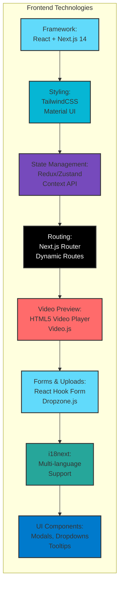

### 2. Backend Microservices Architecture

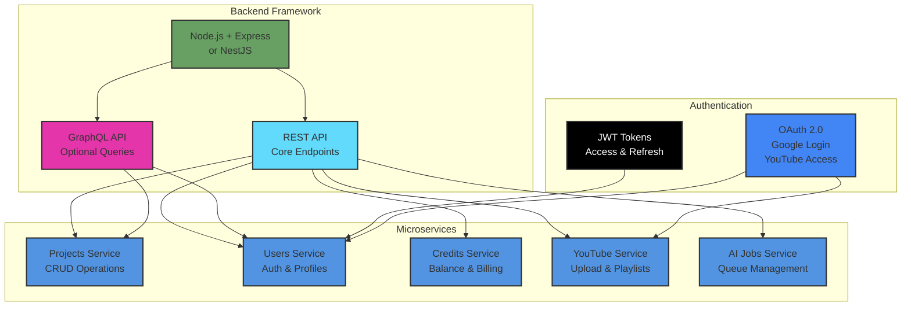

### 3. AI/ML Models and Processing

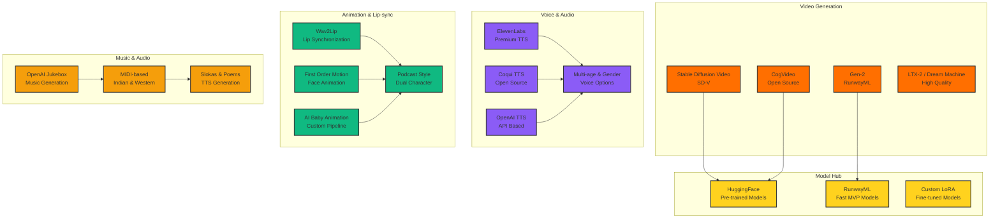

### 4. Cloud Infrastructure (AWS)

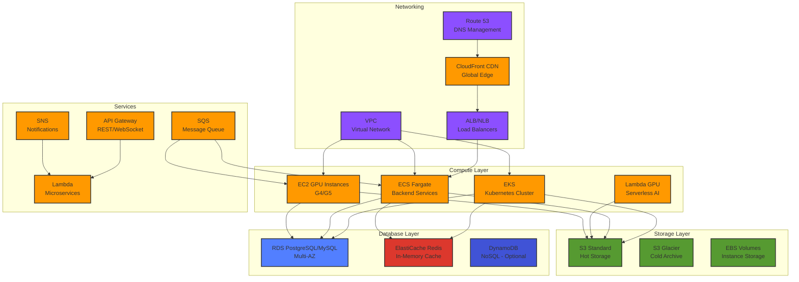

### 5. DevOps & CI/CD Pipeline

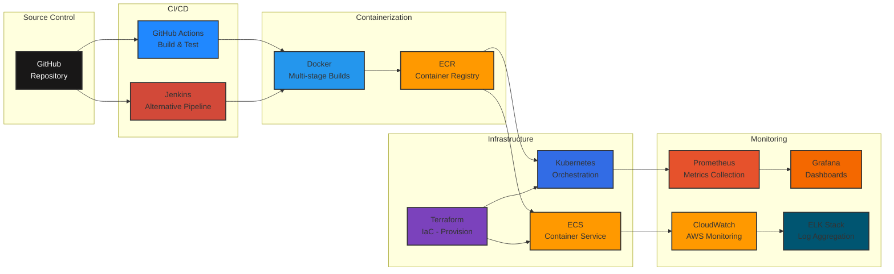

### 6. Storage Architecture

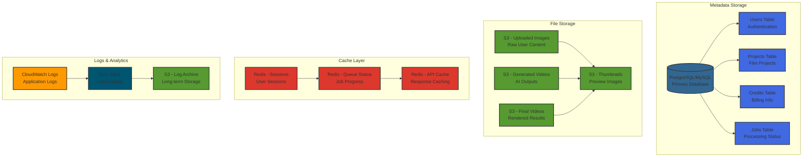

---

## Technology Stack Reference

### Complete Technology Mapping

| Layer | Component | Technology | Purpose |
|-------|-----------|------------|---------|
| **Frontend** | Framework | React + Next.js 14 | Server-side rendering, fast page loads |
| **Frontend** | Styling | TailwindCSS / Material UI | Component-based UI |
| **Frontend** | State | Redux / Zustand / Context API | Global state management |
| **Frontend** | Routing | Next.js Router | Pages & dynamic routing |
| **Frontend** | Video | HTML5 Video Player / Video.js | Play generated videos |
| **Frontend** | Forms | React Hook Form / Dropzone.js | Script input, image upload |
| **Frontend** | i18n | i18next | Multi-language support |
| **Backend** | Framework | Node.js + Express / NestJS | Scalable microservices |
| **Backend** | API | REST / GraphQL | API endpoints |
| **Backend** | Database | PostgreSQL / MySQL | Users, projects, credits |
| **Backend** | Cache | Redis | Fast status & credit balances |
| **Backend** | Storage | AWS S3 / GCP Storage | Images & videos |
| **Backend** | Auth | JWT + OAuth 2.0 | Google, YouTube login |
| **Backend** | Services | Microservices Architecture | Projects, Users, Credits, YouTube, AI Jobs |
| **AI/ML** | Video Gen | Stable Diffusion Video, Gen-2, CogVideo, LTX-2 | Video generation |
| **AI/ML** | Voice | ElevenLabs, Coqui TTS, OpenAI TTS | Multi-age & gender voices |
| **AI/ML** | Lip-sync | Wav2Lip, First Order Motion Model | AI baby/podcast animation |
| **AI/ML** | Music | OpenAI Jukebox, TTS, MIDI | Indian & Western music, Slokas |
| **AI/ML** | Models | HuggingFace / RunwayML | Pre-trained models |
| **Cloud** | Provider | AWS | Primary cloud platform |
| **Cloud** | Compute | EC2 GPU (G4/G5), Lambda | GPU for AI processing |
| **Cloud** | Orchestration | Docker + ECS / Kubernetes | Containerized services |
| **Cloud** | GPU | NVIDIA GPU (G4/G5 or Lambda) | Video synthesis |
| **Cloud** | IaC | Terraform | Manage AWS resources |
| **Cloud** | CI/CD | GitHub Actions / Jenkins | Auto-deploy |
| **Cloud** | Monitoring | Prometheus + Grafana | Metrics & usage |
| **Cloud** | Logging | CloudWatch / ELK Stack | Error tracking |
| **Storage** | Metadata | PostgreSQL / MySQL | Users, credits, projects |
| **Storage** | Media | AWS S3 | Images & videos |
| **Storage** | Cache | Redis | Queue & status |
| **Storage** | Logs | CloudWatch / ELK | Generation logs |
| **Integrations** | YouTube | YouTube Data API v3 | OAuth upload |
| **Integrations** | CRM | Salesforce API | Customer management |
| **Integrations** | Payments | Stripe / PayPal API | Credits & billing |
| **Integrations** | i18n | i18next | Multi-language |

---

## Data Flow

### End-to-End Request Flow

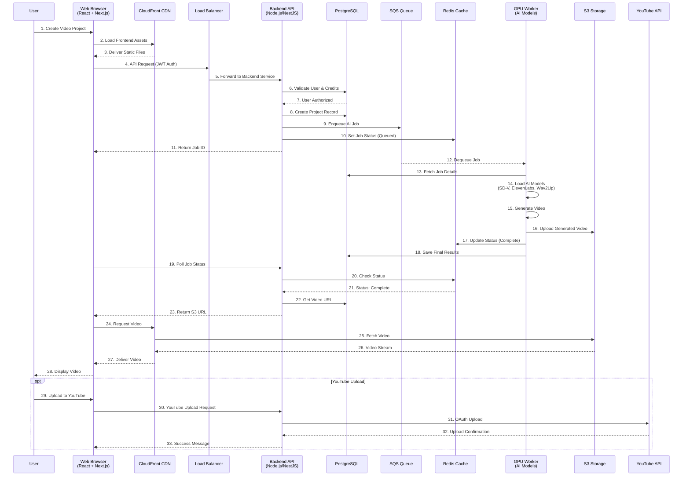

### AI Processing Pipeline

```mermaid
graph LR
    A[Script Input<br/>Text] --> B[Scene Analysis<br/>NLP]
    B --> C[Image Generation<br/>Stable Diffusion]
    C --> D[Video Synthesis<br/>SD-V/Gen-2]
    D --> E[Voice Generation<br/>ElevenLabs/TTS]
    E --> F[Lip-sync<br/>Wav2Lip]
    F --> G[Music Generation<br/>Jukebox/MIDI]
    G --> H[Final Composition<br/>FFmpeg]
    H --> I[Output Video<br/>MP4]
    
    style A fill:#4CAF50,stroke:#333,stroke-width:2px
    style B fill:#2196F3,stroke:#333,stroke-width:2px
    style C fill:#FF6F00,stroke:#333,stroke-width:2px
    style D fill:#FF6F00,stroke:#333,stroke-width:2px
    style E fill:#9C27B0,stroke:#333,stroke-width:2px
    style F fill:#10B981,stroke:#333,stroke-width:2px
    style G fill:#F59E0B,stroke:#333,stroke-width:2px
    style H fill:#EF4444,stroke:#333,stroke-width:2px
    style I fill:#4CAF50,stroke:#333,stroke-width:2px
```

---

## Integration Points

### External Service Integrations

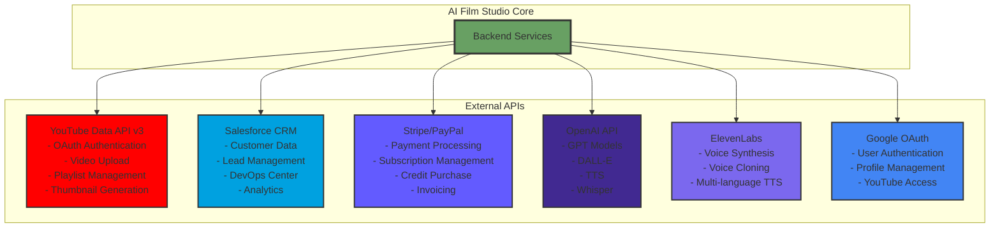

### Security & Access Control Flow

```mermaid
graph TB
    subgraph "Security Layers"
        A[AWS WAF<br/>DDoS Protection<br/>Rate Limiting]
        B[CloudFront<br/>TLS/SSL<br/>Edge Security]
        C[ALB<br/>HTTPS Termination<br/>Security Groups]
        D[JWT Authentication<br/>Access Tokens<br/>Refresh Tokens]
        E[OAuth 2.0<br/>Google Login<br/>YouTube Access]
        F[IAM Roles<br/>Least Privilege<br/>Service Permissions]
        G[Secrets Manager<br/>API Keys<br/>Credentials]
        H[Encryption<br/>At Rest (KMS)<br/>In Transit (TLS)]
    end
    
    A --> B --> C --> D
    D --> E
    C --> F
    F --> G
    G --> H
    
    style A fill:#FF4F00,stroke:#333,stroke-width:2px
    style B fill:#FF9900,stroke:#333,stroke-width:2px
    style C fill:#8C4FFF,stroke:#333,stroke-width:2px
    style D fill:#000000,stroke:#333,stroke-width:2px,color:#fff
    style E fill:#4285F4,stroke:#333,stroke-width:2px
    style F fill:#FF9900,stroke:#333,stroke-width:2px
    style G fill:#DD344C,stroke:#333,stroke-width:2px
    style H fill:#10B981,stroke:#333,stroke-width:2px
```

---

## Deployment Architecture

### Multi-Environment Strategy

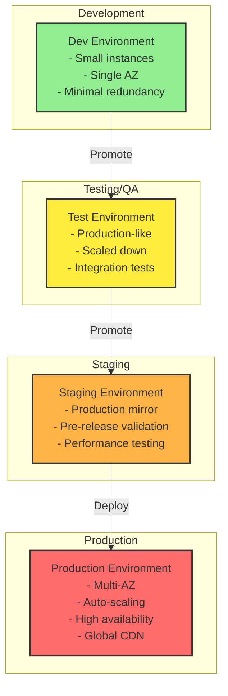

---

## Network Architecture

### AWS VPC and Security Groups

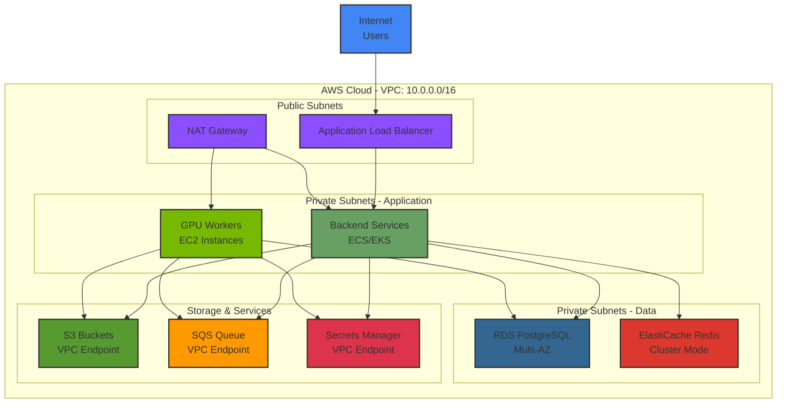

---

## Scaling Strategy

### Auto-scaling Configuration

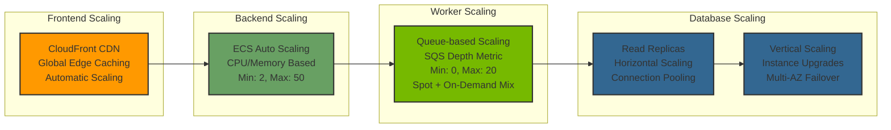

---

## Monitoring & Observability

### Comprehensive Monitoring Stack

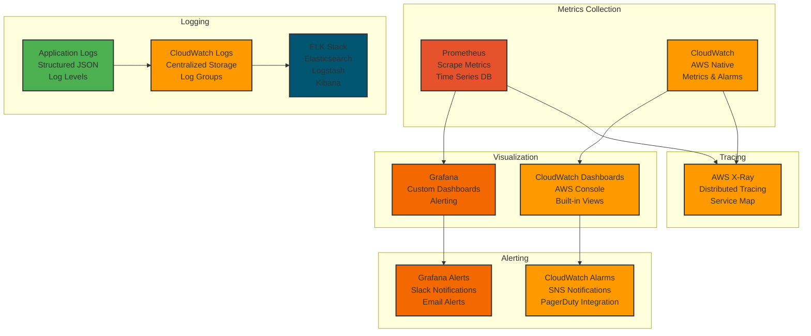

---

## Cost Optimization

### Cost Structure

```mermaid
graph TB
    subgraph "Compute Costs"
        A1[Backend ECS<br/>$120-500/month<br/>Based on traffic]
        A2[GPU Workers<br/>$690-2000/month<br/>70% Spot Instances]
    end
    
    subgraph "Storage Costs"
        B1[S3 Storage<br/>$28-115/month<br/>With Intelligent Tiering]
        B2[RDS Database<br/>$72-589/month<br/>Based on instance size]
        B3[Redis Cache<br/>$12-199/month<br/>Based on node size]
    end
    
    subgraph "Network Costs"
        C1[CloudFront CDN<br/>$5-180/month<br/>Based on traffic]
        C2[NAT Gateway<br/>$37-118/month<br/>Per AZ]
        C3[Load Balancer<br/>$16-33/month<br/>Fixed cost]
    end
    
    subgraph "Optimization Strategies"
        D1[Use Spot Instances<br/>~70% Savings on GPU]
        D2[S3 Lifecycle Policies<br/>Auto-tier to Glacier]
        D3[Reserved Instances<br/>1-3 Year Commitments]
        D4[Right-sizing<br/>Monitor & Adjust]
    end
    
    A1 --> D1
    A2 --> D1
    B1 --> D2
    B2 --> D3
    B3 --> D3
    C1 --> D4
    C2 --> D4
    C3 --> D4
    
    style A1 fill:#FF9900,stroke:#333,stroke-width:2px
    style A2 fill:#76B900,stroke:#333,stroke-width:2px
    style B1 fill:#569A31,stroke:#333,stroke-width:2px
    style B2 fill:#336791,stroke:#333,stroke-width:2px
    style B3 fill:#DC382D,stroke:#333,stroke-width:2px
    style C1 fill:#FF9900,stroke:#333,stroke-width:2px
    style C2 fill:#8C4FFF,stroke:#333,stroke-width:2px
    style C3 fill:#8C4FFF,stroke:#333,stroke-width:2px
    style D1 fill:#4CAF50,stroke:#333,stroke-width:2px
    style D2 fill:#4CAF50,stroke:#333,stroke-width:2px
    style D3 fill:#4CAF50,stroke:#333,stroke-width:2px
    style D4 fill:#4CAF50,stroke:#333,stroke-width:2px
```

---

## Summary

This comprehensive architecture diagram provides a complete blueprint for the AI Film Studio platform, including:

✅ **Frontend Layer**: React + Next.js with TailwindCSS, Material UI, and multi-language support  
✅ **Backend Microservices**: Node.js/NestJS with REST/GraphQL APIs  
✅ **AI/ML Models**: Video generation, voice synthesis, lip-sync, and music generation  
✅ **Cloud Infrastructure**: AWS with EC2 GPU, ECS/Kubernetes, and serverless components  
✅ **Storage Layer**: PostgreSQL/MySQL, Redis cache, and S3 object storage  
✅ **DevOps Pipeline**: GitHub Actions, Docker, Terraform, and Kubernetes  
✅ **Monitoring**: Prometheus, Grafana, CloudWatch, and ELK Stack  
✅ **Integrations**: YouTube, Salesforce, Stripe/PayPal, and AI model APIs  
✅ **Security**: JWT authentication, OAuth 2.0, IAM roles, and encryption  
✅ **Scaling**: Auto-scaling for all components based on demand  

This diagram serves as the definitive reference for developers, DevOps engineers, and stakeholders to understand the complete system architecture and begin implementation.

---

**Document Status**: Ready for Implementation  
**Last Updated**: 2025-12-31  
**Maintained By**: AI-Empower-HQ-360 Architecture Team
