# AI Film Studio – Environment Architecture Diagram

**Version:** 1.0  
**Last Updated:** 2025-12-31  
**Document Owner:** AI-Empower-HQ-360

---

## Overview

This document provides visual representations of the AI Film Studio environment architecture, showing how code flows through environments, how services interact, and how data moves between systems.

---

## Table of Contents

1. [Complete Environment Workflow](#complete-environment-workflow)
2. [Environment Architecture Comparison](#environment-architecture-comparison)
3. [Service Component Diagram](#service-component-diagram)
4. [Data Flow Diagram](#data-flow-diagram)
5. [CI/CD Pipeline Visualization](#cicd-pipeline-visualization)
6. [Network Architecture](#network-architecture)

---

## Complete Environment Workflow

### High-Level Environment Flow

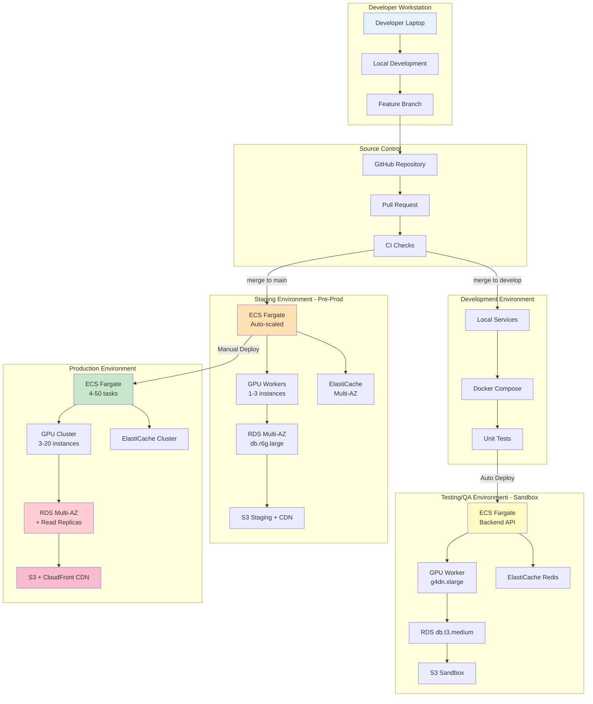

---

## Environment Architecture Comparison

### Development Environment

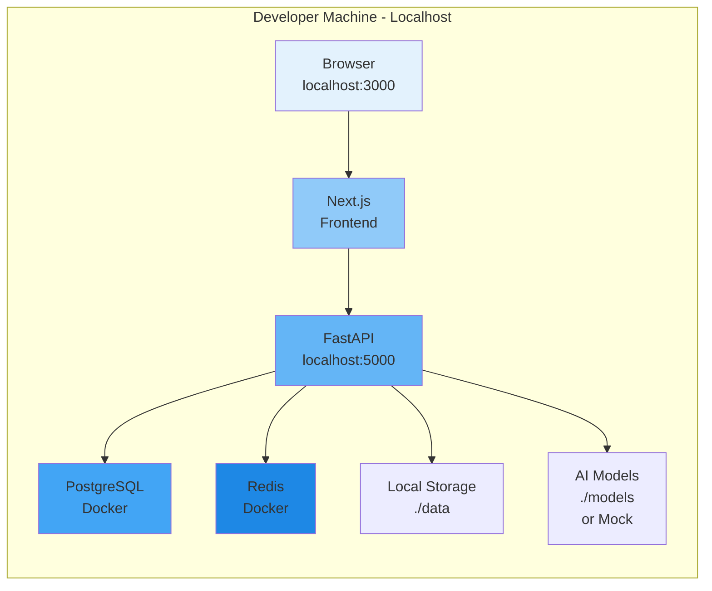

### Testing/QA Environment (Sandbox)

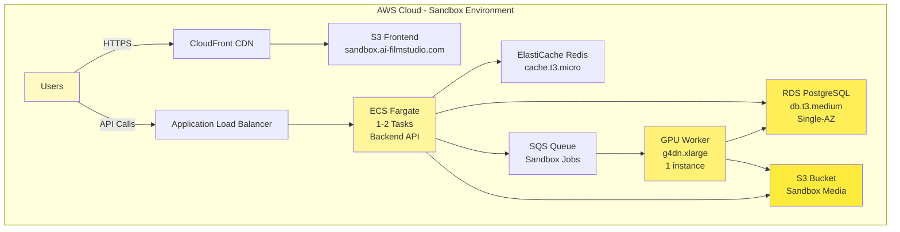

### Staging Environment (Pre-Production)

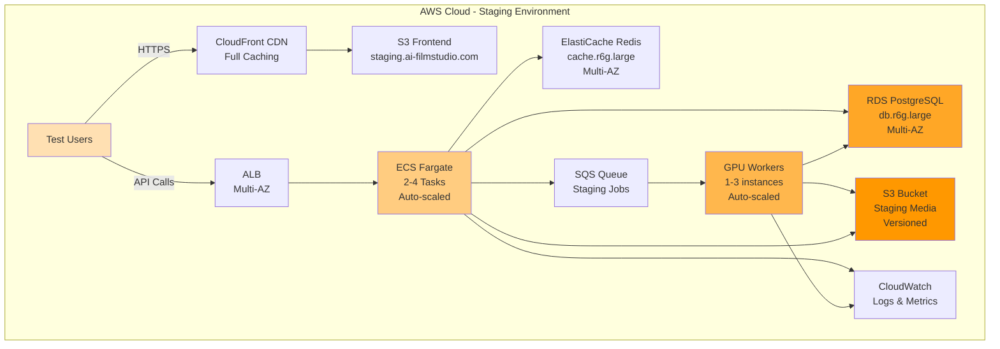

### Production Environment

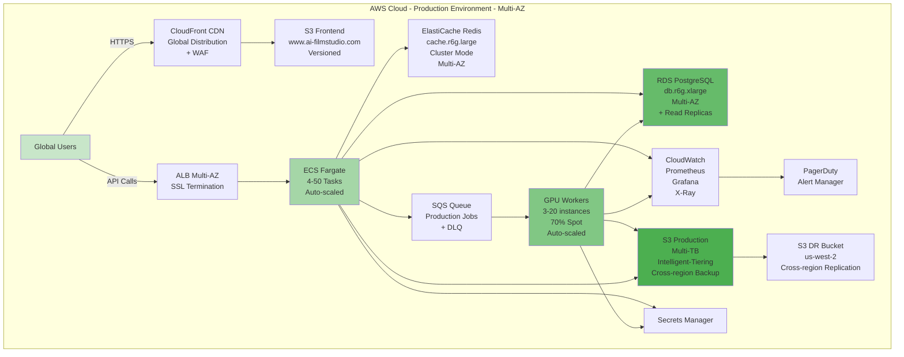

---

## Service Component Diagram

### All Environments - Service Stack

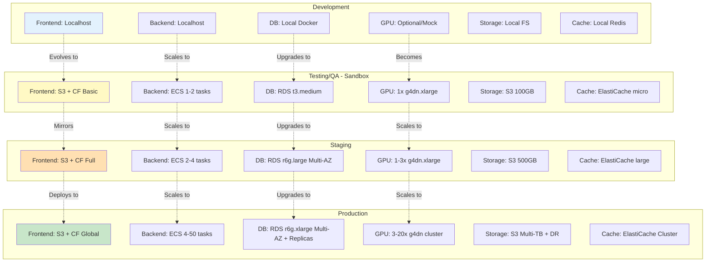

---

## Data Flow Diagram

### User Request Flow Across Production

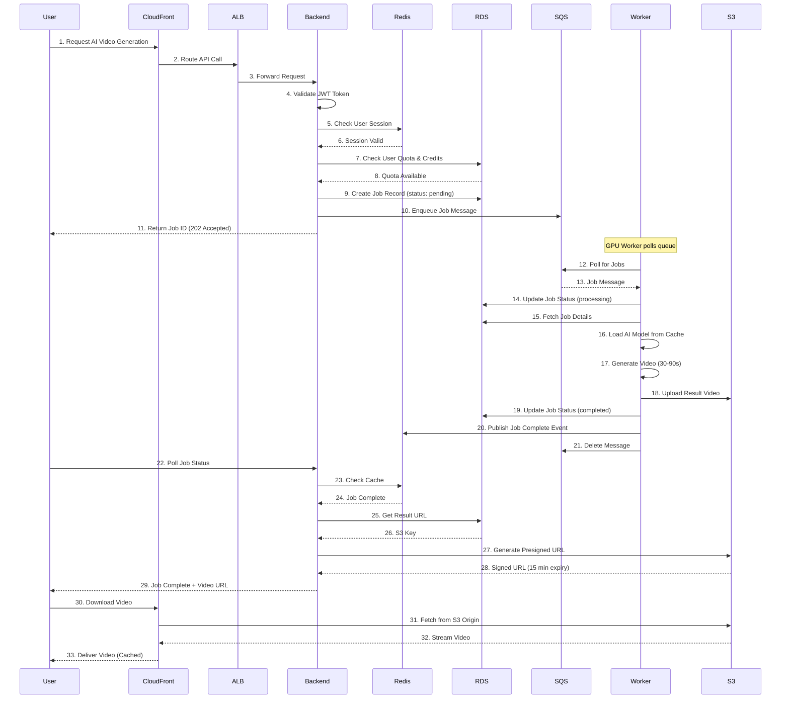

### Code Deployment Flow

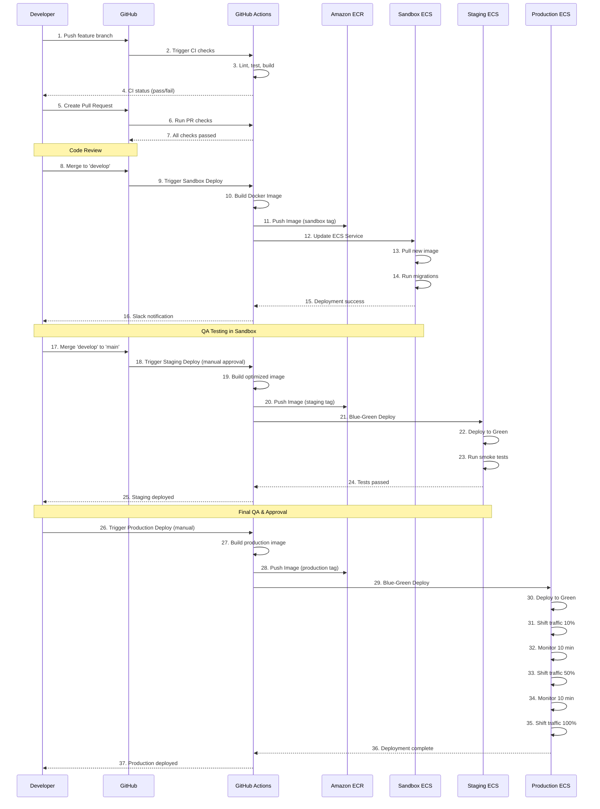

---

## CI/CD Pipeline Visualization

### Complete CI/CD Pipeline

```mermaid
graph LR
    A[Git Push] --> B{Branch?}
    B -->|feature/*| C[CI Checks]
    C --> D[Lint]
    C --> E[Unit Tests]
    C --> F[Build]
    D --> G{Pass?}
    E --> G
    F --> G
    G -->|Yes| H[PR Ready]
    G -->|No| I[Fix Issues]
    I --> A
    
    H --> J[Code Review]
    J --> K{Approved?}
    K -->|No| I
    K -->|Yes| L[Merge to develop]
    
    L --> M[Build Docker]
    M --> N[Push to ECR]
    N --> O[Deploy Sandbox]
    O --> P[Run Migrations]
    P --> Q[Smoke Tests]
    Q --> R{Tests Pass?}
    R -->|No| S[Rollback]
    R -->|Yes| T[QA Testing]
    
    T --> U{QA Pass?}
    U -->|No| I
    U -->|Yes| V[Merge to main]
    
    V --> W[Manual Approval]
    W --> X[Build Production]
    X --> Y[Push to ECR Staging]
    Y --> Z[Deploy Staging]
    Z --> AA[Full Test Suite]
    AA --> AB{Tests Pass?}
    AB -->|No| S
    AB -->|Yes| AC[Final Approval]
    
    AC --> AD[Deploy Production]
    AD --> AE[Blue-Green Deploy]
    AE --> AF[10% Traffic]
    AF --> AG[Monitor 10min]
    AG --> AH{Healthy?}
    AH -->|No| AI[Instant Rollback]
    AH -->|Yes| AJ[50% Traffic]
    AJ --> AK[Monitor 10min]
    AK --> AL{Healthy?}
    AL -->|No| AI
    AL -->|Yes| AM[100% Traffic]
    AM --> AN[Complete]
    
    style A fill:#E3F2FD
    style O fill:#FFF9C4
    style Z fill:#FFE0B2
    style AD fill:#C8E6C9
    style S fill:#FFCDD2
    style AI fill:#FFCDD2
```

---

## Network Architecture

### Production VPC Architecture

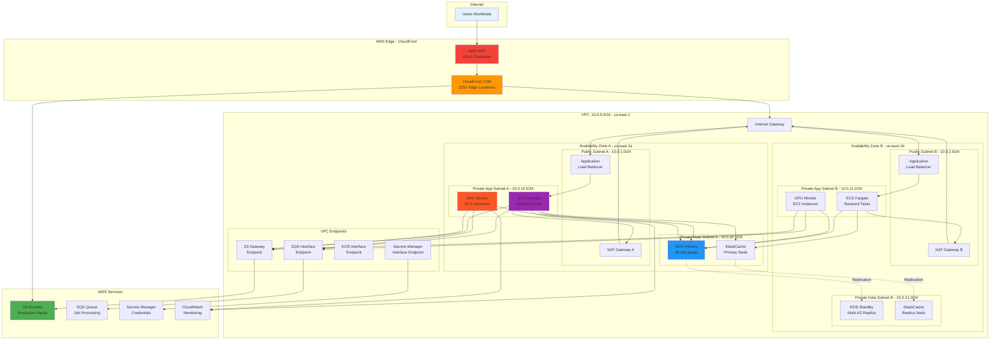

### Environment Network Comparison

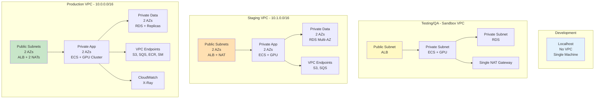

---

## AI Processing Architecture

### AI Pipeline Across Environments

```mermaid
graph TB
    subgraph "Development"
        D1[Script Input]
        D2[Mock AI Response<br/>or Small Model]
        D3[Fast Testing]
        D1 --> D2 --> D3
    end
    
    subgraph "Testing/QA"
        T1[Script Input]
        T2[Full AI Pipeline]
        T3[g4dn.xlarge<br/>NVIDIA T4]
        T4[SDXL Model]
        T5[Video Generation]
        T6[S3 Upload]
        T1 --> T2 --> T3 --> T4 --> T5 --> T6
    end
    
    subgraph "Staging"
        S1[Script Input]
        S2[Production AI Pipeline]
        S3[1-3 GPU Workers<br/>Auto-scaled]
        S4[Full Model Suite]
        S5[Quality Validation]
        S6[Performance Testing]
        S1 --> S2 --> S3 --> S4 --> S5 --> S6
    end
    
    subgraph "Production"
        P1[User Script]
        P2[SQS Job Queue]
        P3[3-20 GPU Workers<br/>Auto-scaled<br/>70% Spot]
        P4[Model Cache<br/>S3 + Local]
        P5[High-Quality Generation]
        P6[CDN Distribution]
        P7[User Delivery]
        P1 --> P2 --> P3 --> P4 --> P5 --> P6 --> P7
    end
    
    D3 -.Validates.-> T1
    T6 -.Mirrors.-> S1
    S6 -.Deploys to.-> P1
    
    style D1 fill:#E3F2FD
    style T1 fill:#FFF9C4
    style S1 fill:#FFE0B2
    style P1 fill:#C8E6C9
```

---

## Cost and Scale Visualization

### Environment Resource Scaling

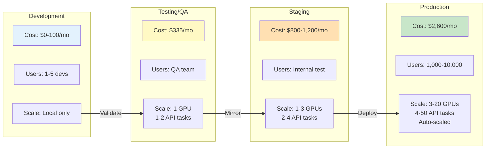

---

## Security Progression

### Security Hardening Across Environments

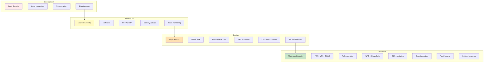

---

## Summary

These diagrams illustrate:

✅ **Clear Environment Progression** — How code and infrastructure evolve from dev to production  
✅ **Service Architecture** — Component interaction at each environment tier  
✅ **Data Flow** — Request processing and AI pipeline workflows  
✅ **Deployment Pipeline** — Automated CI/CD with safety gates  
✅ **Network Design** — VPC architecture and security boundaries  
✅ **Cost & Scale** — Resource allocation and auto-scaling strategy  
✅ **Security Layers** — Progressive hardening from dev to production  

These visual representations complement the detailed environment documentation in [environments.md](./environments.md).

---

## Document Revision History

| Version | Date       | Author                 | Changes                                      |
|---------|------------|------------------------|----------------------------------------------|
| 1.0     | 2025-12-31 | AI-Empower-HQ-360      | Initial environment architecture diagrams    |

---

**End of Document**
