# AI Film Studio - Frontend Tech Stack

**Version:** 1.0  
**Last Updated:** 2025-12-31  
**Document Owner:** AI-Empower-HQ-360

---

## Overview

This document provides a comprehensive breakdown of the AI Film Studio frontend technology stack, including framework selection, libraries, components, styling, and deployment strategies.

---

## 🌐 Frontend Architecture

```mermaid
graph TB
    subgraph "Frontend Technology Stack"
        subgraph "Core Framework Layer"
            REACT[⚛️ React 18+<br/>Component-based UI<br/>Virtual DOM<br/>Hooks API]
            NEXTJS[▲ Next.js 14<br/>SSR/SSG/ISR<br/>Dynamic Routing<br/>API Routes<br/>Image Optimization]
            TS[📘 TypeScript 5.x<br/>Type Safety<br/>IntelliSense<br/>Compile-time Checks]
        end
        
        subgraph "State Management Layer"
            REDUX[🔄 Redux Toolkit<br/>Global State<br/>DevTools Integration]
            ZUSTAND[🐻 Zustand<br/>Lightweight State<br/>Simple API]
            CONTEXT[📦 React Context<br/>Component State<br/>Theme/Auth Context]
            REACT_QUERY[🔄 React Query 5.x<br/>Server State<br/>Caching<br/>Auto-refetch]
        end
        
        subgraph "Styling & UI Layer"
            TAILWIND[🎨 TailwindCSS 3.x<br/>Utility-first CSS<br/>Responsive Design<br/>Dark Mode Support]
            MATERIAL[📦 Material UI<br/>Pre-built Components<br/>Forms, Buttons, Modals]
            CHAKRA[🎭 Chakra UI<br/>Accessible Components<br/>Theme Customization]
            FRAMER[✨ Framer Motion<br/>Smooth Animations<br/>Transitions<br/>Gestures]
        end
        
        subgraph "Forms & Validation Layer"
            REACT_HOOK_FORM[📝 React Hook Form<br/>Performant Forms<br/>Built-in Validation<br/>Error Handling]
            YUP[✅ Yup<br/>Schema Validation<br/>Custom Rules]
            DROPZONE[📤 React Dropzone<br/>Drag & Drop<br/>File Upload<br/>Preview]
        end
        
        subgraph "Media & Interaction Layer"
            VIDEO_JS[🎬 Video.js<br/>HTML5 Video Player<br/>Custom Controls<br/>Plugins]
            WAVESURFER[🌊 Wavesurfer.js<br/>Audio Waveforms<br/>Playback Controls]
            FABRIC[🖼️ Fabric.js<br/>Canvas Editing<br/>Image Manipulation]
        end
        
        subgraph "Internationalization Layer"
            I18NEXT[🌐 i18next<br/>Multi-language Support<br/>Translation Management<br/>Locale Detection]
        end
        
        subgraph "HTTP & API Layer"
            AXIOS[🌍 Axios<br/>HTTP Client<br/>Interceptors<br/>Request/Response Transform]
            SWR[🔄 SWR<br/>Data Fetching<br/>Revalidation<br/>Cache]
        end
        
        subgraph "Utilities Layer"
            LODASH[🔧 Lodash<br/>Utility Functions<br/>Data Manipulation]
            DATE_FNS[📅 date-fns<br/>Date Formatting<br/>Timezone Support]
            CLASSNAMES[🏷️ classnames<br/>Conditional Classes<br/>CSS Module Support]
        end
    end
    
    NEXTJS --> REACT
    NEXTJS --> TS
    REACT --> REDUX
    REACT --> ZUSTAND
    REACT --> CONTEXT
    REACT --> REACT_QUERY
    REACT --> TAILWIND
    REACT --> MATERIAL
    REACT --> CHAKRA
    REACT --> FRAMER
    REACT --> REACT_HOOK_FORM
    REACT_HOOK_FORM --> YUP
    REACT --> DROPZONE
    REACT --> VIDEO_JS
    REACT --> WAVESURFER
    REACT --> FABRIC
    REACT --> I18NEXT
    REACT --> AXIOS
    REACT --> SWR
    REACT --> LODASH
    REACT --> DATE_FNS
    REACT --> CLASSNAMES
    
    style REACT fill:#61DAFB,color:#000
    style NEXTJS fill:#000000,color:#fff
    style TS fill:#3178C6,color:#fff
    style TAILWIND fill:#06B6D4,color:#fff
    style REDUX fill:#764ABC,color:#fff
```



---

## 1️⃣ Framework & Core Libraries

### React 18+
**Purpose**: Core UI library for building component-based interfaces

**Key Features**:
- **Component-based architecture**: Reusable UI components
- **Virtual DOM**: Efficient rendering and updates
- **Hooks API**: useState, useEffect, useContext, custom hooks
- **Concurrent rendering**: Improved performance
- **Suspense**: Lazy loading and code splitting

**Usage in AI Film Studio**:
```jsx
import React, { useState, useEffect } from 'react';

const VideoGenerationComponent = () => {
  const [videoStatus, setVideoStatus] = useState('idle');
  
  useEffect(() => {
    // Poll video generation status
    const interval = setInterval(checkStatus, 5000);
    return () => clearInterval(interval);
  }, []);
  
  return (
    <div className="video-generation">
      <h2>Video Generation Status: {videoStatus}</h2>
    </div>
  );
};
```

**Version**: `^18.2.0`  
**Installation**: `npm install react react-dom`

---

### Next.js 14
**Purpose**: React framework with server-side rendering, routing, and optimization

**Key Features**:
- **Server-Side Rendering (SSR)**: Dynamic content with SEO benefits
- **Static Site Generation (SSG)**: Pre-rendered pages for performance
- **Incremental Static Regeneration (ISR)**: Update static content without rebuild
- **API Routes**: Backend endpoints within Next.js
- **Image Optimization**: Automatic image optimization and lazy loading
- **File-based Routing**: Intuitive routing based on file structure
- **Middleware**: Request/response manipulation
- **App Router**: Modern routing with React Server Components

**Usage in AI Film Studio**:
```javascript
// pages/index.js - Home page with SSG
export async function getStaticProps() {
  return {
    props: { title: 'AI Film Studio' },
    revalidate: 3600 // Revalidate every hour
  };
}

// pages/projects/[id].js - Dynamic project page with SSR
export async function getServerSideProps({ params }) {
  const project = await fetchProject(params.id);
  return { props: { project } };
}

// app/api/generate/route.js - API route for video generation
export async function POST(request) {
  const body = await request.json();
  // Call backend API
  return Response.json({ jobId: '12345' });
}
```

**Version**: `^14.0.0`  
**Installation**: `npx create-next-app@latest ai-film-studio-frontend`

---

### TypeScript 5.x
**Purpose**: Type-safe JavaScript with enhanced developer experience

**Key Features**:
- **Static type checking**: Catch errors at compile time
- **IntelliSense**: Better IDE autocomplete
- **Interface definitions**: Clear data structures
- **Type inference**: Automatic type detection
- **Decorators**: Metadata for classes and methods

**Usage in AI Film Studio**:
```typescript
// types/project.ts
interface Project {
  id: string;
  name: string;
  description: string;
  status: 'draft' | 'processing' | 'completed' | 'failed';
  createdAt: Date;
  updatedAt: Date;
  userId: string;
}

interface VideoGenerationRequest {
  projectId: string;
  script: string;
  duration: number;
  voiceId: string;
  language: string;
}

// components/ProjectCard.tsx
import React from 'react';

interface ProjectCardProps {
  project: Project;
  onEdit: (id: string) => void;
  onDelete: (id: string) => void;
}

const ProjectCard: React.FC<ProjectCardProps> = ({ project, onEdit, onDelete }) => {
  return (
    <div className="project-card">
      <h3>{project.name}</h3>
      <p>{project.description}</p>
      <span className={`status-${project.status}`}>{project.status}</span>
    </div>
  );
};
```

**Version**: `^5.3.0`  
**Installation**: `npm install --save-dev typescript @types/react @types/node`

---

## 2️⃣ State Management

### Redux Toolkit
**Purpose**: Predictable global state management

**Key Features**:
- **Centralized store**: Single source of truth
- **Redux DevTools**: Time-travel debugging
- **Immutable updates**: Prevents state mutations
- **Middleware support**: Async logic with thunks
- **RTK Query**: Data fetching and caching

**Usage in AI Film Studio**:
```typescript
// store/slices/userSlice.ts
import { createSlice, PayloadAction } from '@reduxjs/toolkit';

interface UserState {
  user: User | null;
  credits: number;
  isAuthenticated: boolean;
}

const userSlice = createSlice({
  name: 'user',
  initialState: { user: null, credits: 0, isAuthenticated: false } as UserState,
  reducers: {
    setUser: (state, action: PayloadAction<User>) => {
      state.user = action.payload;
      state.isAuthenticated = true;
    },
    setCredits: (state, action: PayloadAction<number>) => {
      state.credits = action.payload;
    },
    logout: (state) => {
      state.user = null;
      state.credits = 0;
      state.isAuthenticated = false;
    }
  }
});

export const { setUser, setCredits, logout } = userSlice.actions;
export default userSlice.reducer;
```

**Version**: `^2.0.0`  
**Installation**: `npm install @reduxjs/toolkit react-redux`

---

### Zustand
**Purpose**: Lightweight alternative to Redux for simple state

**Key Features**:
- **Minimal boilerplate**: Simple API
- **No providers**: Direct store access
- **TypeScript support**: Full type safety
- **Persist middleware**: Local storage integration

**Usage in AI Film Studio**:
```typescript
// store/projectStore.ts
import { create } from 'zustand';

interface ProjectStore {
  projects: Project[];
  selectedProject: Project | null;
  setProjects: (projects: Project[]) => void;
  selectProject: (project: Project) => void;
  addProject: (project: Project) => void;
}

export const useProjectStore = create<ProjectStore>((set) => ({
  projects: [],
  selectedProject: null,
  setProjects: (projects) => set({ projects }),
  selectProject: (project) => set({ selectedProject: project }),
  addProject: (project) => set((state) => ({ 
    projects: [...state.projects, project] 
  }))
}));

// Usage in component
const ProjectList = () => {
  const { projects, selectProject } = useProjectStore();
  
  return (
    <ul>
      {projects.map(project => (
        <li key={project.id} onClick={() => selectProject(project)}>
          {project.name}
        </li>
      ))}
    </ul>
  );
};
```

**Version**: `^4.4.0`  
**Installation**: `npm install zustand`

---

### React Context API
**Purpose**: Built-in React state sharing for theme, auth, and localization

**Usage in AI Film Studio**:
```typescript
// contexts/ThemeContext.tsx
import React, { createContext, useContext, useState } from 'react';

type Theme = 'light' | 'dark';

interface ThemeContextType {
  theme: Theme;
  toggleTheme: () => void;
}

const ThemeContext = createContext<ThemeContextType | undefined>(undefined);

export const ThemeProvider: React.FC<{ children: React.ReactNode }> = ({ children }) => {
  const [theme, setTheme] = useState<Theme>('light');
  
  const toggleTheme = () => {
    setTheme(prev => prev === 'light' ? 'dark' : 'light');
  };
  
  return (
    <ThemeContext.Provider value={{ theme, toggleTheme }}>
      {children}
    </ThemeContext.Provider>
  );
};

export const useTheme = () => {
  const context = useContext(ThemeContext);
  if (!context) throw new Error('useTheme must be used within ThemeProvider');
  return context;
};
```

---

### React Query 5.x
**Purpose**: Server state management with caching and auto-refetching

**Key Features**:
- **Automatic caching**: Intelligent data caching
- **Background updates**: Auto-refetch on window focus
- **Optimistic updates**: Instant UI updates
- **Query invalidation**: Manual cache clearing
- **Infinite queries**: Pagination support

**Usage in AI Film Studio**:
```typescript
// hooks/useProjects.ts
import { useQuery, useMutation, useQueryClient } from '@tanstack/react-query';
import { fetchProjects, createProject, deleteProject } from '@/services/api';

export const useProjects = () => {
  return useQuery({
    queryKey: ['projects'],
    queryFn: fetchProjects,
    staleTime: 5 * 60 * 1000, // 5 minutes
    refetchOnWindowFocus: true
  });
};

export const useCreateProject = () => {
  const queryClient = useQueryClient();
  
  return useMutation({
    mutationFn: createProject,
    onSuccess: () => {
      queryClient.invalidateQueries({ queryKey: ['projects'] });
    }
  });
};

// Usage in component
const ProjectsPage = () => {
  const { data: projects, isLoading, error } = useProjects();
  const { mutate: createNewProject } = useCreateProject();
  
  if (isLoading) return <Spinner />;
  if (error) return <ErrorMessage error={error} />;
  
  return (
    <div>
      {projects?.map(project => <ProjectCard key={project.id} project={project} />)}
      <button onClick={() => createNewProject({ name: 'New Project' })}>
        Create Project
      </button>
    </div>
  );
};
```

**Version**: `^5.17.0`  
**Installation**: `npm install @tanstack/react-query`

---

## 3️⃣ Styling & UI Components

### TailwindCSS 3.x
**Purpose**: Utility-first CSS framework for rapid styling

**Key Features**:
- **Utility classes**: Pre-defined CSS classes (e.g., `flex`, `bg-blue-500`)
- **Responsive design**: Mobile-first breakpoints
- **Dark mode**: Built-in dark mode support
- **JIT compiler**: On-demand CSS generation
- **Custom configuration**: Tailwind config for brand colors

**Usage in AI Film Studio**:
```jsx
// tailwind.config.js
module.exports = {
  content: ['./src/**/*.{js,ts,jsx,tsx}'],
  darkMode: 'class',
  theme: {
    extend: {
      colors: {
        brand: {
          primary: '#4A90E2',
          secondary: '#F39C12',
          accent: '#E74C3C'
        }
      }
    }
  },
  plugins: [
    require('@tailwindcss/forms'),
    require('@tailwindcss/typography')
  ]
};

// Component usage
const Button = ({ children, variant = 'primary' }) => {
  const baseClasses = 'px-4 py-2 rounded-lg font-semibold transition-all';
  const variantClasses = {
    primary: 'bg-brand-primary text-white hover:bg-blue-600',
    secondary: 'bg-brand-secondary text-white hover:bg-orange-600',
    outline: 'border-2 border-brand-primary text-brand-primary hover:bg-brand-primary hover:text-white'
  };
  
  return (
    <button className={`${baseClasses} ${variantClasses[variant]}`}>
      {children}
    </button>
  );
};
```

**Version**: `^3.4.0`  
**Installation**: `npm install -D tailwindcss postcss autoprefixer`

---

### Material UI
**Purpose**: Pre-built React components following Material Design

**Key Features**:
- **Component library**: Buttons, inputs, modals, tables, etc.
- **Theme customization**: Custom colors, typography, spacing
- **Accessibility**: ARIA labels and keyboard navigation
- **Grid system**: Responsive layout components

**Usage in AI Film Studio**:
```jsx
import { Button, TextField, Dialog, DialogTitle, DialogContent, DialogActions } from '@mui/material';

const CreateProjectDialog = ({ open, onClose, onCreate }) => {
  const [projectName, setProjectName] = useState('');
  
  return (
    <Dialog open={open} onClose={onClose} maxWidth="sm" fullWidth>
      <DialogTitle>Create New Project</DialogTitle>
      <DialogContent>
        <TextField
          autoFocus
          margin="dense"
          label="Project Name"
          type="text"
          fullWidth
          variant="outlined"
          value={projectName}
          onChange={(e) => setProjectName(e.target.value)}
        />
      </DialogContent>
      <DialogActions>
        <Button onClick={onClose}>Cancel</Button>
        <Button onClick={() => onCreate(projectName)} variant="contained">
          Create
        </Button>
      </DialogActions>
    </Dialog>
  );
};
```

**Version**: `^5.15.0`  
**Installation**: `npm install @mui/material @emotion/react @emotion/styled`

---

### Chakra UI
**Purpose**: Alternative component library with accessibility focus

**Key Features**:
- **Accessible by default**: WCAG compliant
- **Composable components**: Build complex UIs
- **Dark mode**: Easy theme switching
- **Style props**: Inline styling with props

**Usage in AI Film Studio**:
```jsx
import { Box, Button, Stack, Heading, useToast } from '@chakra-ui/react';

const VideoGenerationPanel = () => {
  const toast = useToast();
  
  const handleGenerate = () => {
    toast({
      title: 'Video generation started',
      description: 'Your video is being processed',
      status: 'success',
      duration: 5000,
      isClosable: true
    });
  };
  
  return (
    <Box p={6} bg="white" shadow="md" borderRadius="lg">
      <Heading size="md" mb={4}>Generate Video</Heading>
      <Stack spacing={4}>
        <Button colorScheme="blue" onClick={handleGenerate}>
          Generate Video
        </Button>
      </Stack>
    </Box>
  );
};
```

**Version**: `^2.8.0`  
**Installation**: `npm install @chakra-ui/react @chakra-ui/next-js @emotion/react @emotion/styled framer-motion`

---

### Framer Motion
**Purpose**: Animation library for smooth transitions and gestures

**Key Features**:
- **Declarative animations**: Animate components with props
- **Gestures**: Drag, hover, tap interactions
- **Layout animations**: Automatic layout transitions
- **Variants**: Reusable animation configurations

**Usage in AI Film Studio**:
```jsx
import { motion, AnimatePresence } from 'framer-motion';

const VideoCard = ({ video, isSelected }) => {
  return (
    <motion.div
      layout
      initial={{ opacity: 0, scale: 0.8 }}
      animate={{ opacity: 1, scale: 1 }}
      exit={{ opacity: 0, scale: 0.8 }}
      whileHover={{ scale: 1.05 }}
      whileTap={{ scale: 0.95 }}
      className="video-card"
    >
      
      <h3>{video.title}</h3>
    </motion.div>
  );
};

const VideoGrid = ({ videos }) => {
  return (
    <AnimatePresence>
      {videos.map(video => (
        <VideoCard key={video.id} video={video} />
      ))}
    </AnimatePresence>
  );
};
```

**Version**: `^11.0.0`  
**Installation**: `npm install framer-motion`

---

## 4️⃣ Forms & Validation

### React Hook Form
**Purpose**: Performant form handling with minimal re-renders

**Key Features**:
- **Uncontrolled components**: Better performance
- **Built-in validation**: Required, min/max, pattern rules
- **Error handling**: Field-level and form-level errors
- **Integration**: Works with Yup, Zod, Joi

**Usage in AI Film Studio**:
```typescript
import { useForm } from 'react-hook-form';
import { yupResolver } from '@hookform/resolvers/yup';
import * as yup from 'yup';

const schema = yup.object({
  projectName: yup.string().required('Project name is required').min(3),
  description: yup.string().max(500),
  duration: yup.number().min(30).max(90).required()
});

const ProjectForm = () => {
  const { register, handleSubmit, formState: { errors } } = useForm({
    resolver: yupResolver(schema)
  });
  
  const onSubmit = (data) => {
    console.log(data);
    // Call API to create project
  };
  
  return (
    <form onSubmit={handleSubmit(onSubmit)}>
      <input {...register('projectName')} placeholder="Project Name" />
      {errors.projectName && <span>{errors.projectName.message}</span>}
      
      <textarea {...register('description')} placeholder="Description" />
      {errors.description && <span>{errors.description.message}</span>}
      
      <input {...register('duration')} type="number" placeholder="Duration (seconds)" />
      {errors.duration && <span>{errors.duration.message}</span>}
      
      <button type="submit">Create Project</button>
    </form>
  );
};
```

**Version**: `^7.49.0`  
**Installation**: `npm install react-hook-form`

---

### Yup
**Purpose**: Schema validation library

**Version**: `^1.3.0`  
**Installation**: `npm install yup @hookform/resolvers`

---

### React Dropzone
**Purpose**: Drag-and-drop file upload component

**Key Features**:
- **Drag-and-drop**: Intuitive file selection
- **File validation**: Type, size, count restrictions
- **Preview**: Display uploaded files
- **Multiple files**: Support multiple file uploads

**Usage in AI Film Studio**:
```jsx
import { useDropzone } from 'react-dropzone';

const FileUpload = ({ onFileSelect }) => {
  const { getRootProps, getInputProps, isDragActive } = useDropzone({
    accept: {
      'image/*': ['.png', '.jpg', '.jpeg'],
      'video/*': ['.mp4', '.mov']
    },
    maxSize: 50 * 1024 * 1024, // 50MB
    onDrop: acceptedFiles => {
      onFileSelect(acceptedFiles);
    }
  });
  
  return (
    <div {...getRootProps()} className={`dropzone ${isDragActive ? 'active' : ''}`}>
      <input {...getInputProps()} />
      {isDragActive ? (
        <p>Drop files here...</p>
      ) : (
        <p>Drag & drop files here, or click to select</p>
      )}
    </div>
  );
};
```

**Version**: `^14.2.0`  
**Installation**: `npm install react-dropzone`

---

## 5️⃣ Media & Interaction

### Video.js
**Purpose**: HTML5 video player with custom controls

**Key Features**:
- **Custom controls**: Play, pause, seek, volume, fullscreen
- **Plugins**: Extend functionality
- **Responsive**: Adapts to container size
- **Subtitles**: Multi-language subtitle support

**Usage in AI Film Studio**:
```jsx
import React, { useEffect, useRef } from 'react';
import videojs from 'video.js';
import 'video.js/dist/video-js.css';

const VideoPlayer = ({ src, poster }) => {
  const videoRef = useRef(null);
  const playerRef = useRef(null);
  
  useEffect(() => {
    if (!playerRef.current) {
      const videoElement = videoRef.current;
      if (!videoElement) return;
      
      playerRef.current = videojs(videoElement, {
        controls: true,
        autoplay: false,
        preload: 'auto',
        poster: poster,
        fluid: true,
        sources: [{ src, type: 'video/mp4' }]
      });
    }
    
    return () => {
      if (playerRef.current) {
        playerRef.current.dispose();
        playerRef.current = null;
      }
    };
  }, [src, poster]);
  
  return (
    <div data-vjs-player>
      <video ref={videoRef} className="video-js vjs-big-play-centered" />
    </div>
  );
};
```

**Version**: `^8.10.0`  
**Installation**: `npm install video.js`

---

### Wavesurfer.js
**Purpose**: Audio waveform visualization

**Version**: `^7.5.0`  
**Installation**: `npm install wavesurfer.js`

---

### Fabric.js
**Purpose**: Canvas manipulation and image editing

**Version**: `^5.3.0`  
**Installation**: `npm install fabric`

---

## 6️⃣ Internationalization

### i18next
**Purpose**: Multi-language support and translation management

**Key Features**:
- **Translation files**: JSON-based translations
- **Language detection**: Auto-detect user language
- **Pluralization**: Handle singular/plural forms
- **Interpolation**: Dynamic content in translations

**Usage in AI Film Studio**:
```typescript
// i18n.ts
import i18n from 'i18next';
import { initReactI18next } from 'react-i18next';

i18n
  .use(initReactI18next)
  .init({
    resources: {
      en: {
        translation: {
          welcome: 'Welcome to AI Film Studio',
          createProject: 'Create New Project',
          credits: 'You have {{count}} credits remaining'
        }
      },
      es: {
        translation: {
          welcome: 'Bienvenido a AI Film Studio',
          createProject: 'Crear Nuevo Proyecto',
          credits: 'Te quedan {{count}} créditos'
        }
      },
      hi: {
        translation: {
          welcome: 'AI फिल्म स्टूडियो में आपका स्वागत है',
          createProject: 'नया प्रोजेक्ट बनाएं',
          credits: 'आपके पास {{count}} क्रेडिट बचे हैं'
        }
      }
    },
    lng: 'en',
    fallbackLng: 'en',
    interpolation: {
      escapeValue: false
    }
  });

export default i18n;

// Component usage
import { useTranslation } from 'react-i18next';

const Header = () => {
  const { t, i18n } = useTranslation();
  
  return (
    <header>
      <h1>{t('welcome')}</h1>
      <button onClick={() => i18n.changeLanguage('es')}>Español</button>
      <button onClick={() => i18n.changeLanguage('hi')}>हिन्दी</button>
    </header>
  );
};
```

**Version**: `^23.7.0`  
**Installation**: `npm install i18next react-i18next`

---

## 7️⃣ HTTP & API Communication

### Axios
**Purpose**: Promise-based HTTP client

**Key Features**:
- **Interceptors**: Request/response transformation
- **Automatic JSON parsing**: No manual JSON.parse()
- **Error handling**: Unified error handling
- **Timeout support**: Request timeout configuration

**Usage in AI Film Studio**:
```typescript
// services/api.ts
import axios from 'axios';

const api = axios.create({
  baseURL: process.env.NEXT_PUBLIC_API_URL,
  timeout: 30000,
  headers: {
    'Content-Type': 'application/json'
  }
});

// Request interceptor - Add JWT token
api.interceptors.request.use(
  (config) => {
    const token = localStorage.getItem('token');
    if (token) {
      config.headers.Authorization = `Bearer ${token}`;
    }
    return config;
  },
  (error) => Promise.reject(error)
);

// Response interceptor - Handle errors
api.interceptors.response.use(
  (response) => response,
  (error) => {
    if (error.response?.status === 401) {
      // Redirect to login
      window.location.href = '/login';
    }
    return Promise.reject(error);
  }
);

export const fetchProjects = async () => {
  const response = await api.get('/api/v1/projects');
  return response.data;
};

export const createProject = async (data: ProjectCreateRequest) => {
  const response = await api.post('/api/v1/projects', data);
  return response.data;
};

export const generateVideo = async (projectId: string, data: VideoGenerationRequest) => {
  const response = await api.post(`/api/v1/projects/${projectId}/generate`, data);
  return response.data;
};
```

**Version**: `^1.6.0`  
**Installation**: `npm install axios`

---

## 8️⃣ Utilities

### Lodash
**Purpose**: Utility functions for data manipulation

**Version**: `^4.17.21`  
**Installation**: `npm install lodash`

---

### date-fns
**Purpose**: Date formatting and manipulation

**Version**: `^3.0.0`  
**Installation**: `npm install date-fns`

---

### classnames
**Purpose**: Conditional CSS class concatenation

**Version**: `^2.5.0`  
**Installation**: `npm install classnames`

---

## 9️⃣ Frontend Hosting & Deployment

### Vercel (Recommended)
**Purpose**: Zero-config Next.js hosting

**Key Features**:
- **Automatic deployments**: Git push to deploy
- **Preview deployments**: PR-based previews
- **Edge network**: Global CDN
- **Serverless functions**: API routes
- **Analytics**: Web vitals tracking

**Deployment**:
```bash
# Install Vercel CLI
npm install -g vercel

# Deploy
vercel --prod
```

**Configuration**:
```json
// vercel.json
{
  "framework": "nextjs",
  "buildCommand": "npm run build",
  "devCommand": "npm run dev",
  "installCommand": "npm install",
  "env": {
    "NEXT_PUBLIC_API_URL": "@api-url",
    "NEXT_PUBLIC_STRIPE_KEY": "@stripe-key"
  }
}
```

---

### AWS S3 + CloudFront (Alternative)
**Purpose**: Static hosting with CDN

**Deployment Steps**:
1. Build Next.js app: `npm run build && npm run export`
2. Upload to S3: `aws s3 sync out/ s3://ai-film-studio-frontend-prod/`
3. Invalidate CloudFront cache: `aws cloudfront create-invalidation --distribution-id EXXXXX --paths "/*"`

**Configuration**:
```javascript
// next.config.js
module.exports = {
  output: 'export',
  images: {
    unoptimized: true
  },
  assetPrefix: 'https://d1234567890.cloudfront.net',
  trailingSlash: true
};
```

---

## 🔟 Development Tools

### ESLint
**Purpose**: JavaScript/TypeScript linting

**Configuration**:
```json
// .eslintrc.json
{
  "extends": [
    "next/core-web-vitals",
    "plugin:@typescript-eslint/recommended"
  ],
  "rules": {
    "no-console": "warn",
    "@typescript-eslint/no-unused-vars": "error"
  }
}
```

---

### Prettier
**Purpose**: Code formatting

**Configuration**:
```json
// .prettierrc
{
  "semi": true,
  "singleQuote": true,
  "trailingComma": "es5",
  "tabWidth": 2,
  "printWidth": 100
}
```

---

## 📦 Complete Package.json

```json
{
  "name": "ai-film-studio-frontend",
  "version": "1.0.0",
  "private": true,
  "scripts": {
    "dev": "next dev",
    "build": "next build",
    "start": "next start",
    "lint": "next lint",
    "format": "prettier --write \"src/**/*.{js,jsx,ts,tsx,json,css,md}\""
  },
  "dependencies": {
    "react": "^18.2.0",
    "react-dom": "^18.2.0",
    "next": "^14.0.0",
    "typescript": "^5.3.0",
    "@reduxjs/toolkit": "^2.0.0",
    "react-redux": "^9.0.0",
    "zustand": "^4.4.0",
    "@tanstack/react-query": "^5.17.0",
    "tailwindcss": "^3.4.0",
    "@mui/material": "^5.15.0",
    "@emotion/react": "^11.11.0",
    "@emotion/styled": "^11.11.0",
    "@chakra-ui/react": "^2.8.0",
    "framer-motion": "^11.0.0",
    "react-hook-form": "^7.49.0",
    "yup": "^1.3.0",
    "@hookform/resolvers": "^3.3.0",
    "react-dropzone": "^14.2.0",
    "video.js": "^8.10.0",
    "wavesurfer.js": "^7.5.0",
    "fabric": "^5.3.0",
    "i18next": "^23.7.0",
    "react-i18next": "^13.5.0",
    "axios": "^1.6.0",
    "lodash": "^4.17.21",
    "date-fns": "^3.0.0",
    "classnames": "^2.5.0"
  },
  "devDependencies": {
    "@types/react": "^18.2.0",
    "@types/react-dom": "^18.2.0",
    "@types/node": "^20.10.0",
    "@types/lodash": "^4.14.0",
    "eslint": "^8.56.0",
    "eslint-config-next": "^14.0.0",
    "@typescript-eslint/eslint-plugin": "^6.16.0",
    "@typescript-eslint/parser": "^6.16.0",
    "prettier": "^3.1.0",
    "autoprefixer": "^10.4.0",
    "postcss": "^8.4.0"
  }
}
```

---

## 📂 Frontend Folder Structure

```
frontend/
├── public/                      # Static assets
│   ├── images/
│   ├── fonts/
│   └── icons/
├── src/
│   ├── app/                     # Next.js App Router (Next.js 14)
│   │   ├── layout.tsx
│   │   ├── page.tsx
│   │   ├── projects/
│   │   └── api/
│   ├── components/              # Reusable React components
│   │   ├── common/              # Button, Input, Modal, etc.
│   │   ├── layout/              # Header, Footer, Sidebar
│   │   ├── projects/            # ProjectCard, ProjectList
│   │   ├── video/               # VideoPlayer, VideoEditor
│   │   └── forms/               # LoginForm, ProjectForm
│   ├── hooks/                   # Custom React hooks
│   │   ├── useAuth.ts
│   │   ├── useProjects.ts
│   │   └── useVideoGeneration.ts
│   ├── services/                # API calls
│   │   ├── api.ts
│   │   ├── auth.service.ts
│   │   ├── project.service.ts
│   │   └── video.service.ts
│   ├── store/                   # State management
│   │   ├── slices/              # Redux slices
│   │   └── projectStore.ts      # Zustand store
│   ├── styles/                  # Global styles
│   │   ├── globals.css
│   │   └── tailwind.css
│   ├── utils/                   # Utility functions
│   │   ├── formatters.ts
│   │   ├── validators.ts
│   │   └── helpers.ts
│   ├── types/                   # TypeScript types
│   │   ├── project.ts
│   │   ├── user.ts
│   │   └── api.ts
│   └── config/                  # Configuration
│       ├── i18n.ts
│       └── constants.ts
├── .env.local                   # Environment variables
├── next.config.js
├── tailwind.config.js
├── tsconfig.json
└── package.json
```

---

## 🔄 Component Architecture Example

```typescript
// src/components/projects/ProjectCard.tsx
import React from 'react';
import { motion } from 'framer-motion';
import { useRouter } from 'next/navigation';
import { Card, CardContent, Button, Chip } from '@mui/material';
import { format } from 'date-fns';
import { Project } from '@/types/project';

interface ProjectCardProps {
  project: Project;
  onDelete?: (id: string) => void;
}

export const ProjectCard: React.FC<ProjectCardProps> = ({ project, onDelete }) => {
  const router = useRouter();
  
  const statusColors = {
    draft: 'default',
    processing: 'info',
    completed: 'success',
    failed: 'error'
  } as const;
  
  return (
    <motion.div
      whileHover={{ scale: 1.02 }}
      whileTap={{ scale: 0.98 }}
      className="cursor-pointer"
    >
      <Card
        onClick={() => router.push(`/projects/${project.id}`)}
        className="h-full"
      >
        <CardContent>
          <div className="flex justify-between items-start mb-4">
            <h3 className="text-xl font-bold">{project.name}</h3>
            <Chip
              label={project.status}
              color={statusColors[project.status]}
              size="small"
            />
          </div>
          
          <p className="text-gray-600 mb-4">{project.description}</p>
          
          <div className="flex justify-between items-center">
            <span className="text-sm text-gray-500">
              {format(new Date(project.createdAt), 'MMM dd, yyyy')}
            </span>
            
            {onDelete && (
              <Button
                variant="outlined"
                color="error"
                size="small"
                onClick={(e) => {
                  e.stopPropagation();
                  onDelete(project.id);
                }}
              >
                Delete
              </Button>
            )}
          </div>
        </CardContent>
      </Card>
    </motion.div>
  );
};
```

---

## 🚀 Getting Started

### Installation
```bash
# Create Next.js app
npx create-next-app@latest ai-film-studio-frontend --typescript --tailwind --app

# Install dependencies
cd ai-film-studio-frontend
npm install

# Install additional packages
npm install @reduxjs/toolkit react-redux zustand @tanstack/react-query
npm install @mui/material @emotion/react @emotion/styled
npm install react-hook-form yup @hookform/resolvers
npm install react-dropzone video.js axios i18next react-i18next
npm install framer-motion lodash date-fns classnames

# Run development server
npm run dev
```

### Environment Variables
```bash
# .env.local
NEXT_PUBLIC_API_URL=http://localhost:8000
NEXT_PUBLIC_STRIPE_KEY=pk_test_xxxxx
NEXT_PUBLIC_YOUTUBE_CLIENT_ID=xxxxx.apps.googleusercontent.com
```

---

## 📊 Performance Optimization

### Code Splitting
- Use dynamic imports: `const Component = dynamic(() => import('./Component'))`
- Lazy load heavy components
- Route-based code splitting (automatic with Next.js)

### Image Optimization
- Use Next.js `<Image>` component
- Automatic WebP conversion
- Lazy loading and blur placeholders

### Caching Strategy
- React Query for API caching
- Service Worker for offline support
- CDN caching via CloudFront

---

## ✅ Summary

The AI Film Studio frontend leverages modern React ecosystem tools to provide:

✅ **High Performance**: Next.js SSR, code splitting, optimized images  
✅ **Developer Experience**: TypeScript, hot reloading, linting  
✅ **User Experience**: Smooth animations, responsive design, accessibility  
✅ **Maintainability**: Component-based architecture, state management  
✅ **Scalability**: Modular structure, CDN delivery, caching  
✅ **Internationalization**: Multi-language support  
✅ **Integration**: Seamless backend API communication  

---

**Document Version History**

| Version | Date       | Author            | Changes                       |
|---------|------------|-------------------|-------------------------------|
| 1.0     | 2025-12-31 | AI-Empower-HQ-360 | Initial frontend tech stack doc |

---

**End of Document**
