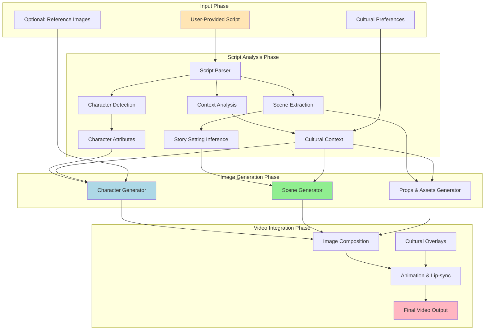
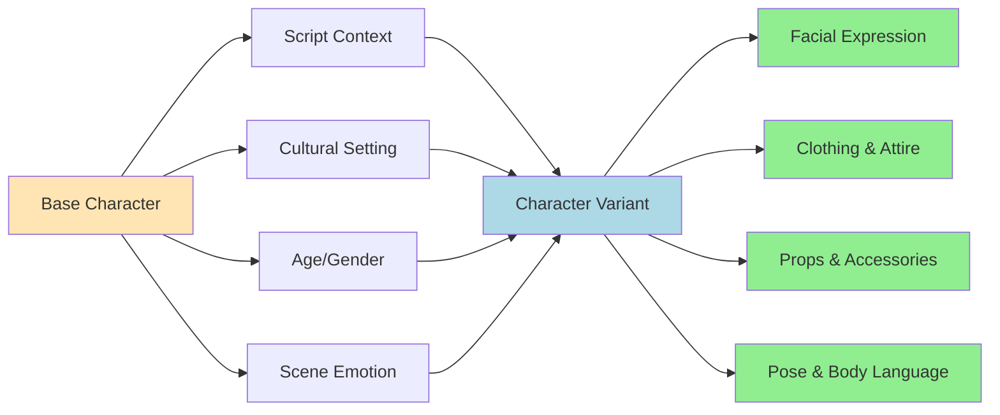
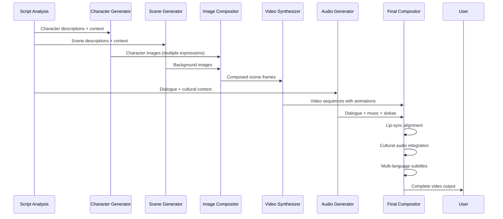

# Image Generation Workflow — Story & Cultural Context

**Version:** 1.0  
**Last Updated:** 2025-12-31  
**Document Owner:** AI-Empower-HQ-360

---

## Table of Contents

1. [Overview](#overview)
2. [Workflow Architecture](#workflow-architecture)
3. [Script Analysis](#script-analysis)
4. [Character Image Generation](#character-image-generation)
5. [Scene & Background Generation](#scene--background-generation)
6. [Cultural Context Integration](#cultural-context-integration)
7. [Integration with Video Pipeline](#integration-with-video-pipeline)
8. [Technical Implementation](#technical-implementation)
9. [Examples & Use Cases](#examples--use-cases)

---

## Overview

The AI Film Studio image generation pipeline is **fully dependent on story/script and cultural context**. This is a core part of the AI workflow that ensures dynamic, contextually-aware visual content generation. Unlike static image generation systems, our pipeline adapts to:

- **Story narrative and context**
- **Character roles and relationships**
- **Cultural settings and traditions**
- **Scene requirements and emotions**
- **Timeline and story progression**

### Key Principles

✅ **Dynamic Generation** — Same characters + different scripts = unique videos  
✅ **Cultural Adaptation** — Visuals reflect region, ethnicity, and traditions  
✅ **Story Consistency** — All generated assets align with narrative context  
✅ **Hierarchical Dependencies** — Script → Story Context → Characters → Scenes → Video

---

## Workflow Architecture



---

## Script Analysis

### 1.1 Input Processing

The AI analyzes the user-provided script to extract comprehensive story information:

**Script Components Analyzed:**
```yaml
Narrative Elements:
  - Scene descriptions and settings
  - Character names and roles
  - Dialogue and emotions
  - Actions and events
  - Temporal progression

Contextual Information:
  - Genre (drama, comedy, action, etc.)
  - Setting (modern, historical, fantasy)
  - Cultural indicators (language, traditions, festivals)
  - Geographical location
  - Time period
```

### 1.2 Story Setting Inference

The system automatically infers story settings from script content:

**Inference Categories:**

| Setting Type | Examples | Detection Signals |
|-------------|----------|-------------------|
| **Cultural** | South Indian, Western, East Asian | Names, festivals, traditions mentioned |
| **Temporal** | Modern, Traditional, Futuristic | Technology references, clothing descriptions |
| **Geographical** | Urban, Rural, Coastal, Mountain | Location descriptions, environment cues |
| **Genre** | Fantasy, Realistic, Sci-Fi | Plot elements, character abilities |

**Example Script Analysis:**

```python
# Input Script
script = """
Scene 1: Village Temple Courtyard
Lakshmi walks towards the ancient temple during Pongal festival.
She wears a traditional silk saree with jasmine flowers in her hair.
The courtyard is decorated with colorful kolam patterns.

Lakshmi: "Namaste, grandmother. The harvest has been bountiful this year."
"""

# AI Analysis Output
{
  "setting": "South Indian village",
  "cultural_context": "South Indian traditional",
  "time_period": "Contemporary or recent past",
  "festival": "Pongal (harvest festival)",
  "location_type": "temple courtyard",
  "season": "harvest season",
  "characters": [
    {
      "name": "Lakshmi",
      "age": "young adult",
      "gender": "female",
      "cultural_markers": ["traditional attire", "jasmine flowers", "respectful language"]
    }
  ],
  "visual_elements": [
    "ancient temple architecture",
    "kolam patterns (rangoli)",
    "silk saree",
    "jasmine flowers",
    "harvest decorations"
  ]
}
```

### 1.3 Character Extraction

**Character Attributes Detected:**
- Name and role in story
- Age and gender
- Emotional state in each scene
- Relationships with other characters
- Cultural background indicators
- Actions and movements

---

## Character Image Generation

### 2.1 Character Creation Process

**Input Sources:**
1. **User-Uploaded Reference Images** (optional)
   - Face photos
   - Body type references
   - Style preferences

2. **AI-Generated Templates** (default)
   - Generated based on script description
   - Cultural phenotype matching
   - Age-appropriate features

### 2.2 Dynamic Character Adaptation

Characters are dynamically adapted based on multiple factors:



### 2.3 Cultural Clothing Adaptation

The system automatically selects appropriate attire based on cultural context:

**South Indian Context:**
```yaml
Traditional Settings:
  Female Characters:
    - Silk sarees (Kanchipuram, Mysore)
    - Jasmine flower garlands
    - Gold jewelry (temple jewelry style)
    - Bindi and kumkum
    - Traditional hairstyle with braids
  
  Male Characters:
    - Dhoti with angavastram
    - Kurta or shirt
    - Traditional jewelry (limited)
    - Sacred thread (if Brahmin context)

Modern Settings:
  Female Characters:
    - Contemporary saree styles
    - Salwar kameez
    - Western fusion wear
    - Minimal jewelry
  
  Male Characters:
    - Formal shirt and trousers
    - Casual modern wear
    - Western business attire
```

**Western Context:**
```yaml
Traditional Settings:
  - Victorian-era clothing
  - Medieval costumes
  - Folk traditional dress
  - Formal gowns and suits

Modern Settings:
  - Business casual
  - Contemporary fashion
  - Streetwear
  - Seasonal appropriate attire
```

### 2.4 Facial Expression & Emotion Mapping

Expressions are dynamically generated based on dialogue and scene context:

| Script Emotion | Facial Expression | Body Language | Cultural Considerations |
|---------------|-------------------|---------------|------------------------|
| Joy | Smile, bright eyes | Open posture, animated | Some cultures prefer subtle expressions |
| Respect | Slight bow, soft expression | Hands folded (namaste) | Varies by cultural norms |
| Sadness | Downcast eyes, tears | Slumped shoulders | Grief expressions differ culturally |
| Anger | Furrowed brows, tense jaw | Closed fists, rigid posture | Varies in acceptable display |
| Surprise | Wide eyes, open mouth | Stepped back | Universal but intensity varies |

---

## Scene & Background Generation

### 3.1 Background Generation Process

Backgrounds are generated to match the story context and cultural setting:

**Generation Pipeline:**
```yaml
Step 1: Scene Type Identification
  - Indoor vs Outdoor
  - Public vs Private space
  - Sacred vs Secular location
  - Time of day (lighting)

Step 2: Cultural Asset Selection
  - Architecture style
  - Decorative elements
  - Furniture and props
  - Natural environment features

Step 3: Lighting & Atmosphere
  - Time-based lighting (dawn, noon, dusk, night)
  - Weather conditions
  - Mood lighting (dramatic, soft, bright)
  - Cultural festival lighting

Step 4: Detail Enhancement
  - Cultural artifacts
  - Period-appropriate items
  - Story-specific props
  - Environmental storytelling
```

### 3.2 Cultural Scene Templates

**South Indian Cultural Scenes:**

```yaml
Temple Scenes:
  Architecture:
    - Dravidian temple gopurams
    - Carved stone pillars
    - Mandapam (hall) structures
    - Stone flooring with kolam
  
  Decorations:
    - Oil lamps (diyas)
    - Flower garlands
    - Colorful flags and banners
    - Incense smoke effects
  
  Ambient Elements:
    - Devotees in background
    - Temple bells
    - Sacred atmosphere lighting

Wedding Scenes:
  Decorations:
    - Marigold and mango leaf decorations
    - Traditional mandap setup
    - Brass lamps and vessels
    - Floral arrangements
  
  Props:
    - Wedding thali (mangalsutra)
    - Turmeric paste
    - Sacred fire (agni)
    - Banana leaves for rituals

Home Scenes:
  Interior:
    - Traditional wooden furniture
    - Brass vessels in display
    - Kolam at entrance
    - Photos of deities/ancestors
  
  Courtyard:
    - Open sky view
    - Tulsi plant (holy basil)
    - Traditional grinding stone
    - Clay pots and vessels

Festival Scenes (Pongal, Diwali, etc.):
  Decorations:
    - Colorful kolam patterns
    - Oil lamps (diyas) arrangement
    - Flower rangoli
    - Festive lighting
  
  Activities:
    - Traditional cooking pots
    - Sugarcane bundles
    - Fireworks (Diwali)
    - Community gathering
```

**Western Cultural Scenes:**

```yaml
Modern Urban:
  - Glass and steel architecture
  - Contemporary furniture
  - Tech devices
  - Minimalist decor

Traditional/Historical:
  - Stone buildings
  - Period-appropriate furniture
  - Historical artifacts
  - Era-specific props

Rural/Countryside:
  - Wooden structures
  - Natural materials
  - Agricultural elements
  - Rustic aesthetics
```

### 3.3 Prop Generation

Props are automatically included based on scene requirements:

**Dynamic Prop Selection:**
```python
# Example: South Indian Wedding Scene
scene_props = {
  "cultural_context": "South Indian wedding",
  "required_props": [
    "wedding thali (mangalsutra)",
    "turmeric paste and kumkum",
    "banana leaves",
    "brass vessels",
    "marigold flowers",
    "sacred fire setup",
    "traditional wedding tambulam (betel leaves)"
  ],
  "optional_props": [
    "traditional music instruments",
    "nadaswaram",
    "relatives in traditional attire",
    "gift items"
  ]
}
```

---

## Cultural Context Integration

### 4.1 Cultural Adaptation Matrix

The system maintains a cultural adaptation framework:

```yaml
Cultural Dimensions:
  Regional Identity:
    - South Indian (Tamil, Telugu, Malayalam, Kannada)
    - North Indian (Hindi, Punjabi, Bengali)
    - East Asian (Chinese, Japanese, Korean)
    - Western (American, European)
    - Middle Eastern
    - African cultures
  
  Religious Context:
    - Hindu traditions
    - Islamic traditions
    - Christian traditions
    - Buddhist traditions
    - Secular contexts
  
  Social Context:
    - Family gatherings
    - Religious ceremonies
    - Festivals and celebrations
    - Daily life activities
    - Professional settings
```

### 4.2 Cultural Consistency Rules

**Consistency Enforcement:**

1. **Temporal Consistency**
   - Characters age appropriately across scenes
   - Clothing changes match story timeline
   - Environmental changes follow narrative

2. **Cultural Consistency**
   - All elements align with chosen cultural context
   - No mixing of incompatible cultural elements
   - Respect for cultural sensitivities

3. **Story Consistency**
   - Characters maintain visual identity
   - Locations remain recognizable
   - Props and assets appear consistently

4. **Aesthetic Consistency**
   - Unified visual style across scenes
   - Consistent color palette for story mood
   - Lighting style matches genre

### 4.3 Cultural Sensitivity Guidelines

**Implemented Safeguards:**
```yaml
Religious Symbols:
  - Accurate representation of sacred items
  - Respectful placement and context
  - Avoid misuse or disrespect

Traditional Attire:
  - Culturally accurate clothing
  - Context-appropriate dress
  - Gender-appropriate attire

Gestures & Body Language:
  - Culturally appropriate gestures
  - Avoid offensive hand signs
  - Respect personal space norms

Sacred Spaces:
  - Accurate architectural representation
  - Respectful depiction of rituals
  - Proper placement of religious elements
```

---

## Integration with Video Pipeline

### 5.1 Video Generation Workflow

Generated images feed into the complete video synthesis pipeline:



### 5.2 Pipeline Integration Details

**Stage 1: Image Composition**
```yaml
Input:
  - Character images (multiple poses/expressions)
  - Scene backgrounds
  - Props and assets
  - Lighting information

Process:
  - Compose characters into scenes
  - Apply depth and perspective
  - Add shadows and lighting effects
  - Insert props at correct positions

Output:
  - Composed scene frames (1024x576 or higher)
```

**Stage 2: Video Synthesis**
```yaml
Models Used:
  - Stable Video Diffusion (SVD)
  - Gen-2 (Runway ML)
  - CogVideo
  - AnimateDiff

Process:
  - Convert static images to video sequences
  - Apply smooth transitions between frames
  - Generate natural movements and animations
  - Apply camera movements (pan, zoom, etc.)

Settings:
  - Frame Rate: 24 fps
  - Duration: 2-5 seconds per clip
  - Resolution: 1024x576 (HD-ready)
```

**Stage 3: Lip-Sync & Animation**
```yaml
Dialogue Synchronization:
  - Extract dialogue from script
  - Generate phoneme timing
  - Apply lip movements to character
  - Match cultural speaking styles

Animation:
  - Natural head movements
  - Eye blinks and expressions
  - Hand gestures (culturally appropriate)
  - Body language matching emotion
```

**Stage 4: Audio Integration**
```yaml
Audio Elements:
  Dialogue:
    - Multi-language support
    - Cultural accent adaptation
    - Emotion-based voice modulation
  
  Music:
    - Cultural music selection
    - Background scores
    - Traditional instruments (for cultural contexts)
  
  Slokas & Chants:
    - Sanskrit slokas (Hindu context)
    - Religious chants
    - Cultural ceremonial sounds
  
  Sound Effects:
    - Environmental sounds
    - Cultural-specific sounds (temple bells, etc.)
    - Action-based effects
```

**Stage 5: Subtitle Generation**
```yaml
Multi-Language Support:
  - Source language (script language)
  - Translation to target languages
  - Cultural idiom adaptation
  - Proper name handling

Subtitle Styling:
  - Font selection (readable, culturally appropriate)
  - Positioning (bottom or top based on scene)
  - Timing synchronization
  - Color contrast for visibility
```

### 5.3 Dynamic Generation Examples

**Example 1: Same Characters, Different Stories**

```yaml
Scenario A: South Indian Wedding
Script: "Lakshmi and Raj meet at a traditional wedding ceremony"
Generated Output:
  - Characters: Traditional wedding attire
  - Scene: Temple wedding mandap
  - Props: Wedding thali, sacred fire
  - Music: Traditional wedding songs
  - Atmosphere: Celebratory, sacred

Scenario B: Modern Office
Script: "Lakshmi and Raj discuss project deadline at office"
Generated Output:
  - Characters: Business casual attire (same faces)
  - Scene: Modern office with computers
  - Props: Laptops, coffee cups, documents
  - Music: Subtle background music
  - Atmosphere: Professional, focused
```

**Result:** Same character identities, completely different visual context based on script.

---

## Technical Implementation

### 6.1 AI Models Used

**Image Generation Stack:**
```yaml
Primary Models:
  Base Image Generation:
    - Model: Stable Diffusion XL (SDXL)
    - Resolution: 1024x1024
    - Custom LoRA: Film production fine-tuning
    - Steps: 30-50 (quality vs speed balance)
  
  Character Consistency:
    - Model: Custom trained LoRA models
    - Face preservation: IP-Adapter + InstantID
    - Expression control: ControlNet
  
  Scene Generation:
    - Model: SDXL with custom LoRA
    - Architectural accuracy: ControlNet (depth, canny)
    - Cultural accuracy: Custom embeddings
  
  Animation:
    - Model: AnimateDiff
    - Lip-sync: Wav2Lip or SadTalker
    - Motion: Custom motion modules

Video Synthesis:
  - Stable Video Diffusion (SVD)
  - CogVideoX
  - Gen-2 (Runway ML API)

Audio Generation:
  - Voice: ElevenLabs / Coqui TTS
  - Music: AudioCraft / MusicGen
  - Cultural instruments: Custom samples
```

### 6.2 Processing Pipeline

**GPU Requirements:**
```yaml
Hardware:
  - GPU: NVIDIA T4 (16GB) or better
  - VRAM: Minimum 16GB for SDXL
  - Instance: AWS g4dn.xlarge or equivalent

Processing Time (per scene):
  - Script analysis: 2-5 seconds
  - Character generation: 15-30 seconds
  - Scene generation: 15-30 seconds
  - Video synthesis: 60-120 seconds
  - Audio generation: 10-20 seconds
  - Final composition: 20-40 seconds
  
Total: 3-5 minutes per 5-second video clip
```

### 6.3 API Integration

**Internal API Flow:**
```python
# Simplified API flow
POST /api/v1/projects/{project_id}/generate
{
  "script": "Scene description with dialogue...",
  "cultural_preferences": {
    "region": "South Indian",
    "style": "traditional",
    "language": "Tamil"
  },
  "character_references": [
    {
      "name": "Lakshmi",
      "image_url": "https://s3.../reference.jpg" // optional
    }
  ]
}

# Backend processing
1. Enqueue job to SQS
2. Worker picks up job
3. Script analysis → Extract context
4. Generate characters → With cultural adaptation
5. Generate scenes → With cultural elements
6. Compose images → Into video frames
7. Apply animations → Lip-sync, movements
8. Add audio → Dialogue, music, effects
9. Generate subtitles → Multi-language
10. Upload to S3 → Final video
11. Update job status → Complete
```

---

## Examples & Use Cases

### 7.1 Use Case: South Indian Festival Film

**Script:**
```
Title: Pongal Celebration

Scene 1: Village Square - Morning
The village square is decorated with colorful kolam patterns.
Villagers gather with pots of freshly cooked pongal.

Meera (young woman in traditional saree): 
"Look! The pongal is overflowing! This year will bring prosperity."

Grandmother: "Yes, child. May the harvest god bless us all."

Scene 2: Temple Visit
The family walks to the ancient temple carrying offerings.
Temple bells ring as they approach the gopuram.
```

**Generated Output:**
```yaml
Characters:
  Meera:
    - Traditional silk saree (bright colors)
    - Jasmine flowers in hair
    - Gold jewelry (traditional style)
    - Joyful expression
    - Young adult features
  
  Grandmother:
    - White or light-colored saree
    - Simple jewelry
    - Kind, wise expression
    - Elderly features with dignity

Scenes:
  Village Square:
    - Colorful kolam patterns on ground
    - Clay pots with pongal (rice dish)
    - Decorated with sugarcane stalks
    - Morning sunlight, festive atmosphere
    - Other villagers in background
  
  Temple:
    - Dravidian architecture gopuram
    - Stone pillars with carvings
    - Temple bells visible
    - Devotees in background
    - Sacred atmosphere with incense

Audio:
  - Dialogue in Tamil with subtitles
    - Traditional Pongal songs in background
  - Temple bell sounds
  - Morning nature sounds

Cultural Elements:
  - Accurate Pongal festival representation
  - Traditional attire appropriate to Tamil culture
  - Correct temple architecture
  - Respectful depiction of rituals
```

### 7.2 Use Case: Modern Corporate Story

**Script:**
```
Title: The Pitch

Scene 1: Conference Room
Sarah presents the quarterly results to the board.
Charts and graphs illuminate the screen behind her.

Sarah: "Our Q3 revenue exceeded projections by 23%."

Board Member: "Impressive work, Sarah."
```

**Generated Output:**
```yaml
Characters:
  Sarah:
    - Business professional attire
    - Confident posture
    - Gesturing towards screen
    - Professional makeup
  
  Board Members:
    - Diverse business attire
    - Seated around table
    - Attentive expressions

Scene:
  Conference Room:
    - Modern office interior
    - Large screen with presentation
    - Conference table
    - Professional lighting
    - Windows showing city skyline

Audio:
  - Clear English dialogue
  - Subtle office ambience
  - Professional tone

Cultural Elements:
  - Western corporate culture
  - Professional environment
  - Modern business setting
```

### 7.3 Use Case: Fantasy Adventure

**Script:**
```
Title: The Enchanted Forest

Scene 1: Mystical Forest
Aria, an elven warrior, draws her bow as shadows approach.
Ancient trees glow with bioluminescent patterns.

Aria: "Show yourself, creature of darkness!"
```

**Generated Output:**
```yaml
Characters:
  Aria:
    - Elven features (pointed ears)
    - Warrior outfit with fantasy elements
    - Determined expression
    - Bow and arrows
    - Fantasy-style clothing

Scene:
  Enchanted Forest:
    - Ancient trees with glowing patterns
    - Mystical atmosphere
    - Fog and magical lighting effects
    - Fantasy flora and fauna
    - Dramatic lighting

Audio:
  - Epic fantasy music
  - Mysterious forest sounds
  - Magical sound effects

Cultural Elements:
  - Fantasy genre conventions
  - Mythological inspirations
  - Epic adventure aesthetic
```

---

## Conclusion

The AI Film Studio image generation workflow is a sophisticated, context-aware system that ensures:

✅ **Dynamic content** based on script narrative  
✅ **Cultural accuracy** and sensitivity  
✅ **Story consistency** across all visual elements  
✅ **Character continuity** with adaptive expressions and attire  
✅ **Scene coherence** with appropriate backgrounds and props  
✅ **Seamless integration** with video, audio, and subtitle generation

This hierarchical, dependency-driven approach guarantees that every generated film respects the story context, cultural authenticity, and artistic vision specified in the script.

---

**Document Revision History**

| Version | Date       | Author                 | Changes                          |
|---------|------------|------------------------|----------------------------------|
| 1.0     | 2025-12-31 | AI-Empower-HQ-360      | Initial workflow documentation   |

---

**End of Document**
