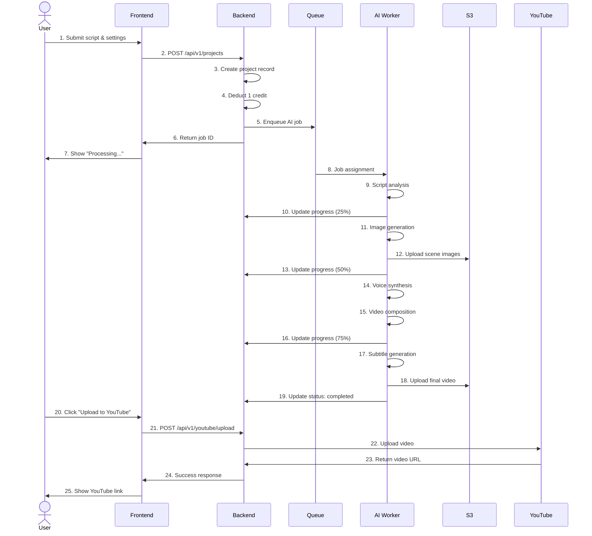

# AI FILM STUDIO – MASTER BLUEPRINT

**Version:** 1.0  
**Last Updated:** 2025-12-31  
**Document Owner:** AI-Empower-HQ-360

---

## Table of Contents

1. [Architecture Overview](#architecture-overview)
2. [Layer Specifications](#layer-specifications)
3. [Data Flow](#data-flow)
4. [Technology Stack](#technology-stack)
5. [Integration Points](#integration-points)

---

## Architecture Overview

```
┌───────────────👤───────────────┐
│         USER LAYER (Blue)      │
│ Script | Images | Voice | Music │
│ Duration | YouTube Credentials │
└───────────────┬───────────────┘
                │
                ▼
┌───────────────💻───────────────┐
│      FRONTEND LAYER (Light Blue)│
│ React + Next.js                │
│ TailwindCSS / Material UI      │
│ Forms & Dropdowns              │
│ Video / Audio Preview          │
│ Multi-language support         │
└───────────────┬───────────────┘
                │ API Requests
                ▼
┌───────────────⚙️───────────────┐
│ BACKEND MICROSERVICES (Green)  │
│ Node.js / NestJS               │
│ Microservices: User, Project,  │
│ Credits, AI Job, YouTube, Admin│
│ Async Job Queue: Redis / BullMQ│
│ Auth: JWT / OAuth 2.0          │
└───────────────┬───────────────┘
                │
   ┌────────────┼────────────┐
   ▼            ▼            ▼
┌───────🗄️───────┐ ┌──────🗄️───────┐ ┌────────🗄️────────┐
│ DATABASE       │ │ CACHE          │ │ STORAGE            │
│ PostgreSQL     │ │ Redis /        │ │ AWS S3 / CloudFront│
│ Users, Projects│ │ ElastiCache    │ │ Videos, Images     │
│ Credits, Logs  │ │ Job Queue      │ │ Subtitles, Thumbnails│
└───────────────┘ └───────────────┘ └────────────────────┘
                │
                ▼
┌───────────────🤖───────────────┐
│ AI / ML LAYER (Orange)         │
│ 1. Script Analysis             │
│ 2. Image Generation            │
│ 3. Voice Synthesis             │
│ 4. Lip-sync / Animation        │
│ 5. Music / Slokas / Poems      │
│ 6. Podcast Overlay             │
│ 7. Subtitles / Multi-language  │
└───────────────┬───────────────┘
                │ GPU / CPU
                ▼
┌───────────────☁️───────────────┐
│ CLOUD / INFRASTRUCTURE (Purple) │
│ AWS EC2 GPU                    │
│ ECS / Kubernetes               │
│ Terraform (IaC)                │
│ RDS (Postgres/MySQL)           │
│ S3 + CloudFront                │
│ Redis / ElastiCache            │
│ Monitoring: CloudWatch, Grafana│
│ Environments: Dev/Sandbox/Prod│
└───────────────┬───────────────┘
                │
                ▼
┌───────────────📊───────────────┐
│ SALESFORCE CRM LAYER (Light Green)│
│ Contacts → Users               │
│ AI_Project__c → Projects       │
│ AI_Credit__c → Credits         │
│ YouTube_Integration__c         │
│ Flows / Apex (status, credits) │
│ Dashboards & Reports           │
└───────────────┬───────────────┘
                │
                ▼
┌───────────────▶️───────────────┐
│ YOUTUBE / OUTPUT LAYER (Red)   │
│ Video Upload (direct)          │
│ Playlist Creation              │
│ Thumbnail Generation           │
│ Download Option                │
│ Duration: 1–5 min              │
└───────────────────────────────┘
```

---

## Layer Specifications

### 1. USER LAYER 👤

**Purpose:** User input interface and interaction point

**Components:**
- **Script Input:** Text area for film script (max 500 words)
- **Image Upload:** Support for reference images and storyboards
- **Voice Selection:** Choose voice type, accent, language
- **Music Selection:** Background music, slokas, poems options
- **Duration Settings:** 1-5 minute video duration control
- **YouTube Credentials:** OAuth integration for direct upload

**User Roles:**
- **Guest:** View landing page
- **Free User:** 3 films/month, watermarked
- **Pro User:** 30 films/month, no watermark
- **Enterprise User:** Unlimited films, priority queue
- **Admin:** Full system access

---

### 2. FRONTEND LAYER 💻

**Technology Stack:**
- **Framework:** React 18+ with Next.js 14+
- **Styling:** TailwindCSS + Material UI
- **State Management:** Zustand / React Context
- **API Client:** Axios with interceptors
- **Language Support:** i18next for multi-language

**Key Features:**
```yaml
Forms & Dropdowns:
  - Project creation form
  - AI generation settings
  - User profile management
  - Credit purchase interface

Video / Audio Preview:
  - Real-time preview player
  - Timeline scrubbing
  - Quality selection (360p, 720p, 1080p)
  - Subtitle overlay preview

Multi-language Support:
  - English (default)
  - Spanish
  - French
  - Hindi
  - More languages via i18next
```

**Key Pages:**
```
/                    - Landing page
/auth/login          - Login page
/auth/register       - Registration page
/dashboard           - User dashboard
/projects            - Project list
/projects/new        - Create new project
/projects/:id        - Project details
/projects/:id/edit   - Edit project
/generate            - AI generation interface
/settings            - User settings
/admin               - Admin dashboard
```

---

### 3. BACKEND MICROSERVICES LAYER ⚙️

**Architecture:** Microservices pattern with Node.js/NestJS

#### 3.1 User Service

**Responsibilities:**
- User registration and authentication
- Profile management
- JWT token generation and validation
- OAuth 2.0 integration (Google, GitHub)
- Password reset and email verification

**API Endpoints:**
```
POST   /api/v1/auth/register
POST   /api/v1/auth/login
POST   /api/v1/auth/logout
POST   /api/v1/auth/refresh
POST   /api/v1/auth/forgot-password
GET    /api/v1/users/me
PATCH  /api/v1/users/me
DELETE /api/v1/users/me
```

#### 3.2 Project Service

**Responsibilities:**
- CRUD operations for film projects
- Project versioning
- Script validation
- Project sharing and collaboration

**API Endpoints:**
```
GET    /api/v1/projects
POST   /api/v1/projects
GET    /api/v1/projects/:id
PATCH  /api/v1/projects/:id
DELETE /api/v1/projects/:id
POST   /api/v1/projects/:id/duplicate
GET    /api/v1/projects/:id/versions
```

#### 3.3 Credits Service

**Responsibilities:**
- Credit balance management
- Credit deduction and addition
- Quota enforcement
- Usage analytics
- Payment integration (Stripe)

**API Endpoints:**
```
GET    /api/v1/credits/balance
GET    /api/v1/credits/history
POST   /api/v1/credits/purchase
POST   /api/v1/credits/deduct
POST   /api/v1/credits/grant (admin only)
```

#### 3.4 AI Job Service

**Responsibilities:**
- Job queue management (Redis/BullMQ)
- Job status tracking
- Progress updates via WebSocket
- Error handling and retry logic
- Job prioritization

**API Endpoints:**
```
POST   /api/v1/jobs/submit
GET    /api/v1/jobs/:id
GET    /api/v1/jobs/:id/status
GET    /api/v1/jobs/:id/progress
DELETE /api/v1/jobs/:id/cancel
GET    /api/v1/jobs (list user jobs)
```

**Job Queue Architecture:**
```yaml
Queue System: Redis + BullMQ
Job Types:
  - script_analysis
  - image_generation
  - voice_synthesis
  - video_composition
  - subtitle_generation
  - thumbnail_generation

Job States:
  - queued
  - processing
  - completed
  - failed
  - cancelled

Priority Levels:
  - high (enterprise users)
  - normal (pro users)
  - low (free users)
```

#### 3.5 YouTube Service

**Responsibilities:**
- YouTube API integration
- Video upload automation
- Playlist creation and management
- Thumbnail upload
- Video metadata management

**API Endpoints:**
```
POST   /api/v1/youtube/connect
POST   /api/v1/youtube/upload
GET    /api/v1/youtube/status/:videoId
POST   /api/v1/youtube/playlists
GET    /api/v1/youtube/playlists
POST   /api/v1/youtube/playlists/:id/add-video
```

#### 3.6 Admin Service

**Responsibilities:**
- User management
- System monitoring
- Content moderation
- Analytics and reporting
- System configuration

**API Endpoints:**
```
GET    /api/v1/admin/users
PATCH  /api/v1/admin/users/:id/suspend
GET    /api/v1/admin/stats
GET    /api/v1/admin/jobs
GET    /api/v1/admin/moderation/queue
POST   /api/v1/admin/moderation/approve/:id
POST   /api/v1/admin/moderation/reject/:id
```

---

### 4. DATABASE LAYER 🗄️

**Primary Database:** PostgreSQL 15+

#### Database Schema

```sql
-- Users table
CREATE TABLE users (
    id UUID PRIMARY KEY DEFAULT gen_random_uuid(),
    email VARCHAR(255) UNIQUE NOT NULL,
    password_hash VARCHAR(255) NOT NULL,
    tier VARCHAR(50) NOT NULL DEFAULT 'free', -- free, pro, enterprise
    credits INTEGER NOT NULL DEFAULT 3,
    credit_reset_date TIMESTAMP NOT NULL,
    created_at TIMESTAMP NOT NULL DEFAULT CURRENT_TIMESTAMP,
    updated_at TIMESTAMP NOT NULL DEFAULT CURRENT_TIMESTAMP,
    last_login_at TIMESTAMP,
    is_active BOOLEAN NOT NULL DEFAULT true,
    email_verified BOOLEAN NOT NULL DEFAULT false
);

-- Projects table
CREATE TABLE projects (
    id UUID PRIMARY KEY DEFAULT gen_random_uuid(),
    user_id UUID NOT NULL REFERENCES users(id) ON DELETE CASCADE,
    title VARCHAR(255) NOT NULL,
    script TEXT NOT NULL,
    status VARCHAR(50) NOT NULL DEFAULT 'draft', -- draft, processing, completed, failed
    style VARCHAR(50), -- cinematic, anime, documentary, etc.
    duration INTEGER, -- target duration in seconds
    thumbnail_url TEXT,
    output_url TEXT,
    created_at TIMESTAMP NOT NULL DEFAULT CURRENT_TIMESTAMP,
    updated_at TIMESTAMP NOT NULL DEFAULT CURRENT_TIMESTAMP,
    deleted_at TIMESTAMP
);

-- Jobs table
CREATE TABLE jobs (
    id UUID PRIMARY KEY DEFAULT gen_random_uuid(),
    project_id UUID NOT NULL REFERENCES projects(id) ON DELETE CASCADE,
    user_id UUID NOT NULL REFERENCES users(id) ON DELETE CASCADE,
    type VARCHAR(50) NOT NULL, -- script_analysis, image_gen, voice_gen, etc.
    status VARCHAR(50) NOT NULL DEFAULT 'queued',
    progress INTEGER NOT NULL DEFAULT 0, -- 0-100
    current_step VARCHAR(255),
    parameters JSONB,
    result JSONB,
    output_url TEXT,
    error_message TEXT,
    priority INTEGER NOT NULL DEFAULT 1, -- 1=low, 2=normal, 3=high
    started_at TIMESTAMP,
    completed_at TIMESTAMP,
    created_at TIMESTAMP NOT NULL DEFAULT CURRENT_TIMESTAMP
);

-- Credit transactions table
CREATE TABLE credit_transactions (
    id UUID PRIMARY KEY DEFAULT gen_random_uuid(),
    user_id UUID NOT NULL REFERENCES users(id) ON DELETE CASCADE,
    type VARCHAR(50) NOT NULL, -- deduction, purchase, grant, refund
    amount INTEGER NOT NULL, -- positive for addition, negative for deduction
    balance_after INTEGER NOT NULL,
    description TEXT,
    metadata JSONB,
    created_at TIMESTAMP NOT NULL DEFAULT CURRENT_TIMESTAMP
);

-- YouTube integrations table
CREATE TABLE youtube_integrations (
    id UUID PRIMARY KEY DEFAULT gen_random_uuid(),
    user_id UUID NOT NULL REFERENCES users(id) ON DELETE CASCADE,
    channel_id VARCHAR(255) NOT NULL,
    channel_name VARCHAR(255),
    access_token TEXT NOT NULL,
    refresh_token TEXT NOT NULL,
    token_expires_at TIMESTAMP NOT NULL,
    created_at TIMESTAMP NOT NULL DEFAULT CURRENT_TIMESTAMP,
    updated_at TIMESTAMP NOT NULL DEFAULT CURRENT_TIMESTAMP
);

-- YouTube uploads table
CREATE TABLE youtube_uploads (
    id UUID PRIMARY KEY DEFAULT gen_random_uuid(),
    project_id UUID NOT NULL REFERENCES projects(id) ON DELETE CASCADE,
    user_id UUID NOT NULL REFERENCES users(id) ON DELETE CASCADE,
    video_id VARCHAR(255) NOT NULL,
    video_title VARCHAR(255) NOT NULL,
    video_url TEXT NOT NULL,
    status VARCHAR(50) NOT NULL, -- uploading, processing, live, failed
    playlist_id VARCHAR(255),
    created_at TIMESTAMP NOT NULL DEFAULT CURRENT_TIMESTAMP,
    updated_at TIMESTAMP NOT NULL DEFAULT CURRENT_TIMESTAMP
);

-- Create indexes
CREATE INDEX idx_projects_user_id ON projects(user_id);
CREATE INDEX idx_projects_status ON projects(status);
CREATE INDEX idx_jobs_project_id ON jobs(project_id);
CREATE INDEX idx_jobs_user_id ON jobs(user_id);
CREATE INDEX idx_jobs_status ON jobs(status);
CREATE INDEX idx_credit_transactions_user_id ON credit_transactions(user_id);
CREATE INDEX idx_youtube_integrations_user_id ON youtube_integrations(user_id);
CREATE INDEX idx_youtube_uploads_project_id ON youtube_uploads(project_id);
```

---

### 5. CACHE LAYER 🗄️

**Technology:** Redis / ElastiCache

**Use Cases:**
```yaml
Session Storage:
  - JWT token blacklist
  - User sessions
  - TTL: 24 hours

API Response Caching:
  - User profile data
  - Project lists
  - Credit balance
  - TTL: 5 minutes

Job Queue:
  - BullMQ job queue
  - Job progress updates
  - Real-time notifications

Rate Limiting:
  - API rate limits per user
  - Login attempt tracking
  - Generation request throttling

Real-time Data:
  - Job status updates
  - WebSocket message queue
  - Live progress tracking
```

**Cache Keys Pattern:**
```
user:{userId}:profile
user:{userId}:credits
project:{projectId}
job:{jobId}:status
job:{jobId}:progress
ratelimit:{userId}:{endpoint}
session:{sessionId}
```

---

### 6. STORAGE LAYER 🗄️

**Technology:** AWS S3 + CloudFront CDN

#### S3 Bucket Structure

```
ai-film-studio-{env}/
├── users/
│   └── {userId}/
│       ├── avatar/
│       ├── uploads/
│       └── projects/
│           └── {projectId}/
│               ├── script.txt
│               ├── raw/
│               │   ├── images/
│               │   ├── audio/
│               │   └── video/
│               ├── generated/
│               │   ├── scenes/
│               │   ├── audio/
│               │   ├── subtitles/
│               │   └── thumbnails/
│               └── final/
│                   ├── {projectId}-720p.mp4
│                   ├── {projectId}-1080p.mp4
│                   └── {projectId}-thumbnail.jpg
└── public/
    ├── assets/
    └── templates/
```

**S3 Configuration:**
```yaml
Versioning: Enabled
Encryption: AES-256 (SSE-S3)
Lifecycle Rules:
  - Transition to IA after 30 days
  - Transition to Glacier after 90 days
  - Delete after 365 days (optional)
CORS: Enabled for frontend uploads
Access: Private (presigned URLs)
```

**CloudFront Configuration:**
```yaml
Origin: S3 bucket
SSL/TLS: ACM certificate
Caching: Optimized for static assets
Compression: Enabled (Gzip, Brotli)
Edge Locations: Global
TTL: 
  - Default: 86400 (1 day)
  - Max: 31536000 (1 year)
  - Min: 0
```

---

### 7. AI/ML LAYER 🤖

**GPU Infrastructure:** AWS EC2 g4dn.xlarge (NVIDIA T4)

#### 7.1 Script Analysis Service

**Functionality:**
- Scene extraction from script
- Character identification
- Setting and mood detection
- Shot planning and composition
- Dialogue extraction

**Technology:**
```python
Model: GPT-4 / Claude 3.5 Sonnet
Input: Raw script text
Output: Structured scene breakdown (JSON)
```

**Example Output:**
```json
{
  "scenes": [
    {
      "scene_number": 1,
      "description": "A sunset beach with calm waves",
      "characters": ["John", "Sarah"],
      "dialogue": "Hello, how are you?",
      "mood": "peaceful",
      "duration": 15,
      "shot_type": "wide"
    }
  ]
}
```

#### 7.2 Image Generation Service

**Functionality:**
- Scene image generation from descriptions
- Style transfer (cinematic, anime, photorealistic)
- Character consistency across scenes
- Background generation

**Technology:**
```python
Model: Stable Diffusion XL 1.0
Fine-tuning: Custom LoRA models
Resolution: 1024x1024 → 1920x1080
Steps: 30-50
Guidance Scale: 7-9
```

**Prompt Engineering:**
```python
prompt_template = """
{scene_description}, {mood}, {style}, 
professional cinematography, high quality, 
detailed, 8k resolution
"""
```

#### 7.3 Voice Synthesis Service

**Functionality:**
- Text-to-speech conversion
- Multi-language support
- Voice cloning (premium feature)
- Emotion and tone control

**Technology:**
```python
Models:
  - ElevenLabs API (primary)
  - Google Cloud TTS (fallback)
  - Coqui TTS (local, open-source)

Languages: English, Spanish, French, Hindi, etc.
Voice Types: Male, Female, Child, Narrator
Formats: WAV, MP3, OGG
```

#### 7.4 Lip-sync / Animation Service

**Functionality:**
- Lip-sync video generation
- Character animation
- Facial expression mapping

**Technology:**
```python
Models:
  - Wav2Lip (lip-sync)
  - Sadtalker (facial animation)
  - D-ID API (commercial option)

Input: Audio + static image
Output: Animated video with lip-sync
```

#### 7.5 Music / Slokas / Poems Generation

**Functionality:**
- Background music generation
- Cultural content (slokas, poems)
- Mood-based music selection
- Audio mixing and mastering

**Technology:**
```python
Models:
  - MusicGen (Meta)
  - AudioCraft
  - Stable Audio

Input: Mood, genre, duration
Output: WAV/MP3 audio file
```

#### 7.6 Podcast Overlay Service

**Functionality:**
- Audio overlay and mixing
- Volume normalization
- Audio effects (reverb, eq)
- Multi-track audio composition

**Technology:**
```python
Libraries:
  - FFmpeg
  - PyDub
  - librosa

Features:
  - Auto-ducking
  - Crossfade
  - Noise reduction
```

#### 7.7 Subtitle Generation Service

**Functionality:**
- Auto-transcription
- Subtitle timing and positioning
- Multi-language translation
- Subtitle formatting (SRT, VTT)

**Technology:**
```python
Models:
  - Whisper (OpenAI) for transcription
  - Google Translate API for translation
  - Custom subtitle formatter

Languages: 50+ languages supported
Formats: SRT, VTT, ASS
```

---

### 8. CLOUD INFRASTRUCTURE LAYER ☁️

**Cloud Provider:** AWS

#### Infrastructure Components

```yaml
Compute:
  - ECS Fargate: Backend microservices (2-10 tasks)
  - EC2 g4dn.xlarge: GPU workers (0-20 instances)
  - Lambda: Serverless functions (thumbnail gen, notifications)

Database:
  - RDS PostgreSQL: Multi-AZ deployment
  - ElastiCache Redis: Cache and job queue

Storage:
  - S3: Media and asset storage
  - EBS: Instance storage

Network:
  - VPC: 10.0.0.0/16
  - Public subnets: 10.0.1.0/24, 10.0.2.0/24
  - Private subnets: 10.0.10.0/24, 10.0.11.0/24
  - ALB: Application Load Balancer
  - CloudFront: CDN

Security:
  - WAF: Web Application Firewall
  - IAM: Identity and Access Management
  - Secrets Manager: API keys and credentials
  - KMS: Encryption keys

Monitoring:
  - CloudWatch: Logs, metrics, alarms
  - X-Ray: Distributed tracing
  - Grafana: Custom dashboards (optional)
```

#### Terraform Structure

```
infrastructure/
└── terraform/
    ├── modules/
    │   ├── vpc/
    │   ├── ecs/
    │   ├── rds/
    │   ├── s3/
    │   ├── redis/
    │   └── monitoring/
    └── environments/
        ├── dev/
        ├── sandbox/
        └── prod/
```

---

### 9. SALESFORCE CRM LAYER 📊

**Integration Purpose:** Customer relationship and project tracking

#### Custom Objects

**1. AI_Project__c**
```
Fields:
  - Project_ID__c (External ID)
  - Contact__c (Lookup to Contact)
  - Title__c (Text)
  - Status__c (Picklist: Draft, Processing, Completed, Failed)
  - Script__c (Long Text Area)
  - Output_URL__c (URL)
  - Created_Date__c (Date/Time)
  - Duration__c (Number)
```

**2. AI_Credit__c**
```
Fields:
  - Contact__c (Lookup to Contact)
  - Transaction_Type__c (Picklist: Deduction, Purchase, Grant)
  - Amount__c (Number)
  - Balance_After__c (Number)
  - Transaction_Date__c (Date/Time)
  - Description__c (Text)
```

**3. YouTube_Integration__c**
```
Fields:
  - Contact__c (Lookup to Contact)
  - Channel_ID__c (Text)
  - Channel_Name__c (Text)
  - Video_ID__c (Text)
  - Upload_Status__c (Picklist: Uploading, Processing, Live, Failed)
  - Upload_Date__c (Date/Time)
```

#### Salesforce Flows

**Flow 1: Project Status Update**
```
Trigger: When AI_Project__c.Status__c changes
Actions:
  - Send email notification to Contact
  - Create task for follow-up
  - Update related case (if exists)
```

**Flow 2: Credit Management**
```
Trigger: When AI_Credit__c is created
Actions:
  - Update Contact credit balance
  - Send low credit warning if < 5
  - Create renewal opportunity for free users
```

#### Apex Classes

```apex
public class ProjectService {
    @future(callout=true)
    public static void syncProjectFromAPI(String projectId) {
        // Sync project data from AI Film Studio API
    }
    
    public static void updateProjectStatus(String projectId, String status) {
        // Update project status in Salesforce
    }
}

public class CreditService {
    public static Integer getUserCredits(String contactId) {
        // Get current credit balance
    }
    
    public static void recordTransaction(String contactId, Integer amount, String type) {
        // Record credit transaction
    }
}
```

---

### 10. YOUTUBE / OUTPUT LAYER ▶️

**Purpose:** Final video delivery and YouTube integration

#### Features

**1. Video Upload (Direct)**
```yaml
Process:
  1. User connects YouTube account (OAuth 2.0)
  2. Select target channel and privacy settings
  3. Set title, description, tags
  4. Upload video directly from S3 to YouTube
  5. Track upload progress and status

YouTube API Scopes:
  - youtube.upload
  - youtube.readonly
  - youtube.force-ssl
```

**2. Playlist Creation**
```yaml
Features:
  - Create new playlists
  - Add videos to existing playlists
  - Organize videos by project or theme
  - Set playlist privacy (Public, Unlisted, Private)
```

**3. Thumbnail Generation**
```yaml
Process:
  1. Extract frame from video (at 30% duration)
  2. Apply AI enhancement (super-resolution)
  3. Add text overlay (title, branding)
  4. Generate multiple thumbnail options
  5. Auto-upload to YouTube

Specifications:
  - Resolution: 1280x720
  - Format: JPG
  - Size: < 2MB
  - Aspect Ratio: 16:9
```

**4. Download Option**
```yaml
Formats Available:
  - MP4 (720p) - Free users
  - MP4 (1080p) - Pro users
  - MP4 (4K) - Enterprise users
  - SRT subtitles (all users)

Download Methods:
  - Direct download (presigned S3 URL)
  - Email link (expires in 7 days)
  - Bulk download (zip archive)
```

**5. Duration Control**
```yaml
Minimum Duration: 30 seconds
Maximum Duration: 5 minutes
Default Duration: 60-90 seconds

Duration Presets:
  - Short (30-60s) - Social media
  - Medium (1-2min) - YouTube Shorts
  - Long (2-5min) - Standard YouTube
```

---

## Data Flow

### End-to-End Film Generation Flow



---

## Technology Stack

### Complete Technology Breakdown

```yaml
Frontend:
  Framework: Next.js 14+
  Language: TypeScript
  UI Library: React 18+
  Styling: TailwindCSS + Material UI
  State: Zustand
  API Client: Axios
  i18n: next-i18next

Backend:
  Runtime: Node.js 20+
  Framework: NestJS / Express
  Language: TypeScript
  API: RESTful + GraphQL
  WebSocket: Socket.io
  Queue: BullMQ + Redis
  Auth: Passport.js (JWT + OAuth)

Database:
  Primary: PostgreSQL 15+
  ORM: Prisma / TypeORM
  Migrations: Alembic / Prisma Migrate
  Cache: Redis 7+

AI/ML:
  Language: Python 3.11+
  Framework: PyTorch 2.0+
  Models:
    - GPT-4 / Claude (script analysis)
    - SDXL (image generation)
    - ElevenLabs (voice synthesis)
    - Whisper (transcription)
    - MusicGen (music generation)
  Processing: FFmpeg

Cloud:
  Provider: AWS
  IaC: Terraform
  Container: Docker + ECS/EKS
  CI/CD: GitHub Actions
  Monitoring: CloudWatch + Grafana

External APIs:
  - OpenAI API
  - ElevenLabs API
  - YouTube Data API v3
  - Stripe API (payments)
  - SendGrid API (emails)
  - Salesforce API

Development:
  Version Control: Git + GitHub
  Code Quality: ESLint, Prettier, Black
  Testing: Jest, Pytest, Playwright
  Documentation: Swagger/OpenAPI
```

---

## Integration Points

### Key Integration Specifications

#### 1. Frontend ↔ Backend
```yaml
Protocol: HTTPS (REST API)
Format: JSON
Auth: JWT Bearer token
Base URL: https://api.aifilmstudio.com/v1
Rate Limit: 100 req/min per user
```

#### 2. Backend ↔ Database
```yaml
Protocol: PostgreSQL wire protocol
Connection Pool: 10-100 connections
SSL: Required (TLS 1.2+)
Migrations: Automatic on deployment
```

#### 3. Backend ↔ Redis
```yaml
Protocol: Redis protocol
Connection: Redis client
Use Cases: Cache, Queue, Real-time
TTL: Variable (5min - 24hrs)
```

#### 4. Backend ↔ S3
```yaml
Protocol: AWS SDK (boto3)
Authentication: IAM role
Encryption: SSE-S3
Multipart Upload: For files > 100MB
Presigned URLs: 1 hour expiry
```

#### 5. Backend ↔ AI Workers
```yaml
Communication: Redis queue (BullMQ)
Message Format: JSON
Job Timeout: 10 minutes
Retry Policy: 3 attempts with exponential backoff
```

#### 6. Backend ↔ YouTube API
```yaml
Protocol: HTTPS (REST)
Authentication: OAuth 2.0
Scopes: youtube.upload, youtube.readonly
Rate Limit: 10,000 units/day
```

#### 7. Backend ↔ Salesforce
```yaml
Protocol: REST API
Authentication: OAuth 2.0 JWT Bearer
Sync Frequency: Real-time (webhooks)
Batch Size: 200 records
```

---

## Deployment Strategy

### Environment Configuration

```yaml
Development:
  Infrastructure: Minimal (1-2 instances)
  GPU Workers: 0-1 (on-demand)
  Database: db.t3.medium
  Cost: ~$300/month

Sandbox:
  Infrastructure: Medium (2-4 instances)
  GPU Workers: 1-2 (mixed spot/on-demand)
  Database: db.r6g.large
  Cost: ~$800/month

Production:
  Infrastructure: Full (4-10 instances)
  GPU Workers: 2-10 (70% spot, 30% on-demand)
  Database: db.r6g.xlarge (Multi-AZ)
  Cost: ~$2,600/month
```

### CI/CD Pipeline

```yaml
Stages:
  1. Code Push → GitHub
  2. Automated Tests (unit, integration)
  3. Security Scan (Snyk, Trivy)
  4. Docker Build → ECR
  5. Deploy to Dev (auto)
  6. Deploy to Sandbox (manual approval)
  7. Deploy to Prod (blue-green, manual)

Deployment Strategy:
  - Blue-green deployment for zero downtime
  - Canary releases for gradual rollout
  - Automated rollback on health check failure
```

---

## Security Considerations

```yaml
Authentication:
  - JWT with 15-minute expiry
  - Refresh tokens (7-day expiry)
  - MFA for admin accounts
  - OAuth 2.0 for third-party logins

Data Protection:
  - Encryption at rest (AES-256)
  - Encryption in transit (TLS 1.2+)
  - Database encryption (KMS)
  - Secrets in AWS Secrets Manager

Network Security:
  - VPC with private subnets
  - Security groups (least privilege)
  - WAF with OWASP rules
  - DDoS protection (AWS Shield)

Compliance:
  - GDPR compliant
  - CCPA compliant
  - SOC 2 Type II (planned)
  - Regular security audits
```

---

## Monitoring & Alerting

```yaml
Metrics:
  - API response time (p50, p95, p99)
  - Error rate by endpoint
  - Active users and sessions
  - Job queue depth
  - GPU utilization
  - Database connections
  - Cache hit rate

Alerts:
  Critical (P1):
    - Service down (< 5 min response)
    - Database unavailable
    - API error rate > 5%
  
  High (P2):
    - API latency > 500ms
    - Queue depth > 100
    - GPU worker failure
  
  Medium (P3):
    - Elevated error rate (2-5%)
    - Cache miss rate > 20%
    - Disk space > 80%

Dashboards:
  - System health dashboard
  - Business metrics dashboard
  - Cost monitoring dashboard
  - User activity dashboard
```

---

## Scalability Targets

```yaml
Users:
  - Current: 1,000 active users
  - 6 months: 5,000 active users
  - 12 months: 10,000+ active users

Performance:
  - API: 1,000 req/sec
  - Concurrent jobs: 50-100
  - Video generation: 2-5 minutes

Storage:
  - Initial: 1TB
  - Growth: 20TB/month
  - Max: 100TB (first year)

Availability:
  - Target: 99.9% uptime
  - RTO: < 4 hours
  - RPO: < 1 hour
```

---

**End of Master Blueprint**

---

**Document Control:**
- **Version:** 1.0
- **Status:** Approved
- **Next Review:** 2026-01-31
- **Owner:** AI-Empower-HQ-360 Engineering Team
