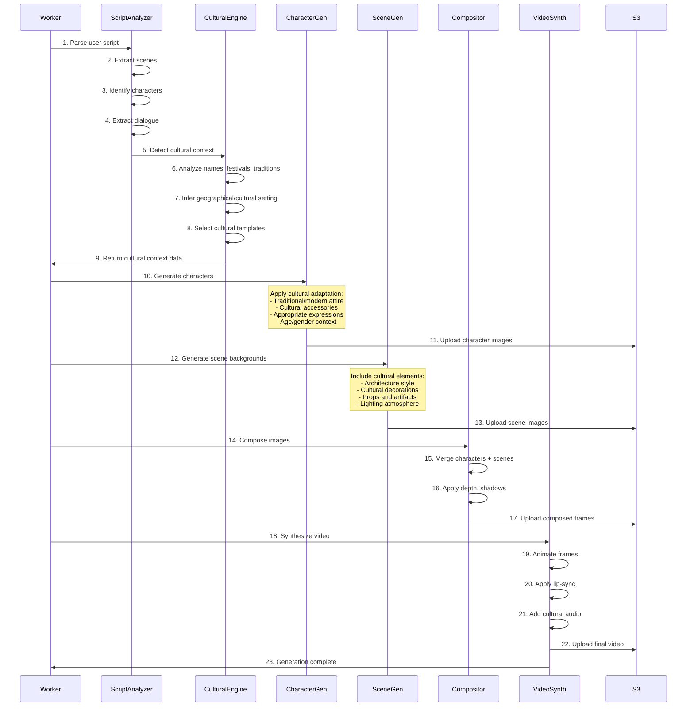

# System Design Document - AI Film Studio

**Version:** 1.1  
**Last Updated:** 2025-12-31  
**Document Owner:** AI-Empower-HQ-360

---

## Table of Contents

1. [Executive Summary](#executive-summary)
2. [High-Level Architecture](#high-level-architecture)
3. [Component Specifications](#component-specifications)
4. [Network Architecture](#network-architecture)
5. [Data Flow Diagrams](#data-flow-diagrams)
6. [Security Architecture](#security-architecture)
7. [Scaling Strategies](#scaling-strategies)
8. [Disaster Recovery Plan](#disaster-recovery-plan)
9. [Cost Breakdown](#cost-breakdown)
10. [Technology Stack](#technology-stack)

---

## Executive Summary

The AI Film Studio is a cloud-native platform designed to democratize AI-powered film production. The system leverages modern microservices architecture deployed on AWS, utilizing serverless and containerized components for scalability, reliability, and cost-effectiveness.

### Key Architectural Principles

- **Scalability**: Auto-scaling components based on demand
- **Reliability**: Multi-AZ deployments with automated failover
- **Security**: Defense-in-depth with encryption, IAM, and network isolation
- **Cost Optimization**: Right-sized instances with spot instances for GPU workloads
- **Performance**: Global CDN delivery and efficient GPU utilization

---

## High-Level Architecture


---

## Component Specifications

### 1. Frontend Layer

#### Next.js Application

**Technology Stack:**
- **Framework:** Next.js 14+ (React 18+)
- **Language:** TypeScript
- **Styling:** Tailwind CSS
- **State Management:** Zustand / React Context
- **API Client:** Axios with interceptors

**Hosting:**
- **Primary:** AWS S3 Static Website Hosting
- **CDN:** CloudFront Distribution
- **Build:** Next.js Static Export (`next export`)

**Configuration:**
```yaml
S3 Bucket:
  - Name: ai-film-studio-frontend-prod
  - Region: us-east-1
  - Versioning: Enabled
  - Encryption: AES-256

CloudFront:
  - Origin: S3 Static Website
  - SSL/TLS: ACM Certificate
  - Caching: Optimized for static assets
  - Compression: Gzip & Brotli
  - Edge Locations: Global
```

**Key Features:**
- Server-Side Generation (SSG) for public pages
- Client-Side Rendering for authenticated views
- Progressive Web App (PWA) capabilities
- Responsive design (mobile-first)
- Lazy loading and code splitting

---

### 2. Backend Layer

#### FastAPI Application

**Technology Stack:**
- **Framework:** FastAPI 0.104+
- **Language:** Python 3.11+
- **ASGI Server:** Uvicorn
- **Database ORM:** SQLAlchemy 2.0
- **Validation:** Pydantic V2
- **Authentication:** JWT (PyJWT)

**Hosting:**
- **Container Orchestration:** Amazon ECS (Fargate) or Amazon EKS
- **Load Balancer:** Application Load Balancer (ALB)
- **Auto Scaling:** Target Tracking based on CPU/Memory

**Container Specifications:**
```yaml
Docker Image:
  - Base: python:3.11-slim
  - Size: ~500MB (optimized)

ECS Task Definition:
  - CPU: 1 vCPU (1024 units)
  - Memory: 2GB (2048 MB)
  - Desired Count: 2 (min)
  - Max Count: 10 (prod)
  - Health Check: /health endpoint

Environment Variables:
  - DATABASE_URL: From Secrets Manager
  - REDIS_URL: ElastiCache endpoint
  - JWT_SECRET: From Secrets Manager
  - AWS_REGION: us-east-1
```

**API Endpoints:**
```
Authentication:
  POST /api/v1/auth/register
  POST /api/v1/auth/login
  POST /api/v1/auth/refresh
  POST /api/v1/auth/logout

Projects:
  GET    /api/v1/projects
  POST   /api/v1/projects
  GET    /api/v1/projects/{id}
  PUT    /api/v1/projects/{id}
  DELETE /api/v1/projects/{id}

AI Processing:
  POST /api/v1/generate/script
  POST /api/v1/generate/storyboard
  POST /api/v1/generate/video
  GET  /api/v1/jobs/{job_id}/status

Assets:
  GET    /api/v1/assets
  POST   /api/v1/assets/upload
  DELETE /api/v1/assets/{id}
```

---

### 3. Worker Layer (GPU Processing)

#### AI Processing Workers

**Technology Stack:**
- **Runtime:** Python 3.11
- **ML Frameworks:** PyTorch, Transformers, Diffusers
- **Container:** Docker on EC2 or EKS
- **Queue:** Amazon SQS

**Hosting:**
```yaml
EC2 Instances:
  - Instance Type: g4dn.xlarge
  - GPU: NVIDIA T4 (16GB)
  - vCPUs: 4
  - Memory: 16GB
  - Storage: 125GB NVMe SSD
  - AMI: Deep Learning AMI (Ubuntu)

Auto Scaling:
  - Metric: SQS ApproximateNumberOfMessages
  - Scale Up: Queue depth > 10
  - Scale Down: Queue depth < 2
  - Min Instances: 0 (dev), 1 (prod)
  - Max Instances: 5 (dev), 20 (prod)

Spot Instances:
  - Strategy: Mixed (70% spot, 30% on-demand)
  - Cost Savings: ~70% vs on-demand
```

**AI Models:**
```yaml
Text Generation (Scripts):
  - Model: GPT-3.5-turbo / Claude API
  - Fallback: Local LLaMA 2

Image Generation (Story-Driven & Cultural Context):
  Base Model:
    - Model: Stable Diffusion XL (SDXL)
    - LoRA: Custom film production LoRA
    - Steps: 30-50
    - Resolution: 1024x1024
  
  Character Generation:
    - Model: SDXL + Custom LoRA
    - Face consistency: IP-Adapter + InstantID
    - Expression control: ControlNet (OpenPose, facial landmarks)
    - Cultural adaptation: Custom embeddings per region
    - Clothing generation: Region-specific LoRA models
  
  Scene Generation:
    - Model: SDXL + Architectural LoRA
    - Layout control: ControlNet (depth, canny edge)
    - Cultural elements: Custom trained embeddings
    - Props & decorations: Context-aware generation
  
  Cultural Context Models:
    - South Indian: Custom LoRA (temples, traditional attire, festivals)
    - Western: Standard SDXL with architectural control
    - East Asian: Region-specific LoRA models
    - Custom: Fantasy and historical period models

Video Generation:
  - Model: Stable Video Diffusion
  - Frame Rate: 24 fps
  - Duration: 2-5 seconds per clip
  - Resolution: 1024x576
  - Animation: AnimateDiff for smooth motion
  - Lip-sync: Wav2Lip / SadTalker

Audio Generation:
  - Model: AudioCraft / MusicGen
  - Format: WAV, MP3
  - Cultural music: Region-specific sample libraries
  - Voice: ElevenLabs API / Coqui TTS
```

**Job Processing Flow:**
```python
1. Poll SQS queue
2. Retrieve job metadata from RDS
3. Load script and analyze context
   3a. Extract scenes, characters, dialogue
   3b. Detect cultural context from script
   3c. Identify story setting and time period
4. Load AI models (cached when possible)
5. Execute image generation pipeline:
   5a. Generate character images with cultural adaptation
   5b. Generate scene backgrounds with cultural elements
   5c. Compose characters into scenes
6. Execute video synthesis:
   6a. Convert static images to video sequences
   6b. Apply animations and lip-sync
   6c. Integrate cultural audio (dialogue, music, slokas)
7. Upload results to S3
8. Update job status in RDS with detailed progress
9. Send notification (optional)
10. Delete SQS message
```

**Image Generation Dependency Hierarchy:**
```
User Script
    ↓
Script Analysis (context extraction)
    ↓
Cultural Context Detection
    ↓
    ├→ Character Generation (with cultural attire)
    ├→ Scene Generation (with cultural elements)
    └→ Props & Assets (culturally appropriate)
    ↓
Image Composition
    ↓
Video Synthesis (with cultural audio)
    ↓
Final Video Output
```


---

### 4. Data Layer

#### Amazon RDS PostgreSQL

**Configuration:**
```yaml
Database Engine: PostgreSQL 15.4
Deployment: Multi-AZ
Instance Class: db.t3.medium (dev), db.r6g.xlarge (prod)
Storage:
  - Type: gp3 SSD
  - Size: 100GB (dev), 500GB (prod)
  - IOPS: 3000 (baseline)
  - Auto-scaling: Enabled (up to 1TB)

High Availability:
  - Multi-AZ: Yes
  - Automated Backups: 7 days retention
  - Backup Window: 03:00-04:00 UTC
  - Maintenance Window: Sun 04:00-05:00 UTC

Security:
  - Encryption at Rest: AES-256 (KMS)
  - Encryption in Transit: TLS 1.2+
  - Network: Private subnet only
  - Security Group: Backend ECS only
```

**Schema Overview:**
```sql
-- Core Tables
users (id, email, password_hash, created_at, updated_at)
projects (id, user_id, name, description, status, created_at)
jobs (id, project_id, type, status, parameters, result_url, created_at)
assets (id, project_id, type, s3_key, metadata, created_at)
subscriptions (id, user_id, plan, status, expires_at)
```

#### Amazon S3

**Bucket Structure:**
```yaml
Media Storage Bucket:
  - Name: ai-film-studio-media-prod
  - Region: us-east-1
  - Versioning: Enabled
  - Lifecycle Rules:
      - Transition to IA: 30 days
      - Transition to Glacier: 90 days
      - Expire incomplete uploads: 7 days
  - CORS: Enabled for frontend uploads
  - Encryption: SSE-S3 (AES-256)

Backup Bucket:
  - Name: ai-film-studio-backups-prod
  - Region: us-west-2 (cross-region)
  - Replication: From primary bucket
  - Lifecycle: Retain 90 days

Folder Structure:
  /users/{user_id}/
    /projects/{project_id}/
      /raw/        # Original uploads
      /generated/  # AI-generated content
      /final/      # Rendered outputs
```

#### Amazon SQS

**Queue Configuration:**
```yaml
Job Queue:
  - Name: ai-film-studio-jobs-prod
  - Type: Standard
  - Visibility Timeout: 300 seconds (5 min)
  - Message Retention: 14 days
  - Max Message Size: 256KB
  - Dead Letter Queue: Enabled (3 retries)
  
DLQ (Dead Letter Queue):
  - Name: ai-film-studio-jobs-dlq-prod
  - Retention: 14 days
  - Alarm: CloudWatch alert on message > 5
```

#### ElastiCache Redis

**Configuration:**
```yaml
Cache Cluster:
  - Engine: Redis 7.0
  - Node Type: cache.t3.micro (dev), cache.r6g.large (prod)
  - Nodes: 2 (Multi-AZ)
  - Encryption: In-transit and at-rest

Use Cases:
  - Session storage
  - API response caching
  - Rate limiting counters
  - Real-time job status
```

---

## Network Architecture

### VPC Configuration


### Network Specifications

**VPC Configuration:**
```yaml
VPC CIDR: 10.0.0.0/16
Region: us-east-1
DNS Hostnames: Enabled
DNS Resolution: Enabled

Public Subnets (Internet-facing):
  - Subnet A: 10.0.1.0/24 (us-east-1a)
  - Subnet B: 10.0.2.0/24 (us-east-1b)
  - Components: ALB, NAT Gateway, Bastion (optional)

Private App Subnets:
  - Subnet A: 10.0.10.0/24 (us-east-1a)
  - Subnet B: 10.0.11.0/24 (us-east-1b)
  - Components: ECS/EKS, GPU Workers

Private Data Subnets:
  - Subnet A: 10.0.20.0/24 (us-east-1a)
  - Subnet B: 10.0.21.0/24 (us-east-1b)
  - Components: RDS, ElastiCache
```

### Security Groups

**Security Group Rules:**

```yaml
ALB Security Group (sg-alb):
  Inbound:
    - Port 443 (HTTPS): 0.0.0.0/0
    - Port 80 (HTTP): 0.0.0.0/0 → Redirect to 443
  Outbound:
    - All traffic to Backend SG

Backend ECS Security Group (sg-backend):
  Inbound:
    - Port 8000: From ALB SG
    - Port 8000: From Backend SG (ECS service mesh)
  Outbound:
    - Port 443: To 0.0.0.0/0 (AWS APIs, external services)
    - Port 5432: To RDS SG
    - Port 6379: To Redis SG
    - SQS: Via VPC Endpoint

GPU Worker Security Group (sg-gpu):
  Inbound:
    - None (pulls from SQS)
  Outbound:
    - Port 443: To 0.0.0.0/0 (AWS APIs, model downloads)
    - Port 5432: To RDS SG
    - S3: Via VPC Endpoint
    - SQS: Via VPC Endpoint

RDS Security Group (sg-rds):
  Inbound:
    - Port 5432: From Backend SG
    - Port 5432: From GPU Worker SG
  Outbound:
    - None

ElastiCache Security Group (sg-redis):
  Inbound:
    - Port 6379: From Backend SG
  Outbound:
    - None
```

### VPC Endpoints

```yaml
Gateway Endpoints (No cost):
  - S3: com.amazonaws.us-east-1.s3
  - DynamoDB: com.amazonaws.us-east-1.dynamodb

Interface Endpoints ($7.30/mo each):
  - SQS: com.amazonaws.us-east-1.sqs
  - Secrets Manager: com.amazonaws.us-east-1.secretsmanager
  - ECR: com.amazonaws.us-east-1.ecr.api
  - ECR Docker: com.amazonaws.us-east-1.ecr.dkr
  - CloudWatch Logs: com.amazonaws.us-east-1.logs
```

---

## Data Flow Diagrams

### User Request Flow


### File Upload Flow


### Real-Time Status Updates (WebSocket)


### Image Generation Workflow (Story & Cultural Context)

The AI Film Studio implements a sophisticated image generation pipeline that is **fully dependent on script content and cultural context**. This ensures dynamic, contextually-aware visual content that respects cultural authenticity.



**Key Workflow Characteristics:**

```yaml
Dynamic Generation:
  - Same characters + different scripts = unique videos
  - Context-aware expression and pose generation
  - Story-driven costume and prop selection

Cultural Adaptation:
  Supported Contexts:
    - South Indian (Tamil, Telugu, Malayalam, Kannada)
    - North Indian (Hindi, Punjabi, Bengali)
    - East Asian (Chinese, Japanese, Korean)
    - Western (American, European)
    - Middle Eastern
    - African cultures
    - Fantasy/Custom settings
  
  Adaptation Elements:
    - Traditional vs modern attire
    - Cultural accessories (jewelry, props)
    - Architectural styles
    - Ceremonial elements
    - Color palettes
    - Musical styles

Dependency Hierarchy:
  Script → Story Context → Cultural Detection →
  Character Images → Scene Backgrounds →
  Image Composition → Video Synthesis → Final Output

Processing Steps:
  1. Script Analysis (5% progress)
     - Scene extraction
     - Character identification
     - Dialogue parsing
     - Cultural indicator detection
  
  2. Character Generation (20% progress)
     - Reference image processing (if provided)
     - Cultural attire selection
     - Expression adaptation
     - Pose generation
  
  3. Scene Generation (35% progress)
     - Background creation with cultural elements
     - Props and decorations
     - Lighting and atmosphere
  
  4. Image Composition (50% progress)
     - Character-scene integration
     - Depth and perspective
     - Shadow and lighting effects
  
  5. Video Synthesis (70% progress)
     - Static to motion conversion
     - Animation application
     - Camera movements
  
  6. Audio Integration (85% progress)
     - Dialogue with cultural accents
     - Traditional music
     - Cultural sounds (bells, chants, etc.)
     - Multi-language subtitles
  
  7. Final Rendering (100% progress)
     - Video encoding
     - Quality optimization
     - Upload to S3

Example: South Indian Wedding Scene
  Script Input: "Lakshmi arrives at temple in silk saree for wedding"
  
  Cultural Detection:
    - Region: South Indian
    - Event: Wedding ceremony
    - Location: Temple
    - Character: Female (Lakshmi)
  
  Generated Elements:
    Character:
      - Traditional silk saree (bright colors)
      - Jasmine flowers in hair
      - Gold temple jewelry
      - Joyful expression
      - Cultural makeup (bindi, kumkum)
    
    Scene:
      - Dravidian temple architecture
      - Wedding mandap decorations
      - Marigold flower garlands
      - Oil lamps (diyas)
      - Other guests in traditional attire
    
    Audio:
      - Dialogue in Tamil/Telugu
      - Traditional wedding music
      - Temple bell sounds
      - Subtitle in English
```

**Technical Implementation:**

```yaml
AI Models Used:
  Character Generation:
    - Base: Stable Diffusion XL
    - Face Consistency: IP-Adapter + InstantID
    - Cultural Adaptation: Region-specific LoRA models
    - Expression Control: ControlNet (facial landmarks)
  
  Scene Generation:
    - Base: SDXL + Architectural LoRA
    - Cultural Elements: Custom embeddings
    - Layout: ControlNet (depth, edge detection)
  
  Animation:
    - Motion: AnimateDiff
    - Lip-sync: Wav2Lip / SadTalker
    - Video: Stable Video Diffusion

Processing Time (per 5-second clip):
  - Script analysis: 2-5 seconds
  - Character generation: 15-30 seconds
  - Scene generation: 15-30 seconds
  - Image composition: 10-15 seconds
  - Video synthesis: 60-120 seconds
  - Audio integration: 10-20 seconds
  Total: 3-5 minutes
```

---

## Security Architecture

### Defense in Depth Strategy


### Security Components

#### 1. TLS/SSL Termination

**CloudFront:**
```yaml
SSL/TLS Configuration:
  - Protocol: TLS 1.2, TLS 1.3
  - Certificate: AWS ACM
  - Cipher Suites: Modern (recommended)
  - HSTS: Enabled (max-age=31536000)
  - Certificate Validation: Domain Validation (DV)
```

**Application Load Balancer:**
```yaml
SSL/TLS Configuration:
  - Protocol: TLS 1.2+
  - Certificate: AWS ACM
  - Security Policy: ELBSecurityPolicy-TLS13-1-2-2021-06
  - HTTP → HTTPS Redirect: Enabled
```

#### 2. Encryption at Rest

**S3 Buckets:**
```yaml
Encryption:
  - Type: SSE-S3 (AES-256)
  - Alternative: SSE-KMS (CMK) for sensitive data
  - Bucket Policy: Enforce encryption

Access:
  - Block Public Access: Enabled
  - Versioning: Enabled
  - MFA Delete: Enabled (production)
```

**RDS Database:**
```yaml
Encryption:
  - Type: AES-256
  - KMS Key: Customer Managed Key
  - Automated Backups: Encrypted
  - Snapshots: Encrypted

Access:
  - SSL/TLS: Required
  - Certificate: rds-ca-2019
```

#### 3. IAM Roles & Policies (Least Privilege)

**ECS Task Role (Backend):**
```json
{
  "Version": "2012-10-17",
  "Statement": [
    {
      "Effect": "Allow",
      "Action": [
        "sqs:SendMessage",
        "sqs:GetQueueUrl"
      ],
      "Resource": "arn:aws:sqs:us-east-1:*:ai-film-studio-jobs-prod"
    },
    {
      "Effect": "Allow",
      "Action": [
        "s3:PutObject",
        "s3:GetObject"
      ],
      "Resource": "arn:aws:s3:::ai-film-studio-media-prod/*"
    },
    {
      "Effect": "Allow",
      "Action": [
        "secretsmanager:GetSecretValue"
      ],
      "Resource": "arn:aws:secretsmanager:us-east-1:*:secret:ai-film-studio/*"
    }
  ]
}
```

**GPU Worker IAM Role:**
```json
{
  "Version": "2012-10-17",
  "Statement": [
    {
      "Effect": "Allow",
      "Action": [
        "sqs:ReceiveMessage",
        "sqs:DeleteMessage",
        "sqs:GetQueueAttributes"
      ],
      "Resource": "arn:aws:sqs:us-east-1:*:ai-film-studio-jobs-prod"
    },
    {
      "Effect": "Allow",
      "Action": [
        "s3:PutObject",
        "s3:PutObjectAcl"
      ],
      "Resource": "arn:aws:s3:::ai-film-studio-media-prod/*/generated/*"
    },
    {
      "Effect": "Allow",
      "Action": [
        "secretsmanager:GetSecretValue"
      ],
      "Resource": "arn:aws:secretsmanager:us-east-1:*:secret:ai-film-studio/*"
    }
  ]
}
```

#### 4. Authentication & Authorization

**JWT Token Flow:**
```yaml
Access Token:
  - Type: JWT
  - Algorithm: RS256 (asymmetric)
  - Expiry: 15 minutes
  - Claims: user_id, email, role, subscription_tier

Refresh Token:
  - Storage: HttpOnly Cookie (backend) or Redis
  - Expiry: 7 days
  - Rotation: Enabled

Token Validation:
  - Signature verification (public key)
  - Expiry check
  - Issuer validation
  - Audience validation
```

**API Authorization:**
```python
# Role-Based Access Control (RBAC)
Roles:
  - free_user: Limited quotas
  - pro_user: Enhanced features
  - admin: Full access

Permissions:
  - create_project: All authenticated users
  - generate_video: pro_user, admin
  - access_admin_panel: admin only
```

#### 5. AWS WAF Rules

```yaml
Web ACL Rules:
  1. Rate Limiting:
     - 100 requests per 5 minutes per IP
     - Action: Block (429 response)
  
  2. Geo-Blocking:
     - Block high-risk countries (optional)
     - Action: Block
  
  3. SQL Injection Protection:
     - AWS Managed Rule: SQLi
     - Action: Block
  
  4. XSS Protection:
     - AWS Managed Rule: XSS
     - Action: Block
  
  5. Known Bad Inputs:
     - AWS Managed Rule: Core Rule Set
     - Action: Block
  
  6. IP Reputation List:
     - AWS Managed Rule: Amazon IP Reputation
     - Action: Block
```

#### 6. Secrets Management

```yaml
AWS Secrets Manager:
  Secrets:
    - ai-film-studio/prod/database-url
    - ai-film-studio/prod/jwt-secret
    - ai-film-studio/prod/openai-api-key
    - ai-film-studio/prod/stripe-api-key
  
  Rotation:
    - Database Password: 30 days
    - JWT Secret: 90 days (with backward compatibility)
    - API Keys: Manual rotation
  
  Access:
    - VPC Endpoint: secretsmanager
    - IAM Policies: Least privilege per service
```

---

## Scaling Strategies

### 1. Frontend Scaling (CloudFront)

```yaml
Strategy: Global Edge Caching

Configuration:
  - Cache Behavior: Cache optimized
  - Default TTL: 86400 (1 day)
  - Max TTL: 31536000 (1 year)
  - Compress Objects: Enabled
  - Origin Shield: Enabled (us-east-1)

Performance:
  - Global: 225+ edge locations
  - Latency: <100ms for cached content
  - Bandwidth: Unlimited
  - Cache Hit Ratio: Target >90%

Cost Optimization:
  - Caching reduces origin requests
  - Compression reduces data transfer
```

### 2. Backend API Scaling (ECS)

```yaml
Auto Scaling Policy:
  Type: Target Tracking
  
  Metrics:
    - Target: CPU Utilization 70%
    - Target: Memory Utilization 80%
    - Target: ALB Request Count per Target
  
  Configuration:
    - Min Capacity: 2 tasks
    - Max Capacity: 10 tasks (dev), 50 tasks (prod)
    - Scale Out Cooldown: 60 seconds
    - Scale In Cooldown: 300 seconds
  
  Scaling Pattern:
    - 2 tasks → 4 tasks: CPU >70% for 3 minutes
    - 4 tasks → 8 tasks: CPU >70% for 3 minutes
    - 8 tasks → 2 tasks: CPU <50% for 15 minutes

Load Balancer:
  - Algorithm: Least Outstanding Requests
  - Health Check: /health (interval 30s)
  - Deregistration Delay: 30 seconds
```

**Scaling Timeline:**


### 3. GPU Worker Scaling

```yaml
Auto Scaling Policy:
  Type: Custom Metric (SQS Queue Depth)
  
  Scaling Triggers:
    Scale Out:
      - SQS Messages > 10: Add 1 instance
      - SQS Messages > 25: Add 2 instances
      - SQS Messages > 50: Add 4 instances
    
    Scale In:
      - SQS Messages < 5: Remove 1 instance
      - No messages for 10 min: Scale to min
  
  Configuration:
    - Min Capacity: 0 (dev), 1 (prod)
    - Max Capacity: 5 (dev), 20 (prod)
    - Warm-up Time: 300 seconds (model loading)
    - Scale In Protection: 600 seconds

Instance Mix:
  - On-Demand: 30% (stable baseline)
  - Spot Instances: 70% (cost savings)
  - Spot Interruption Handling: Graceful shutdown

Cost Optimization:
  - g4dn.xlarge On-Demand: $0.526/hour
  - g4dn.xlarge Spot: ~$0.158/hour (70% savings)
  - Average Cost: $0.27/hour (mixed)
```

**Queue-Based Scaling:**


### 4. Database Scaling

```yaml
Read Replicas:
  - Purpose: Distribute read traffic
  - Count: 1 (dev), 2-3 (prod)
  - Replication Lag: <1 second
  - Automatic Failover: Enabled

Connection Pooling:
  - Backend: PgBouncer or SQLAlchemy pool
  - Min Connections: 10
  - Max Connections: 100
  - Idle Timeout: 600 seconds

Query Optimization:
  - Indexes: On frequently queried columns
  - Materialized Views: For complex aggregations
  - Query Caching: ElastiCache Redis

Vertical Scaling (when needed):
  - db.t3.medium → db.r6g.large → db.r6g.xlarge
  - Zero-downtime with Multi-AZ failover
```

### 5. Cache Scaling (ElastiCache)

```yaml
Configuration:
  - Cluster Mode: Enabled (for prod)
  - Shards: 1 (dev), 3 (prod)
  - Replicas per Shard: 1

Caching Strategy:
  - User Sessions: TTL 1 hour
  - API Responses: TTL 5 minutes
  - Static Data: TTL 1 day
  - Job Status: Real-time (no expiry)

Cache Hit Ratio Target: >80%

Eviction Policy: allkeys-lru
```

---

## Disaster Recovery Plan

### Recovery Objectives

```yaml
Recovery Time Objective (RTO): 1 hour
Recovery Point Objective (RPO): 15 minutes

Tier Classification:
  - Tier 1 (Critical): Database, Auth Service
  - Tier 2 (Important): API Backend, GPU Workers
  - Tier 3 (Normal): Frontend (cached), Monitoring
```

### 1. RDS Multi-AZ Failover

```yaml
Primary Configuration:
  - Multi-AZ Deployment: Enabled
  - Availability Zones: us-east-1a (primary), us-east-1b (standby)
  - Synchronous Replication: Enabled
  - Automatic Failover: 60-120 seconds

Failover Triggers:
  - Primary AZ failure
  - Primary instance failure
  - Network connectivity loss
  - Storage failure

Failover Process:
  1. AWS detects failure (30-60 seconds)
  2. DNS record updated to standby IP
  3. Standby promoted to primary
  4. Applications reconnect automatically
  5. New standby provisioned in different AZ

Testing:
  - Frequency: Quarterly
  - Method: Forced failover during maintenance window
```

### 2. S3 Cross-Region Replication

```yaml
Replication Configuration:
  Source:
    - Bucket: ai-film-studio-media-prod
    - Region: us-east-1
  
  Destination:
    - Bucket: ai-film-studio-media-dr-usw2
    - Region: us-west-2
  
  Settings:
    - Replication Time Control (RTC): Enabled
    - Replication SLA: 99.9% within 15 minutes
    - Delete Marker Replication: Disabled
    - Existing Objects: Replicated

Recovery Process:
  1. Update CloudFront origin to DR bucket
  2. Update backend S3 client to DR region
  3. Verify data integrity
  4. Resume operations

Storage Class:
  - Primary: S3 Standard
  - DR: S3 Standard-IA (cost optimization)
```

### 3. Automated Backups

**RDS Automated Backups:**
```yaml
Configuration:
  - Frequency: Daily
  - Retention: 7 days (dev), 30 days (prod)
  - Backup Window: 03:00-04:00 UTC
  - Point-in-Time Recovery: 5-minute intervals

Manual Snapshots:
  - Before major deployments
  - Before schema migrations
  - Retention: 90 days

Cross-Region Backup:
  - Automated copy to us-west-2
  - Retention: 14 days
```

**Application Data Backups:**
```yaml
S3 Versioning:
  - Enabled on all media buckets
  - Version Retention: 30 days
  - MFA Delete: Enabled (prod)

Database Exports:
  - Weekly full backup to S3
  - Format: Parquet (compressed)
  - Encryption: KMS
  - Retention: 90 days
```

### 4. Infrastructure as Code (IaC) Backups

```yaml
Terraform State:
  - Backend: S3 with versioning
  - State Locking: DynamoDB
  - Backup: Cross-region replication
  - Version Control: Git repository

Configuration:
  - All IaC in Git repository
  - Tagged releases for each deployment
  - Automated testing in staging
  - Rollback capability within 15 minutes
```

### 5. Disaster Recovery Procedures

**Scenario 1: Complete Region Failure (us-east-1)**

```yaml
Recovery Steps:
  1. Activate DR runbook (ETA: 5 min)
  2. Promote RDS snapshot in us-west-2 (ETA: 15 min)
  3. Deploy ECS cluster in us-west-2 via Terraform (ETA: 20 min)
  4. Update Route53 to point to us-west-2 ALB (ETA: 2 min)
  5. Verify application functionality (ETA: 10 min)
  6. Update CloudFront origin (ETA: 5 min)
  7. Monitor for issues (ETA: ongoing)

Total RTO: ~60 minutes
Data Loss: <15 minutes (RPO)
```

**Scenario 2: Data Corruption**

```yaml
Recovery Steps:
  1. Identify corruption scope and timestamp
  2. Restore RDS snapshot from before corruption
  3. Create new RDS instance (parallel to prod)
  4. Export uncorrupted data
  5. Import into production database
  6. Verify data integrity
  7. Resume operations

Total RTO: 2-4 hours (depending on data size)
```

**Scenario 3: Security Breach**

```yaml
Immediate Actions:
  1. Isolate compromised resources (security groups)
  2. Rotate all credentials (Secrets Manager)
  3. Review CloudTrail logs
  4. Terminate suspicious sessions
  5. Deploy from known-good state (IaC)
  6. Enable AWS GuardDuty findings
  7. Notify users if data exposed

Recovery Time: 1-6 hours (depending on severity)
```

### 6. DR Testing Schedule

```yaml
Test Type: Tabletop Exercise
Frequency: Monthly
Duration: 1 hour
Participants: Engineering team, DevOps

Test Type: Failover Test (RDS)
Frequency: Quarterly
Duration: 2 hours
Impact: None (Multi-AZ automatic)

Test Type: Full DR Drill
Frequency: Semi-annually
Duration: 4 hours
Impact: Minimal (staging environment)

Test Type: Chaos Engineering
Frequency: Monthly
Tools: AWS Fault Injection Simulator
Scope: Individual component failures
```

---

## Cost Breakdown

### Development Environment

**Monthly Cost: $335**

```yaml
Compute:
  ECS Fargate (Backend):
    - Tasks: 1 x 1vCPU, 2GB
    - Hours: 730 (24/7)
    - Cost: $29.93/month
  
  GPU Workers:
    - Instance: g4dn.xlarge (spot)
    - Usage: 40 hours/month (on-demand)
    - Cost: $21.04/month ($0.526/hour)
    - Note: Scale to 0 when idle

Database:
  RDS PostgreSQL:
    - Instance: db.t3.medium (2vCPU, 4GB)
    - Storage: 100GB gp3
    - Multi-AZ: No
    - Cost: $72.27/month

  ElastiCache Redis:
    - Instance: cache.t3.micro
    - Nodes: 1
    - Cost: $12.41/month

Storage:
  S3 Standard:
    - Storage: 50GB
    - Requests: 100,000 GET, 10,000 PUT
    - Cost: $1.38/month
  
  S3 Data Transfer:
    - Outbound: 10GB
    - Cost: $0.90/month

Network:
  Application Load Balancer:
    - Hours: 730
    - LCU: Minimal
    - Cost: $16.43/month
  
  NAT Gateway:
    - Hours: 730
    - Data: 50GB
    - Cost: $36.86/month

CDN:
  CloudFront:
    - Data Transfer: 50GB
    - Requests: 500,000
    - Cost: $4.50/month

Other Services:
  SQS: $0.50/month
  Secrets Manager: $2.00/month (5 secrets)
  CloudWatch Logs: $5.00/month
  VPC Endpoints (2): $14.60/month
  Route53: $0.50/month
  ACM Certificate: $0 (free)

Subtotal: $218.32/month
Buffer (10%): $21.83/month
Total: ~$240/month

With GPU Usage (40 hrs):
Total: ~$335/month
```

### Production Environment

**Monthly Cost: $2,600**

```yaml
Compute:
  ECS Fargate (Backend):
    - Tasks: 4 x 1vCPU, 2GB (average)
    - Hours: 730 x 4 = 2,920
    - Cost: $119.70/month
  
  GPU Workers:
    - Instance: g4dn.xlarge (70% spot, 30% on-demand)
    - Average: 3 instances running
    - Hours: 730 x 3 = 2,190
    - Spot Cost: $346.26 (2,190 x 70% x $0.158)
    - On-Demand Cost: $345.23 (2,190 x 30% x $0.526)
    - Total: $691.49/month

Database:
  RDS PostgreSQL:
    - Instance: db.r6g.xlarge (4vCPU, 32GB)
    - Storage: 500GB gp3, 5,000 IOPS
    - Multi-AZ: Yes
    - Cost: $589.44/month
  
  RDS Read Replica:
    - Instance: db.r6g.large (2vCPU, 16GB)
    - Storage: 500GB gp3
    - Cost: $267.12/month

  ElastiCache Redis:
    - Instance: cache.r6g.large (2vCPU, 13GB)
    - Nodes: 2 (Multi-AZ)
    - Cost: $198.72/month

Storage:
  S3 Standard:
    - Storage: 1TB
    - Requests: 10M GET, 1M PUT
    - Cost: $27.50/month
  
  S3 Intelligent-Tiering:
    - Storage: 2TB (older content)
    - Cost: $44.00/month
  
  S3 Data Transfer:
    - Outbound: 500GB
    - Cost: $45.00/month
  
  S3 Cross-Region Replication:
    - Destination Storage: 1TB (us-west-2)
    - Cost: $23.00/month

Network:
  Application Load Balancer:
    - Hours: 730
    - LCU: Moderate traffic
    - Cost: $32.85/month
  
  NAT Gateway (2):
    - Hours: 730 x 2 = 1,460
    - Data: 500GB
    - Cost: $118.30/month

CDN:
  CloudFront:
    - Data Transfer: 2TB
    - Requests: 50M
    - Cost: $180.00/month

Backups & DR:
  RDS Automated Backups:
    - Backup Storage: 500GB
    - Cost: $47.50/month
  
  S3 DR Bucket (us-west-2):
    - Storage: 1TB Standard-IA
    - Cost: $12.50/month

Monitoring & Security:
  CloudWatch Logs:
    - Ingestion: 50GB
    - Storage: 100GB
    - Cost: $28.00/month
  
  CloudWatch Alarms: $2.00/month
  AWS WAF: $10.00/month
  GuardDuty: $15.00/month
  Config: $12.00/month

Other Services:
  SQS: $5.00/month
  Secrets Manager: $8.00/month (20 secrets)
  VPC Endpoints (6): $43.80/month
  Route53: $1.00/month
  ACM Certificate: $0 (free)

Subtotal: $2,418.91/month
Buffer (7.5%): $181.42/month
Total: ~$2,600/month

Annual Cost: $31,200/year
```

### Cost Optimization Strategies

```yaml
Immediate Savings:
  1. Spot Instances for GPU Workers: ~70% savings
     - Savings: ~$1,037/month
  
  2. S3 Intelligent-Tiering: Auto-optimization
     - Savings: ~$150/month (for older content)
  
  3. Reserved Instances (1-year):
     - RDS: 40% savings = $236/month
     - ElastiCache: 35% savings = $69/month
     - Total Savings: ~$305/month
  
  4. CloudFront Reserved Capacity:
     - 10TB/month commitment: 15% savings
     - Savings: ~$27/month

  5. ECS Fargate Compute Savings Plans:
     - 1-year commitment: 20% savings
     - Savings: ~$24/month

Medium-Term Optimizations:
  - Implement aggressive caching: -20% RDS load
  - Compress media files: -30% S3 storage
  - Optimize Docker images: -20% ECS compute
  - Right-size instances based on metrics

Estimated Total Savings: $500-800/month (20-30%)
Optimized Production Cost: ~$1,800-2,100/month
```

### Scaling Cost Projections

```yaml
User Tiers & Costs:
  100 Active Users:
    - Dev Environment: $335/month
    - Light GPU usage
  
  1,000 Active Users:
    - Production: $2,600/month
    - Moderate GPU usage (current estimate)
  
  5,000 Active Users:
    - Production: $6,500/month
    - Scale to 8 GPU workers average
    - Additional RDS read replicas
  
  10,000 Active Users:
    - Production: $12,000/month
    - Scale to 15 GPU workers average
    - Multi-region deployment recommended
    - CDN costs increase significantly

Cost per Active User:
  - At 1,000 users: $2.60/user/month
  - At 5,000 users: $1.30/user/month
  - At 10,000 users: $1.20/user/month
  
Target: Break-even at $15/user/month subscription
Margin: 85% at 1,000 users, 91% at 10,000 users
```

---

## Technology Stack

### Frontend Stack

```yaml
Core Framework:
  - Next.js: 14.x
  - React: 18.x
  - TypeScript: 5.x

UI Libraries:
  - Tailwind CSS: 3.x
  - Headless UI: 1.x
  - Radix UI: 1.x (accessible components)
  - Framer Motion: 11.x (animations)

State Management:
  - Zustand: 4.x (global state)
  - React Query: 5.x (server state)
  - React Hook Form: 7.x (forms)

Media Handling:
  - react-player: Video playback
  - react-dropzone: File uploads
  - fabric.js: Canvas editing

Build Tools:
  - Webpack: 5.x (Next.js default)
  - SWC: Fast compilation
  - PostCSS: CSS processing
```

### Backend Stack

```yaml
Core Framework:
  - FastAPI: 0.104+
  - Python: 3.11
  - Uvicorn: 0.24+ (ASGI server)

Database:
  - SQLAlchemy: 2.0 (ORM)
  - Alembic: 1.12 (migrations)
  - asyncpg: 0.29 (async Postgres driver)

Authentication:
  - PyJWT: 2.8
  - passlib: 1.7 (password hashing)
  - python-multipart: 0.0.6 (file uploads)

Task Queue:
  - Boto3: 1.29 (AWS SDK)
  - aioboto3: 12.0 (async AWS SDK)

Validation:
  - Pydantic: 2.5

Monitoring:
  - prometheus-fastapi-instrumentator: 6.1
  - python-json-logger: 2.0
```

### AI/ML Stack

```yaml
Core Frameworks:
  - PyTorch: 2.1+
  - Transformers: 4.36+ (Hugging Face)
  - Diffusers: 0.25+ (Stable Diffusion)
  - CUDA: 12.1 (GPU acceleration)

Video Generation:
  - Stable Diffusion Video (SD-V)
  - RunwayML Gen-2
  - CogVideo
  - AnimateDiff
  - LTX-2, Dream Machine

Voice Synthesis (Multi-age & Multi-gender):
  - ElevenLabs API (Baby to Mature 45+)
  - Coqui TTS (self-hosted)
  - OpenAI TTS
  - Azure Speech Services
  Age Groups: Baby, Toddler, Child, Pre-teen, Teen, Young Adult, Adult, Mature

Lip-sync & Animation:
  - Wav2Lip
  - First Order Motion Model (FOMM)
  - SadTalker (3D-aware)
  - MediaPipe Face Mesh
  
Music & Audio:
  - MusicGen (Meta)
  - AudioCraft
  - OpenAI Jukebox
  - MIDI generation
  - Indian Classical Music support
  - Slokas, Sahasranamas, Devotional content
  
Podcast-Style Videos:
  - Dual/multi-character overlay
  - Split-screen layouts (50/50, 60/40, 70/30)
  - Picture-in-picture
  - Round table (4-person)
  
Subtitles & Translation:
  - OpenAI Whisper (ASR)
  - Google Cloud Speech-to-Text
  - Google Translate API
  - DeepL API
  - 20+ languages support
  - SRT, VTT, ASS formats
  
Job Management:
  - AWS SQS (primary queue)
  - BullMQ (Redis-based)
  - RabbitMQ (alternative)
  - Celery (Python tasks)
  - Priority queuing system
  - Auto-scaling GPU workers

Optimization:
  - xformers: 0.0.23 (memory efficient attention)
  - bitsandbytes: 0.41 (quantization)
  - torch.compile: Native PyTorch 2.0
  - Flash Attention: 2.x
```

📖 **[Complete AI/ML Stack Documentation](../../ai-ml-stack.md)**

### Infrastructure Stack

```yaml
Cloud Provider:
  - AWS: Primary cloud platform

Container Orchestration:
  - Amazon ECS (Fargate): Backend services
  - Amazon EKS: GPU workers (alternative)
  - Docker: 24.x

Infrastructure as Code:
  - Terraform: 1.6+
  - AWS CDK: 2.x (alternative)

CI/CD:
  - GitHub Actions: Automated deployments
  - AWS CodeBuild: Container builds
  - AWS CodeDeploy: Blue/green deployments

Monitoring:
  - CloudWatch: Logs, metrics, alarms
  - AWS X-Ray: Distributed tracing
  - Grafana: Dashboards (optional)
  - Prometheus: Metrics collection (optional)
```

### Development Tools

```yaml
Version Control:
  - Git: 2.x
  - GitHub: Repository hosting

Code Quality:
  - ESLint: Frontend linting
  - Prettier: Code formatting
  - Ruff: Python linting
  - Black: Python formatting
  - MyPy: Python type checking

Testing:
  - Jest: Frontend unit tests
  - Playwright: E2E tests
  - pytest: Backend unit tests
  - Locust: Load testing

Documentation:
  - Swagger/OpenAPI: API documentation
  - Storybook: Component documentation
  - MkDocs: General documentation
```

---

## Appendices

### A. Deployment Checklist

```yaml
Pre-Deployment:
  - [ ] Run all unit tests
  - [ ] Run integration tests
  - [ ] Security scan (Snyk, Trivy)
  - [ ] Review Terraform plan
  - [ ] Database migration tested in staging
  - [ ] Backup created
  - [ ] Rollback plan documented

Deployment:
  - [ ] Deploy to staging environment
  - [ ] Smoke tests passed
  - [ ] Deploy to production (blue/green)
  - [ ] Health checks passed
  - [ ] Monitor logs for errors
  - [ ] Verify all endpoints

Post-Deployment:
  - [ ] Monitor CloudWatch metrics (15 min)
  - [ ] Check error rates
  - [ ] Verify database connections
  - [ ] Test critical user flows
  - [ ] Update documentation
  - [ ] Notify team of completion
```

### B. Monitoring & Alerts

```yaml
Critical Alerts (PagerDuty):
  - RDS CPU > 90% for 5 minutes
  - ECS task failures > 3 in 5 minutes
  - ALB 5xx errors > 1% for 5 minutes
  - GPU worker crashes
  - S3 access denied errors

Warning Alerts (Email):
  - RDS connections > 80%
  - SQS queue depth > 100
  - ECS memory utilization > 85%
  - CloudFront error rate > 5%
  - Disk space < 20% on EC2

Info Alerts (Slack):
  - Deployments completed
  - Auto-scaling events
  - Scheduled maintenance
  - Cost anomalies detected
```

### C. Contact Information

```yaml
Engineering Team:
  - Lead: [Name] <email>
  - Backend: [Name] <email>
  - Frontend: [Name] <email>
  - DevOps: [Name] <email>

On-Call Rotation:
  - Primary: [Current on-call]
  - Secondary: [Backup]
  - Schedule: 7-day rotation

Escalation:
  - Level 1: Engineering team (15 min)
  - Level 2: Team lead (30 min)
  - Level 3: CTO (1 hour)

Vendor Support:
  - AWS: Enterprise support (15 min response)
  - OpenAI: API support
  - Stripe: Email support
```

---

## Document Revision History

| Version | Date       | Author                 | Changes                          |
|---------|------------|------------------------|----------------------------------|
| 1.0     | 2025-12-27 | AI-Empower-HQ-360      | Initial system design document   |
| 1.1     | 2025-12-31 | AI-Empower-HQ-360      | Added detailed image generation workflow, cultural context integration, and processing pipeline |

---

## Approval Signatures

This document represents the approved system architecture for the AI Film Studio platform as of 2025-12-31.

**Approved by:**
- Engineering Lead: _________________ Date: _______
- DevOps Lead: _________________ Date: _______
- Security Officer: _________________ Date: _______

---

**End of Document**

