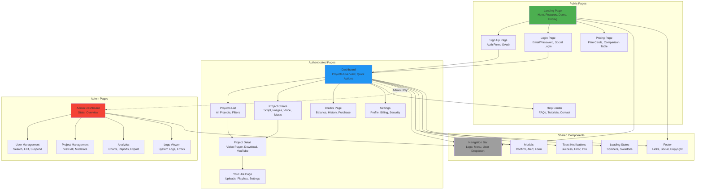
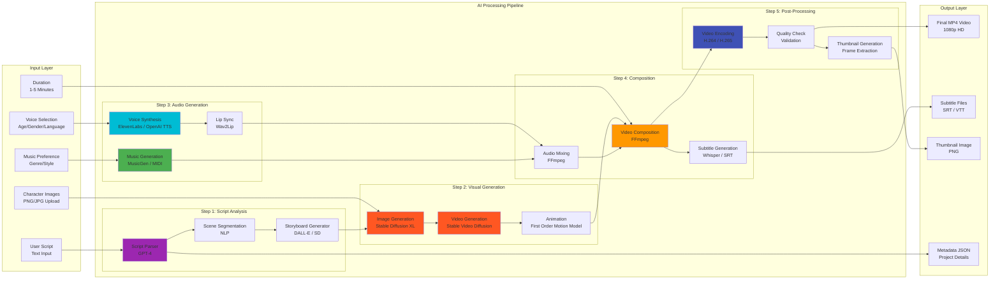
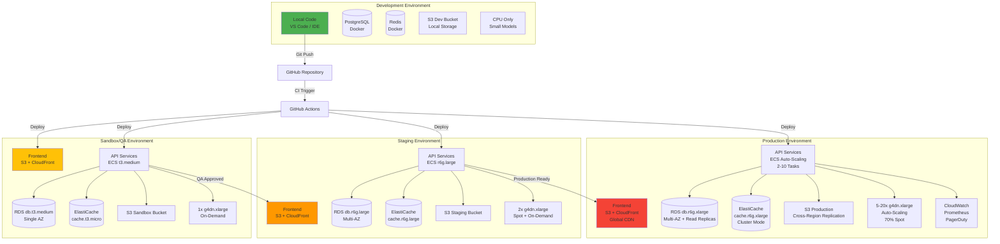
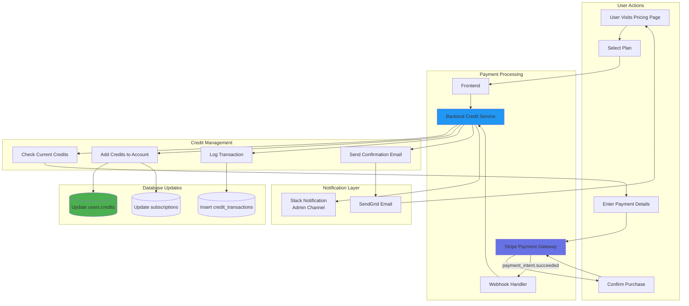
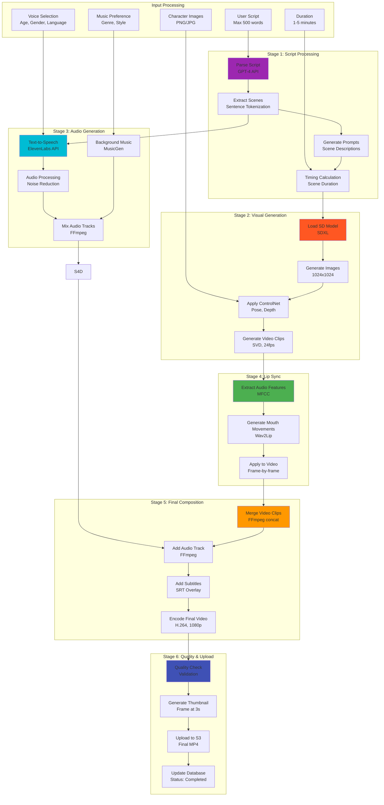
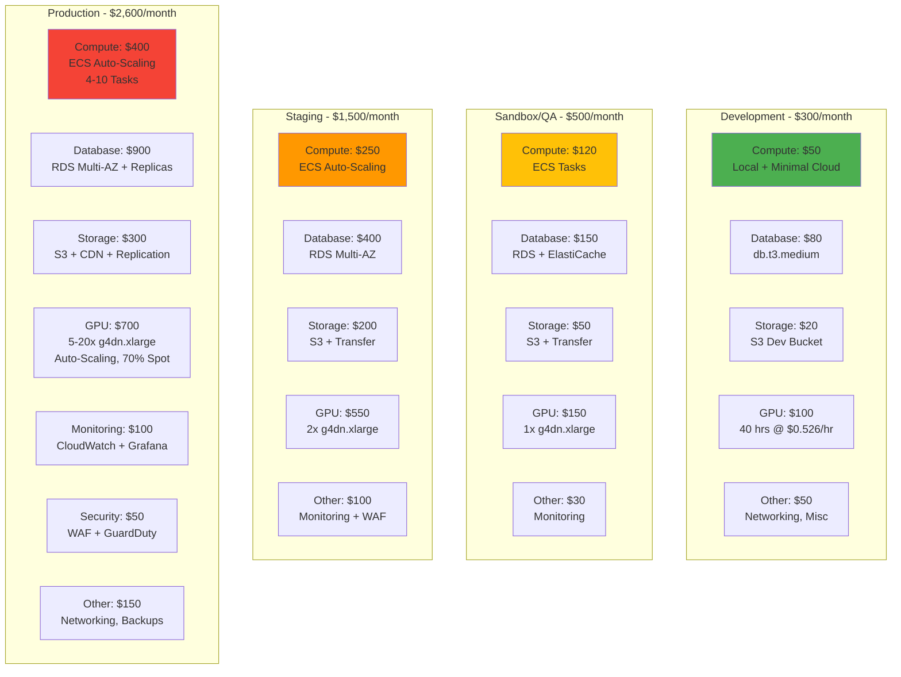
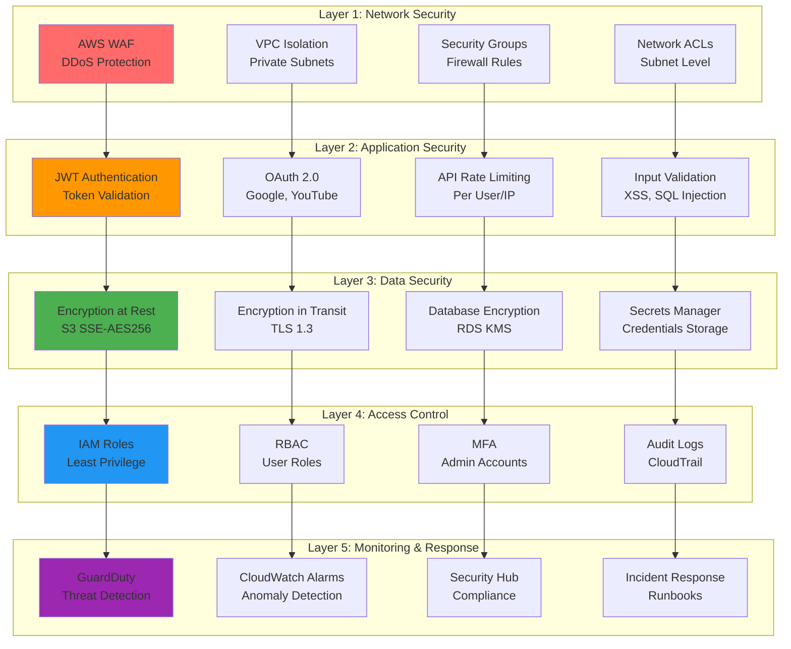
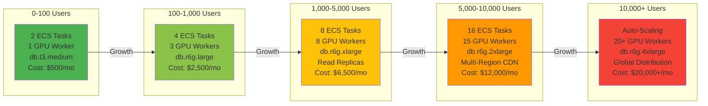

# Visual Architecture Diagram - AI Film Studio

**Version:** 1.0  
**Last Updated:** 2025-12-31  
**Document Owner:** AI-Empower-HQ-360

---

## 📐 Complete System Architecture

This document provides comprehensive visual diagrams showing all pages, microservices, AI models, cloud infrastructure, environments, and data flow for the AI Film Studio platform.

---

## 🏗️ Master System Architecture

```mermaid
graph TB
    subgraph "User Access Layer"
        U1[Web Users]
        U2[Mobile Users - Future]
        U3[Admin Users]
    end
    
    subgraph "CDN & Security Layer"
        CF[CloudFront CDN<br/>Global Edge Network]
        WAF[AWS WAF<br/>DDoS Protection]
        R53[Route 53<br/>DNS Management]
    end
    
    subgraph "Frontend Application Layer"
        FE[Next.js Frontend<br/>React 18 + TypeScript]
        S3FE[S3 Static Hosting<br/>Frontend Assets]
    end
    
    subgraph "API Gateway & Load Balancing"
        ALB[Application Load Balancer<br/>HTTPS Termination]
        AG[API Gateway<br/>Rate Limiting & Auth]
    end
    
    subgraph "Backend Microservices - ECS Fargate Cluster"
        direction TB
        B1[User Service<br/>Auth & Profile]
        B2[Project Service<br/>CRUD Operations]
        B3[Credit Service<br/>Payments & Subscriptions]
        B4[AI Job Service<br/>Job Orchestration]
        B5[YouTube Service<br/>Upload & Playlists]
        B6[Admin Service<br/>Management]
        B7[Analytics Service<br/>Metrics & Reports]
    end
    
    subgraph "AI Processing Layer - GPU Workers"
        direction LR
        W1[Video Generation Worker<br/>Stable Diffusion XL]
        W2[Voice Synthesis Worker<br/>ElevenLabs / TTS]
        W3[Music Generation Worker<br/>MusicGen]
        W4[Video Composition Worker<br/>FFmpeg]
        W5[Podcast Mode Worker<br/>Multi-Character]
    end
    
    subgraph "Message Queue"
        SQS[Amazon SQS<br/>Job Queue]
        DLQ[Dead Letter Queue<br/>Failed Jobs]
    end
    
    subgraph "Data Persistence Layer"
        RDS[(RDS PostgreSQL<br/>Multi-AZ + Read Replicas)]
        REDIS[(ElastiCache Redis<br/>Session & Cache)]
        S3M[(S3 Media Storage<br/>Videos, Images, Audio)]
        S3B[(S3 Backup Bucket<br/>Cross-Region)]
    end
    
    subgraph "External Service Integrations"
        STRIPE[Stripe<br/>Payment Processing]
        YT[YouTube Data API v3<br/>Video Upload]
        SFDC[Salesforce CRM<br/>Customer Management]
        ELEVEN[ElevenLabs API<br/>Voice Synthesis]
        OPENAI[OpenAI API<br/>GPT & TTS]
    end
    
    subgraph "Monitoring & Operations"
        CW[CloudWatch<br/>Logs & Metrics]
        PROM[Prometheus + Grafana<br/>Advanced Monitoring]
        PD[PagerDuty<br/>Alerting]
        SECRETS[Secrets Manager<br/>Credentials]
    end
    
    subgraph "CI/CD Pipeline"
        GH[GitHub<br/>Code Repository]
        GHA[GitHub Actions<br/>CI/CD Workflows]
        ECR[Amazon ECR<br/>Container Registry]
    end
    
    U1 --> R53
    U2 -.-> R53
    U3 --> R53
    R53 --> CF
    CF --> WAF
    WAF --> FE
    FE --> S3FE
    WAF --> ALB
    ALB --> AG
    
    AG --> B1
    AG --> B2
    AG --> B3
    AG --> B4
    AG --> B5
    AG --> B6
    AG --> B7
    
    B1 --> RDS
    B2 --> RDS
    B3 --> RDS
    B4 --> RDS
    B5 --> RDS
    B6 --> RDS
    B7 --> RDS
    
    B1 --> REDIS
    B3 --> REDIS
    B4 --> REDIS
    
    B4 --> SQS
    SQS --> DLQ
    SQS --> W1
    SQS --> W2
    SQS --> W3
    SQS --> W4
    SQS --> W5
    
    W1 --> S3M
    W2 --> S3M
    W3 --> S3M
    W4 --> S3M
    W5 --> S3M
    
    W1 --> RDS
    W2 --> RDS
    W3 --> RDS
    W4 --> RDS
    W5 --> RDS
    
    S3M --> S3B
    
    B3 --> STRIPE
    B5 --> YT
    B6 --> SFDC
    W1 --> OPENAI
    W2 --> ELEVEN
    W3 --> OPENAI
    
    B1 --> CW
    B2 --> CW
    B3 --> CW
    B4 --> CW
    B5 --> CW
    B6 --> CW
    B7 --> CW
    W1 --> CW
    W2 --> CW
    W3 --> CW
    W4 --> CW
    W5 --> CW
    
    CW --> PROM
    PROM --> PD
    
    B1 --> SECRETS
    B2 --> SECRETS
    B3 --> SECRETS
    B4 --> SECRETS
    B5 --> SECRETS
    B6 --> SECRETS
    W1 --> SECRETS
    W2 --> SECRETS
    W3 --> SECRETS
    W4 --> SECRETS
    W5 --> SECRETS
    
    GH --> GHA
    GHA --> ECR
    ECR --> B1
    ECR --> B2
    ECR --> B3
    ECR --> B4
    ECR --> B5
    ECR --> B6
    ECR --> W1
    ECR --> W2
    ECR --> W3
    ECR --> W4
    ECR --> W5
    
    style CF fill:#FF9900
    style WAF fill:#FF6B6B
    style FE fill:#4CAF50
    style ALB fill:#FF9900
    style AG fill:#2196F3
    style RDS fill:#527FFF
    style REDIS fill:#DC382D
    style S3M fill:#569A31
    style S3B fill:#569A31
    style SQS fill:#FF9900
    style W1 fill:#FF6B35
    style W2 fill:#FF6B35
    style W3 fill:#FF6B35
    style W4 fill:#FF6B35
    style W5 fill:#FF6B35
```



---

## 🎭 Frontend Pages & Components Architecture



---

## 🤖 AI Models & Processing Pipeline



---

## 🔄 End-to-End Data Flow

```mermaid
sequenceDiagram
    actor User
    participant Frontend as Frontend<br/>(Next.js)
    participant ALB as Load Balancer
    participant Auth as Auth Service
    participant Project as Project Service
    participant Credit as Credit Service
    participant Job as AI Job Service
    participant Queue as SQS Queue
    participant Worker as GPU Worker
    participant Storage as S3 Storage
    participant DB as PostgreSQL
    participant Cache as Redis
    participant YouTube as YouTube API
    
    %% Authentication Flow
    User->>Frontend: 1. Visit Platform
    Frontend->>ALB: 2. Request Page
    ALB->>Frontend: 3. Serve Static Assets
    User->>Frontend: 4. Login
    Frontend->>Auth: 5. POST /auth/login
    Auth->>DB: 6. Verify Credentials
    DB-->>Auth: 7. User Data
    Auth->>Cache: 8. Store Session
    Auth-->>Frontend: 9. JWT Token
    Frontend-->>User: 10. Redirect to Dashboard
    
    %% Project Creation Flow
    User->>Frontend: 11. Create New Project
    Frontend->>Project: 12. POST /projects
    Project->>DB: 13. INSERT Project
    DB-->>Project: 14. project_id
    Project-->>Frontend: 15. Project Created
    
    User->>Frontend: 16. Upload Character Images
    Frontend->>Storage: 17. Upload to S3 (presigned URL)
    Storage-->>Frontend: 18. Upload Success
    
    User->>Frontend: 19. Configure & Generate
    Frontend->>Job: 20. POST /jobs/generate
    Job->>Credit: 21. Check Credits
    Credit->>DB: 22. SELECT credits
    DB-->>Credit: 23. credits = 10
    Credit->>DB: 24. Deduct 3 Credits
    DB-->>Credit: 25. Updated
    Credit->>Cache: 26. Invalidate Cache
    
    Job->>DB: 27. Create Job Record
    Job->>Queue: 28. Enqueue Job Message
    Job-->>Frontend: 29. Job Queued (job_id)
    Frontend-->>User: 30. Processing Started
    
    %% AI Processing Flow
    Worker->>Queue: 31. Poll Queue
    Queue-->>Worker: 32. Job Message
    Worker->>DB: 33. Update Status: Processing
    Worker->>Storage: 34. Download Assets
    Storage-->>Worker: 35. Assets Downloaded
    
    Worker->>Worker: 36. Load AI Models
    Worker->>Worker: 37. Generate Video (3-5 min)
    Worker->>Worker: 38. Compose Audio
    Worker->>Worker: 39. Merge Video + Audio
    
    Worker->>Storage: 40. Upload Final Video
    Storage-->>Worker: 41. Video URL
    Worker->>DB: 42. Update Status: Completed
    Worker->>Queue: 43. Delete Message
    Worker->>Cache: 44. Cache Video URL
    
    %% Result Retrieval Flow
    Frontend->>Job: 45. GET /jobs/:id (polling)
    Job->>Cache: 46. Check Cache
    Cache-->>Job: 47. Job Status
    Job-->>Frontend: 48. Status: Completed + URL
    Frontend-->>User: 49. Video Ready!
    
    User->>Frontend: 50. Download Video
    Frontend->>Storage: 51. Generate Signed URL
    Storage-->>Frontend: 52. Download URL
    Frontend-->>User: 53. Download Started
    
    %% YouTube Upload Flow (Optional)
    User->>Frontend: 54. Upload to YouTube
    Frontend->>YouTube: 55. POST /youtube/upload
    YouTube->>Storage: 56. Download Video
    YouTube->>YouTube: 57. Upload to YouTube API
    YouTube->>DB: 58. Save Upload Record
    YouTube-->>Frontend: 59. Upload Success
    Frontend-->>User: 60. Published to YouTube!
    
    style User fill:#4CAF50
    style Worker fill:#FF6B35
    style Storage fill:#569A31
    style Queue fill:#FF9900
```

---

## 🌐 Multi-Environment Architecture



---

## 💳 Subscription & Payment Flow



---

## 🎥 Video Generation Pipeline (Detailed)



---

## 📊 Cost Breakdown by Environment



---

## 🔐 Security Architecture Layers



---

## 📈 Scaling Strategy



---

## 🎯 Key Takeaways

### **Architecture Principles**
1. **Scalability**: Auto-scaling at every layer
2. **Reliability**: Multi-AZ deployments, failover mechanisms
3. **Security**: Defense in depth, encryption everywhere
4. **Cost Optimization**: Spot instances, right-sizing, caching
5. **Performance**: GPU acceleration, CDN, Redis caching

### **Technology Choices**
- **Frontend**: Next.js for SSR, SEO, and performance
- **Backend**: Microservices for scalability and maintainability
- **AI**: Best-in-class models (SDXL, ElevenLabs, FFmpeg)
- **Cloud**: AWS for comprehensive services and global reach
- **Database**: PostgreSQL for reliability and ACID compliance

### **Critical Success Factors**
1. Efficient GPU worker utilization (70% spot instances)
2. Aggressive caching strategy (Redis + CloudFront)
3. Optimized AI model loading (preload, cache)
4. Robust error handling and retry logic
5. Comprehensive monitoring and alerting

---

**📊 END OF VISUAL ARCHITECTURE DOCUMENT**

This comprehensive visual reference provides a complete view of the AI Film Studio platform architecture, from user interfaces to AI processing pipelines, and from development environments to production deployments.
