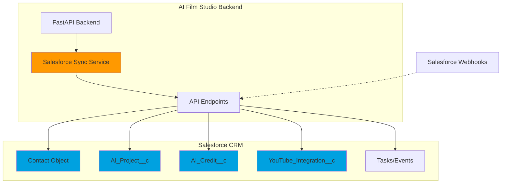
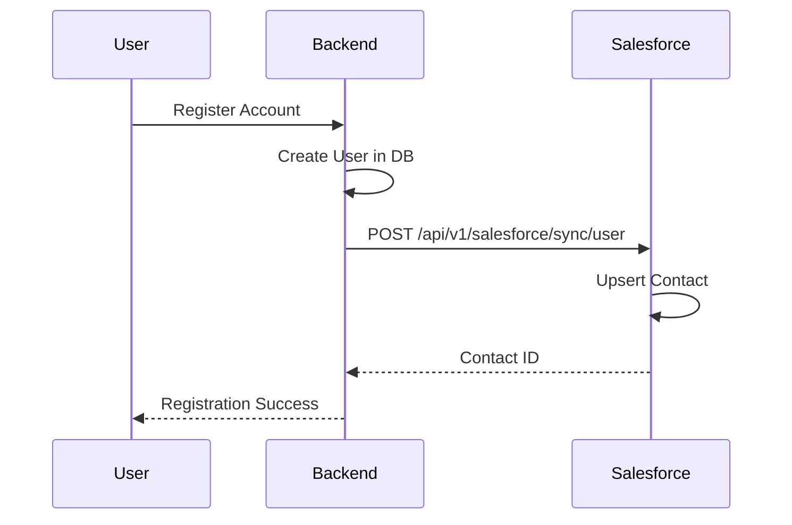
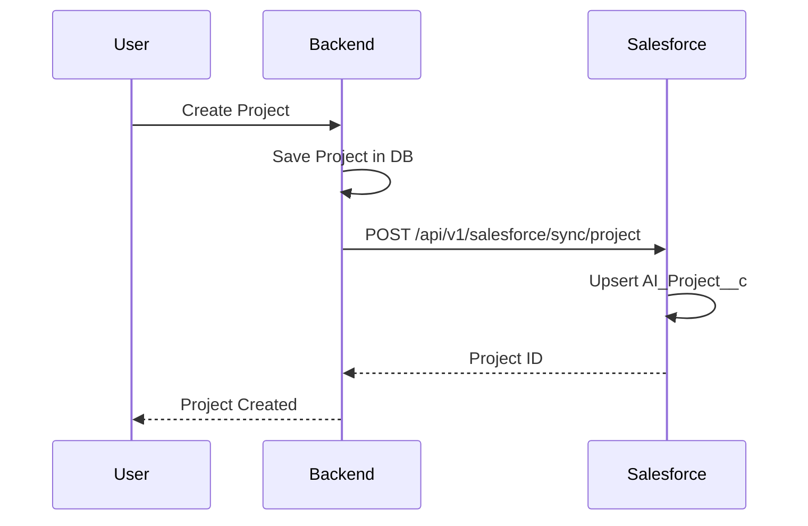
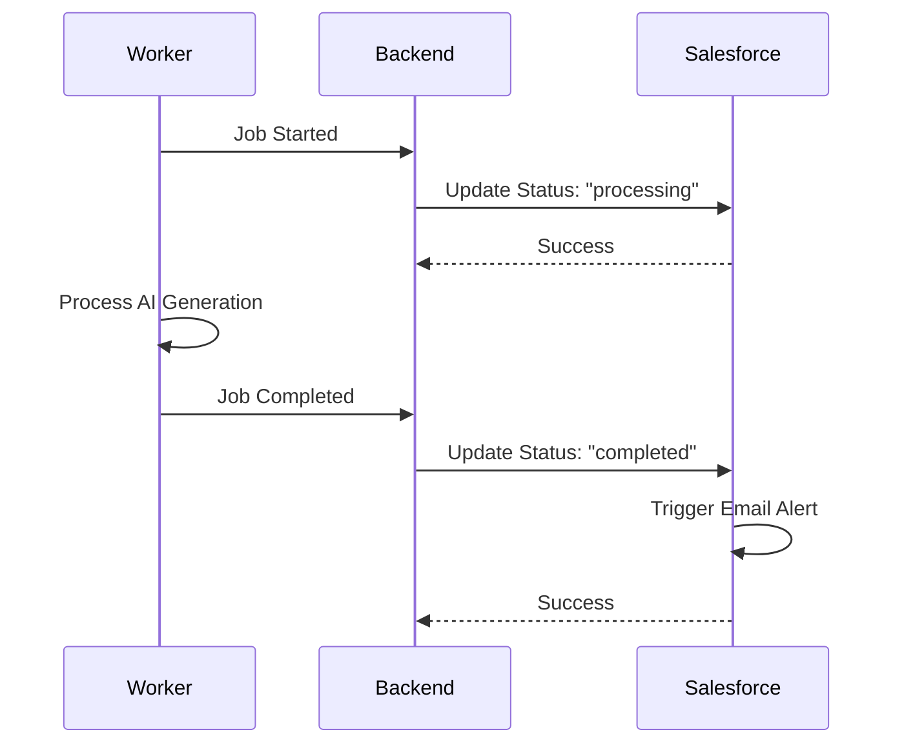
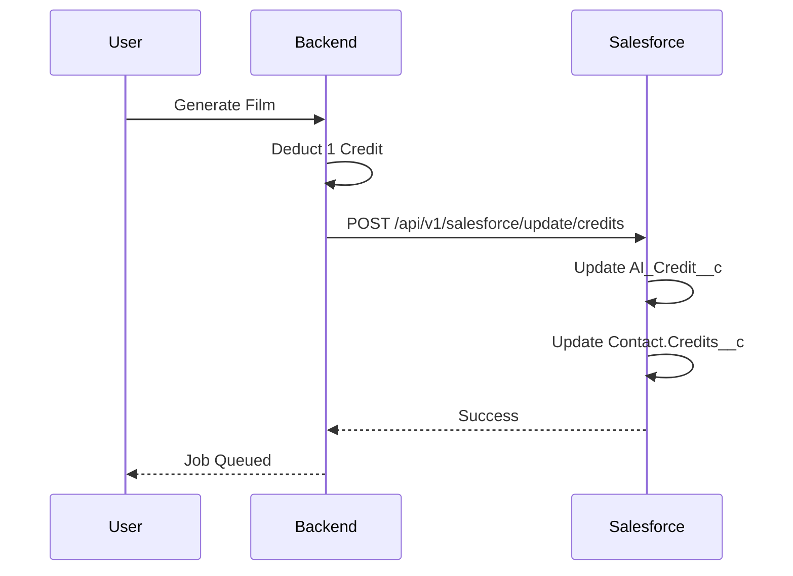

# Salesforce CRM Integration Guide

**Version:** 1.0  
**Last Updated:** 2025-12-31  
**Document Owner:** AI-Empower-HQ-360

---

## Table of Contents

1. [Overview](#overview)
2. [Architecture](#architecture)
3. [Salesforce Objects](#salesforce-objects)
4. [Setup Instructions](#setup-instructions)
5. [Data Flow](#data-flow)
6. [API Endpoints](#api-endpoints)
7. [Automation & Workflows](#automation--workflows)
8. [Testing](#testing)
9. [Troubleshooting](#troubleshooting)

---

## Overview

The AI Film Studio platform integrates with Salesforce CRM to track user activity, project status, credit usage, and YouTube uploads. This integration enables:

- **User Management**: Sync users to Salesforce Contacts
- **Project Tracking**: Monitor AI project lifecycle in AI_Project__c custom object
- **Credit Management**: Track subscription plans and credit usage in AI_Credit__c
- **YouTube Integration**: Record video uploads in YouTube_Integration__c
- **Automation**: Trigger workflows for notifications and analytics

---

## Architecture

### Integration Components



### Key Features

- **Real-time Sync**: Background tasks sync data without blocking API responses
- **Upsert Operations**: Use external IDs to prevent duplicates
- **Error Handling**: Graceful degradation if Salesforce is unavailable
- **Webhook Support**: Bi-directional sync with Salesforce webhooks

---

## Salesforce Objects

### 1. Contact (Standard Object)

Maps to individual users in AI Film Studio.

**Fields:**

| Field Name | API Name | Type | Description |
|------------|----------|------|-------------|
| First Name | FirstName | Text | User's first name |
| Last Name | LastName | Text(Required) | User's last name |
| Email | Email | Email | User's email address |
| Plan Type | Plan_Type__c | Picklist | free, pro, enterprise |
| Credits | Credits__c | Number | Current credit balance |
| User External ID | User_External_Id__c | Text(External ID) | Maps to internal user ID |
| Last Login | Last_Login__c | DateTime | Last login timestamp |

**Create Custom Fields:**

```apex
// Execute in Salesforce Developer Console or Workbench
// Custom fields should be created via Setup > Object Manager > Contact

Plan_Type__c: Picklist with values: free, pro, enterprise
Credits__c: Number(18, 0)
User_External_Id__c: Text(255, External ID, Unique)
Last_Login__c: Date/Time
```

---

### 2. AI_Project__c (Custom Object)

Tracks film projects and their processing status.

**Fields:**

| Field Name | API Name | Type | Description |
|------------|----------|------|-------------|
| Project Name | Name | Text(Auto-number) | Project title |
| Script | Script__c | Long Text Area | Project script content |
| Status | Status__c | Picklist | draft, queued, processing, completed, failed |
| Duration | Duration__c | Number | Video duration in seconds |
| Video URL | Video_URL__c | URL | Final video S3 URL |
| Subtitles URL | Subtitles_URL__c | URL | Subtitles file URL |
| Thumbnail URL | Thumbnail_URL__c | URL | Video thumbnail URL |
| Contact | Contact__c | Lookup(Contact) | Project owner |
| Project External ID | Project_External_Id__c | Text(External ID) | Internal project ID |
| Created Date | Created_Date__c | Date/Time | Project creation date |
| Completed Date | Completed_Date__c | Date/Time | Completion timestamp |
| Error Message | Error_Message__c | Text(255) | Error details if failed |

**Create Custom Object:**

1. Navigate to **Setup > Object Manager > Create > Custom Object**
2. Object Name: `AI_Project`
3. API Name: `AI_Project__c`
4. Record Name: `AI Project Name` (Auto Number: PRJ-{00000})
5. Add all custom fields listed above

---

### 3. AI_Credit__c (Custom Object)

Tracks user subscription plans and credit allocations.

**Fields:**

| Field Name | API Name | Type | Description |
|------------|----------|------|-------------|
| Name | Name | Text(Auto-number) | Record identifier |
| Contact | Contact__c | Lookup(Contact) | User reference |
| Plan Type | Plan_Type__c | Picklist | free, pro, enterprise |
| Credits Allocated | Credits_Allocated__c | Number | Total credits for period |
| Credits Used | Credits_Used__c | Number | Credits consumed |
| Credits Remaining | Credits_Remaining__c | Formula(Number) | Allocated - Used |
| Reset Date | Reset_Date__c | Date | Monthly credit reset date |
| Expiry Date | Expiry_Date__c | Date | Subscription expiry |
| Status | Status__c | Picklist | active, expired, cancelled |

**Formula Field:**

```
Credits_Remaining__c = Credits_Allocated__c - Credits_Used__c
```

---

### 4. YouTube_Integration__c (Custom Object)

Records YouTube video uploads and their status.

**Fields:**

| Field Name | API Name | Type | Description |
|------------|----------|------|-------------|
| Name | Name | Text(Auto-number) | Record identifier |
| AI Project | AI_Project__c | Lookup(AI_Project__c) | Related project |
| Channel ID | Channel_Id__c | Text(50) | YouTube channel ID |
| Video ID | Video_Id__c | Text(50) | YouTube video ID |
| Playlist ID | Playlist_Id__c | Text(50) | YouTube playlist ID |
| Upload Status | Upload_Status__c | Picklist | pending, uploading, completed, failed |
| Upload Date | Upload_Date__c | Date/Time | Upload timestamp |
| Error Message | Error_Message__c | Text(255) | Error details if failed |

---

## Setup Instructions

### Prerequisites

- Salesforce Developer or Production Org
- System Administrator access
- Connected App credentials

### Step 1: Create Custom Objects and Fields

1. **Create Custom Objects**: Follow the object definitions above
2. **Set Field-Level Security**: Grant access to all profiles
3. **Create Page Layouts**: Design record detail pages
4. **Add to Apps**: Include in Lightning Apps navigation

### Step 2: Create Connected App

1. Navigate to **Setup > Apps > App Manager > New Connected App**
2. Connected App Name: `AI Film Studio Integration`
3. API Name: `AI_Film_Studio_Integration`
4. Contact Email: Your email
5. **Enable OAuth Settings**: Check
6. Callback URL: `https://your-domain.com/oauth/callback`
7. Selected OAuth Scopes:
   - Full access (full)
   - Perform requests on your behalf at any time (refresh_token, offline_access)
8. Save and note the **Consumer Key** and **Consumer Secret**

### Step 3: Configure Security Token

1. Navigate to **Your User Profile > Settings > Reset Security Token**
2. Click **Reset Security Token**
3. Copy the token from your email

### Step 4: Set Environment Variables

Update your `.env` file:

```bash
# Salesforce CRM Configuration
SALESFORCE_USERNAME=your_username@salesforce.com
SALESFORCE_PASSWORD=your_password
SALESFORCE_SECURITY_TOKEN=your_security_token
SALESFORCE_DOMAIN=login  # or 'test' for sandbox
SALESFORCE_API_VERSION=58.0
SALESFORCE_CONSUMER_KEY=your_consumer_key
SALESFORCE_CONSUMER_SECRET=your_consumer_secret
SALESFORCE_SYNC_ENABLED=true
```

### Step 5: Install Dependencies

```bash
pip install simple-salesforce>=1.12.5 salesforce-bulk>=2.2.0
```

### Step 6: Test Connection

```bash
curl http://localhost:8000/api/v1/salesforce/health
```

Expected response:
```json
{
  "status": "healthy",
  "connected": true,
  "sync_enabled": true
}
```

---

## Data Flow

### 1. User Registration Flow



### 2. Project Creation Flow



### 3. AI Job Processing Flow



### 4. Credit Deduction Flow



---

## API Endpoints

### POST /api/v1/salesforce/sync/user

Sync user data to Salesforce Contact.

**Request:**
```json
{
  "user_id": "550e8400-e29b-41d4-a716-446655440000",
  "email": "john.doe@example.com",
  "first_name": "John",
  "last_name": "Doe",
  "plan_type": "pro",
  "credits": 30
}
```

**Response:**
```json
{
  "status": "success",
  "message": "User sync initiated",
  "user_id": "550e8400-e29b-41d4-a716-446655440000"
}
```

---

### POST /api/v1/salesforce/sync/project

Sync project data to Salesforce AI_Project__c.

**Request:**
```json
{
  "project_id": "proj_123456",
  "user_id": "550e8400-e29b-41d4-a716-446655440000",
  "title": "My First Film",
  "script": "A story about...",
  "status": "draft"
}
```

**Response:**
```json
{
  "status": "success",
  "message": "Project sync initiated",
  "project_id": "proj_123456"
}
```

---

### POST /api/v1/salesforce/update/project-status

Update project status in Salesforce.

**Request:**
```json
{
  "project_id": "proj_123456",
  "status": "completed",
  "video_url": "https://s3.amazonaws.com/...",
  "completed_at": "2025-12-31T17:00:00Z"
}
```

**Response:**
```json
{
  "status": "success",
  "message": "Project status update initiated",
  "project_id": "proj_123456",
  "new_status": "completed"
}
```

---

### POST /api/v1/salesforce/update/credits

Update credit usage in Salesforce.

**Request:**
```json
{
  "user_id": "550e8400-e29b-41d4-a716-446655440000",
  "credits_used": 15
}
```

**Response:**
```json
{
  "status": "success",
  "message": "Credit update initiated",
  "user_id": "550e8400-e29b-41d4-a716-446655440000"
}
```

---

### POST /api/v1/salesforce/sync/youtube-upload

Sync YouTube upload to Salesforce.

**Request:**
```json
{
  "project_id": "proj_123456",
  "channel_id": "UCxxxxxxxxxxxxx",
  "video_id": "dQw4w9WgXcQ",
  "upload_status": "completed"
}
```

**Response:**
```json
{
  "status": "success",
  "message": "YouTube upload sync initiated",
  "project_id": "proj_123456"
}
```

---

### GET /api/v1/salesforce/health

Check Salesforce connection status.

**Response:**
```json
{
  "status": "healthy",
  "connected": true,
  "sync_enabled": true
}
```

---

## Automation & Workflows

### 1. Email Notifications

**Use Case**: Notify users when video generation completes.

**Implementation** (Salesforce Flow):

1. **Trigger**: Record-Triggered Flow on AI_Project__c
2. **Criteria**: Status changed to "completed"
3. **Action**: Send Email Alert
   - Recipient: {!Contact.Email}
   - Subject: "Your AI Film is Ready!"
   - Body: Include {!Video_URL__c} download link

**Flow Configuration:**

```yaml
Object: AI_Project__c
Trigger: Record is updated
Condition: Status__c EQUALS completed AND ISCHANGED(Status__c)
Actions:
  - Send Email:
      Template: Video_Generation_Complete
      Recipient: {!AI_Project__c.Contact__c.Email}
```

---

### 2. Credit Deduction Trigger

**Use Case**: Automatically deduct credits when a project is submitted for generation.

**Implementation** (Apex Trigger):

```apex
trigger DeductCreditsOnProjectGeneration on AI_Project__c (before update) {
    for (AI_Project__c project : Trigger.new) {
        AI_Project__c oldProject = Trigger.oldMap.get(project.Id);
        
        // Check if status changed from draft to queued
        if (project.Status__c == 'queued' && oldProject.Status__c == 'draft') {
            // Find active credit record for this contact
            List<AI_Credit__c> credits = [
                SELECT Id, Credits_Used__c 
                FROM AI_Credit__c 
                WHERE Contact__c = :project.Contact__c 
                AND Status__c = 'active' 
                ORDER BY CreatedDate DESC 
                LIMIT 1
            ];
            
            if (!credits.isEmpty()) {
                AI_Credit__c credit = credits[0];
                credit.Credits_Used__c += 1;
                update credit;
            }
        }
    }
}
```

---

### 3. Failed Job Support Case

**Use Case**: Automatically create a support case when AI job fails multiple times.

**Implementation** (Process Builder):

1. **Object**: AI_Project__c
2. **Criteria**: Status__c = "failed" AND Failure_Count__c >= 3
3. **Action**: Create Case
   - Subject: "AI Job Failed - {!Name}"
   - Priority: High
   - Description: {!Error_Message__c}
   - Contact: {!Contact__c}

---

### 4. Scheduled YouTube Upload Check

**Use Case**: Periodically check YouTube upload status and update records.

**Implementation** (Scheduled Apex Job):

```apex
global class YouTubeUploadStatusCheck implements Schedulable {
    global void execute(SchedulableContext sc) {
        List<YouTube_Integration__c> pendingUploads = [
            SELECT Id, Video_Id__c, Upload_Status__c
            FROM YouTube_Integration__c
            WHERE Upload_Status__c = 'uploading'
            AND CreatedDate = LAST_N_DAYS:7
        ];
        
        for (YouTube_Integration__c upload : pendingUploads) {
            // Call external API to check status
            // Update record based on response
        }
        
        update pendingUploads;
    }
}

// Schedule to run every hour
System.schedule('YouTube Upload Check', '0 0 * * * ?', new YouTubeUploadStatusCheck());
```

---

## Testing

### Unit Tests

Run the test suite:

```bash
pytest tests/test_salesforce_integration.py -v
```

### Manual Testing

1. **Test User Sync**:
   ```bash
   curl -X POST http://localhost:8000/api/v1/salesforce/sync/user \
     -H "Content-Type: application/json" \
     -d '{
       "user_id": "test_user_123",
       "email": "test@example.com",
       "first_name": "Test",
       "last_name": "User",
       "plan_type": "free",
       "credits": 3
     }'
   ```

2. **Verify in Salesforce**:
   - Navigate to Contacts
   - Search by email: test@example.com
   - Verify User_External_Id__c = test_user_123

3. **Test Project Sync**:
   ```bash
   curl -X POST http://localhost:8000/api/v1/salesforce/sync/project \
     -H "Content-Type: application/json" \
     -d '{
       "project_id": "test_proj_456",
       "user_id": "test_user_123",
       "title": "Test Film",
       "script": "Test script content",
       "status": "draft"
     }'
   ```

4. **Verify in Salesforce**:
   - Navigate to AI Projects
   - Find record with Project_External_Id__c = test_proj_456
   - Verify Contact lookup is set correctly

---

## Troubleshooting

### Connection Issues

**Problem**: `SalesforceAuthenticationFailed` error

**Solutions**:
1. Verify username, password, and security token
2. Check IP restrictions on Salesforce profile
3. Ensure Connected App is approved
4. Verify API access is enabled for user

---

### Record Not Found

**Problem**: Upsert fails with "External ID not found"

**Solutions**:
1. Ensure external ID field is marked as unique
2. Verify external ID field is indexed
3. Check field-level security permissions

---

### Sync Delays

**Problem**: Data not appearing in Salesforce immediately

**Expected Behavior**: Sync operations run in background tasks (async)

**Solutions**:
1. Check application logs for errors
2. Verify background tasks are executing
3. Monitor Salesforce API limits

---

### API Limits

**Problem**: Salesforce API limit exceeded

**Solutions**:
1. Implement batch processing for bulk operations
2. Use Salesforce Bulk API for large datasets
3. Monitor daily API usage in Setup > System Overview

---

## Best Practices

1. **Use External IDs**: Always upsert with external IDs to prevent duplicates
2. **Async Operations**: Run sync operations in background to avoid blocking
3. **Error Handling**: Log errors but don't fail user requests
4. **Rate Limiting**: Respect Salesforce API limits (15,000/day for Developer Edition)
5. **Data Validation**: Validate data before sending to Salesforce
6. **Monitoring**: Set up alerts for sync failures
7. **Testing**: Use Salesforce Sandbox for development and testing

---

## Support

For issues with Salesforce integration:

- **GitHub Issues**: [AI Film Studio Issues](https://github.com/AI-Empower-HQ-360/AI-Film-Studio/issues)
- **Salesforce Support**: [Salesforce Help](https://help.salesforce.com)
- **Documentation**: This guide

---

**Last Updated**: 2025-12-31  
**Version**: 1.0
