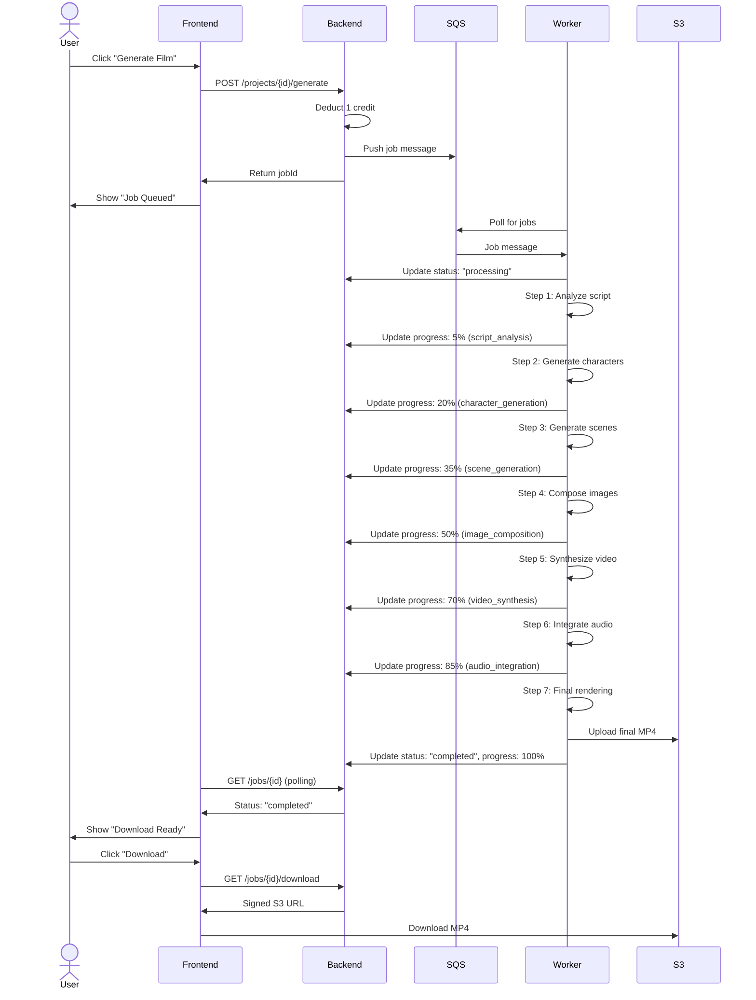
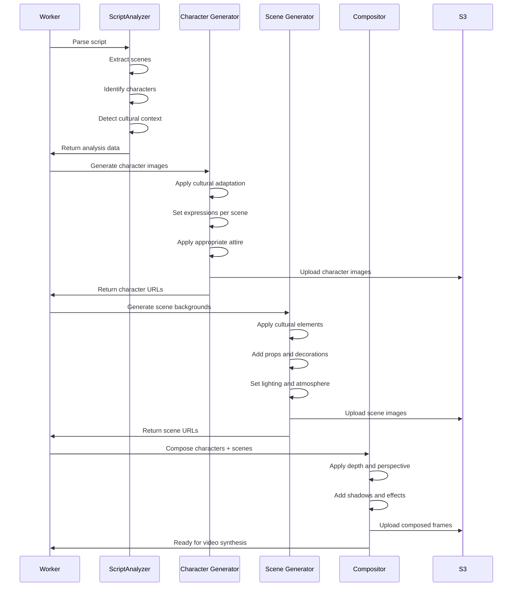

# Functional Requirements Document (FRD)
## AI Film Studio

**Document Version:** 1.1  
**Date:** 2025-12-31  
**Author:** AI-Empower-HQ-360  
**Status:** Approved

---

## 1. Introduction

### 1.1 Purpose
This document specifies the functional requirements for the AI Film Studio platform, detailing how the system must behave to meet business objectives.

### 1.2 Scope
Covers all user-facing features, APIs, data models, workflows, and acceptance criteria for the MVP release.

### 1.3 Document Conventions
- **FR-XXX**: Functional Requirement ID
- **Priority**: P0 (Critical), P1 (High), P2 (Medium), P3 (Low)
- **Status**: Draft, Approved, Implemented, Tested

---

## 2. System Overview

### 2.1 User Roles
| Role | Description | Capabilities |
|------|-------------|--------------|
| **Guest** | Unauthenticated visitor | View landing page, signup |
| **Free User** | Registered, free tier | 3 films/month, watermarked |
| **Pro User** | Paid subscriber ($29/mo) | 30 films/month, no watermark |
| **Enterprise User** | Paid subscriber ($299/mo) | Unlimited films, priority queue |
| **Admin** | Platform administrator | Full system access, moderation |

---

## 3. Functional Requirements

## 3.1 Authentication & Authorization

### FR-001: User Registration [P0]
**Description**: Users can create an account using email/password or OAuth.

**Acceptance Criteria**:
- [ ] Accept valid email format
- [ ] Password must be 8+ characters with 1 uppercase, 1 number
- [ ] Support Google OAuth and GitHub OAuth
- [ ] Send email verification link
- [ ] Create user record in database with default free tier
- [ ] Assign initial 3 credits

**API Endpoint**:
```
POST /api/v1/auth/register
Body: { "email": "string", "password": "string" }
Response: { "userId": "uuid", "email": "string", "tier": "free" }
```

---

### FR-002: User Login [P0]
**Description**: Users can log in with email/password or OAuth.

**Acceptance Criteria**:
- [ ] Validate credentials against database
- [ ] Return JWT token (expires in 24 hours)
- [ ] Refresh token for extended sessions
- [ ] Lock account after 5 failed attempts
- [ ] Support "Remember Me" option

**API Endpoint**:
```
POST /api/v1/auth/login
Body: { "email": "string", "password": "string" }
Response: { "accessToken": "jwt", "refreshToken": "jwt", "expiresIn": 86400 }
```

---

### FR-003: Password Reset [P1]
**Description**: Users can reset forgotten passwords.

**Acceptance Criteria**:
- [ ] Send reset link to registered email
- [ ] Reset link expires in 1 hour
- [ ] Allow user to set new password
- [ ] Invalidate old sessions

**API Endpoint**:
```
POST /api/v1/auth/forgot-password
Body: { "email": "string" }
Response: { "message": "Reset link sent" }
```

---

## 3.2 Project Management

### FR-010: Create Project [P0]
**Description**: Users can create new film projects.

**Acceptance Criteria**:
- [ ] Accept project title (max 100 characters)
- [ ] Accept script text (max 500 words)
- [ ] Assign unique project ID
- [ ] Default status: "draft"
- [ ] Link project to user account

**API Endpoint**:
```
POST /api/v1/projects
Headers: { "Authorization": "Bearer <token>" }
Body: { "title": "string", "script": "string" }
Response: { "projectId": "uuid", "status": "draft", "createdAt": "timestamp" }
```

---

### FR-011: List Projects [P0]
**Description**: Users can view all their projects.

**Acceptance Criteria**:
- [ ] Return paginated list (20 per page)
- [ ] Filter by status (draft, processing, completed, failed)
- [ ] Sort by created date (newest first)
- [ ] Include thumbnail for completed films

**API Endpoint**:
```
GET /api/v1/projects?page=1&status=all
Response: {
  "projects": [
    { "projectId": "uuid", "title": "string", "status": "string", "thumbnail": "url" }
  ],
  "totalCount": 42,
  "page": 1
}
```

---

### FR-012: Update Project [P1]
**Description**: Users can edit draft projects.

**Acceptance Criteria**:
- [ ] Allow title and script changes
- [ ] Only editable if status is "draft"
- [ ] Version history saved (optional for MVP)

**API Endpoint**:
```
PATCH /api/v1/projects/{projectId}
Body: { "title": "new title", "script": "updated script" }
Response: { "projectId": "uuid", "updatedAt": "timestamp" }
```

---

### FR-013: Delete Project [P2]
**Description**: Users can delete projects.

**Acceptance Criteria**:
- [ ] Soft delete (mark as deleted, don't remove from DB)
- [ ] Delete associated S3 assets after 30 days
- [ ] Cannot delete if job is processing

**API Endpoint**:
```
DELETE /api/v1/projects/{projectId}
Response: { "message": "Project deleted" }
```

---

## 3.3 Film Generation

### FR-020: Submit Film Generation Job [P0]
**Description**: Users can generate a film from a project script.

**Acceptance Criteria**:
- [ ] Deduct 1 credit from user account
- [ ] Return error if insufficient credits
- [ ] Create job record in database
- [ ] Push job message to SQS queue
- [ ] Return job ID for tracking

**API Endpoint**:
```
POST /api/v1/projects/{projectId}/generate
Response: { "jobId": "uuid", "status": "queued", "estimatedTime": "3-5 minutes" }
```

---

### FR-021: Track Job Progress [P0]
**Description**: Users can check the status of film generation jobs.

**Acceptance Criteria**:
- [ ] Return current status (queued, processing, completed, failed)
- [ ] Provide progress percentage (0-100%)
- [ ] Show current step (script analysis, scene generation, composition)
- [ ] Estimate time remaining

**API Endpoint**:
```
GET /api/v1/jobs/{jobId}
Response: {
  "jobId": "uuid",
  "status": "processing",
  "progress": 65,
  "currentStep": "scene_generation",
  "estimatedTimeRemaining": "90 seconds"
}
```

---

### FR-022: Download Generated Film [P0]
**Description**: Users can download completed films.

**Acceptance Criteria**:
- [ ] Generate signed S3 URL (valid for 1 hour)
- [ ] Return MP4 file (1080p, H.264 codec)
- [ ] Include watermark for free-tier users
- [ ] Log download event for analytics

**API Endpoint**:
```
GET /api/v1/jobs/{jobId}/download
Response: { "downloadUrl": "https://s3.amazonaws.com/...", "expiresIn": 3600 }
```

---

### FR-023: Regenerate Film [P1]
**Description**: Users can regenerate a film with different settings.

**Acceptance Criteria**:
- [ ] Deduct 1 credit
- [ ] Allow style parameter changes (cinematic, anime, etc.)
- [ ] Preserve original version
- [ ] Create new job

**API Endpoint**:
```
POST /api/v1/projects/{projectId}/regenerate
Body: { "style": "anime", "pacing": "fast" }
Response: { "jobId": "uuid", "status": "queued" }
```

---

### FR-024: Script-Based Image Generation [P0]
**Description**: System analyzes user scripts to generate contextually appropriate images for characters and scenes.

**Acceptance Criteria**:
- [ ] Parse script text to extract scene descriptions
- [ ] Identify character names, roles, and attributes
- [ ] Detect dialogue and emotional context
- [ ] Infer story setting (modern, traditional, fantasy, etc.)
- [ ] Extract cultural indicators from script content
- [ ] Generate structured context data for image generation

**API Endpoint**:
```
POST /api/v1/internal/script-analysis
Body: { "script": "string", "projectId": "uuid" }
Response: {
  "scenes": [...],
  "characters": [...],
  "cultural_context": {...},
  "story_setting": "string"
}
```

---

### FR-025: Cultural Context-Aware Character Generation [P0]
**Description**: Generate character images that adapt to cultural context and story requirements.

**Acceptance Criteria**:
- [ ] Accept character reference images (optional)
- [ ] Generate characters based on script descriptions
- [ ] Adapt facial expressions based on scene emotions
- [ ] Apply culturally appropriate clothing and attire
- [ ] Include cultural accessories (jewelry, props)
- [ ] Maintain character consistency across scenes
- [ ] Support multiple cultural contexts (South Indian, Western, East Asian, etc.)

**Cultural Adaptation Examples**:
```yaml
South Indian Traditional:
  - Traditional attire (sarees, dhotis)
  - Jasmine flowers, bindis, traditional jewelry
  - Cultural hairstyles
  - Appropriate skin tones and features

Western Modern:
  - Contemporary clothing
  - Modern accessories
  - Professional or casual attire
  - Diverse ethnic representations
```

**API Endpoint**:
```
POST /api/v1/internal/generate-character
Body: {
  "character_name": "string",
  "script_context": {...},
  "cultural_context": "string",
  "reference_image_url": "string" (optional)
}
Response: { "character_images": [...], "character_id": "uuid" }
```

---

### FR-026: Scene & Background Generation [P0]
**Description**: Generate scene backgrounds and environments based on story context and cultural setting.

**Acceptance Criteria**:
- [ ] Generate backgrounds matching story setting
- [ ] Include culturally appropriate architectural elements
- [ ] Add environmental props and decorations
- [ ] Apply correct lighting based on time of day
- [ ] Include cultural-specific elements (temples, kolam patterns, etc.)
- [ ] Ensure scene consistency across related shots
- [ ] Support various location types (indoor, outdoor, sacred, public)

**Cultural Scene Templates**:
```yaml
South Indian Contexts:
  - Temple courtyards with gopurams
  - Traditional homes with kolam
  - Festival decorations (Pongal, Diwali)
  - Village squares
  - Wedding mandaps

Western Contexts:
  - Modern offices
  - Contemporary homes
  - Urban streets
  - Historical buildings
```

**API Endpoint**:
```
POST /api/v1/internal/generate-scene
Body: {
  "scene_description": "string",
  "cultural_context": "string",
  "time_of_day": "string",
  "location_type": "string"
}
Response: { "scene_images": [...], "scene_id": "uuid" }
```

---

### FR-027: Dynamic Cultural Adaptation [P0]
**Description**: System dynamically adapts all visual elements based on detected or specified cultural context.

**Acceptance Criteria**:
- [ ] Auto-detect cultural context from script content
- [ ] Allow manual cultural preference selection
- [ ] Ensure all visual elements align with cultural context
- [ ] Apply culturally appropriate color palettes
- [ ] Use culturally accurate props and accessories
- [ ] Validate cultural sensitivity and accuracy
- [ ] Support multiple simultaneous cultural contexts in different scenes

**Supported Cultural Contexts**:
- South Indian (Tamil, Telugu, Malayalam, Kannada)
- North Indian (Hindi, Punjabi, Bengali)
- East Asian (Chinese, Japanese, Korean)
- Western (American, European)
- Middle Eastern
- African cultures
- Fantasy/Custom settings

**API Endpoint**:
```
POST /api/v1/projects/{projectId}/cultural-preferences
Body: {
  "primary_culture": "string",
  "secondary_culture": "string" (optional),
  "style_preferences": {...}
}
Response: { "updated": true }
```

---

### FR-028: Character Upload & Reference Images [P1]
**Description**: Users can upload reference images for character generation.

**Acceptance Criteria**:
- [ ] Accept image uploads (JPEG, PNG)
- [ ] Validate image format and size (max 10MB)
- [ ] Store reference images in S3
- [ ] Link reference images to characters
- [ ] Use reference for facial features in generation
- [ ] Support multiple reference images per character

**API Endpoint**:
```
POST /api/v1/projects/{projectId}/characters/{characterId}/reference
Headers: { "Content-Type": "multipart/form-data" }
Body: { "image": file }
Response: { "reference_url": "string", "character_id": "uuid" }
```

---

### FR-029: Video Pipeline Integration [P0]
**Description**: Generated images are seamlessly integrated into the video synthesis pipeline.

**Acceptance Criteria**:
- [ ] Compose characters into scene backgrounds
- [ ] Apply depth and perspective corrections
- [ ] Generate smooth animations between frames
- [ ] Apply lip-sync to character dialogue
- [ ] Integrate cultural audio elements (music, slokas)
- [ ] Generate multi-language subtitles
- [ ] Apply culturally appropriate transitions

**Pipeline Stages**:
1. Image composition (characters + scenes)
2. Video synthesis (static to motion)
3. Lip-sync and animation
4. Audio integration (dialogue, music, effects)
5. Subtitle generation
6. Final rendering

**Processing Steps Tracked**:
```
- script_analysis (5%)
- character_generation (20%)
- scene_generation (35%)
- image_composition (50%)
- video_synthesis (70%)
- audio_integration (85%)
- final_rendering (100%)
```

---

## 3.4 Credit System

### FR-030: View Credit Balance [P0]
**Description**: Users can check their available credits.

**Acceptance Criteria**:
- [ ] Display current balance
- [ ] Show credit reset date (monthly)
- [ ] Display usage history (last 10 transactions)

**API Endpoint**:
```
GET /api/v1/users/me/credits
Response: {
  "balance": 15,
  "tier": "pro",
  "resetDate": "2026-01-01",
  "history": [
    { "date": "2025-12-20", "type": "deduction", "amount": -1, "description": "Film generated" }
  ]
}
```

---

### FR-031: Purchase Additional Credits [P1]
**Description**: Users can buy credit top-ups.

**Acceptance Criteria**:
- [ ] Integrate with Stripe payment gateway
- [ ] Pricing: $5 for 10 credits
- [ ] Instant credit addition after payment
- [ ] Send confirmation email

**API Endpoint**:
```
POST /api/v1/credits/purchase
Body: { "quantity": 10 }
Response: { "stripeSessionId": "cs_test_...", "redirectUrl": "https://stripe.com/..." }
```

---

## 3.5 Administration

### FR-040: Admin Dashboard [P2]
**Description**: Admins can view system health and user stats.

**Acceptance Criteria**:
- [ ] Display total users, active users, jobs processed
- [ ] Show system resource usage (CPU, GPU, storage)
- [ ] Display failed job count with error logs
- [ ] Real-time queue depth

**UI Page**: `/admin/dashboard`

---

### FR-041: User Management [P2]
**Description**: Admins can manage user accounts.

**Acceptance Criteria**:
- [ ] Search users by email
- [ ] View user details (projects, credits, tier)
- [ ] Suspend/unsuspend accounts
- [ ] Grant manual credits

**API Endpoint**:
```
GET /api/v1/admin/users?search=email@example.com
Response: { "users": [...] }
```

---

### FR-042: Content Moderation [P1]
**Description**: Admins can review flagged scripts.

**Acceptance Criteria**:
- [ ] Automatic flagging of inappropriate keywords
- [ ] Admin review queue
- [ ] Approve or reject projects
- [ ] Notify users of violations

**UI Page**: `/admin/moderation`

---

## 4. Data Models

### 4.1 User
```json
{
  "userId": "uuid",
  "email": "string",
  "passwordHash": "string",
  "tier": "free|pro|enterprise",
  "credits": "integer",
  "creditResetDate": "date",
  "createdAt": "timestamp",
  "lastLoginAt": "timestamp"
}
```

### 4.2 Project
```json
{
  "projectId": "uuid",
  "userId": "uuid (FK)",
  "title": "string",
  "script": "text",
  "status": "draft|processing|completed|failed",
  "thumbnailUrl": "string",
  "createdAt": "timestamp",
  "updatedAt": "timestamp"
}
```

### 4.3 Job
```json
{
  "jobId": "uuid",
  "projectId": "uuid (FK)",
  "status": "queued|processing|completed|failed",
  "progress": "integer (0-100)",
  "currentStep": "string",
  "outputUrl": "string",
  "errorMessage": "string",
  "startedAt": "timestamp",
  "completedAt": "timestamp"
}
```

### 4.4 CreditTransaction
```json
{
  "transactionId": "uuid",
  "userId": "uuid (FK)",
  "type": "deduction|purchase|grant",
  "amount": "integer",
  "balanceAfter": "integer",
  "description": "string",
  "createdAt": "timestamp"
}
```

### 4.5 Character
```json
{
  "characterId": "uuid",
  "projectId": "uuid (FK)",
  "name": "string",
  "description": "text",
  "attributes": {
    "age": "string",
    "gender": "string",
    "role": "string",
    "culturalContext": "string"
  },
  "referenceImageUrls": ["string"],
  "generatedImageUrls": ["string"],
  "createdAt": "timestamp",
  "updatedAt": "timestamp"
}
```

### 4.6 Scene
```json
{
  "sceneId": "uuid",
  "projectId": "uuid (FK)",
  "sceneNumber": "integer",
  "description": "text",
  "location": "string",
  "timeOfDay": "string",
  "culturalContext": "string",
  "backgroundImageUrls": ["string"],
  "characters": ["uuid (FK to Character)"],
  "props": ["string"],
  "createdAt": "timestamp",
  "updatedAt": "timestamp"
}
```

### 4.7 CulturalPreferences
```json
{
  "preferencesId": "uuid",
  "projectId": "uuid (FK)",
  "primaryCulture": "string",
  "secondaryCulture": "string",
  "stylePreferences": {
    "colorPalette": "string",
    "architecture": "string",
    "clothing": "string",
    "musicStyle": "string"
  },
  "createdAt": "timestamp",
  "updatedAt": "timestamp"
}
```

### 4.8 ScriptAnalysis
```json
{
  "analysisId": "uuid",
  "projectId": "uuid (FK)",
  "extractedData": {
    "scenes": [{
      "number": "integer",
      "description": "string",
      "characters": ["string"],
      "dialogue": ["string"]
    }],
    "characters": [{
      "name": "string",
      "attributes": "object",
      "relationships": ["string"]
    }],
    "culturalIndicators": ["string"],
    "storySetting": "string",
    "genre": "string",
    "timePeriod": "string"
  },
  "createdAt": "timestamp"
}
```

---

## 5. Workflows

### 5.1 Film Generation Workflow



### 5.2 Image Generation Sub-Workflow



---

## 6. Non-Functional Requirements (Summary)

- **Performance**: API response time <200ms (p95)
- **Scalability**: Support 100 concurrent jobs
- **Availability**: 99.9% uptime
- **Security**: JWT auth, HTTPS, encrypted storage
- **Compliance**: GDPR, CCPA compliant

---

## 7. Acceptance Criteria Template

For each feature:
- [ ] Unit tests pass
- [ ] Integration tests pass
- [ ] API documentation updated
- [ ] UI/UX reviewed
- [ ] Security review completed
- [ ] Performance benchmarks met

---

## 8. Out of Scope (MVP)

- Real-time collaboration
- Advanced video editing tools
- Mobile apps (iOS/Android)
- Multi-language support
- Custom AI model training

---

---

## 9. Related Documents

- [Master Workflow Implementation Roadmap](./MASTER-WORKFLOW-ROADMAP.md) - Complete end-to-end implementation blueprint including all advanced features
- [Non-Functional Requirements (NFR)](./NFR.md) - System quality attributes and operational requirements
- [System Design Document](../architecture/system-design.md) - Technical architecture and infrastructure details

---

**Document Control**  
- **Next Review Date**: 2026-01-27  
- **Change History**: 
  - Version 1.0 (2025-12-27) - Initial release
  - Version 1.1 (2025-12-31) - Added image generation workflow requirements (FR-024 to FR-029), updated data models, added cultural context integration
