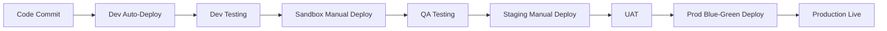

# 🎬 AI FILM STUDIO – Environment Setup Master Checklist

> **Complete guide for setting up Dev, Sandbox, Staging, and Production environments**

📋 **Tags:** `#setup` `#devops` `#environment` `#aws` `#infrastructure` `#configuration`

---

## 📑 Table of Contents

- [1️⃣ Version Control](#1️⃣-version-control)
- [2️⃣ AWS Account Setup](#2️⃣-aws-account-setup)
- [3️⃣ Salesforce Setup](#3️⃣-salesforce-setup)
- [4️⃣ YouTube / Google Setup](#4️⃣-youtube--google-setup)
- [5️⃣ AI / ML Models & Tools](#5️⃣-ai--ml-models--tools)
- [6️⃣ Frontend / Backend Setup](#6️⃣-frontend--backend-setup)
- [7️⃣ Environment Files](#7️⃣-environment-files)
- [8️⃣ Optional Tools & Services](#8️⃣-optional-tools--services)
- [9️⃣ Environment Mapping Summary](#9️⃣-environment-mapping-summary)
- [🔟 Quick Start Guide](#🔟-quick-start-guide)

---

## 1️⃣ Version Control

**Tags:** `#git` `#github` `#version-control` `#cicd`

| Item | Action / Notes | Status |
|------|---------------|--------|
| **GitHub Repository** | Create repositories for frontend, backend, AI code, Terraform infra | ☐ |
| **GitHub Copilot** | Optional: Enable AI-assisted code generation for team | ☐ |
| **Branch Strategy** | Create and protect branches: `main`, `develop`, `staging`, `production` | ☐ |
| **Branch Protection** | Set up rules: require PR reviews, status checks before merge | ☐ |
| **GitHub Actions** | Configure CI/CD workflows for automated deployments | ☐ |
| **Secrets Management** | Add repository secrets for AWS, API keys, credentials | ☐ |

### Branch Workflow
```
develop → sandbox → staging → production
```

---

## 2️⃣ AWS Account Setup

**Tags:** `#aws` `#cloud` `#infrastructure` `#iac`

### 2.1 Core Services

| Service / Layer | Action / Notes | Dev | Sandbox | Staging | Prod | Status |
|----------------|---------------|-----|---------|---------|------|--------|
| **IAM Setup** | Create admin user, groups, roles, policies | Required | Required | Required | Required | ☐ |
| **VPC Configuration** | Set up VPC with public/private subnets across multiple AZs | 1 AZ | 1 AZ | 2 AZ | 3 AZ | ☐ |
| **EC2 GPU Instances** | Launch GPU instances (g4dn.xlarge or better) | 1 small | 1 medium | 2 medium | 4+ large | ☐ |
| **S3 Buckets** | Create buckets for media storage, logs, backups | Required | Required | Required | Required | ☐ |
| **CloudFront CDN** | Configure CDN for video delivery | Optional | Optional | Required | Required | ☐ |
| **RDS Database** | PostgreSQL/MySQL for users, projects, credits | t3.micro | t3.small | t3.medium | r5.large | ☐ |
| **ElastiCache Redis** | For job queue & session cache | t3.micro | t3.small | t3.medium | r5.large | ☐ |
| **ECS / EKS** | Container orchestration for microservices | Fargate | Fargate | EKS | EKS | ☐ |
| **Application Load Balancer** | Distribute traffic across backend instances | Required | Required | Required | Required | ☐ |
| **NAT Gateway** | Enable internet access for private subnets | 1 | 1 | 2 | 3 | ☐ |
| **SQS Queues** | Message queues for async job processing | Required | Required | Required | Required | ☐ |

### 2.2 Security & Secrets

| Service | Action / Notes | Status |
|---------|---------------|--------|
| **AWS Secrets Manager** | Store database passwords, API keys, JWT secrets | ☐ |
| **Parameter Store** | Store non-sensitive configuration parameters | ☐ |
| **KMS Keys** | Create encryption keys for S3, RDS, EBS | ☐ |
| **Security Groups** | Configure firewall rules for each service | ☐ |
| **WAF** | Web Application Firewall for API protection (Prod/Staging) | ☐ |
| **ACM Certificates** | SSL/TLS certificates for HTTPS | ☐ |

### 2.3 Monitoring & Logging

| Service | Action / Notes | Status |
|---------|---------------|--------|
| **CloudWatch Logs** | Centralized log aggregation | ☐ |
| **CloudWatch Metrics** | Custom application metrics | ☐ |
| **CloudWatch Alarms** | Set up alerts for CPU, memory, disk, errors | ☐ |
| **X-Ray** | Distributed tracing (optional) | ☐ |
| **CloudTrail** | API audit logging | ☐ |
| **SNS Topics** | Notification channels for alerts | ☐ |

### 2.4 Infrastructure as Code

| Tool | Action / Notes | Status |
|------|---------------|--------|
| **Terraform** | Set up Terraform workspace and state backend (S3 + DynamoDB) | ☐ |
| **Terraform Modules** | Create reusable modules for VPC, ECS, RDS, S3, etc. | ☐ |
| **Terraform Workspaces** | Create workspaces: dev, sandbox, staging, prod | ☐ |
| **Terraform Variables** | Create .tfvars files for each environment | ☐ |

### 2.5 Cost Management

| Item | Action / Notes | Status |
|------|---------------|--------|
| **Budget Alerts** | Set up billing alarms for each environment | ☐ |
| **Cost Allocation Tags** | Tag resources with environment, project, owner | ☐ |
| **Reserved Instances** | Purchase RIs for production RDS/ElastiCache (cost savings) | ☐ |
| **Auto-scaling** | Configure auto-scaling policies to optimize costs | ☐ |

---

## 3️⃣ Salesforce Setup

**Tags:** `#salesforce` `#crm` `#integration` `#api`

| Item | Action / Notes | Dev | Sandbox | Prod | Status |
|------|---------------|-----|---------|------|--------|
| **Salesforce Account** | Sign up for Developer Edition (free) or create sandbox org | Free Dev | Sandbox | Production | ☐ |
| **Custom Objects** | Create objects: `AI_Project__c`, `AI_Credit__c`, `YouTube_Integration__c`, `User_Subscription__c` | Required | Required | Required | ☐ |
| **Fields & Relationships** | Define custom fields, lookup/master-detail relationships | Required | Required | Required | ☐ |
| **Validation Rules** | Create rules for data integrity (e.g., credit balance > 0) | Required | Required | Required | ☐ |
| **Flows / Process Builder** | Automate credit deduction, project status updates, alerts | Required | Required | Required | ☐ |
| **Apex Classes** | Custom business logic for complex workflows | As needed | As needed | As needed | ☐ |
| **Reports & Dashboards** | Create dashboards for tracking projects, credits, video metrics | Required | Required | Required | ☐ |
| **API Access** | Enable REST/SOAP API access | Required | Required | Required | ☐ |
| **Connected App** | Create connected app for OAuth 2.0 authentication | Required | Required | Required | ☐ |
| **API Credentials** | Generate Consumer Key, Consumer Secret, Security Token | Required | Required | Required | ☐ |
| **Permission Sets** | Create permission sets for different user roles | Required | Required | Required | ☐ |

### Salesforce Objects Schema

```
AI_Project__c
├── Name (Text)
├── User__c (Lookup to User)
├── Script__c (Long Text)
├── Status__c (Picklist: Draft, Processing, Completed, Failed)
├── Video_URL__c (URL)
├── Credits_Used__c (Number)
├── Created_Date__c (DateTime)
└── Completed_Date__c (DateTime)

AI_Credit__c
├── User__c (Lookup to User)
├── Balance__c (Number)
├── Last_Updated__c (DateTime)
├── Transaction_Type__c (Picklist: Purchase, Usage, Refund)
└── Amount__c (Number)

YouTube_Integration__c
├── User__c (Lookup to User)
├── Channel_ID__c (Text)
├── Access_Token__c (Encrypted Text)
├── Refresh_Token__c (Encrypted Text)
├── Upload_Enabled__c (Checkbox)
└── Last_Sync__c (DateTime)
```

---

## 4️⃣ YouTube / Google Setup

**Tags:** `#youtube` `#google-api` `#oauth` `#video-upload`

| Item | Action / Notes | Status |
|------|---------------|--------|
| **Google Cloud Account** | Sign up for Google Cloud Platform account | ☐ |
| **Create Project** | Create a new project in Google Cloud Console | ☐ |
| **Enable YouTube Data API v3** | Enable API in APIs & Services section | ☐ |
| **OAuth 2.0 Credentials** | Create OAuth 2.0 Client ID (Web application) | ☐ |
| **Authorized Redirect URIs** | Add callback URLs for each environment | ☐ |
| **OAuth Consent Screen** | Configure consent screen with app info and scopes | ☐ |
| **API Scopes** | Request scopes: `youtube.upload`, `youtube.readonly`, `youtube.force-ssl` | ☐ |
| **API Key** | Generate API key for read-only operations (optional) | ☐ |
| **Quota Management** | Monitor and request quota increase if needed (default: 10,000 units/day) | ☐ |
| **Service Account** | Create service account for backend automation (optional) | ☐ |

### Required OAuth Scopes
```
https://www.googleapis.com/auth/youtube.upload
https://www.googleapis.com/auth/youtube.readonly
https://www.googleapis.com/auth/youtube.force-ssl
```

### Redirect URIs by Environment
```
Dev:        http://localhost:3000/api/auth/youtube/callback
Sandbox:    https://sandbox.aifilmstudio.com/api/auth/youtube/callback
Staging:    https://staging.aifilmstudio.com/api/auth/youtube/callback
Production: https://app.aifilmstudio.com/api/auth/youtube/callback
```

---

## 5️⃣ AI / ML Models & Tools

**Tags:** `#ai` `#ml` `#models` `#gpu` `#inference`

| Category | Tool / Model | Purpose | Status |
|----------|-------------|---------|--------|
| **Image Generation** | Stable Diffusion XL (SDXL) | High-quality image generation from text | ☐ |
| **Image Generation** | Stable Diffusion 1.5/2.1 | Faster inference, lower GPU requirements | ☐ |
| **Video Generation** | LTX-2 / Stable Video Diffusion | Text/image to short video clips | ☐ |
| **Video Generation** | AnimateDiff | Animate static images | ☐ |
| **Video Generation** | Runway ML API (optional) | Professional video generation | ☐ |
| **Voice Synthesis** | ElevenLabs API | High-quality text-to-speech | ☐ |
| **Voice Synthesis** | Coqui TTS (open-source) | Self-hosted TTS | ☐ |
| **Voice Synthesis** | OpenAI TTS API | Alternative TTS service | ☐ |
| **Lip-sync / Animation** | Wav2Lip | Lip-sync for talking head videos | ☐ |
| **Music Generation** | MusicGen / AudioCraft | Background music generation | ☐ |
| **Music Library** | Indian Classical / Devotional | Slokas, bhajans, ragas | ☐ |
| **Music Library** | Western Music | Royalty-free background tracks | ☐ |
| **Dialogue / Podcast** | GPT-4 / Claude API | Generate multi-character conversations | ☐ |
| **Video Editing** | FFmpeg | Video composition, encoding, effects | ☐ |
| **Video Editing** | MoviePy (Python) | Programmatic video editing | ☐ |

### Model Storage
- **Local Development**: `./models/` directory (gitignored)
- **Production**: S3 bucket with versioning enabled
- **Model Registry**: Track model versions and performance metrics

### GPU Requirements by Environment
| Environment | Instance Type | GPU Memory | Count |
|-------------|--------------|------------|-------|
| Dev | g4dn.xlarge | 16 GB | 1 |
| Sandbox | g4dn.xlarge | 16 GB | 1 |
| Staging | g4dn.2xlarge | 32 GB | 2 |
| Production | g4dn.12xlarge | 192 GB | 4+ |

---

## 6️⃣ Frontend / Backend Setup

**Tags:** `#frontend` `#backend` `#microservices` `#api`

### 6.1 Frontend (Next.js + React)

| Item | Action / Notes | Status |
|------|---------------|--------|
| **Framework** | Next.js 14 with App Router | ☐ |
| **TypeScript** | Enable TypeScript for type safety | ☐ |
| **Styling** | Tailwind CSS + Material UI or shadcn/ui | ☐ |
| **State Management** | React Context API + Zustand/Redux | ☐ |
| **API Client** | Axios or Fetch with React Query | ☐ |
| **Authentication** | NextAuth.js with JWT | ☐ |
| **Video Player** | Video.js or React Player | ☐ |
| **File Upload** | React Dropzone for script/media uploads | ☐ |
| **Notifications** | Toast notifications (react-hot-toast) | ☐ |
| **Analytics** | Google Analytics / Mixpanel integration | ☐ |

### 6.2 Backend (FastAPI + Python)

| Service | Responsibility | Port | Status |
|---------|---------------|------|--------|
| **API Gateway** | Main entry point, routing | 8000 | ☐ |
| **User Service** | Authentication, user management | 8001 | ☐ |
| **Project Service** | Project CRUD, script management | 8002 | ☐ |
| **Credit Service** | Credit balance, transactions | 8003 | ☐ |
| **AI Job Service** | Job creation, status tracking | 8004 | ☐ |
| **YouTube Service** | OAuth, video upload to YouTube | 8005 | ☐ |
| **Admin Service** | Admin dashboard, analytics | 8006 | ☐ |
| **Notification Service** | Email, SMS, push notifications | 8007 | ☐ |

### 6.3 Worker Service (GPU Processing)

| Component | Purpose | Status |
|-----------|---------|--------|
| **Job Consumer** | Poll SQS queue for new jobs | ☐ |
| **Scene Parser** | Parse script into scenes and shots | ☐ |
| **Image Generator** | Generate images using Stable Diffusion | ☐ |
| **Video Generator** | Generate video clips from images | ☐ |
| **Audio Generator** | Generate voiceover and music | ☐ |
| **Video Compositor** | Combine all assets into final video | ☐ |
| **S3 Uploader** | Upload final video to S3 | ☐ |
| **Status Updater** | Update job status in database | ☐ |

### 6.4 Async Jobs & Queue

| Item | Technology | Purpose | Status |
|------|-----------|---------|--------|
| **Message Queue** | AWS SQS | Async job queue | ☐ |
| **Job Orchestration** | Celery / Bull MQ | Task distribution and retry logic | ☐ |
| **Rate Limiting** | Redis | API rate limiting per user | ☐ |
| **Caching** | Redis / ElastiCache | Cache user sessions, API responses | ☐ |

---

## 7️⃣ Environment Files

**Tags:** `#configuration` `#environment` `#secrets` `#dotenv`

### 7.1 Environment File Structure

Create the following files in your project root:

```
.env.dev
.env.sandbox
.env.staging
.env.prod
```

And for Terraform:
```
infrastructure/terraform/environments/dev/terraform.tfvars
infrastructure/terraform/environments/sandbox/terraform.tfvars
infrastructure/terraform/environments/staging/terraform.tfvars
infrastructure/terraform/environments/prod/terraform.tfvars
```

### 7.2 Variables to Include

**See complete templates in:**
- `.env.dev.template`
- `.env.sandbox.template`
- `.env.staging.template`
- `.env.prod.template`

**Key Variable Categories:**
1. **General Settings** - App name, environment, debug mode
2. **API Configuration** - Host, port, CORS origins
3. **Database** - Connection strings, pool size
4. **Cache/Redis** - Redis URL, TTL settings
5. **AWS** - Region, access keys, S3 buckets
6. **Salesforce** - API credentials, instance URL
7. **YouTube** - OAuth credentials, API keys
8. **AI Models** - Model paths, GPU settings
9. **Authentication** - JWT secrets, token expiry
10. **Feature Flags** - Enable/disable features per environment
11. **Monitoring** - CloudWatch, logging levels
12. **Third-party Services** - Email, SMS, analytics

---

## 8️⃣ Optional Tools & Services

**Tags:** `#tools` `#devops` `#monitoring` `#optimization`

### 8.1 Containerization & Orchestration

| Tool | Purpose | Status |
|------|---------|--------|
| **Docker** | Containerize backend and AI worker services | ☐ |
| **Docker Compose** | Local multi-container development | ☐ |
| **Kubernetes (EKS)** | Production container orchestration | ☐ |
| **Helm** | Kubernetes package management | ☐ |

### 8.2 Monitoring & Observability

| Tool | Purpose | Status |
|------|---------|--------|
| **CloudWatch** | AWS native monitoring and logs | ☐ |
| **Prometheus** | Metrics collection and alerting | ☐ |
| **Grafana** | Visualization dashboards | ☐ |
| **Datadog** | APM and infrastructure monitoring | ☐ |
| **Sentry** | Error tracking and crash reporting | ☐ |
| **ELK Stack** | Elasticsearch, Logstash, Kibana for logs | ☐ |

### 8.3 CI/CD & Automation

| Tool | Purpose | Status |
|------|---------|--------|
| **GitHub Actions** | Automated CI/CD pipelines | ☐ |
| **AWS CodePipeline** | Alternative CI/CD on AWS | ☐ |
| **AWS CodeBuild** | Build service | ☐ |
| **AWS CodeDeploy** | Deployment automation | ☐ |
| **Terraform Cloud** | Remote state management | ☐ |

### 8.4 Testing

| Tool | Purpose | Status |
|------|---------|--------|
| **Pytest** | Backend unit and integration tests | ☐ |
| **Jest** | Frontend unit tests | ☐ |
| **Cypress** | End-to-end testing | ☐ |
| **Locust** | Load testing | ☐ |
| **Postman** | API testing and documentation | ☐ |

### 8.5 Security

| Tool | Purpose | Status |
|------|---------|--------|
| **AWS GuardDuty** | Threat detection | ☐ |
| **AWS Inspector** | Vulnerability assessment | ☐ |
| **Snyk** | Dependency vulnerability scanning | ☐ |
| **OWASP ZAP** | Security testing | ☐ |
| **HashiCorp Vault** | Advanced secrets management | ☐ |

---

## 9️⃣ Environment Mapping Summary

**Tags:** `#environments` `#deployment` `#strategy`

| Environment | Purpose | Infrastructure Scale | Data | CI/CD | Access |
|-------------|---------|---------------------|------|-------|--------|
| **Dev** | Rapid development and feature testing | Minimal: 1 AZ, small instances | Mock/sample data | Auto-deploy on merge to `develop` | All developers |
| **Sandbox** | QA testing, integration testing | Small: 1 AZ, medium instances | Anonymized production-like data | Manual trigger | QA team + developers |
| **Staging** | Pre-production validation, UAT | Production-like: 2 AZ, medium-large instances | Anonymized production data | Manual approval required | QA + stakeholders |
| **Production** | Live customer traffic | Full HA: 3 AZ, auto-scaling, multi-region | Real customer data | Manual approval + blue-green deployment | Ops team only |

### Deployment Strategy



### Rollback Strategy

| Environment | Rollback Method | Time to Rollback |
|-------------|----------------|------------------|
| Dev | Git revert + redeploy | < 5 minutes |
| Sandbox | Git revert + redeploy | < 5 minutes |
| Staging | Blue-green switch back | < 2 minutes |
| Production | Blue-green switch back | < 1 minute |

---

## 🔟 Quick Start Guide

**Tags:** `#quickstart` `#setup` `#onboarding`

### Prerequisites Checklist

- [ ] AWS Account with admin access
- [ ] GitHub account and repository created
- [ ] Docker Desktop installed
- [ ] Node.js 18+ and npm installed
- [ ] Python 3.11+ installed
- [ ] Terraform 1.5+ installed
- [ ] kubectl installed (for Kubernetes)
- [ ] AWS CLI configured
- [ ] Google Cloud account (for YouTube API)
- [ ] Salesforce Developer Edition account

### Day 1: Foundation Setup

1. **Clone Repository**
   ```bash
   git clone https://github.com/your-org/AI-Film-Studio.git
   cd AI-Film-Studio
   ```

2. **Set Up Environment Files**
   ```bash
   cp .env.dev.template .env.dev
   # Edit .env.dev with your credentials
   ```

3. **Initialize Terraform**
   ```bash
   cd infrastructure/terraform/environments/dev
   terraform init
   terraform plan
   ```

4. **Create AWS Resources**
   ```bash
   terraform apply
   ```

5. **Set Up Database**
   ```bash
   cd ../../../../backend
   python -m venv venv
   source venv/bin/activate
   pip install -r requirements.txt
   alembic upgrade head
   ```

### Day 2: Services Setup

6. **Start Backend Services**
   ```bash
   docker-compose up -d
   ```

7. **Set Up Frontend**
   ```bash
   cd frontend
   npm install
   npm run dev
   ```

8. **Download AI Models**
   ```bash
   cd worker
   python scripts/download_models.py
   ```

### Day 3: Integrations

9. **Configure Salesforce**
   - Create custom objects
   - Set up connected app
   - Add credentials to .env file

10. **Configure YouTube API**
    - Enable YouTube Data API
    - Create OAuth credentials
    - Add to .env file

11. **Test End-to-End**
    ```bash
    npm run test:e2e
    ```

---

## 📝 Additional Resources

- [Complete File Structure Template](./FILE_STRUCTURE_TEMPLATE.md)
- [Environment Variables Reference](./ENV_VARIABLES_REFERENCE.md)
- [AWS Setup Detailed Guide](./AWS_SETUP_GUIDE.md)
- [Salesforce Integration Guide](./SALESFORCE_INTEGRATION_GUIDE.md)
- [AI Models Configuration](./AI_MODELS_CONFIGURATION.md)

---

## ✅ Setup Completion Checklist

Use this final checklist to verify all environments are ready:

### Dev Environment
- [ ] VPC and networking configured
- [ ] RDS database running
- [ ] Redis cache running
- [ ] S3 buckets created
- [ ] EC2 GPU instance running
- [ ] Backend services deployed
- [ ] Frontend deployed
- [ ] AI models downloaded
- [ ] Test project creation successful

### Sandbox Environment
- [ ] All Dev items + QA test suite running

### Staging Environment
- [ ] All Sandbox items + production-like data loaded

### Production Environment
- [ ] All Staging items + monitoring and alerts configured
- [ ] Backup strategy implemented
- [ ] Disaster recovery plan in place
- [ ] Security audit completed

---

**🎉 Congratulations! Your AI Film Studio environments are now set up and ready for development!**

---

_Last Updated: 2025-01-01_  
_Version: 1.0.0_  
_Maintained by: AI-Empower-HQ-360_
