# 🌐 AI FILM STUDIO – TECH STACK & LAYER MAPPING

**Document Version:** 1.0  
**Last Updated:** 2025-12-31  
**Document Owner:** AI-Empower-HQ-360

---

## Table of Contents

1. [Overview](#overview)
2. [Complete Tech Stack Table](#complete-tech-stack-table)
3. [Layer-by-Layer Breakdown](#layer-by-layer-breakdown)
4. [AI/ML Pipeline Dependencies](#aiml-pipeline-dependencies)
5. [Salesforce CRM Integration](#salesforce-crm-integration)
6. [Subscription & Credit System](#subscription--credit-system)
7. [Environment Strategy](#environment-strategy)
8. [Key Notes](#key-notes)

---

## Overview

This document provides a comprehensive mapping of all technologies, services, and components used in the AI Film Studio platform. It serves as the complete implementation reference for developers, architects, and stakeholders.

### Key Architecture Principles

- **Microservices Architecture**: Modular separation of concerns with dedicated services
- **Cloud-Native**: Built on AWS infrastructure with scalable components
- **AI/ML Driven**: All outputs depend on script, story, and cultural context
- **Multi-Environment**: Development → Sandbox/QA → Staging → Production
- **Credit-Based Monetization**: 3 credits = 1 minute video

---

## Complete Tech Stack Table

| Layer / Component | Technology / Service | Purpose / Functionality |
|-------------------|---------------------|------------------------|
| **User Layer** | Browser / Mobile App | Inputs: Script, Images, Voice, Music, Duration; User interaction |
| **Frontend Layer** | React / Next.js | UI, routing, dynamic forms, multi-language support |
| | TailwindCSS / Material UI | Styling, responsive design |
| | Video.js / HTML5 | Video/audio preview |
| | i18next | Multi-language interface |
| | Forms & Dropdowns | Script input, voice selection, video duration, music/slokas selection |
| **Backend Layer** | Node.js / NestJS / FastAPI | Microservices architecture |
| | Express / REST / GraphQL | API endpoints for frontend communication |
| | **Microservices:** | |
| | - User Service | Authentication, user management, profiles |
| | - Project Service | Project CRUD, status tracking |
| | - Credits Service | Credit management, subscription tracking |
| | - AI Job Service | Job queue management, status updates |
| | - YouTube Service | Video uploads, playlist management |
| | - Admin Service | System administration, analytics |
| | JWT / OAuth 2.0 | Authentication & security |
| | Redis / BullMQ / SQS | Async AI job queue, caching |
| **Database Layer** | PostgreSQL / MySQL | Users, Projects, Credits, Logs |
| | Redis / ElastiCache | Fast cache for credits, AI job status |
| | AWS S3 + CloudFront | Storage for images, generated videos, subtitles, thumbnails |
| **AI / ML Layer** | **Script Analysis** | |
| | Custom NLP | Extract characters, actions, emotions, story & cultural context |
| | **Image Generation:** | |
| | - Stable Diffusion XL | Character & background generation |
| | - Runway Gen-2 | Advanced video generation |
| | - CogVideo | Video synthesis |
| | - LTX-2 | Latent video transformation |
| | - Dream Machine | Culture-aware image generation |
| | **Voice Synthesis:** | |
| | - ElevenLabs | Multi-age, multi-gender voices |
| | - Coqui TTS | Open-source voice synthesis |
| | - OpenAI TTS | Mature/child voices, multiple languages |
| | **Lip-sync / Animation:** | |
| | - Wav2Lip | Facial lip synchronization |
| | - First Order Motion Model | Head alignment and facial movements |
| | **Music / Audio:** | |
| | - OpenAI Jukebox | AI-generated music |
| | - MIDI-based synthesis | Scene background music |
| | - Indian & Western music | Cultural audio options |
| | - Slokas & Poems | Religious and poetic audio |
| | - Sahasranamas | Traditional chants |
| | **Podcast Overlay** | Dual-character dialogue, conversation mode |
| | **Subtitles / Multi-language** | Whisper ASR + translation |
| **Cloud / Infrastructure** | AWS EC2 GPU | AI processing & rendering (g4dn.xlarge, p3.2xlarge) |
| | AWS ECS / Kubernetes | Scalable backend services |
| | Terraform | Infrastructure as Code |
| | RDS (PostgreSQL / MySQL) | Relational database (Multi-AZ) |
| | S3 + CloudFront | Media storage, CDN |
| | Redis / ElastiCache | Cache & queue management |
| | **Monitoring:** | |
| | - CloudWatch | System health, logs, AI job monitoring |
| | - Grafana | Visualization dashboards |
| | - Prometheus | Metrics collection |
| | **Environments:** | Dev, Sandbox/QA, Staging, Production |
| **Salesforce CRM Layer** | **Objects:** | |
| | - Contacts | User management |
| | - AI_Project__c | Project tracking, status, video & subtitle URLs |
| | - AI_Credit__c | Credits tracking, subscription management |
| | - YouTube_Integration__c | YouTube uploads, playlist, thumbnails |
| | **Automation:** | |
| | - Flows | Credit deduction automation |
| | - Process Builder | Project status updates |
| | - Apex | Custom business logic, notifications |
| | **Analytics:** | |
| | - Dashboards | AI usage, revenue metrics |
| | - Reports | Project count, user statistics |
| **YouTube / Output Layer** | YouTube API / OAuth | Direct upload, video ID, playlist management |
| | Thumbnail Generation | Automatic thumbnail creation from video frames |
| | Download Option | Users can download generated videos |
| | Duration Selection | 1–5 minutes videos, credits deducted accordingly |
| **Subscription & Credit System** | **Tiers:** | |
| | - Free | 3 credits/month, watermarked videos |
| | - Standard | 30 credits/month, basic features |
| | - Pro | 100 credits/month, advanced features |
| | - Enterprise | Unlimited credits, priority queue, white-label |
| | **Payment Integration** | Stripe / PayPal for subscription purchase & credit top-up |
| | **Credit Rules** | 3 credits = 1 minute video |
| **Project Features / AI Dependencies** | **Pipeline Flow** | Script → Story & Culture → Image → Voice → Animation → Music → Podcast → Subtitles |
| | Multi-language Support | Subtitles, interface, and audio in 20+ languages |
| | Podcast-style | Multi-character, dual-character video generation |
| | Music Integration | Both Indian & Western cultural audio options |
| | YouTube Integration | Playlist auto-creation, upload, thumbnail management |

---

## Layer-by-Layer Breakdown

### 1. User Layer

**Purpose**: Primary interface for user interaction with the platform

**Components**:
- **Web Browser**: Desktop and mobile web access
- **Mobile App** (Future): Native iOS/Android applications

**User Inputs**:
- Script text (up to 500 words)
- Images for reference or background
- Voice selection (age, gender, language)
- Music selection (genre, cultural preference)
- Video duration (1-5 minutes)
- Slokas/poems selection (optional)

**User Capabilities**:
- Create and manage projects
- Configure video settings
- Preview generated content
- Download final videos
- Upload to YouTube directly
- Manage subscription and credits

---

### 2. Frontend Layer

**Technology Stack**:
- **Framework**: React 18+ with Next.js 14+
- **Language**: TypeScript
- **Styling**: TailwindCSS + Material UI components
- **State Management**: Zustand / React Context
- **Internationalization**: i18next for multi-language support

**Key Features**:
- **Dynamic Forms**: Script input, configuration panels
- **Dropdowns & Selectors**: Voice selection, music genres, video duration
- **Video Preview**: Video.js / HTML5 for playback
- **Real-time Updates**: WebSocket for job progress
- **Responsive Design**: Mobile-first approach

**Routes**:
```
/                    - Landing page
/dashboard           - User dashboard
/projects            - Project list
/projects/new        - Create new project
/projects/:id        - Project details
/projects/:id/edit   - Edit project
/credits             - Credit balance and purchase
/settings            - User settings
/admin               - Admin panel
```

---

### 3. Backend Layer

**Architecture**: Microservices with RESTful APIs

**Technology Stack**:
- **Runtime**: Node.js / NestJS OR Python FastAPI
- **API**: Express / REST / GraphQL
- **Authentication**: JWT / OAuth 2.0
- **Queue**: Redis / BullMQ / AWS SQS
- **Cache**: Redis / ElastiCache

**Microservices**:

#### 3.1 User Service
- User registration and authentication
- Profile management
- Password reset and email verification
- Role-based access control (RBAC)

**Endpoints**:
```
POST   /api/v1/auth/register
POST   /api/v1/auth/login
POST   /api/v1/auth/refresh
POST   /api/v1/auth/forgot-password
GET    /api/v1/users/me
PUT    /api/v1/users/me
```

#### 3.2 Project Service
- Project CRUD operations
- Project status tracking
- Project metadata management
- Version history

**Endpoints**:
```
GET    /api/v1/projects
POST   /api/v1/projects
GET    /api/v1/projects/:id
PUT    /api/v1/projects/:id
DELETE /api/v1/projects/:id
```

#### 3.3 Credits Service
- Credit balance management
- Credit transactions
- Subscription tier management
- Payment processing integration

**Endpoints**:
```
GET    /api/v1/credits/balance
POST   /api/v1/credits/purchase
GET    /api/v1/credits/history
POST   /api/v1/subscriptions/upgrade
```

#### 3.4 AI Job Service
- Job creation and queueing
- Job status tracking
- Progress updates
- Result retrieval

**Endpoints**:
```
POST   /api/v1/jobs
GET    /api/v1/jobs/:id
GET    /api/v1/jobs/:id/status
GET    /api/v1/jobs/:id/result
DELETE /api/v1/jobs/:id
```

#### 3.5 YouTube Service
- OAuth authentication with YouTube
- Video upload
- Playlist management
- Thumbnail generation and upload

**Endpoints**:
```
POST   /api/v1/youtube/auth
POST   /api/v1/youtube/upload
GET    /api/v1/youtube/playlists
POST   /api/v1/youtube/playlists
POST   /api/v1/youtube/add-to-playlist
```

#### 3.6 Admin Service
- User management
- System analytics
- Content moderation
- System health monitoring

**Endpoints**:
```
GET    /api/v1/admin/users
GET    /api/v1/admin/statistics
GET    /api/v1/admin/system-health
POST   /api/v1/admin/moderate
```

---

### 4. Database Layer

#### 4.1 Relational Database (PostgreSQL/MySQL)

**Tables**:

```sql
-- Users table
users (
    id UUID PRIMARY KEY,
    email VARCHAR(255) UNIQUE NOT NULL,
    password_hash VARCHAR(255) NOT NULL,
    full_name VARCHAR(255),
    subscription_tier VARCHAR(50),
    credits_balance INTEGER DEFAULT 3,
    credits_reset_date DATE,
    created_at TIMESTAMP,
    updated_at TIMESTAMP,
    last_login_at TIMESTAMP
)

-- Projects table
projects (
    id UUID PRIMARY KEY,
    user_id UUID REFERENCES users(id),
    title VARCHAR(255) NOT NULL,
    script TEXT NOT NULL,
    status VARCHAR(50),
    video_duration INTEGER,
    video_url VARCHAR(500),
    thumbnail_url VARCHAR(500),
    subtitle_urls JSONB,
    settings JSONB,
    created_at TIMESTAMP,
    updated_at TIMESTAMP
)

-- Credits transactions
credit_transactions (
    id UUID PRIMARY KEY,
    user_id UUID REFERENCES users(id),
    type VARCHAR(50),
    amount INTEGER,
    balance_after INTEGER,
    description TEXT,
    created_at TIMESTAMP
)

-- AI jobs
ai_jobs (
    id UUID PRIMARY KEY,
    project_id UUID REFERENCES projects(id),
    user_id UUID REFERENCES users(id),
    job_type VARCHAR(100),
    status VARCHAR(50),
    progress INTEGER,
    current_step VARCHAR(100),
    result_data JSONB,
    error_message TEXT,
    started_at TIMESTAMP,
    completed_at TIMESTAMP
)

-- YouTube integrations
youtube_integrations (
    id UUID PRIMARY KEY,
    user_id UUID REFERENCES users(id),
    project_id UUID REFERENCES projects(id),
    video_id VARCHAR(255),
    playlist_id VARCHAR(255),
    upload_status VARCHAR(50),
    youtube_url VARCHAR(500),
    created_at TIMESTAMP
)
```

#### 4.2 Cache Layer (Redis/ElastiCache)

**Use Cases**:
- Session management
- Credit balance caching
- AI job status real-time updates
- API response caching
- Rate limiting counters

**Data Structures**:
```
user:session:{user_id}        - User session data (TTL: 1 hour)
user:credits:{user_id}        - Credit balance cache (TTL: 5 minutes)
job:status:{job_id}           - Job status (TTL: until completion)
api:response:{endpoint}       - API response cache (TTL: varies)
ratelimit:{user_id}:{endpoint} - Rate limit counters (TTL: 1 minute)
```

#### 4.3 Object Storage (AWS S3)

**Bucket Structure**:
```
ai-film-studio-media-prod/
├── users/{user_id}/
│   ├── projects/{project_id}/
│   │   ├── raw/                   # User uploads
│   │   ├── script/                # Script files
│   │   ├── images/                # Generated images
│   │   ├── audio/                 # Generated audio/music
│   │   ├── video-clips/           # Individual video clips
│   │   ├── final/                 # Final rendered video
│   │   ├── subtitles/             # Subtitle files (SRT, VTT)
│   │   └── thumbnails/            # Video thumbnails
```

**Lifecycle Policies**:
- Transition to IA after 30 days
- Transition to Glacier after 90 days
- Delete incomplete uploads after 7 days

---

### 5. AI/ML Layer

This layer handles all AI-powered content generation. All AI outputs are **context-aware** and depend on script analysis, story understanding, and cultural context.

#### 5.1 Script Analysis (NLP Pipeline)

**Technology**: Custom NLP models + GPT-4/Claude API

**Capabilities**:
- **Character Extraction**: Identify characters, their roles, and relationships
- **Action Identification**: Detect key actions and events
- **Emotion Analysis**: Understand emotional tone and sentiment
- **Story Structure**: Analyze plot, pacing, and narrative arc
- **Cultural Context**: Detect cultural references, traditions, religious elements
- **Scene Breakdown**: Split script into individual scenes

**Output Format**:
```json
{
  "characters": [
    {
      "name": "John",
      "role": "protagonist",
      "age_group": "adult",
      "gender": "male",
      "personality": "brave, determined"
    }
  ],
  "scenes": [
    {
      "scene_number": 1,
      "description": "John enters the temple",
      "setting": "temple interior",
      "time_of_day": "morning",
      "cultural_context": "Hindu temple",
      "emotions": ["reverence", "curiosity"],
      "duration_seconds": 10
    }
  ],
  "cultural_elements": {
    "religion": "Hinduism",
    "traditions": ["temple worship"],
    "music_style": "Indian classical"
  }
}
```

#### 5.2 Image Generation

**Models**:
- **Stable Diffusion XL**: Primary image generation
- **Runway Gen-2**: Advanced video generation
- **CogVideo**: Video synthesis from text
- **LTX-2**: Latent transformation for video
- **Dream Machine**: Culture-aware generation

**Process**:
1. Generate character images based on descriptions
2. Create background images for each scene
3. Apply cultural styling (architecture, clothing, props)
4. Ensure consistency across scenes
5. Generate in appropriate resolution (1024x1024 or higher)

**Prompt Engineering**:
```python
# Example prompt for temple scene
prompt = f"""
A {age} {gender} character named {name} standing in a {cultural_context} temple interior,
morning light streaming through windows, {emotion} expression, 
wearing traditional {cultural} clothing, highly detailed, cinematic lighting,
4k resolution, professional photography
"""
```

#### 5.3 Voice Synthesis

**Services**:
- **ElevenLabs**: High-quality, emotional voices
- **Coqui TTS**: Open-source alternative
- **OpenAI TTS**: Multi-language support

**Voice Options**:
- **Age Groups**: Child, Teen, Adult, Elderly
- **Gender**: Male, Female, Non-binary
- **Languages**: 20+ languages supported
- **Emotions**: Happy, Sad, Angry, Calm, Excited
- **Accent**: Regional accents available

**Configuration**:
```json
{
  "character": "John",
  "voice_profile": {
    "provider": "elevenlabs",
    "voice_id": "adam",
    "age": "adult",
    "gender": "male",
    "emotion": "determined",
    "language": "en-US"
  },
  "text": "I must find the ancient artifact",
  "speed": 1.0,
  "pitch": 1.0
}
```

#### 5.4 Lip-sync / Animation

**Models**:
- **Wav2Lip**: Precise lip synchronization
- **First Order Motion Model**: Facial animation and head movement

**Process**:
1. Load character image
2. Load audio file
3. Apply Wav2Lip for lip movement
4. Apply FOMM for natural head movements
5. Render final animated character

**Parameters**:
```json
{
  "image_path": "s3://bucket/users/{user_id}/projects/{project_id}/images/character_1.png",
  "audio_path": "s3://bucket/users/{user_id}/projects/{project_id}/audio/dialog_1.wav",
  "model": "wav2lip",
  "quality": "high",
  "fps": 30
}
```

#### 5.5 Music & Audio

**Services**:
- **OpenAI Jukebox**: AI-generated music
- **MIDI Synthesis**: Traditional music generation
- **Audio Libraries**: Pre-composed tracks

**Music Types**:
- **Scene Background**: Ambient music for scenes
- **Cultural Music**: Indian classical, Western orchestral
- **Slokas & Poems**: Religious chants and poetry
- **Sahasranamas**: Traditional mantras
- **Podcast Style**: Background music for dialogue

**Configuration**:
```json
{
  "scene_id": "scene_1",
  "music_type": "background",
  "genre": "indian_classical",
  "mood": "peaceful",
  "duration_seconds": 30,
  "volume": 0.3,
  "fade_in": true,
  "fade_out": true
}
```

#### 5.6 Podcast Overlay

**Features**:
- Dual-character conversations
- Multi-character dialogue
- Natural pauses and interruptions
- Background music integration

**Configuration**:
```json
{
  "mode": "podcast",
  "characters": ["host", "guest"],
  "conversation_style": "interview",
  "background_music": true,
  "transitions": "smooth"
}
```

#### 5.7 Subtitles / Multi-language

**Technology**:
- **Whisper ASR**: Audio transcription
- **Translation APIs**: Multi-language translation
- **Subtitle Formats**: SRT, VTT, ASS

**Supported Languages**: 
English, Spanish, French, German, Hindi, Tamil, Telugu, Bengali, Marathi, Gujarati, Kannada, Malayalam, Punjabi, Japanese, Chinese, Korean, Arabic, Portuguese, Russian, Italian

**Process**:
1. Transcribe audio using Whisper
2. Translate to target languages
3. Generate subtitle files
4. Sync with video timestamps
5. Store in S3

---

### 6. Cloud / Infrastructure

#### 6.1 Compute Resources

**AWS EC2 GPU Instances**:
- **Type**: g4dn.xlarge (T4 GPU) for standard workloads
- **Type**: p3.2xlarge (V100 GPU) for heavy workloads
- **Auto-scaling**: Based on SQS queue depth
- **Spot Instances**: 70% cost savings

**AWS ECS / Kubernetes**:
- Backend services orchestration
- Auto-scaling based on CPU/Memory
- Blue-green deployments
- Service mesh for inter-service communication

#### 6.2 Infrastructure as Code

**Terraform Modules**:
```
infrastructure/terraform/
├── modules/
│   ├── vpc/
│   ├── ecs/
│   ├── rds/
│   ├── s3/
│   ├── elasticache/
│   └── monitoring/
├── environments/
│   ├── dev/
│   ├── sandbox/
│   ├── staging/
│   └── production/
```

#### 6.3 Monitoring & Observability

**CloudWatch**:
- Application logs
- System metrics (CPU, memory, disk)
- Custom metrics (job queue depth, generation time)
- Alarms for critical thresholds

**Grafana + Prometheus**:
- Real-time dashboards
- Historical trend analysis
- Custom visualizations
- Alert management

**Metrics Tracked**:
- API response times
- Job processing times
- Error rates
- Credit consumption
- User activity
- GPU utilization

---

### 7. Salesforce CRM Layer

#### 7.1 Custom Objects

**Contact (Standard Object)**:
- Enhanced with custom fields
- Subscription tier
- Credit balance
- Last video generation date

**AI_Project__c (Custom Object)**:
```
Fields:
- Name: Project title
- User__c: Lookup to Contact
- Script__c: Long text area
- Status__c: Picklist (Draft, Processing, Completed, Failed)
- Video_URL__c: URL to final video
- Subtitle_URLs__c: JSON of subtitle file URLs
- Thumbnail_URL__c: URL to thumbnail
- Duration_Minutes__c: Number
- Credits_Used__c: Number
- Created_Date__c: DateTime
```

**AI_Credit__c (Custom Object)**:
```
Fields:
- User__c: Lookup to Contact
- Transaction_Type__c: Picklist (Purchase, Deduction, Grant)
- Amount__c: Number
- Balance_After__c: Number
- Description__c: Text
- Transaction_Date__c: DateTime
```

**YouTube_Integration__c (Custom Object)**:
```
Fields:
- Project__c: Lookup to AI_Project__c
- Video_ID__c: YouTube video ID
- Playlist_ID__c: YouTube playlist ID
- Upload_Status__c: Picklist (Pending, Uploading, Completed, Failed)
- YouTube_URL__c: Full YouTube URL
- Thumbnail_URL__c: YouTube thumbnail URL
- Upload_Date__c: DateTime
```

#### 7.2 Automation

**Flows**:
1. **Credit Deduction Flow**: Triggered when job starts
2. **Project Status Update Flow**: Updates project status
3. **Notification Flow**: Email/SMS notifications to users

**Process Builder**:
1. **Subscription Renewal**: Resets credits on renewal date
2. **Failed Job Refund**: Returns credits if job fails

**Apex Triggers**:
1. **validateCreditBalance**: Checks credits before job creation
2. **updateProjectStatistics**: Updates user statistics
3. **syncWithExternalAPI**: Syncs data with backend API

#### 7.3 Analytics

**Dashboards**:
- User Activity Dashboard
- Revenue Dashboard
- AI Usage Dashboard
- System Health Dashboard

**Reports**:
- Daily Active Users
- Videos Generated Per Day
- Credit Consumption
- Subscription Tier Distribution
- Most Popular Features

---

### 8. YouTube / Output Layer

#### 8.1 YouTube API Integration

**OAuth 2.0 Flow**:
1. User authorizes application
2. Receive access token and refresh token
3. Store securely in database
4. Use for API calls

**Capabilities**:
- Upload videos (up to 256GB)
- Create and manage playlists
- Set video metadata (title, description, tags)
- Upload custom thumbnails
- Set visibility (public, unlisted, private)

**API Endpoints Used**:
```
POST   /youtube/v3/videos - Upload video
POST   /youtube/v3/playlists - Create playlist
POST   /youtube/v3/playlistItems - Add video to playlist
POST   /youtube/v3/thumbnails/set - Upload thumbnail
```

#### 8.2 Thumbnail Generation

**Process**:
1. Extract frame from video at specific timestamp
2. Apply branding/overlays if configured
3. Resize to YouTube dimensions (1280x720)
4. Save to S3
5. Upload to YouTube

#### 8.3 Download Option

**Implementation**:
- Generate pre-signed S3 URL (valid for 1 hour)
- Support for different quality options
- Watermark removal for paid tiers
- Download tracking for analytics

---

### 9. Subscription & Credit System

#### 9.1 Subscription Tiers

| Tier | Price | Credits/Month | Features |
|------|-------|---------------|----------|
| **Free** | $0 | 3 | Watermarked videos, 1 min max, basic voices |
| **Standard** | $9.99/mo | 30 | No watermark, 3 min max, standard voices |
| **Pro** | $29.99/mo | 100 | Premium voices, 5 min max, priority queue, advanced features |
| **Enterprise** | $299.99/mo | Unlimited | White-label, API access, dedicated support, custom voices |

#### 9.2 Credit System Rules

**Credit Calculation**:
- **Base Rule**: 3 credits = 1 minute of video
- **Rounding**: Rounded up to nearest minute

**Examples**:
- 30 seconds = 3 credits (rounded to 1 minute)
- 1 minute = 3 credits
- 2.5 minutes = 9 credits (rounded to 3 minutes)
- 5 minutes = 15 credits

**Credit Deduction**:
- Deducted when job starts processing
- Refunded if job fails
- Not refunded if user cancels after processing starts

#### 9.3 Payment Integration

**Stripe Integration**:
- Subscription management
- One-time credit purchases
- Automatic renewals
- Invoice generation
- Payment method management

**PayPal Integration** (Alternative):
- One-time payments
- Credit top-ups
- Invoice generation

---

### 10. Project Features / AI Dependencies

#### 10.1 Complete Pipeline Flow

```mermaid
graph LR
    A[Script Input] --> B[Script Analysis]
    B --> C[Story & Culture Understanding]
    C --> D[Image Generation]
    D --> E[Voice Synthesis]
    E --> F[Animation & Lip-sync]
    F --> G[Music Integration]
    G --> H[Podcast Overlay]
    H --> I[Subtitle Generation]
    I --> J[Final Video Composition]
    J --> K[YouTube Upload / Download]
```



**Dependency Chain**:
1. **Script**: Foundation for all AI operations
2. **Story & Culture**: Informs style and context
3. **Images**: Based on story analysis
4. **Voice**: Character-specific, emotion-aware
5. **Animation**: Synced with voice
6. **Music**: Scene-appropriate, culturally relevant
7. **Podcast**: Multi-character dialogue
8. **Subtitles**: Multi-language support
9. **Composition**: Assembles all elements
10. **Output**: Delivers final product

#### 10.2 Multi-language Support

**Interface Languages**: 10+ languages
**Subtitle Languages**: 20+ languages
**Voice Languages**: 15+ languages with native accents

#### 10.3 Cultural Audio Options

**Indian Music**:
- Classical (Hindustani, Carnatic)
- Folk music by region
- Devotional music
- Slokas and mantras
- Sahasranamas

**Western Music**:
- Orchestral
- Cinematic scores
- Jazz
- Ambient
- Electronic

---

## Environment Strategy

### Development Environment
- **Purpose**: Rapid development and testing
- **Infrastructure**: Minimal resources, single AZ
- **Database**: Small instance, no Multi-AZ
- **GPU**: Spot instances, scale to 0 when idle
- **Cost**: ~$335/month

### Sandbox/QA Environment
- **Purpose**: Integration testing, QA validation
- **Infrastructure**: Mirrors production (scaled down)
- **Database**: Multi-AZ enabled
- **GPU**: Limited scaling
- **Cost**: ~$800/month

### Staging Environment
- **Purpose**: Pre-production validation, final testing
- **Infrastructure**: Production-like configuration
- **Database**: Multi-AZ, read replicas
- **GPU**: Full scaling capability
- **Cost**: ~$1,500/month

### Production Environment
- **Purpose**: Live user traffic
- **Infrastructure**: Multi-AZ, auto-scaling, HA
- **Database**: Multi-AZ, multiple read replicas
- **GPU**: Full scaling with spot instances
- **Monitoring**: Complete observability stack
- **Cost**: ~$2,600/month (baseline)

---

## Key Notes

### 1. AI Output Dependencies

✅ **All AI outputs (images, voice, music) are dependent on**:
- Script content and structure
- Story analysis and understanding
- Cultural context detection
- Character relationships and emotions

This ensures:
- **Consistency**: All elements match the narrative
- **Cultural Accuracy**: Appropriate representations
- **Emotional Coherence**: Tone matches scene requirements
- **Character Consistency**: Visual and voice match throughout

### 2. Multiple Environments

✅ **Environment progression ensures quality**:
```
Development → Sandbox/QA → Staging → Production
```

**Benefits**:
- Safe testing without affecting users
- QA validation before production
- Performance testing in staging
- Rollback capability

### 3. Credit & Subscription System

✅ **Drives monetization**:
- Free tier for user acquisition
- Standard tier for casual users
- Pro tier for regular creators
- Enterprise tier for businesses

**Revenue Model**:
- Monthly recurring revenue (MRR)
- Credit top-ups for additional income
- Enterprise contracts for stable revenue

### 4. Salesforce CRM Centralization

✅ **All business data centralized**:
- User management in Salesforce
- Project tracking with full history
- Credit transactions logged
- YouTube integration tracked
- Automation for business logic
- Analytics and reporting

**Benefits**:
- Single source of truth
- Business process automation
- Customer relationship management
- Sales and marketing integration

### 5. Cloud & AI Infrastructure

✅ **Provides scalability**:
- GPU processing for AI workloads
- S3 for unlimited storage
- CloudFront for global delivery
- Monitoring for reliability

**Cost Optimization**:
- Spot instances (70% savings)
- Auto-scaling (pay for usage)
- S3 lifecycle policies
- Reserved instances for baseline

### 6. Quality Assurance

✅ **Multiple validation layers**:
- Script validation
- AI output quality checks
- Video rendering verification
- User acceptance testing
- Automated monitoring

---

## Implementation Checklist

### Phase 1: Foundation (Weeks 1-2)
- [ ] Set up development environment
- [ ] Configure AWS infrastructure (Terraform)
- [ ] Deploy PostgreSQL database
- [ ] Set up Redis cache
- [ ] Configure S3 buckets
- [ ] Set up monitoring (CloudWatch)

### Phase 2: Backend Services (Weeks 3-4)
- [ ] Implement User Service
- [ ] Implement Project Service
- [ ] Implement Credits Service
- [ ] Implement AI Job Service
- [ ] Implement authentication (JWT)
- [ ] Set up API gateway

### Phase 3: AI/ML Pipeline (Weeks 5-8)
- [ ] Integrate script analysis (NLP)
- [ ] Implement image generation (SDXL)
- [ ] Implement voice synthesis (ElevenLabs)
- [ ] Implement lip-sync (Wav2Lip)
- [ ] Implement music generation
- [ ] Implement subtitle generation (Whisper)
- [ ] Build video composition pipeline

### Phase 4: Frontend (Weeks 9-10)
- [ ] Build React/Next.js application
- [ ] Implement user dashboard
- [ ] Implement project management UI
- [ ] Implement video preview
- [ ] Implement credit management UI
- [ ] Implement multi-language support (i18next)

### Phase 5: Integrations (Weeks 11-12)
- [ ] Implement YouTube integration
- [ ] Implement Stripe payment integration
- [ ] Set up Salesforce CRM objects
- [ ] Configure Salesforce automation
- [ ] Implement webhook notifications

### Phase 6: Testing & Deployment (Weeks 13-14)
- [ ] Unit testing (80% coverage)
- [ ] Integration testing
- [ ] Load testing
- [ ] Security testing
- [ ] Deploy to staging
- [ ] User acceptance testing
- [ ] Deploy to production

### Phase 7: Operations (Ongoing)
- [ ] Monitor system health
- [ ] Optimize costs
- [ ] Gather user feedback
- [ ] Iterate on features
- [ ] Scale infrastructure as needed

---

## Conclusion

This comprehensive tech stack mapping provides a complete blueprint for the AI Film Studio platform. The architecture is designed for:

- **Scalability**: Handle 10,000+ concurrent users
- **Reliability**: 99.9% uptime with Multi-AZ deployment
- **Performance**: <200ms API response time, 2-5 min video generation
- **Cost-Efficiency**: ~$2,600/month baseline with optimization strategies
- **User Experience**: Intuitive interface with multi-language support
- **Monetization**: Credit-based system with multiple subscription tiers

By following this mapping and implementation plan, the AI Film Studio will deliver a world-class AI-powered video creation platform that democratizes film production for creators worldwide.

---

**Document Control**:
- **Version**: 1.0
- **Status**: Approved
- **Next Review**: 2026-01-31
- **Owner**: Engineering Team
